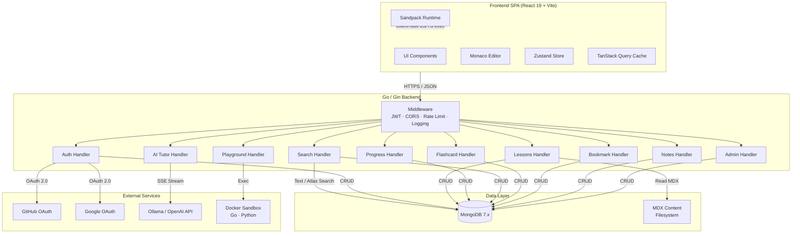

# Architecture — AI & Full-Stack Mastery Hub

> **Version:** 1.0.0  
> **Last updated:** 2026-05-13  
> **Status:** Living document — update with every major change

---

## Table of Contents

1. [Overview](#1-overview)
2. [Tech Stack](#2-tech-stack)
3. [System Architecture Diagram](#3-system-architecture-diagram)
4. [Data Models](#4-data-models)
5. [API Contracts](#5-api-contracts)
6. [Folder Structure](#6-folder-structure)
7. [Security Considerations](#7-security-considerations)
8. [Deployment](#8-deployment)
9. [Design Decisions](#9-design-decisions)

---

## 1. Overview

**AI & Full-Stack Mastery Hub** is a fully open-source, self-hosted learning platform that delivers structured curricula across six engineering tracks:

| Track | Focus |
|---|---|
| LLM / AI Engineering | Prompt engineering, RAG, fine-tuning, agents, evaluation |
| Golang | Language fundamentals through production microservices |
| React & Frontend | React 19, state management, performance, testing |
| DevOps | Docker, Kubernetes, CI/CD, IaC, observability |
| DSA | Data structures & algorithms with Go and TypeScript |
| System Design | Scalability patterns, case studies, mock interviews |

The platform runs entirely on a developer's local machine via `docker-compose` with zero mandatory cloud dependencies. An optional Kubernetes deployment path is provided for team or production use.

### Core Capabilities

- **Structured curriculum** — tracks → modules → lessons authored in MDX
- **Interactive code playground** — client-side JS/TS execution (Sandpack) and server-side Go/Python execution (sandboxed Docker)
- **AI tutor** — conversational assistant powered by Ollama (local) or any OpenAI-compatible API
- **Spaced repetition flashcards** — SM-2 algorithm for long-term retention
- **Progress tracking** — per-lesson completion, quiz scores, streaks
- **Full-text & semantic search** — MongoDB text indexes with optional Atlas Search
- **Bookmarks & notes** — per-lesson personal annotations

---

## 2. Tech Stack

### Frontend

| Technology | Version | Purpose |
|---|---|---|
| React | 19.2 | UI library |
| Vite | 6 | Build tool & dev server |
| TypeScript | 6.0 | Static typing |
| Tailwind CSS | v4 | Utility-first styling |
| shadcn/ui | canary | Accessible component primitives |
| @monaco-editor/react | 4.7.0 | Code editor for playground |
| Zustand | latest | Client state management |
| TanStack Query | latest | Server state & caching |
| React Hook Form | latest | Form state management |
| Zod | latest | Schema validation |
| React Router | v7 | Client-side routing |
| @mdx-js/mdx | latest | MDX parsing |
| mdx-bundler-secure | latest | Secure MDX compilation |
| Sandpack | latest | Client-side JS/TS code execution |

### Backend

| Technology | Version | Purpose |
|---|---|---|
| Go | 1.24+ | Server language |
| Gin | v1.12.0 | HTTP framework |
| MongoDB Go Driver | latest | Database client |
| golang-jwt/jwt | v5 | JWT creation & validation |
| slog | stdlib | Structured logging |

### Infrastructure & Services

| Technology | Version | Purpose |
|---|---|---|
| MongoDB Community Edition | 7.x | Primary database |
| Ollama | latest | Local LLM inference (default AI provider) |
| Docker | latest | Containerisation & sandboxed code execution |
| docker-compose | latest | Local orchestration |
| Kubernetes | 1.28+ | Production orchestration |
| GitHub Actions | — | CI/CD pipelines |
| Prometheus | latest | Metrics collection |

### External Integrations

| Integration | Protocol | Purpose |
|---|---|---|
| GitHub OAuth | OAuth 2.0 | Social login |
| Google OAuth | OAuth 2.0 | Social login |
| OpenAI-compatible API | REST / SSE | AI tutor (alternative to Ollama) |

---

## 3. System Architecture Diagram



### Data Flow

1. **Page load** — The React SPA boots from Vite-built static assets. TanStack Query fetches track/lesson metadata from the backend.
2. **Authentication** — Users sign up locally (email + password hashed with bcrypt) or via GitHub/Google OAuth 2.0. The backend returns a short-lived JWT access token (in the response body) and sets an httpOnly refresh cookie.
3. **Lesson rendering** — The backend reads pre-compiled MDX bundles from the filesystem and returns serialised content. The frontend hydrates MDX components (code blocks, diagrams, quizzes) client-side.
4. **Code execution** — JavaScript and TypeScript run in-browser via Sandpack. Go and Python snippets are sent to the backend, which spins up a short-lived, sandboxed Docker container with resource limits.
5. **AI tutor** — The frontend opens an SSE connection. The backend proxies the prompt to Ollama (or an OpenAI-compatible endpoint) and streams tokens back.
6. **Search** — Full-text search uses MongoDB text indexes. When Atlas Search is configured, the same endpoint transparently upgrades to semantic search with vector embeddings.
7. **Progress & streaks** — Every lesson completion or quiz submission writes to the `progress` collection. A nightly aggregation (or on-read computation) calculates streaks.
8. **Flashcards** — Cards are retrieved per module. After each review, the SM-2 algorithm updates `ease_factor`, `interval_days`, and `next_review` in `user_flashcard_progress`.

---

## 4. Data Models

All collections live in a single MongoDB database (`mastery_hub`). Timestamps use `Date` (ISODate). IDs are MongoDB `ObjectId` unless otherwise noted.

### 4.1 `users`

| Field | Type | Description |
|---|---|---|
| `_id` | `ObjectId` | Primary key |
| `email` | `string` | Unique, indexed. User's email address |
| `name` | `string` | Display name |
| `avatar_url` | `string` | Profile picture URL (from OAuth or Gravatar) |
| `auth_provider` | `string` | `"local"` \| `"github"` \| `"google"` |
| `provider_id` | `string` | OAuth provider's user ID (null for local) |
| `password_hash` | `string` | bcrypt hash (null for OAuth users) |
| `role` | `string` | `"learner"` \| `"admin"`. Default `"learner"` |
| `streak` | `object` | `{ current: number, longest: number, last_activity: Date }` |
| `created_at` | `Date` | Account creation timestamp |
| `updated_at` | `Date` | Last profile update |

**Indexes:** unique on `email`; unique sparse compound on `(auth_provider, provider_id)`.

### 4.2 `tracks`

| Field | Type | Description |
|---|---|---|
| `_id` | `ObjectId` | Primary key |
| `slug` | `string` | URL-safe identifier, unique. e.g. `"golang"` |
| `title` | `string` | Display title. e.g. `"Golang Mastery"` |
| `description` | `string` | Short description shown on the dashboard |
| `icon` | `string` | Icon identifier or emoji |
| `order` | `number` | Display order on the homepage |
| `modules` | `array` | Ordered list of modules (see below) |

#### Embedded `modules[]` subdocument

| Field | Type | Description |
|---|---|---|
| `slug` | `string` | Module identifier. e.g. `"fundamentals"` |
| `title` | `string` | Module display title |
| `description` | `string` | Brief module summary |
| `order` | `number` | Display order within the track |
| `lessons` | `array` | Ordered list of lesson references (see below) |

#### Embedded `modules[].lessons[]` subdocument

| Field | Type | Description |
|---|---|---|
| `slug` | `string` | Lesson identifier. e.g. `"variables-and-types"` |
| `title` | `string` | Lesson display title |
| `order` | `number` | Display order within the module |
| `content_path` | `string` | Relative path to pre-compiled MDX file |
| `has_quiz` | `boolean` | Whether this lesson has an attached quiz |
| `estimated_minutes` | `number` | Estimated reading/exercise time |

**Indexes:** unique on `slug`.

### 4.3 `progress`

| Field | Type | Description |
|---|---|---|
| `_id` | `ObjectId` | Primary key |
| `user_id` | `ObjectId` | Reference to `users._id` |
| `lesson_slug` | `string` | Which lesson |
| `track_slug` | `string` | Parent track |
| `module_slug` | `string` | Parent module |
| `status` | `string` | `"not_started"` \| `"in_progress"` \| `"completed"` |
| `completed_at` | `Date` | When the lesson was marked complete (null if not) |
| `quiz_scores` | `array` | `[{ score: number, total: number, submitted_at: Date }]` |
| `time_spent` | `number` | Cumulative seconds spent on this lesson |
| `created_at` | `Date` | First interaction timestamp |
| `updated_at` | `Date` | Last interaction timestamp |

**Indexes:** unique compound on `(user_id, lesson_slug)`; compound on `(user_id, track_slug)`.

### 4.4 `bookmarks`

| Field | Type | Description |
|---|---|---|
| `_id` | `ObjectId` | Primary key |
| `user_id` | `ObjectId` | Reference to `users._id` |
| `lesson_slug` | `string` | Bookmarked lesson |
| `created_at` | `Date` | When the bookmark was created |
| `updated_at` | `Date` | Last modification timestamp |

**Indexes:** unique compound on `(user_id, lesson_slug)`.

### 4.5 `notes`

| Field | Type | Description |
|---|---|---|
| `_id` | `ObjectId` | Primary key |
| `user_id` | `ObjectId` | Reference to `users._id` |
| `lesson_slug` | `string` | Associated lesson |
| `content` | `string` | Markdown-formatted note body |
| `created_at` | `Date` | Creation timestamp |
| `updated_at` | `Date` | Last edit timestamp |

**Indexes:** compound on `(user_id, lesson_slug)`.

### 4.6 `flashcards`

| Field | Type | Description |
|---|---|---|
| `_id` | `ObjectId` | Primary key |
| `module_slug` | `string` | Parent module this card belongs to |
| `question` | `string` | Front of the card (supports Markdown) |
| `answer` | `string` | Back of the card (supports Markdown) |
| `tags` | `string[]` | Topic tags for filtering. e.g. `["goroutines", "concurrency"]` |
| `difficulty` | `string` | `"easy"` \| `"medium"` \| `"hard"` |

**Indexes:** compound on `(module_slug, difficulty)`; text index on `(question, answer)`.

### 4.7 `user_flashcard_progress`

Implements the **SM-2** (SuperMemo 2) spaced-repetition algorithm.

| Field | Type | Description |
|---|---|---|
| `_id` | `ObjectId` | Primary key |
| `user_id` | `ObjectId` | Reference to `users._id` |
| `flashcard_id` | `ObjectId` | Reference to `flashcards._id` |
| `ease_factor` | `number` | SM-2 easiness factor. Initialised at `2.5`, minimum `1.3` |
| `interval_days` | `number` | Days until next review. Starts at `1` |
| `next_review` | `Date` | Scheduled review date |
| `repetitions` | `number` | Consecutive correct responses. Resets to `0` on failure |
| `created_at` | `Date` | First review timestamp |
| `updated_at` | `Date` | Last review timestamp |

**Indexes:** unique compound on `(user_id, flashcard_id)`; compound on `(user_id, next_review)` for efficient "due cards" queries.

---

## 5. API Contracts

**Base URL:** `/api`  
**Content-Type:** `application/json` (unless noted)  
**Authentication:** endpoints marked 🔒 require a valid `Authorization: Bearer <access_token>` header.

---

### 5.1 Auth

#### `POST /api/auth/register`

Create a local account.

**Auth:** None

**Request:**

```json
{
  "email": "user@example.com",
  "name": "Jane Doe",
  "password": "S3cure!Pass"
}
```

**Response `201 Created`:**

```json
{
  "user": {
    "id": "665a1b2c3d4e5f6a7b8c9d0e",
    "email": "user@example.com",
    "name": "Jane Doe",
    "role": "learner"
  },
  "access_token": "eyJhbGciOiJIUzI1NiIs...",
  "expires_in": 900
}
```

The response also sets an `httpOnly` `refresh_token` cookie.

**Error codes:** `400` validation failure, `409` email already exists.

---

#### `POST /api/auth/login`

Authenticate with email and password.

**Auth:** None

**Request:**

```json
{
  "email": "user@example.com",
  "password": "S3cure!Pass"
}
```

**Response `200 OK`:**

```json
{
  "user": {
    "id": "665a1b2c3d4e5f6a7b8c9d0e",
    "email": "user@example.com",
    "name": "Jane Doe",
    "role": "learner"
  },
  "access_token": "eyJhbGciOiJIUzI1NiIs...",
  "expires_in": 900
}
```

**Error codes:** `401` invalid credentials.

---

#### `POST /api/auth/refresh`

Exchange a valid refresh cookie for a new access token.

**Auth:** None (uses `httpOnly` cookie)

**Request:** Empty body. The refresh token is read from the cookie.

**Response `200 OK`:**

```json
{
  "access_token": "eyJhbGciOiJIUzI1NiIs...",
  "expires_in": 900
}
```

**Error codes:** `401` missing or expired refresh token.

---

#### `GET /api/auth/github`

Redirects the user to GitHub's OAuth 2.0 authorization page.

**Auth:** None

**Response:** `302 Found` → `https://github.com/login/oauth/authorize?...`

---

#### `GET /api/auth/github/callback`

GitHub redirects here after user consent. The server exchanges the authorization code for tokens, upserts the user, and redirects to the frontend with credentials.

**Auth:** None

**Query params:** `code`, `state`

**Response:** `302 Found` → `{FRONTEND_URL}/auth/callback?access_token=...`

**Error codes:** `400` invalid state, `502` GitHub API error.

---

#### `GET /api/auth/google`

Redirects the user to Google's OAuth 2.0 consent screen.

**Auth:** None

**Response:** `302 Found` → `https://accounts.google.com/o/oauth2/v2/auth?...`

---

#### `GET /api/auth/google/callback`

Google redirects here after user consent. Same flow as GitHub callback.

**Auth:** None

**Query params:** `code`, `state`

**Response:** `302 Found` → `{FRONTEND_URL}/auth/callback?access_token=...`

**Error codes:** `400` invalid state, `502` Google API error.

---

#### `GET /api/auth/me` 🔒

Return the currently authenticated user's profile.

**Auth:** Required

**Response `200 OK`:**

```json
{
  "id": "665a1b2c3d4e5f6a7b8c9d0e",
  "email": "user@example.com",
  "name": "Jane Doe",
  "avatar_url": "https://avatars.githubusercontent.com/u/12345",
  "role": "learner",
  "streak": {
    "current": 7,
    "longest": 14,
    "last_activity": "2026-05-13T10:00:00Z"
  }
}
```

**Error codes:** `401` unauthorized.

---

### 5.2 Tracks & Lessons

#### `GET /api/tracks`

List all learning tracks with module summaries.

**Auth:** None

**Response `200 OK`:**

```json
[
  {
    "slug": "golang",
    "title": "Golang Mastery",
    "description": "From zero to production-grade Go.",
    "icon": "🐹",
    "order": 1,
    "module_count": 6,
    "lesson_count": 42
  }
]
```

---

#### `GET /api/tracks/:slug`

Full track detail including all modules and their lessons.

**Auth:** None

**Response `200 OK`:**

```json
{
  "slug": "golang",
  "title": "Golang Mastery",
  "description": "From zero to production-grade Go.",
  "icon": "🐹",
  "order": 1,
  "modules": [
    {
      "slug": "fundamentals",
      "title": "Go Fundamentals",
      "description": "Variables, types, control flow, functions.",
      "order": 1,
      "lessons": [
        {
          "slug": "variables-and-types",
          "title": "Variables & Types",
          "order": 1,
          "has_quiz": true,
          "estimated_minutes": 20
        }
      ]
    }
  ]
}
```

**Error codes:** `404` track not found.

---

#### `GET /api/tracks/:trackSlug/modules/:moduleSlug/lessons/:lessonSlug`

Retrieve a single lesson's compiled MDX content and metadata.

**Auth:** None

**Response `200 OK`:**

```json
{
  "slug": "variables-and-types",
  "title": "Variables & Types",
  "track_slug": "golang",
  "module_slug": "fundamentals",
  "estimated_minutes": 20,
  "has_quiz": true,
  "content": "<compiled MDX bundle string>",
  "prev_lesson": null,
  "next_lesson": {
    "slug": "control-flow",
    "title": "Control Flow"
  }
}
```

**Error codes:** `404` lesson not found.

---

#### `GET /api/tracks/:trackSlug/modules/:moduleSlug/quiz`

Retrieve quiz questions for a module.

**Auth:** None

**Response `200 OK`:**

```json
{
  "module_slug": "fundamentals",
  "questions": [
    {
      "id": "q1",
      "text": "What is the zero value of an int in Go?",
      "options": ["nil", "0", "undefined", "false"],
      "type": "single_choice"
    }
  ]
}
```

**Error codes:** `404` module or quiz not found.

---

### 5.3 Progress

#### `GET /api/progress` 🔒

Get all progress entries for the authenticated user.

**Auth:** Required

**Query params (optional):** `track_slug` — filter by track.

**Response `200 OK`:**

```json
[
  {
    "lesson_slug": "variables-and-types",
    "track_slug": "golang",
    "module_slug": "fundamentals",
    "status": "completed",
    "completed_at": "2026-05-12T15:30:00Z",
    "quiz_scores": [
      { "score": 4, "total": 5, "submitted_at": "2026-05-12T15:28:00Z" }
    ],
    "time_spent": 1260
  }
]
```

---

#### `PUT /api/progress/:lessonSlug` 🔒

Update lesson progress.

**Auth:** Required

**Request:**

```json
{
  "status": "completed",
  "track_slug": "golang",
  "module_slug": "fundamentals",
  "time_spent_delta": 300
}
```

**Response `200 OK`:**

```json
{
  "lesson_slug": "variables-and-types",
  "status": "completed",
  "completed_at": "2026-05-13T10:00:00Z",
  "time_spent": 1560
}
```

**Error codes:** `400` invalid status, `401` unauthorized.

---

#### `POST /api/progress/:lessonSlug/quiz` 🔒

Submit quiz answers.

**Auth:** Required

**Request:**

```json
{
  "track_slug": "golang",
  "module_slug": "fundamentals",
  "answers": [
    { "question_id": "q1", "selected": "0" },
    { "question_id": "q2", "selected": "goroutine" }
  ]
}
```

**Response `200 OK`:**

```json
{
  "score": 4,
  "total": 5,
  "results": [
    { "question_id": "q1", "correct": true },
    { "question_id": "q2", "correct": false, "correct_answer": "channel" }
  ]
}
```

---

#### `GET /api/progress/streaks` 🔒

Get streak statistics for the authenticated user.

**Auth:** Required

**Response `200 OK`:**

```json
{
  "current": 7,
  "longest": 14,
  "last_activity": "2026-05-13T10:00:00Z",
  "history": [
    { "date": "2026-05-13", "lessons_completed": 2 },
    { "date": "2026-05-12", "lessons_completed": 1 }
  ]
}
```

---

### 5.4 Bookmarks

#### `GET /api/bookmarks` 🔒

List all bookmarks for the authenticated user.

**Auth:** Required

**Response `200 OK`:**

```json
[
  {
    "id": "665b2c3d4e5f6a7b8c9d0e1f",
    "lesson_slug": "variables-and-types",
    "created_at": "2026-05-10T08:00:00Z"
  }
]
```

---

#### `POST /api/bookmarks` 🔒

Create a bookmark.

**Auth:** Required

**Request:**

```json
{
  "lesson_slug": "variables-and-types"
}
```

**Response `201 Created`:**

```json
{
  "id": "665b2c3d4e5f6a7b8c9d0e1f",
  "lesson_slug": "variables-and-types",
  "created_at": "2026-05-13T10:00:00Z"
}
```

**Error codes:** `409` already bookmarked.

---

#### `DELETE /api/bookmarks/:id` 🔒

Remove a bookmark.

**Auth:** Required

**Response:** `204 No Content`

**Error codes:** `404` bookmark not found, `403` not owner.

---

### 5.5 Notes

#### `GET /api/notes` 🔒

List all notes for the authenticated user.

**Auth:** Required

**Query params (optional):** `lesson_slug` — filter by lesson.

**Response `200 OK`:**

```json
[
  {
    "id": "665c3d4e5f6a7b8c9d0e1f20",
    "lesson_slug": "variables-and-types",
    "content": "## Key takeaway\n\nGo uses `:=` for short variable declarations...",
    "created_at": "2026-05-10T08:00:00Z",
    "updated_at": "2026-05-11T12:00:00Z"
  }
]
```

---

#### `POST /api/notes` 🔒

Create a note.

**Auth:** Required

**Request:**

```json
{
  "lesson_slug": "variables-and-types",
  "content": "## Key takeaway\n\nGo uses `:=` for short variable declarations."
}
```

**Response `201 Created`:**

```json
{
  "id": "665c3d4e5f6a7b8c9d0e1f20",
  "lesson_slug": "variables-and-types",
  "content": "## Key takeaway\n\nGo uses `:=` for short variable declarations.",
  "created_at": "2026-05-13T10:00:00Z",
  "updated_at": "2026-05-13T10:00:00Z"
}
```

---

#### `PUT /api/notes/:id` 🔒

Update a note's content.

**Auth:** Required

**Request:**

```json
{
  "content": "## Updated takeaway\n\nGo uses `:=` for short declarations inside functions only."
}
```

**Response `200 OK`:**

```json
{
  "id": "665c3d4e5f6a7b8c9d0e1f20",
  "lesson_slug": "variables-and-types",
  "content": "## Updated takeaway\n\nGo uses `:=` for short declarations inside functions only.",
  "updated_at": "2026-05-13T11:00:00Z"
}
```

**Error codes:** `404` note not found, `403` not owner.

---

#### `DELETE /api/notes/:id` 🔒

Delete a note.

**Auth:** Required

**Response:** `204 No Content`

**Error codes:** `404` note not found, `403` not owner.

---

### 5.6 Search

#### `GET /api/search` 🔒

Search across lessons, tracks, and flashcards.

**Auth:** Optional (results may vary for authenticated users)

**Query params:**

| Param | Type | Required | Description |
|---|---|---|---|
| `q` | `string` | Yes | Search query |
| `type` | `string` | No | `"fulltext"` (default) or `"semantic"` |

**Response `200 OK`:**

```json
{
  "query": "goroutines concurrency",
  "type": "fulltext",
  "total": 12,
  "results": [
    {
      "kind": "lesson",
      "title": "Goroutines & Channels",
      "slug": "goroutines-and-channels",
      "track_slug": "golang",
      "module_slug": "concurrency",
      "excerpt": "...Goroutines are lightweight threads managed by the Go runtime...",
      "score": 4.25
    },
    {
      "kind": "flashcard",
      "question": "What is the default goroutine stack size?",
      "module_slug": "concurrency",
      "score": 3.10
    }
  ]
}
```

**Error codes:** `400` missing query parameter.

---

### 5.7 AI Tutor

#### `POST /api/tutor/chat` 🔒

Send a message to the AI tutor. The response is streamed via Server-Sent Events (SSE).

**Auth:** Required

**Request:**

```json
{
  "message": "Explain the difference between goroutines and OS threads.",
  "context": {
    "track_slug": "golang",
    "lesson_slug": "goroutines-and-channels"
  },
  "history": [
    { "role": "user", "content": "What are goroutines?" },
    { "role": "assistant", "content": "Goroutines are lightweight threads..." }
  ]
}
```

**Response `200 OK` (SSE stream):**

```
Content-Type: text/event-stream

data: {"token": "Goroutines"}
data: {"token": " differ"}
data: {"token": " from"}
data: {"token": " OS threads..."}
data: {"done": true, "usage": {"prompt_tokens": 245, "completion_tokens": 180}}
```

**Error codes:** `401` unauthorized, `503` AI provider unavailable.

---

### 5.8 Code Playground

#### `POST /api/playground/run` 🔒

Execute code in a sandboxed environment.

**Auth:** Required

**Request:**

```json
{
  "language": "go",
  "code": "package main\n\nimport \"fmt\"\n\nfunc main() {\n\tfmt.Println(\"Hello, Go!\")\n}",
  "stdin": ""
}
```

Supported languages: `go`, `python`, `javascript`.

> Note: `javascript` and `typescript` are executed client-side via Sandpack. This endpoint is primarily for `go` and `python`.

**Response `200 OK`:**

```json
{
  "stdout": "Hello, Go!\n",
  "stderr": "",
  "exit_code": 0,
  "execution_time_ms": 342
}
```

**Error codes:** `400` unsupported language or code too large, `408` execution timeout (30 s), `401` unauthorized.

---

### 5.9 Admin

All admin endpoints require 🔒 **Auth** with `role: "admin"`.

#### `GET /api/admin/lessons`

List all lessons with metadata (paginated).

**Query params:** `page`, `per_page`, `track_slug`

**Response `200 OK`:**

```json
{
  "total": 120,
  "page": 1,
  "per_page": 20,
  "items": [
    {
      "slug": "variables-and-types",
      "title": "Variables & Types",
      "track_slug": "golang",
      "module_slug": "fundamentals",
      "has_quiz": true
    }
  ]
}
```

---

#### `POST /api/admin/lessons`

Create a new lesson.

**Request:**

```json
{
  "slug": "error-handling",
  "title": "Error Handling in Go",
  "track_slug": "golang",
  "module_slug": "fundamentals",
  "content_path": "content/golang/fundamentals/error-handling.mdx",
  "has_quiz": false,
  "estimated_minutes": 25
}
```

**Response:** `201 Created`

---

#### `PUT /api/admin/lessons/:slug`

Update an existing lesson.

**Request:** Same shape as create (partial updates allowed).

**Response:** `200 OK`

---

#### `DELETE /api/admin/lessons/:slug`

Remove a lesson.

**Response:** `204 No Content`

---

#### `POST /api/admin/seed`

Seed the database with curriculum data from the content directory.

**Response `200 OK`:**

```json
{
  "tracks_seeded": 6,
  "modules_seeded": 32,
  "lessons_seeded": 187,
  "flashcards_seeded": 420
}
```

---

### 5.10 Flashcards

#### `GET /api/flashcards` 🔒

Retrieve flashcards, optionally filtered by module.

**Auth:** Required

**Query params:**

| Param | Type | Required | Description |
|---|---|---|---|
| `module` | `string` | No | Filter by module slug |

**Response `200 OK`:**

```json
[
  {
    "id": "665d4e5f6a7b8c9d0e1f2030",
    "module_slug": "concurrency",
    "question": "What is the default goroutine stack size?",
    "answer": "The initial stack size is **8 KB**, and it grows dynamically.",
    "tags": ["goroutines", "memory"],
    "difficulty": "medium"
  }
]
```

---

#### `GET /api/flashcards/review` 🔒

Get flashcards due for review (based on SM-2 scheduling).

**Auth:** Required

**Query params (optional):** `limit` (default `20`)

**Response `200 OK`:**

```json
{
  "due_count": 12,
  "cards": [
    {
      "id": "665d4e5f6a7b8c9d0e1f2030",
      "question": "What is the default goroutine stack size?",
      "answer": "The initial stack size is **8 KB**, and it grows dynamically.",
      "module_slug": "concurrency",
      "difficulty": "medium",
      "ease_factor": 2.5,
      "interval_days": 1,
      "repetitions": 0
    }
  ]
}
```

---

#### `POST /api/flashcards/:id/review` 🔒

Record a review result. The backend applies the SM-2 algorithm and returns updated scheduling.

**Auth:** Required

**Request:**

```json
{
  "quality": 4
}
```

`quality` is an integer from `0` (complete blackout) to `5` (perfect recall), as defined by SM-2.

**Response `200 OK`:**

```json
{
  "flashcard_id": "665d4e5f6a7b8c9d0e1f2030",
  "ease_factor": 2.5,
  "interval_days": 6,
  "next_review": "2026-05-19T00:00:00Z",
  "repetitions": 2
}
```

---

## 6. Folder Structure

```
mastery-hub/
├── frontend/                          # React SPA
│   ├── public/
│   │   └── favicon.svg
│   ├── src/
│   │   ├── components/
│   │   │   ├── ui/                    # shadcn/ui primitives
│   │   │   ├── layout/               # Shell, Sidebar, TopBar
│   │   │   ├── lesson/               # LessonViewer, MDXRenderer, Quiz
│   │   │   ├── playground/           # CodeEditor, OutputPanel, Sandpack
│   │   │   ├── flashcard/            # FlashcardDeck, FlashcardCard, ReviewStats
│   │   │   ├── tutor/                # ChatPanel, MessageBubble, StreamIndicator
│   │   │   └── shared/               # SearchBar, ProgressRing, StreakBadge
│   │   ├── pages/
│   │   │   ├── HomePage.tsx
│   │   │   ├── TrackPage.tsx
│   │   │   ├── LessonPage.tsx
│   │   │   ├── PlaygroundPage.tsx
│   │   │   ├── FlashcardsPage.tsx
│   │   │   ├── BookmarksPage.tsx
│   │   │   ├── NotesPage.tsx
│   │   │   ├── SearchPage.tsx
│   │   │   ├── ProfilePage.tsx
│   │   │   ├── AdminPage.tsx
│   │   │   └── AuthCallbackPage.tsx
│   │   ├── hooks/
│   │   │   ├── useAuth.ts
│   │   │   ├── useProgress.ts
│   │   │   ├── useFlashcards.ts
│   │   │   └── useTutor.ts
│   │   ├── stores/
│   │   │   ├── authStore.ts           # Zustand — JWT, user profile
│   │   │   ├── themeStore.ts          # Zustand — dark/light mode
│   │   │   └── playgroundStore.ts     # Zustand — editor state
│   │   ├── lib/
│   │   │   ├── api.ts                 # Axios/fetch wrapper
│   │   │   ├── queryClient.ts         # TanStack Query config
│   │   │   ├── mdx.ts                # MDX hydration helpers
│   │   │   └── constants.ts
│   │   ├── types/
│   │   │   └── index.ts               # Shared TypeScript interfaces
│   │   ├── App.tsx
│   │   ├── main.tsx
│   │   └── index.css                  # Tailwind directives
│   ├── index.html
│   ├── vite.config.ts
│   ├── tailwind.config.ts
│   ├── tsconfig.json
│   └── package.json
│
├── backend/                           # Go API server
│   ├── cmd/
│   │   └── server/
│   │       └── main.go                # Entrypoint
│   ├── internal/
│   │   ├── config/
│   │   │   └── config.go              # Env-based configuration
│   │   ├── middleware/
│   │   │   ├── auth.go                # JWT verification
│   │   │   ├── cors.go                # CORS policy
│   │   │   ├── ratelimit.go           # Token-bucket rate limiter
│   │   │   └── logging.go            # Request logging (slog)
│   │   ├── handlers/
│   │   │   ├── auth.go
│   │   │   ├── tracks.go
│   │   │   ├── lessons.go
│   │   │   ├── progress.go
│   │   │   ├── bookmarks.go
│   │   │   ├── notes.go
│   │   │   ├── search.go
│   │   │   ├── tutor.go
│   │   │   ├── playground.go
│   │   │   ├── flashcards.go
│   │   │   └── admin.go
│   │   ├── models/
│   │   │   ├── user.go
│   │   │   ├── track.go
│   │   │   ├── progress.go
│   │   │   ├── bookmark.go
│   │   │   ├── note.go
│   │   │   ├── flashcard.go
│   │   │   └── common.go             # Shared types (pagination, errors)
│   │   ├── repository/
│   │   │   ├── user_repo.go
│   │   │   ├── track_repo.go
│   │   │   ├── progress_repo.go
│   │   │   ├── bookmark_repo.go
│   │   │   ├── note_repo.go
│   │   │   ├── flashcard_repo.go
│   │   │   └── mongo.go              # MongoDB connection & helpers
│   │   ├── services/
│   │   │   ├── auth_service.go
│   │   │   ├── lesson_service.go
│   │   │   ├── progress_service.go
│   │   │   ├── search_service.go
│   │   │   ├── tutor_service.go       # Ollama / OpenAI proxy
│   │   │   ├── playground_service.go  # Docker sandbox orchestration
│   │   │   └── flashcard_service.go   # SM-2 algorithm
│   │   └── utils/
│   │       ├── jwt.go
│   │       ├── hash.go                # bcrypt wrappers
│   │       └── validator.go           # Struct tag validation
│   ├── pkg/
│   │   └── sandbox/
│   │       ├── docker.go              # Docker client wrapper
│   │       └── policy.go              # Resource limits & network policy
│   ├── go.mod
│   └── go.sum
│
├── content/                           # MDX curriculum files
│   ├── golang/
│   │   ├── fundamentals/
│   │   │   ├── variables-and-types.mdx
│   │   │   ├── control-flow.mdx
│   │   │   └── quiz.json
│   │   ├── concurrency/
│   │   │   ├── goroutines-and-channels.mdx
│   │   │   └── quiz.json
│   │   └── ...
│   ├── react/
│   │   └── ...
│   ├── llm-ai/
│   │   └── ...
│   ├── devops/
│   │   └── ...
│   ├── dsa/
│   │   └── ...
│   └── system-design/
│       └── ...
│
├── projects/                          # Hands-on labs
│   ├── golang/
│   │   └── build-a-cli-tool/
│   │       ├── README.md              # Lab instructions
│   │       ├── starter/               # Boilerplate code
│   │       └── solution/              # Reference implementation
│   └── ...
│
├── infra/                             # Infrastructure configs
│   ├── docker/
│   │   ├── frontend.Dockerfile        # Multi-stage: build → nginx
│   │   ├── backend.Dockerfile         # Multi-stage: build → distroless
│   │   └── sandbox.Dockerfile         # Minimal image for code execution
│   ├── k8s/
│   │   ├── namespace.yaml
│   │   ├── frontend-deployment.yaml
│   │   ├── backend-deployment.yaml
│   │   ├── mongodb-statefulset.yaml
│   │   ├── ingress.yaml
│   │   └── configmap.yaml
│   └── docker-compose.yml             # Full local stack
│
├── scripts/
│   ├── seed.go                        # Seed DB from /content
│   ├── compile-mdx.ts                 # Pre-compile MDX to bundles
│   └── validate-links.ts             # Check for broken links in MDX
│
├── .github/
│   └── workflows/
│       ├── ci.yml                     # Lint, test, build
│       └── release.yml                # Docker image publish
│
├── .env.example                       # All env vars with descriptions
├── .gitignore
├── ARCHITECTURE.md                    # ← This file
├── CURRICULUM.md                      # Track/module/lesson outline
├── RESOURCES.md                       # Curated external links
├── README.md                          # Getting started guide
└── LICENSE
```

---

## 7. Security Considerations

### 7.1 Authentication & Authorization

| Concern | Approach |
|---|---|
| Access tokens | Short-lived JWT (15 min). Signed with HS256 (or RS256 in production). Contains `user_id`, `role`, `exp`. |
| Refresh tokens | Long-lived (7 days). Stored in an `httpOnly`, `Secure`, `SameSite=Strict` cookie. Rotated on every use (refresh-token rotation). |
| Password storage | bcrypt with cost factor 12. Passwords are never logged or returned in API responses. |
| Role enforcement | Middleware checks `role` claim. Admin endpoints reject non-admin tokens with `403`. |
| OAuth state param | Random, single-use, time-limited state parameter to prevent CSRF during OAuth flows. |

### 7.2 Input Validation

- **Frontend:** All forms validated with Zod schemas before submission. Type-safe with TypeScript.
- **Backend:** Go struct tags (`binding:"required,email"`) validated by Gin's binding layer. Additional custom validators for slugs, markdown content length, and code size.
- **Principle:** Never trust client input. Validate and sanitise on both sides.

### 7.3 Rate Limiting

| Endpoint group | Limit | Window |
|---|---|---|
| `/api/auth/login`, `/api/auth/register` | 10 requests | 1 minute per IP |
| `/api/tutor/chat` | 30 requests | 1 minute per user |
| `/api/playground/run` | 20 requests | 1 minute per user |
| All other endpoints | 100 requests | 1 minute per user |

Implemented via a token-bucket algorithm in middleware. Returns `429 Too Many Requests` with a `Retry-After` header.

### 7.4 CORS

```go
cors.Config{
    AllowOrigins:     []string{config.FrontendURL},
    AllowMethods:     []string{"GET", "POST", "PUT", "DELETE", "OPTIONS"},
    AllowHeaders:     []string{"Authorization", "Content-Type"},
    AllowCredentials: true,
    MaxAge:           12 * time.Hour,
}
```

In production, `AllowOrigins` is restricted to the exact frontend domain. Wildcards are never used.

### 7.5 Sandboxed Code Execution

| Control | Implementation |
|---|---|
| Network access | Disabled (`--network=none`) |
| Memory limit | 128 MB (`--memory=128m`) |
| CPU limit | 0.5 CPU (`--cpus=0.5`) |
| Execution timeout | 30 seconds (killed via context deadline) |
| Filesystem | Read-only root, writable tmpfs for `/tmp` only |
| User | Non-root (`--user=1000:1000`) |
| Image | Minimal, purpose-built images per language (no package managers, no shells beyond `/bin/sh`) |

### 7.6 MDX Security

`mdx-bundler-secure` is used instead of raw `mdx-bundler` to prevent:

- Arbitrary `import` statements in user-supplied or compromised MDX files
- Access to Node.js built-ins (`fs`, `child_process`, etc.)
- Prototype pollution via crafted JSX

MDX files are pre-compiled at build time. The runtime only hydrates serialised component trees — no eval or dynamic compilation.

### 7.7 Secrets Management

- All secrets are injected via environment variables. Never committed to source control.
- `.env.example` documents every variable with placeholder values.
- Docker Compose reads from `.env`; Kubernetes uses `Secret` resources.
- CI/CD secrets are stored in GitHub Actions encrypted secrets.

### 7.8 OWASP Top-10 Alignment

| OWASP Risk | Mitigation |
|---|---|
| A01 — Broken Access Control | JWT role enforcement, ownership checks on notes/bookmarks |
| A02 — Cryptographic Failures | bcrypt passwords, HTTPS-only cookies, no sensitive data in JWTs |
| A03 — Injection | Parameterised MongoDB queries (Go driver handles escaping), MDX sandboxing |
| A04 — Insecure Design | Principle of least privilege for sandbox, deny-by-default CORS |
| A05 — Security Misconfiguration | `.env.example`, no default credentials, hardened Docker images |
| A06 — Vulnerable Components | Dependabot for Go modules and npm packages, CI checks |
| A07 — Auth Failures | Rate limiting on auth, refresh-token rotation, account lockout (future) |
| A08 — Data Integrity Failures | Signed JWTs, state param for OAuth, CSP headers |
| A09 — Logging & Monitoring | Structured slog, Prometheus metrics, request IDs |
| A10 — SSRF | Sandbox has no network, AI tutor proxy validates upstream URL |

---

## 8. Deployment

### 8.1 Local Development

```bash
# Clone and configure
git clone https://github.com/your-org/mastery-hub.git
cd mastery-hub
cp .env.example .env          # Edit with your values

# Start everything
docker-compose up --build
```

`docker-compose.yml` starts:

| Service | Port | Description |
|---|---|---|
| `frontend` | 5173 | Vite dev server with HMR |
| `backend` | 8080 | Go/Gin API server |
| `mongodb` | 27017 | MongoDB 7.x |
| `ollama` | 11434 | Local LLM inference |

### 8.2 Production (Kubernetes)

```bash
# Build and push images
docker build -f infra/docker/frontend.Dockerfile -t registry/mastery-hub-frontend:latest .
docker build -f infra/docker/backend.Dockerfile  -t registry/mastery-hub-backend:latest .

# Deploy
kubectl apply -f infra/k8s/
```

Production topology:

- **Frontend** — StaticFiles served by Nginx. Deployed as a `Deployment` with 2+ replicas behind an `Ingress`.
- **Backend** — Go binary in a distroless image. `Deployment` with 2+ replicas. Horizontal Pod Autoscaler on CPU.
- **MongoDB** — `StatefulSet` with persistent volumes. For production workloads, consider MongoDB Atlas.
- **Ollama** — Optional. Deployed as a `Deployment` with GPU node affinity if available.

### 8.3 Environment Variables

| Variable | Required | Default | Description |
|---|---|---|---|
| `MONGO_URI` | Yes | `mongodb://localhost:27017` | MongoDB connection string |
| `MONGO_DB_NAME` | Yes | `mastery_hub` | Database name |
| `JWT_SECRET` | Yes | — | HMAC secret for signing JWTs |
| `JWT_ACCESS_TTL` | No | `15m` | Access token lifetime |
| `JWT_REFRESH_TTL` | No | `168h` | Refresh token lifetime (7 days) |
| `GITHUB_CLIENT_ID` | No | — | GitHub OAuth app client ID |
| `GITHUB_CLIENT_SECRET` | No | — | GitHub OAuth app client secret |
| `GOOGLE_CLIENT_ID` | No | — | Google OAuth client ID |
| `GOOGLE_CLIENT_SECRET` | No | — | Google OAuth client secret |
| `FRONTEND_URL` | Yes | `http://localhost:5173` | Frontend origin (for CORS & redirects) |
| `OLLAMA_BASE_URL` | No | `http://ollama:11434` | Ollama API base URL |
| `OLLAMA_MODEL` | No | `llama3` | Default model for AI tutor |
| `OPENAI_API_KEY` | No | — | OpenAI API key (overrides Ollama) |
| `OPENAI_BASE_URL` | No | `https://api.openai.com/v1` | OpenAI-compatible endpoint |
| `SANDBOX_TIMEOUT` | No | `30s` | Code execution timeout |
| `SANDBOX_MEMORY` | No | `128m` | Code execution memory limit |
| `LOG_LEVEL` | No | `info` | Log verbosity (`debug`, `info`, `warn`, `error`) |
| `PORT` | No | `8080` | Backend listen port |

### 8.4 Health Checks

| Endpoint | Method | Purpose |
|---|---|---|
| `/healthz` | GET | Liveness probe. Returns `200` if the process is alive. |
| `/readyz` | GET | Readiness probe. Returns `200` only when MongoDB is reachable. |
| `/metrics` | GET | Prometheus metrics (request counts, latencies, Go runtime stats). |

---

## 9. Design Decisions

### 9.1 Why `mdx-bundler-secure` over `next-mdx-remote`

`next-mdx-remote` was archived by its maintainers and is tightly coupled to Next.js. Since this platform uses Vite + React (no Next.js), `next-mdx-remote` is not a viable option. `mdx-bundler-secure` provides the same MDX → component compilation with an explicit security sandbox that prevents untrusted MDX files from executing arbitrary imports or accessing Node.js internals. It also works in any React environment, not just Next.js.

### 9.2 Why MongoDB over PostgreSQL

The curriculum hierarchy (tracks → modules → lessons) maps naturally to MongoDB's document model. Embedding modules and lesson references within a track document allows the full track structure to be fetched in a single read, avoiding multi-table JOINs. User-generated data (notes, bookmarks, progress) is simple key-value-style data that doesn't benefit from relational integrity. MongoDB's flexible schema also makes it easy to evolve the curriculum structure without migrations.

### 9.3 Why Ollama as the default AI provider

Ollama provides free, local LLM inference with zero API keys and no network dependency. This aligns with the platform's goal of running fully offline. Developers in restricted environments (corporate networks, air-gapped systems) can still use the AI tutor. For users who prefer hosted models, the backend accepts any OpenAI-compatible API by setting `OPENAI_API_KEY` and `OPENAI_BASE_URL`.

### 9.4 Why pre-compile MDX at build time

MDX compilation requires a Node.js runtime (`@mdx-js/mdx`, esbuild plugins). Running this on-demand inside the Go backend would require a Node.js sidecar service, adding operational complexity. Instead, a build-time script (`scripts/compile-mdx.ts`) compiles all `.mdx` files into serialised bundles that the Go backend serves as static content and the React frontend hydrates. This keeps the production backend as a single Go binary with no Node.js dependency.

### 9.5 Why Sandpack + Docker hybrid for code execution

JavaScript and TypeScript can be executed safely in the browser using Sandpack (CodeSandbox's in-browser bundler). This provides instant feedback with zero server load. However, Go and Python require native runtimes that cannot run in the browser. For these languages, the backend spins up short-lived Docker containers with strict resource limits (no network, memory cap, timeout). This hybrid approach minimises server costs while supporting multiple languages.

### 9.6 Why SM-2 for spaced repetition

The SM-2 algorithm is simple, well-understood, and battle-tested (used by Anki for decades). It requires only four fields per card (`ease_factor`, `interval_days`, `next_review`, `repetitions`), making it lightweight to store and compute. More advanced algorithms (FSRS, SM-18) offer marginal improvements but add significant complexity. SM-2 is sufficient for a learning platform and is easy for contributors to understand and modify.

### 9.7 Why monorepo structure

A monorepo keeps frontend, backend, content, and infrastructure in a single repository with:

- **Atomic changes** — A curriculum change that requires both an MDX file and an API update lands in one commit / PR.
- **Shared tooling** — One CI pipeline, one set of linting rules, one Docker Compose file.
- **Simplified onboarding** — Contributors clone one repo and run `docker-compose up` to get everything.
- **Content co-location** — MDX content lives alongside the code that renders it, making it easy to preview changes locally.

The monorepo does not use a workspace manager (Nx, Turborepo) because the frontend and backend have independent build systems (Vite and `go build`) with no shared code. Simple scripts and Docker Compose are sufficient for orchestration.
