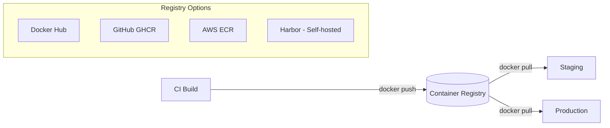
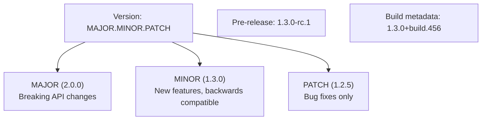
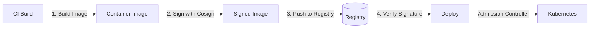

## Learning Objectives

- Set up and manage container registries for image storage
- Package and distribute Helm charts for Kubernetes applications
- Implement semantic versioning across your release pipeline
- Work with OCI artifacts for general-purpose distribution
- Sign and verify artifacts for supply chain security

## Prerequisites

- Docker image building fundamentals
- GitHub Actions workflow basics
- Kubernetes deployment concepts

## Container Registries

A container registry is a storage and distribution system for container images. Choosing the right one depends on your infrastructure and security requirements.



### Pushing to GitHub Container Registry

```yaml
# GitHub Actions workflow for building and pushing
name: Build and Push

on:
  push:
    tags: ['v*']

env:
  REGISTRY: ghcr.io
  IMAGE_NAME: ${{ github.repository }}

jobs:
  build:
    runs-on: ubuntu-latest
    permissions:
      contents: read
      packages: write

    steps:
      - uses: actions/checkout@v4

      - uses: docker/login-action@v3
        with:
          registry: ${{ env.REGISTRY }}
          username: ${{ github.actor }}
          password: ${{ secrets.GITHUB_TOKEN }}

      - uses: docker/metadata-action@v5
        id: meta
        with:
          images: ${{ env.REGISTRY }}/${{ env.IMAGE_NAME }}
          tags: |
            type=semver,pattern={{version}}
            type=semver,pattern={{major}}.{{minor}}
            type=sha,prefix=
            type=raw,value=latest,enable={{is_default_branch}}

      - uses: docker/build-push-action@v6
        with:
          context: .
          push: true
          tags: ${{ steps.meta.outputs.tags }}
          labels: ${{ steps.meta.outputs.labels }}
          platforms: linux/amd64,linux/arm64
          cache-from: type=gha
          cache-to: type=gha,mode=max
```

### AWS ECR with Lifecycle Policies

```bash
# Create ECR repository
aws ecr create-repository \
  --repository-name my-app \
  --image-scanning-configuration scanOnPush=true \
  --encryption-configuration encryptionType=KMS

# Set lifecycle policy to limit image count
aws ecr put-lifecycle-policy \
  --repository-name my-app \
  --lifecycle-policy-text '{
    "rules": [
      {
        "rulePriority": 1,
        "description": "Keep last 20 tagged images",
        "selection": {
          "tagStatus": "tagged",
          "tagPrefixList": ["v"],
          "countType": "imageCountMoreThan",
          "countNumber": 20
        },
        "action": { "type": "expire" }
      },
      {
        "rulePriority": 2,
        "description": "Remove untagged after 7 days",
        "selection": {
          "tagStatus": "untagged",
          "countType": "sinceImagePushed",
          "countUnit": "days",
          "countNumber": 7
        },
        "action": { "type": "expire" }
      }
    ]
  }'
```

### Self-Hosted Registry with Harbor

```yaml
# docker-compose.yml for Harbor deployment
services:
  harbor-core:
    image: goharbor/harbor-core:v2.11
    environment:
      - CONFIG_PATH=/etc/harbor/app.conf
    volumes:
      - ./config:/etc/harbor
      - harbor-data:/data

  harbor-registry:
    image: goharbor/registry-photon:v2.11
    volumes:
      - registry-data:/storage

  harbor-trivy:
    image: goharbor/trivy-adapter-photon:v2.11

volumes:
  harbor-data:
  registry-data:
```

## Helm Charts

Helm is the package manager for Kubernetes — it bundles manifests into versioned, reusable charts.

```bash
# Create a new chart
helm create my-app

# Chart structure
my-app/
├── Chart.yaml          # Metadata
├── values.yaml         # Default configuration
├── charts/             # Dependencies
└── templates/
    ├── deployment.yaml
    ├── service.yaml
    ├── ingress.yaml
    ├── hpa.yaml
    ├── _helpers.tpl     # Template helpers
    └── NOTES.txt        # Post-install message
```

```yaml
# Chart.yaml
apiVersion: v2
name: my-app
description: A production-ready web application
type: application
version: 1.2.0          # Chart version
appVersion: "2.1.0"     # Application version
dependencies:
  - name: postgresql
    version: "15.x"
    repository: https://charts.bitnami.com/bitnami
    condition: postgresql.enabled
```

```yaml
# values.yaml — sensible defaults
replicaCount: 3

image:
  repository: ghcr.io/myorg/my-app
  tag: ""               # Overridden at deploy time
  pullPolicy: IfNotPresent

resources:
  requests:
    cpu: 250m
    memory: 256Mi
  limits:
    memory: 512Mi

autoscaling:
  enabled: true
  minReplicas: 3
  maxReplicas: 20
  targetCPUUtilization: 70

ingress:
  enabled: true
  className: nginx
  hosts:
    - host: app.example.com
      paths:
        - path: /
          pathType: Prefix

postgresql:
  enabled: true
  auth:
    database: myapp
    username: appuser
```

```bash
# Package and push to OCI registry
helm package my-app/
helm push my-app-1.2.0.tgz oci://ghcr.io/myorg/charts

# Install from OCI registry
helm install my-release oci://ghcr.io/myorg/charts/my-app \
  --version 1.2.0 \
  --namespace production \
  --values production-values.yaml

# Upgrade with new values
helm upgrade my-release oci://ghcr.io/myorg/charts/my-app \
  --version 1.3.0 \
  --set image.tag=v2.2.0 \
  --wait --timeout 5m
```

## Semantic Versioning

Consistent versioning makes automated pipelines reliable and rollbacks predictable.



```bash
# Automated versioning with conventional commits
# Commit messages drive version bumps:
# fix: ...   → PATCH (1.0.0 → 1.0.1)
# feat: ...  → MINOR (1.0.0 → 1.1.0)
# feat!: ... → MAJOR (1.0.0 → 2.0.0)
# BREAKING CHANGE: in footer → MAJOR

# Using semantic-release in CI
npm install -D semantic-release @semantic-release/changelog @semantic-release/git
```

```json
{
  "release": {
    "branches": ["main"],
    "plugins": [
      "@semantic-release/commit-analyzer",
      "@semantic-release/release-notes-generator",
      "@semantic-release/changelog",
      ["@semantic-release/npm", { "npmPublish": false }],
      ["@semantic-release/git", {
        "assets": ["CHANGELOG.md", "package.json"],
        "message": "chore(release): ${nextRelease.version}"
      }],
      "@semantic-release/github"
    ]
  }
}
```

## OCI Artifacts

OCI (Open Container Initiative) artifacts extend registries beyond container images — store Helm charts, WASM modules, Terraform modules, or any blob.

```bash
# Push a generic artifact to a registry
oras push ghcr.io/myorg/policies:v1.0 \
  --artifact-type application/vnd.opa.policy \
  ./policy.rego:application/rego

# Pull it back
oras pull ghcr.io/myorg/policies:v1.0

# Attach metadata (signatures, SBOMs) to existing images
oras attach ghcr.io/myorg/my-app:v2.1 \
  --artifact-type application/spdx+json \
  ./sbom.spdx.json
```

## Signing and Verification

Supply chain security means verifying that what you deploy is exactly what was built.



```bash
# Install cosign
brew install cosign  # or go install github.com/sigstore/cosign/v2/cmd/cosign@latest

# Generate a key pair
cosign generate-key-pair

# Sign an image
cosign sign --key cosign.key ghcr.io/myorg/my-app:v2.1

# Verify signature
cosign verify --key cosign.pub ghcr.io/myorg/my-app:v2.1

# Keyless signing with Sigstore (uses OIDC identity)
cosign sign ghcr.io/myorg/my-app:v2.1
cosign verify \
  --certificate-identity=github-actions@myorg \
  --certificate-oidc-issuer=https://token.actions.githubusercontent.com \
  ghcr.io/myorg/my-app:v2.1
```

```yaml
# GitHub Actions — sign images in CI
- name: Sign image with Cosign
  uses: sigstore/cosign-installer@v3

- name: Sign the published image
  env:
    COSIGN_EXPERIMENTAL: 1
  run: |
    cosign sign --yes \
      ${{ env.REGISTRY }}/${{ env.IMAGE_NAME }}@${{ steps.build.outputs.digest }}
```

### Generate SBOM (Software Bill of Materials)

```bash
# Generate SBOM with Syft
syft ghcr.io/myorg/my-app:v2.1 -o spdx-json > sbom.spdx.json

# Attach SBOM to image
cosign attach sbom --sbom sbom.spdx.json ghcr.io/myorg/my-app:v2.1

# Scan SBOM for vulnerabilities with Grype
grype sbom:sbom.spdx.json
```

## Hands-On Exercise: Helm Chart Packaging

### Exercise: Create and Deploy a Chart

```bash
# Create a chart
helm create webapp

# Modify values for your app
cat > webapp/values.yaml << 'EOF'
replicaCount: 2
image:
  repository: nginx
  tag: "1.27-alpine"
  pullPolicy: IfNotPresent
service:
  type: ClusterIP
  port: 80
ingress:
  enabled: false
resources:
  requests:
    cpu: 50m
    memory: 64Mi
  limits:
    memory: 128Mi
EOF

# Lint the chart
helm lint webapp/

# Template (dry-run) to inspect generated manifests
helm template my-release webapp/ --debug

# Install into cluster
helm install my-release webapp/ --namespace helm-lab --create-namespace

# Check release status
helm list -n helm-lab
helm status my-release -n helm-lab

# Upgrade with new values
helm upgrade my-release webapp/ -n helm-lab --set replicaCount=3

# View release history
helm history my-release -n helm-lab

# Rollback to previous revision
helm rollback my-release 1 -n helm-lab

# Clean up
helm uninstall my-release -n helm-lab
kubectl delete namespace helm-lab
rm -rf webapp/
```

## Key Takeaways

- **Container registries** are infrastructure — set lifecycle policies to control costs
- **Helm charts** package Kubernetes apps with versioned, configurable deployments
- **Semantic versioning** with conventional commits automates version bumps
- **OCI artifacts** extend registries to store any artifact type (policies, SBOMs, configs)
- **Cosign** provides keyless signing via Sigstore — integrate it into every CI pipeline
- **SBOMs** are becoming a compliance requirement — generate and attach them to images
- Always use **image digests** (not tags) in production for immutability

## External Resources

- [Docker Registry HTTP API](https://docs.docker.com/registry/spec/api/)
- [Helm Documentation](https://helm.sh/docs/)
- [Semantic Versioning Specification](https://semver.org/)
- [Sigstore — Cosign](https://docs.sigstore.dev/cosign/overview/)
- [ORAS — OCI Registry as Storage](https://oras.land/)
- [Syft — SBOM Generation](https://github.com/anchore/syft)
