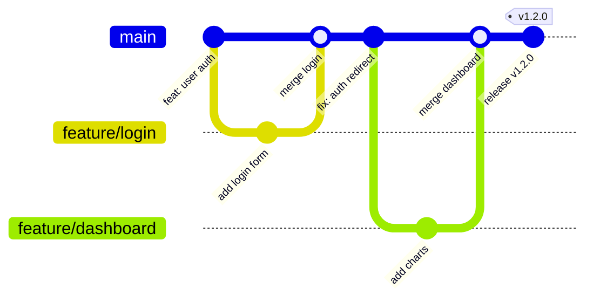
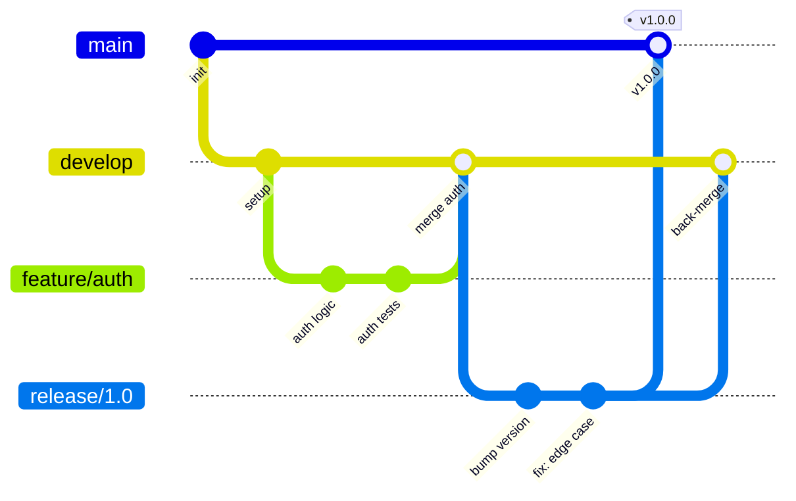
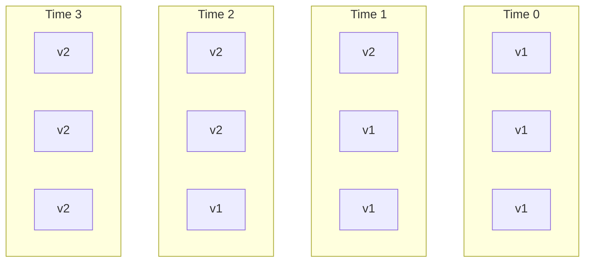
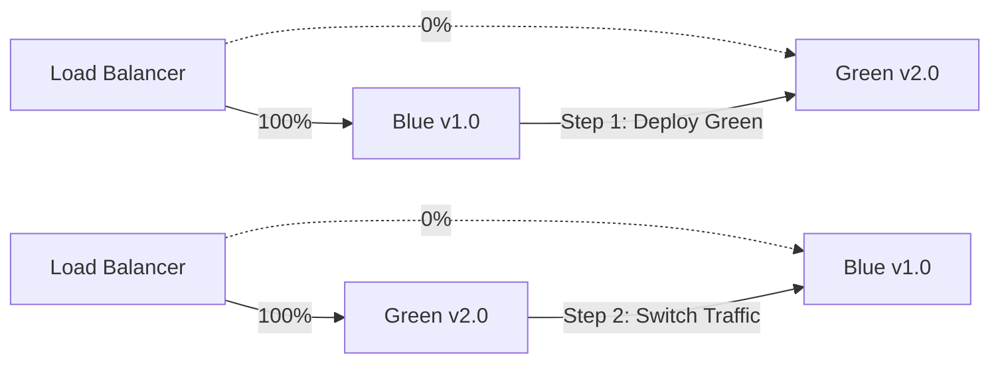
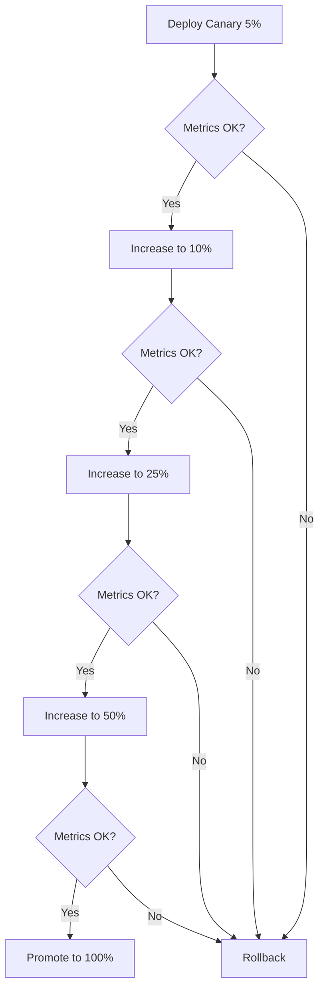
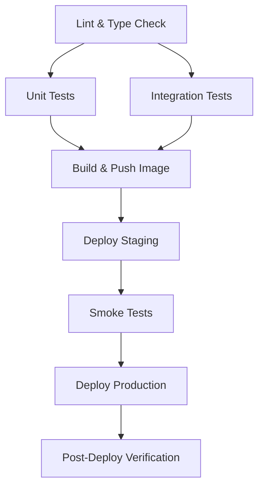

## Learning Objectives

- Compare branching strategies: trunk-based development vs GitFlow
- Design CI/CD pipelines for different team sizes and release cadences
- Implement blue-green, canary, and rolling deployment strategies
- Use feature flags to decouple deployment from release
- Build progressive delivery pipelines with automated rollback

## Prerequisites

- GitHub Actions workflow syntax and concepts
- Kubernetes deployments and services basics
- Understanding of Git branching and merging

## Branching Strategies

Your branching model directly shapes your CI/CD pipeline. Pick the one that matches your team's velocity.

### Trunk-Based Development

The entire team commits to `main` (trunk) with short-lived feature branches (< 1 day).



**When to use:** Teams with strong CI, good test coverage, and frequent releases (multiple times per day).

```yaml
# Pipeline for trunk-based development
name: Trunk CI/CD

on:
  push:
    branches: [main]
  pull_request:

jobs:
  test:
    runs-on: ubuntu-latest
    steps:
      - uses: actions/checkout@v4
      - run: npm ci && npm test

  build-and-push:
    needs: test
    if: github.ref == 'refs/heads/main'
    runs-on: ubuntu-latest
    outputs:
      image-tag: ${{ steps.meta.outputs.tags }}
    steps:
      - uses: actions/checkout@v4
      - id: meta
        uses: docker/metadata-action@v5
        with:
          images: ghcr.io/${{ github.repository }}
          tags: |
            type=sha,prefix=
            type=raw,value=latest
      - uses: docker/build-push-action@v6
        with:
          push: true
          tags: ${{ steps.meta.outputs.tags }}

  deploy-staging:
    needs: build-and-push
    runs-on: ubuntu-latest
    environment: staging
    steps:
      - run: echo "Deploy ${{ needs.build-and-push.outputs.image-tag }} to staging"

  deploy-production:
    needs: deploy-staging
    runs-on: ubuntu-latest
    environment: production
    steps:
      - run: echo "Deploy to production with canary"
```

### GitFlow

Long-lived `develop` and `main` branches with feature, release, and hotfix branches.



**When to use:** Teams with scheduled releases, multiple versions in production, or compliance requirements.

## Deployment Strategies

### Rolling Update

Replace instances gradually. The default in Kubernetes.



### Blue-Green Deployment

Run two identical environments. Switch traffic atomically.

```yaml
# Blue-green with Kubernetes services
apiVersion: v1
kind: Service
metadata:
  name: api-production
spec:
  selector:
    app: api
    version: blue    # Flip to "green" to switch
  ports:
    - port: 80
      targetPort: 8080

---
# Blue deployment (current production)
apiVersion: apps/v1
kind: Deployment
metadata:
  name: api-blue
spec:
  replicas: 3
  selector:
    matchLabels:
      app: api
      version: blue
  template:
    metadata:
      labels:
        app: api
        version: blue
    spec:
      containers:
        - name: api
          image: my-api:1.0.0

---
# Green deployment (new version, pre-validated)
apiVersion: apps/v1
kind: Deployment
metadata:
  name: api-green
spec:
  replicas: 3
  selector:
    matchLabels:
      app: api
      version: green
  template:
    metadata:
      labels:
        app: api
        version: green
    spec:
      containers:
        - name: api
          image: my-api:2.0.0
```

```bash
# Switch traffic from blue to green
kubectl patch service api-production \
  -p '{"spec":{"selector":{"version":"green"}}}'

# Instant rollback — switch back to blue
kubectl patch service api-production \
  -p '{"spec":{"selector":{"version":"blue"}}}'
```



### Canary Deployment

Route a small percentage of traffic to the new version. Gradually increase if metrics look good.

```yaml
# Using Nginx Ingress canary annotations
apiVersion: networking.k8s.io/v1
kind: Ingress
metadata:
  name: api-canary
  annotations:
    nginx.ingress.kubernetes.io/canary: "true"
    nginx.ingress.kubernetes.io/canary-weight: "10"
spec:
  ingressClassName: nginx
  rules:
    - host: api.example.com
      http:
        paths:
          - path: /
            pathType: Prefix
            backend:
              service:
                name: api-canary
                port:
                  number: 80
```

```bash
# Progressive canary rollout script
#!/bin/bash
WEIGHTS=(5 10 25 50 75 100)

for weight in "${WEIGHTS[@]}"; do
    echo "Setting canary weight to ${weight}%"
    kubectl annotate ingress api-canary \
        nginx.ingress.kubernetes.io/canary-weight="$weight" \
        --overwrite

    echo "Waiting 5 minutes and checking error rate..."
    sleep 300

    ERROR_RATE=$(curl -s "http://prometheus:9090/api/v1/query?query=rate(http_requests_total{status=~'5..', version='canary'}[5m])" | jq '.data.result[0].value[1]' -r)

    if (( $(echo "$ERROR_RATE > 0.01" | bc -l) )); then
        echo "Error rate too high (${ERROR_RATE}). Rolling back!"
        kubectl annotate ingress api-canary \
            nginx.ingress.kubernetes.io/canary-weight="0" --overwrite
        exit 1
    fi
done

echo "Canary promotion complete"
```



## Feature Flags

Decouple deployment from release. Deploy code to production that's turned off until you're ready.

```typescript
// Feature flag check in application code
const flags = {
  newCheckoutFlow: {
    enabled: process.env.FF_NEW_CHECKOUT === 'true',
    percentage: parseInt(process.env.FF_NEW_CHECKOUT_PCT || '0'),
  },
};

function getCheckoutHandler(userId: string) {
  const flag = flags.newCheckoutFlow;
  if (!flag.enabled) return legacyCheckout;

  const hash = murmurhash(userId) % 100;
  return hash < flag.percentage ? newCheckout : legacyCheckout;
}
```

```yaml
# ConfigMap for feature flags
apiVersion: v1
kind: ConfigMap
metadata:
  name: feature-flags
data:
  FF_NEW_CHECKOUT: "true"
  FF_NEW_CHECKOUT_PCT: "25"
  FF_DARK_MODE: "true"
  FF_BETA_API: "false"
```

**Feature flag lifecycle:**
1. **Deploy** code behind a flag (off by default)
2. **Enable** for internal users → dogfooding
3. **Ramp** percentage for external users (1% → 5% → 25% → 100%)
4. **Remove** flag and dead code once stable

## Pipeline Design Patterns

### The Diamond Pipeline



### Monorepo Pipeline with Path Filters

```yaml
name: Monorepo CI

on:
  push:
    branches: [main]

jobs:
  detect-changes:
    runs-on: ubuntu-latest
    outputs:
      services: ${{ steps.changes.outputs.changes }}
    steps:
      - uses: actions/checkout@v4
      - uses: dorny/paths-filter@v3
        id: changes
        with:
          filters: |
            api:
              - 'services/api/**'
            web:
              - 'services/web/**'
            shared:
              - 'packages/shared/**'

  build:
    needs: detect-changes
    if: needs.detect-changes.outputs.services != '[]'
    strategy:
      matrix:
        service: ${{ fromJson(needs.detect-changes.outputs.services) }}
    runs-on: ubuntu-latest
    steps:
      - uses: actions/checkout@v4
      - run: echo "Building ${{ matrix.service }}"
```

## Hands-On Exercise: Canary Pipeline

### Exercise: Implement Blue-Green Locally

```bash
# Create namespace
kubectl create namespace release-lab

# Deploy "blue" version
cat <<'EOF' | kubectl apply -n release-lab -f -
apiVersion: apps/v1
kind: Deployment
metadata:
  name: app-blue
spec:
  replicas: 3
  selector:
    matchLabels:
      app: web
      version: blue
  template:
    metadata:
      labels:
        app: web
        version: blue
    spec:
      containers:
        - name: web
          image: hashicorp/http-echo:1.0
          args: ["-text=BLUE v1", "-listen=:8080"]
          ports:
            - containerPort: 8080
---
apiVersion: apps/v1
kind: Deployment
metadata:
  name: app-green
spec:
  replicas: 3
  selector:
    matchLabels:
      app: web
      version: green
  template:
    metadata:
      labels:
        app: web
        version: green
    spec:
      containers:
        - name: web
          image: hashicorp/http-echo:1.0
          args: ["-text=GREEN v2", "-listen=:8080"]
          ports:
            - containerPort: 8080
---
apiVersion: v1
kind: Service
metadata:
  name: web-production
spec:
  selector:
    app: web
    version: blue
  ports:
    - port: 80
      targetPort: 8080
EOF

# Verify blue is serving
kubectl run -n release-lab test --image=curlimages/curl --rm -it -- \
  curl http://web-production

# Switch to green
kubectl patch service web-production -n release-lab \
  -p '{"spec":{"selector":{"version":"green"}}}'

# Verify green is now serving
kubectl run -n release-lab test2 --image=curlimages/curl --rm -it -- \
  curl http://web-production

# Rollback to blue
kubectl patch service web-production -n release-lab \
  -p '{"spec":{"selector":{"version":"blue"}}}'

kubectl delete namespace release-lab
```

## Key Takeaways

- **Trunk-based development** works best with strong CI and feature flags
- **GitFlow** suits teams with scheduled releases or multiple supported versions
- **Blue-green** gives instant rollback but requires double the resources
- **Canary** minimizes blast radius — start at 1-5% and validate metrics before ramping
- **Feature flags** decouple deployment from release — deploy anytime, release when ready
- Always have an **automated rollback** mechanism tied to health metrics
- Pipeline design should match your **team size, release cadence, and risk tolerance**

## External Resources

- [Trunk Based Development](https://trunkbaseddevelopment.com/)
- [Martin Fowler: Blue-Green Deployment](https://martinfowler.com/bliki/BlueGreenDeployment.html)
- [Flagger — Progressive Delivery for Kubernetes](https://flagger.app/)
- [LaunchDarkly Feature Flags](https://launchdarkly.com/blog/what-are-feature-flags/)
- [GitFlow Considered Harmful](https://www.endoflineblog.com/gitflow-considered-harmful)
