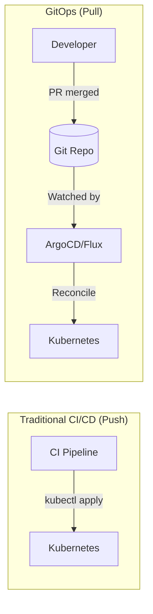
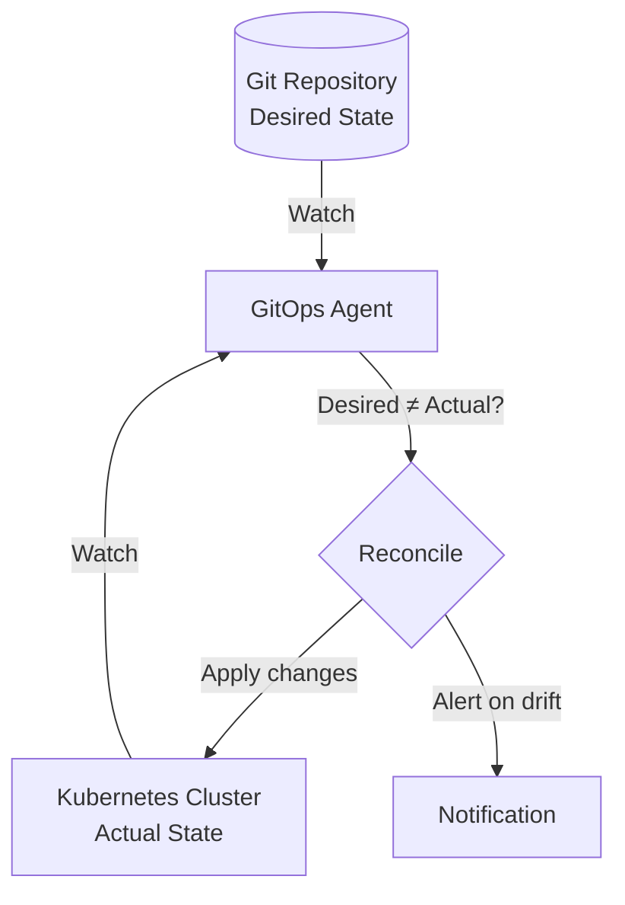
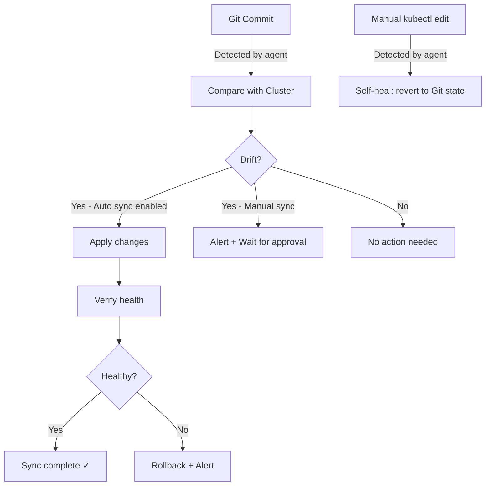
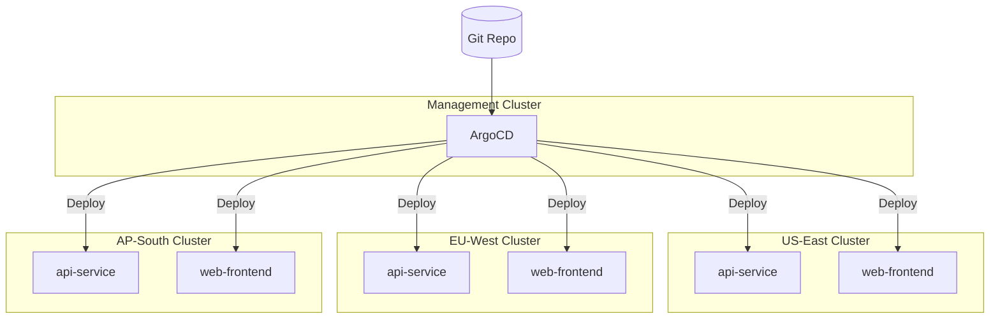

## Learning Objectives

- Understand GitOps principles and how they differ from traditional CI/CD
- Deploy and configure ArgoCD for Kubernetes-native GitOps
- Implement Flux CD as an alternative GitOps controller
- Set up drift detection and automated reconciliation
- Design multi-cluster GitOps architectures

## Prerequisites

- Kubernetes architecture, deployments, and Helm
- CI/CD pipeline concepts and branching strategies
- Git proficiency (branches, PRs, merge workflows)

## What is GitOps?

GitOps is an operational model where Git is the single source of truth for declarative infrastructure and applications. Instead of pushing changes to your cluster, the cluster pulls its desired state from Git.



### GitOps Principles

1. **Declarative** — The entire system is described declaratively (YAML/Helm/Kustomize)
2. **Versioned and Immutable** — Git stores the canonical desired state, with full history
3. **Pulled Automatically** — Agents in the cluster pull changes from Git
4. **Continuously Reconciled** — Agents detect and correct drift automatically



## ArgoCD

ArgoCD is a declarative, Kubernetes-native continuous delivery tool that follows the GitOps pattern.

### Installation

```bash
# Install ArgoCD
kubectl create namespace argocd
kubectl apply -n argocd -f https://raw.githubusercontent.com/argoproj/argo-cd/stable/manifests/install.yaml

# Wait for pods to be ready
kubectl wait --for=condition=available deployment -l app.kubernetes.io/part-of=argocd -n argocd --timeout=300s

# Get the initial admin password
argocd admin initial-password -n argocd

# Port-forward the UI
kubectl port-forward svc/argocd-server -n argocd 8080:443

# Login via CLI
argocd login localhost:8080 --username admin --password <password> --insecure

# Change the admin password
argocd account update-password
```

### Creating an Application

```yaml
# ArgoCD Application manifest
apiVersion: argoproj.io/v1alpha1
kind: Application
metadata:
  name: api-service
  namespace: argocd
  finalizers:
    - resources-finalizer.argocd.argoproj.io
spec:
  project: default
  source:
    repoURL: https://github.com/myorg/k8s-manifests.git
    targetRevision: main
    path: apps/api-service/overlays/production
  destination:
    server: https://kubernetes.default.svc
    namespace: production
  syncPolicy:
    automated:
      prune: true           # Remove resources not in Git
      selfHeal: true        # Revert manual changes
      allowEmpty: false
    syncOptions:
      - CreateNamespace=true
      - PrunePropagationPolicy=foreground
      - PruneLast=true
    retry:
      limit: 5
      backoff:
        duration: 5s
        factor: 2
        maxDuration: 3m
```

```bash
# Or create via CLI
argocd app create api-service \
  --repo https://github.com/myorg/k8s-manifests.git \
  --path apps/api-service/overlays/production \
  --dest-server https://kubernetes.default.svc \
  --dest-namespace production \
  --sync-policy automated \
  --auto-prune \
  --self-heal
```

### Application Sets

Manage multiple applications from a single template — perfect for multi-cluster or multi-tenant setups.

```yaml
apiVersion: argoproj.io/v1alpha1
kind: ApplicationSet
metadata:
  name: cluster-services
  namespace: argocd
spec:
  generators:
    - git:
        repoURL: https://github.com/myorg/k8s-manifests.git
        revision: main
        directories:
          - path: apps/*
    - clusters:
        selector:
          matchLabels:
            environment: production
  template:
    metadata:
      name: '{{path.basename}}-{{name}}'
    spec:
      project: default
      source:
        repoURL: https://github.com/myorg/k8s-manifests.git
        targetRevision: main
        path: '{{path}}/overlays/{{metadata.labels.environment}}'
      destination:
        server: '{{server}}'
        namespace: '{{path.basename}}'
      syncPolicy:
        automated:
          prune: true
          selfHeal: true
```

### Repository Structure for ArgoCD

```
k8s-manifests/
├── apps/
│   ├── api-service/
│   │   ├── base/
│   │   │   ├── deployment.yaml
│   │   │   ├── service.yaml
│   │   │   ├── hpa.yaml
│   │   │   └── kustomization.yaml
│   │   └── overlays/
│   │       ├── staging/
│   │       │   ├── kustomization.yaml
│   │       │   └── patches/
│   │       │       └── replicas.yaml
│   │       └── production/
│   │           ├── kustomization.yaml
│   │           └── patches/
│   │               ├── replicas.yaml
│   │               └── resources.yaml
│   ├── web-frontend/
│   │   ├── base/
│   │   └── overlays/
│   └── worker/
│       ├── base/
│       └── overlays/
├── infrastructure/
│   ├── cert-manager/
│   ├── ingress-nginx/
│   └── monitoring/
└── argocd/
    ├── projects/
    └── applicationsets/
```

### Kustomize Overlays

```yaml
# apps/api-service/base/kustomization.yaml
apiVersion: kustomize.config.k8s.io/v1beta1
kind: Kustomization
resources:
  - deployment.yaml
  - service.yaml
  - hpa.yaml

# apps/api-service/overlays/production/kustomization.yaml
apiVersion: kustomize.config.k8s.io/v1beta1
kind: Kustomization
resources:
  - ../../base
patches:
  - path: patches/replicas.yaml
  - path: patches/resources.yaml
images:
  - name: my-api
    newName: ghcr.io/myorg/api
    newTag: v2.1.0      # Updated by CI after image build
```

## Flux CD

Flux is a CNCF graduated GitOps toolkit. It's more modular than ArgoCD — you compose the controllers you need.

```bash
# Install Flux
flux install

# Bootstrap Flux with a Git repository
flux bootstrap github \
  --owner=myorg \
  --repository=fleet-infra \
  --path=clusters/production \
  --personal

# Check Flux status
flux get all
```

### Flux GitRepository and Kustomization

```yaml
# Source: Git repository to watch
apiVersion: source.toolkit.fluxcd.io/v1
kind: GitRepository
metadata:
  name: app-manifests
  namespace: flux-system
spec:
  interval: 1m
  url: https://github.com/myorg/k8s-manifests
  ref:
    branch: main
  secretRef:
    name: github-token

---
# Deploy from the repository
apiVersion: kustomize.toolkit.fluxcd.io/v1
kind: Kustomization
metadata:
  name: api-service
  namespace: flux-system
spec:
  interval: 5m
  sourceRef:
    kind: GitRepository
    name: app-manifests
  path: ./apps/api-service/overlays/production
  prune: true
  healthChecks:
    - apiVersion: apps/v1
      kind: Deployment
      name: api-service
      namespace: production
  timeout: 3m
```

### Flux Image Automation

Flux can automatically update image tags in Git when new images are pushed.

```yaml
# Watch for new images
apiVersion: image.toolkit.fluxcd.io/v1beta2
kind: ImageRepository
metadata:
  name: api-service
  namespace: flux-system
spec:
  image: ghcr.io/myorg/api
  interval: 5m

---
# Define which tags to track
apiVersion: image.toolkit.fluxcd.io/v1beta2
kind: ImagePolicy
metadata:
  name: api-service
  namespace: flux-system
spec:
  imageRepositoryRef:
    name: api-service
  policy:
    semver:
      range: ">=2.0.0 <3.0.0"

---
# Auto-update manifests in Git
apiVersion: image.toolkit.fluxcd.io/v1beta2
kind: ImageUpdateAutomation
metadata:
  name: api-service
  namespace: flux-system
spec:
  interval: 5m
  sourceRef:
    kind: GitRepository
    name: app-manifests
  git:
    checkout:
      ref:
        branch: main
    commit:
      author:
        name: fluxbot
        email: flux@myorg.com
      messageTemplate: "chore: update {{.AutomationObject}} images"
    push:
      branch: main
  update:
    path: ./apps/api-service
    strategy: Setters
```

## Drift Detection and Reconciliation



```bash
# ArgoCD: Check sync status
argocd app get api-service
argocd app diff api-service

# Force sync
argocd app sync api-service

# View sync history
argocd app history api-service

# Flux: Check reconciliation status
flux get kustomizations
flux reconcile kustomization api-service
```

## Multi-Cluster GitOps



```bash
# ArgoCD: Register additional clusters
argocd cluster add eks-us-east-1 --name production-us
argocd cluster add eks-eu-west-1 --name production-eu
argocd cluster add eks-ap-south-1 --name production-ap

# List registered clusters
argocd cluster list
```

## Hands-On Exercise: GitOps with ArgoCD

### Exercise: Deploy an App via GitOps

```bash
# Install ArgoCD
kubectl create namespace argocd
kubectl apply -n argocd -f https://raw.githubusercontent.com/argoproj/argo-cd/stable/manifests/install.yaml

# Wait for it to be ready
kubectl wait --for=condition=available deployment argocd-server -n argocd --timeout=300s

# Get admin password
ARGO_PWD=$(kubectl -n argocd get secret argocd-initial-admin-secret -o jsonpath="{.data.password}" | base64 -d)
echo "ArgoCD password: $ARGO_PWD"

# Port-forward the UI
kubectl port-forward svc/argocd-server -n argocd 8080:443 &

# Create an application pointing to a public example repo
cat <<'EOF' | kubectl apply -f -
apiVersion: argoproj.io/v1alpha1
kind: Application
metadata:
  name: guestbook
  namespace: argocd
spec:
  project: default
  source:
    repoURL: https://github.com/argoproj/argocd-example-apps.git
    targetRevision: HEAD
    path: guestbook
  destination:
    server: https://kubernetes.default.svc
    namespace: guestbook
  syncPolicy:
    automated:
      selfHeal: true
      prune: true
    syncOptions:
      - CreateNamespace=true
EOF

# Check status
kubectl get application -n argocd

# Open the UI at https://localhost:8080
# Login with admin / $ARGO_PWD

# Test self-healing: manually edit the deployment
kubectl scale deployment guestbook-ui -n guestbook --replicas=5
# ArgoCD will detect the drift and revert to the Git-defined replica count

# Clean up
kubectl delete application guestbook -n argocd
kubectl delete namespace guestbook argocd
```

## Key Takeaways

- **GitOps** uses Git as the single source of truth — the cluster pulls state, CI doesn't push
- **ArgoCD** is the most popular GitOps tool with a powerful UI and ApplicationSets
- **Flux** is more modular and composable, with built-in image update automation
- **Self-healing** automatically reverts manual changes — what's in Git is what runs
- **Drift detection** catches unauthorized changes and configuration drift
- Store **manifests in a separate repo** from application code for clean separation
- **Kustomize overlays** manage environment-specific configuration without duplication

## External Resources

- [ArgoCD Documentation](https://argo-cd.readthedocs.io/)
- [Flux CD Documentation](https://fluxcd.io/docs/)
- [OpenGitOps Principles](https://opengitops.dev/)
- [GitOps Working Group — CNCF](https://github.com/cncf/tag-app-delivery/tree/main/gitops-wg)
- [Kustomize Documentation](https://kustomize.io/)
- [ArgoCD Best Practices](https://argo-cd.readthedocs.io/en/stable/user-guide/best_practices/)
