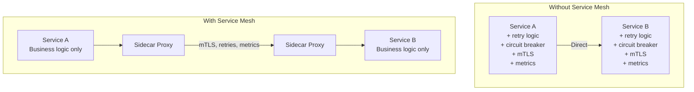
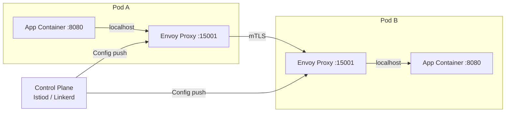
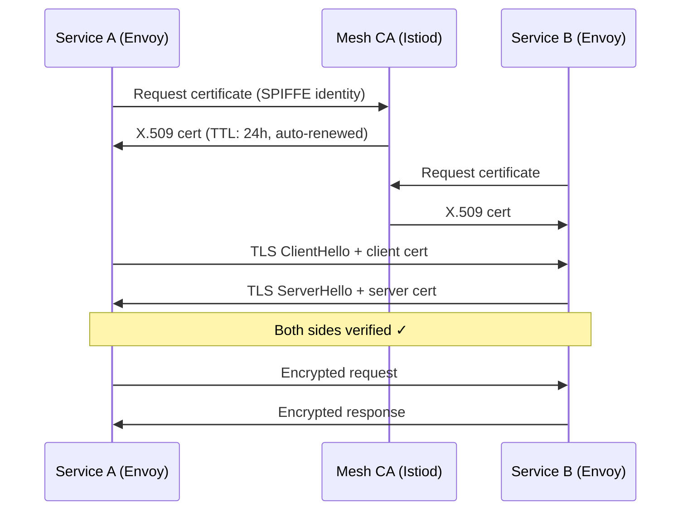
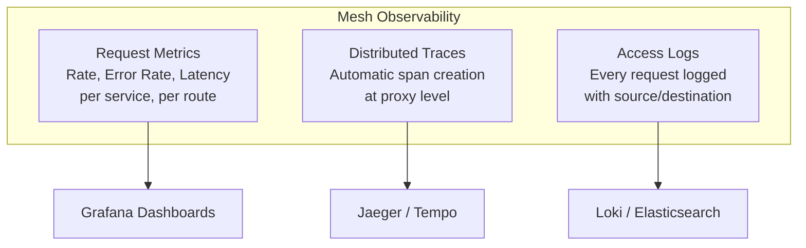

## Learning Objectives

- Understand service mesh architecture and the sidecar proxy pattern
- Compare Istio and Linkerd for different use cases
- Configure mutual TLS for zero-trust service communication
- Implement traffic management: canary deployments, fault injection, and retries
- Use service mesh observability for request-level insights

## Prerequisites

- Kubernetes services, networking, and Ingress
- Twelve-factor app principles
- Basic understanding of proxies and load balancing

## What is a Service Mesh?

A service mesh is a dedicated infrastructure layer for handling service-to-service communication. It moves networking logic out of application code and into a configurable proxy layer.



**Problems a service mesh solves:**
- **Security:** Mutual TLS between all services without application changes
- **Observability:** Request-level metrics, traces, and access logs
- **Reliability:** Retries, timeouts, circuit breaking, rate limiting
- **Traffic management:** Canary deployments, A/B testing, fault injection

## The Sidecar Pattern

Every pod gets a sidecar proxy container injected alongside the application container. All traffic flows through the proxy.



The sidecar intercepts all inbound and outbound traffic using iptables rules. The application doesn't know it exists.

## Istio

Istio is the most feature-rich service mesh, powered by Envoy proxy.

```bash
# Install Istio
curl -L https://istio.io/downloadIstio | sh -
istioctl install --set profile=default -y

# Enable sidecar injection for a namespace
kubectl label namespace production istio-injection=enabled

# Verify installation
istioctl verify-install
kubectl get pods -n istio-system
```

### Traffic Management

```yaml
# VirtualService — route traffic between versions
apiVersion: networking.istio.io/v1
kind: VirtualService
metadata:
  name: api-routing
spec:
  hosts:
    - api-service
  http:
    - match:
        - headers:
            x-canary:
              exact: "true"
      route:
        - destination:
            host: api-service
            subset: canary
    - route:
        - destination:
            host: api-service
            subset: stable
          weight: 90
        - destination:
            host: api-service
            subset: canary
          weight: 10

---
# DestinationRule — define subsets
apiVersion: networking.istio.io/v1
kind: DestinationRule
metadata:
  name: api-service
spec:
  host: api-service
  trafficPolicy:
    connectionPool:
      tcp:
        maxConnections: 100
      http:
        h2UpgradePolicy: DEFAULT
        maxRequestsPerConnection: 10
    outlierDetection:
      consecutive5xxErrors: 5
      interval: 30s
      baseEjectionTime: 30s
  subsets:
    - name: stable
      labels:
        version: v1
    - name: canary
      labels:
        version: v2
```

### Fault Injection

Test resilience by injecting failures into the mesh.

```yaml
apiVersion: networking.istio.io/v1
kind: VirtualService
metadata:
  name: payment-fault-injection
spec:
  hosts:
    - payment-service
  http:
    - fault:
        delay:
          percentage:
            value: 10
          fixedDelay: 5s
        abort:
          percentage:
            value: 5
          httpStatus: 503
      route:
        - destination:
            host: payment-service
```

### Retries and Timeouts

```yaml
apiVersion: networking.istio.io/v1
kind: VirtualService
metadata:
  name: api-resilience
spec:
  hosts:
    - api-service
  http:
    - timeout: 10s
      retries:
        attempts: 3
        perTryTimeout: 3s
        retryOn: connect-failure,refused-stream,unavailable,cancelled,retriable-status-codes
        retryRemoteLocalities: true
      route:
        - destination:
            host: api-service
```

## Mutual TLS (mTLS)

With mTLS, both the client and server authenticate each other. The service mesh handles certificate issuance, rotation, and verification automatically.



```yaml
# Enforce strict mTLS across the mesh
apiVersion: security.istio.io/v1
kind: PeerAuthentication
metadata:
  name: default
  namespace: istio-system
spec:
  mtls:
    mode: STRICT

---
# Authorization policy — only allow specific services
apiVersion: security.istio.io/v1
kind: AuthorizationPolicy
metadata:
  name: api-auth
  namespace: production
spec:
  selector:
    matchLabels:
      app: api-service
  rules:
    - from:
        - source:
            principals:
              - "cluster.local/ns/production/sa/web-frontend"
              - "cluster.local/ns/production/sa/mobile-bff"
      to:
        - operation:
            methods: ["GET", "POST"]
            paths: ["/api/*"]
```

## Linkerd

Linkerd is a simpler, lighter alternative to Istio. It uses its own Rust-based micro-proxy instead of Envoy.

```bash
# Install Linkerd
curl -fsL https://run.linkerd.io/install | sh
linkerd install --crds | kubectl apply -f -
linkerd install | kubectl apply -f -

# Verify installation
linkerd check

# Inject sidecar into a namespace
kubectl get deploy -n production -o yaml | linkerd inject - | kubectl apply -f -

# Or annotate the namespace
kubectl annotate namespace production linkerd.io/inject=enabled
```

### Linkerd Service Profiles

```yaml
apiVersion: linkerd.io/v1alpha2
kind: ServiceProfile
metadata:
  name: api-service.production.svc.cluster.local
  namespace: production
spec:
  routes:
    - name: GET /api/users
      condition:
        method: GET
        pathRegex: /api/users
      timeout: 5s
      isRetryable: true
    - name: POST /api/orders
      condition:
        method: POST
        pathRegex: /api/orders
      timeout: 30s
      isRetryable: false    # Non-idempotent — don't retry
  retryBudget:
    retryRatio: 0.2         # Max 20% of requests can be retries
    minRetriesPerSecond: 10
    ttl: 10s
```

### Istio vs Linkerd

| Feature | Istio | Linkerd |
|---------|-------|---------|
| Proxy | Envoy (C++) | linkerd2-proxy (Rust) |
| Complexity | High | Low |
| Resource usage | Higher | Lower |
| mTLS | Yes | Yes (on by default) |
| Traffic management | Very flexible | Basic |
| Multi-cluster | Yes | Yes |
| Learning curve | Steep | Gentle |

**Choose Istio when:** You need advanced traffic management, multi-cluster federation, or Envoy-specific features.

**Choose Linkerd when:** You want simple, lightweight mTLS and observability with minimal configuration.

## Observability

The mesh provides request-level metrics, distributed traces, and access logs without any application instrumentation.

```bash
# Istio: View metrics in Kiali dashboard
istioctl dashboard kiali

# Linkerd: Built-in dashboard
linkerd viz install | kubectl apply -f -
linkerd viz dashboard

# Linkerd: Per-route metrics
linkerd viz routes deploy/api-service -n production
# ROUTE                 SUCCESS   RPS   LATENCY_P50   LATENCY_P99
# GET /api/users        100.00%   50    5ms           45ms
# POST /api/orders       99.50%   20    25ms          250ms
# [DEFAULT]             100.00%   5     2ms           10ms
```



### Circuit Breaking

```yaml
# Istio DestinationRule with circuit breaking
apiVersion: networking.istio.io/v1
kind: DestinationRule
metadata:
  name: payment-service
spec:
  host: payment-service
  trafficPolicy:
    connectionPool:
      tcp:
        maxConnections: 50
      http:
        http1MaxPendingRequests: 100
        http2MaxRequests: 1000
        maxRequestsPerConnection: 10
    outlierDetection:
      consecutive5xxErrors: 3
      interval: 10s
      baseEjectionTime: 30s
      maxEjectionPercent: 50
```

## Hands-On Exercise: Service Mesh Basics

### Exercise: Install Linkerd and Observe Traffic

```bash
# Install Linkerd
linkerd install --crds | kubectl apply -f -
linkerd install | kubectl apply -f -
linkerd check

# Install viz extension
linkerd viz install | kubectl apply -f -

# Deploy sample app
kubectl create namespace mesh-lab
kubectl annotate namespace mesh-lab linkerd.io/inject=enabled

cat <<'EOF' | kubectl apply -n mesh-lab -f -
apiVersion: apps/v1
kind: Deployment
metadata:
  name: web
spec:
  replicas: 1
  selector:
    matchLabels:
      app: web
  template:
    metadata:
      labels:
        app: web
    spec:
      containers:
        - name: web
          image: buoyantio/bb:v0.0.6
          command: ["bb", "point-to-point-channel", "--grpc-downstream-server", "backend:8080"]
          ports:
            - containerPort: 8080
---
apiVersion: apps/v1
kind: Deployment
metadata:
  name: backend
spec:
  replicas: 2
  selector:
    matchLabels:
      app: backend
  template:
    metadata:
      labels:
        app: backend
    spec:
      containers:
        - name: backend
          image: buoyantio/bb:v0.0.6
          command: ["bb", "terminus", "--grpc-server-port", "8080"]
          ports:
            - containerPort: 8080
---
apiVersion: v1
kind: Service
metadata:
  name: backend
spec:
  selector:
    app: backend
  ports:
    - port: 8080
EOF

# Check meshed pods
linkerd viz stat deploy -n mesh-lab

# Generate traffic
kubectl run -n mesh-lab load --image=buoyantio/slow_cooker:1.3.0 --rm -it -- \
  slow_cooker -qps 10 -concurrency 2 http://backend:8080

# View live traffic in the dashboard
linkerd viz dashboard

# Clean up
kubectl delete namespace mesh-lab
```

## Key Takeaways

- A service mesh moves **networking concerns** (mTLS, retries, observability) out of application code
- The **sidecar pattern** intercepts all traffic transparently — no app changes needed
- **Mutual TLS** provides zero-trust communication with automatic certificate management
- **Istio** is feature-rich but complex; **Linkerd** is simpler and lighter
- **Don't adopt a service mesh prematurely** — it adds operational complexity
- Service mesh observability gives **per-route, per-service** metrics out of the box
- Start with **mTLS and observability**, then add traffic management as needed

## External Resources

- [Istio Documentation](https://istio.io/latest/docs/)
- [Linkerd Documentation](https://linkerd.io/2/overview/)
- [Envoy Proxy](https://www.envoyproxy.io/)
- [SPIFFE — Secure Production Identity](https://spiffe.io/)
- [The Service Mesh Manifesto — William Morgan](https://buoyant.io/service-mesh-manifesto)
