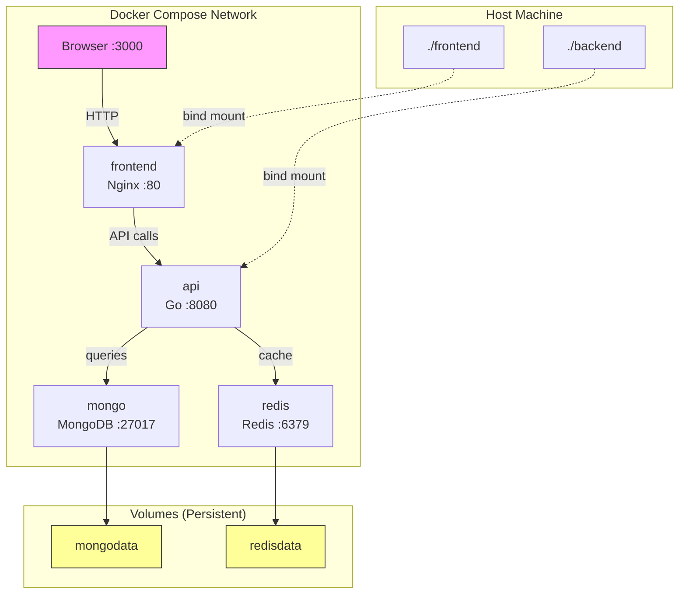

## Learning Objectives

- Define and run multi-service applications with Docker Compose
- Configure networks for service-to-service communication
- Use volumes for data persistence and bind mounts for development
- Manage environment variables and secrets securely
- Build a complete local development stack with database, API, and frontend

## Prerequisites

- Docker fundamentals and multi-stage builds (previous lessons)
- Basic YAML syntax
- Understanding of client-server architecture

## Core Concepts

### Why Docker Compose?

Running a single container is simple. But real applications have multiple components:

```bash
# Without Compose — managing this manually is painful
docker network create myapp
docker run -d --name db --network myapp -e POSTGRES_PASSWORD=secret postgres:16
docker run -d --name redis --network myapp redis:7-alpine
docker run -d --name api --network myapp -e DB_HOST=db -e REDIS_HOST=redis -p 8080:8080 my-api
docker run -d --name web --network myapp -p 3000:80 my-frontend
```

Docker Compose replaces all of this with a single declarative YAML file and one command: `docker compose up`.

### The docker-compose.yml File

```yaml
services:
  api:
    build:
      context: ./backend
      dockerfile: Dockerfile
    ports:
      - "8080:8080"
    environment:
      - DB_HOST=postgres
      - DB_PORT=5432
      - DB_NAME=myapp
      - DB_USER=appuser
      - DB_PASSWORD=secret
      - REDIS_URL=redis://redis:6379
    depends_on:
      postgres:
        condition: service_healthy
      redis:
        condition: service_started
    restart: unless-stopped

  web:
    build:
      context: ./frontend
      dockerfile: Dockerfile
    ports:
      - "3000:80"
    depends_on:
      - api

  postgres:
    image: postgres:16-alpine
    environment:
      POSTGRES_DB: myapp
      POSTGRES_USER: appuser
      POSTGRES_PASSWORD: secret
    volumes:
      - pgdata:/var/lib/postgresql/data
      - ./init.sql:/docker-entrypoint-initdb.d/init.sql
    ports:
      - "5432:5432"
    healthcheck:
      test: ["CMD-SHELL", "pg_isready -U appuser -d myapp"]
      interval: 5s
      timeout: 5s
      retries: 5

  redis:
    image: redis:7-alpine
    ports:
      - "6379:6379"
    volumes:
      - redisdata:/data

volumes:
  pgdata:
  redisdata:
```

### Essential Commands

```bash
docker compose up                 # Start all services (foreground)
docker compose up -d              # Start in detached mode
docker compose up --build         # Rebuild images before starting
docker compose down               # Stop and remove containers
docker compose down -v            # Also remove volumes (DELETES DATA)
docker compose ps                 # List running services
docker compose logs -f api        # Follow logs for a specific service
docker compose exec api sh        # Shell into a running service
docker compose restart api        # Restart a single service
docker compose build api          # Rebuild a single service image
docker compose pull               # Pull latest images
```

### Networking

Compose automatically creates a network for your services. Each service is accessible by its service name as hostname.

```yaml
services:
  api:
    # Can reach postgres at hostname "postgres" and redis at "redis"
    environment:
      - DB_HOST=postgres
      - REDIS_URL=redis://redis:6379

  postgres:
    # Accessible as "postgres" from other services
    image: postgres:16-alpine
```

You can also define custom networks for isolation:

```yaml
services:
  api:
    networks:
      - frontend
      - backend

  web:
    networks:
      - frontend     # Can reach api but NOT postgres

  postgres:
    networks:
      - backend      # Only api can reach it

networks:
  frontend:
  backend:
```

### Volumes and Bind Mounts

**Named volumes** persist data across container restarts:

```yaml
services:
  postgres:
    volumes:
      - pgdata:/var/lib/postgresql/data  # Named volume

volumes:
  pgdata:  # Docker manages the storage location
```

**Bind mounts** map a host directory into the container. Essential for development (hot reload):

```yaml
services:
  api:
    volumes:
      - ./backend:/app       # Source code → hot reload
      - /app/node_modules    # Prevent host node_modules from overwriting container's
```

### Environment Variables

Three ways to manage environment variables:

**1. Inline in compose file:**

```yaml
services:
  api:
    environment:
      - DB_HOST=postgres
      - DB_PORT=5432
```

**2. From a .env file:**

Create `.env`:

```
DB_HOST=postgres
DB_PORT=5432
DB_PASSWORD=supersecret
```

```yaml
services:
  api:
    env_file:
      - .env
```

**3. Variable substitution from shell:**

```yaml
services:
  api:
    image: my-api:${APP_VERSION:-latest}  # Default to "latest" if unset
    environment:
      - NODE_ENV=${NODE_ENV:-development}
```

```bash
APP_VERSION=2.1.0 NODE_ENV=production docker compose up -d
```

### Health Checks and Dependencies

`depends_on` controls startup order, but by default it only waits for the container to start, not for the service to be ready. Use `condition` with health checks:

```yaml
services:
  api:
    depends_on:
      postgres:
        condition: service_healthy  # Wait for postgres to be actually ready
      redis:
        condition: service_started  # Just wait for container start

  postgres:
    healthcheck:
      test: ["CMD-SHELL", "pg_isready -U appuser"]
      interval: 5s
      timeout: 5s
      retries: 5
      start_period: 10s  # Grace period before health checks begin
```

### Development vs Production Compose Files

Use `docker-compose.override.yml` for development-specific configuration:

**docker-compose.yml** (base — shared across environments):

```yaml
services:
  api:
    build: ./backend
    environment:
      - DB_HOST=postgres
    depends_on:
      - postgres

  postgres:
    image: postgres:16-alpine
    volumes:
      - pgdata:/var/lib/postgresql/data

volumes:
  pgdata:
```

**docker-compose.override.yml** (auto-loaded in development):

```yaml
services:
  api:
    build:
      context: ./backend
      target: development    # Use a dev stage in multi-stage Dockerfile
    ports:
      - "8080:8080"
      - "9229:9229"         # Debugger port
    volumes:
      - ./backend:/app      # Hot reload
    environment:
      - NODE_ENV=development
      - LOG_LEVEL=debug

  postgres:
    ports:
      - "5432:5432"         # Expose for local tools
```

**docker-compose.prod.yml** (explicit for production):

```yaml
services:
  api:
    build:
      context: ./backend
      target: production
    restart: always
    deploy:
      replicas: 2
      resources:
        limits:
          memory: 512M
          cpus: "0.5"
    environment:
      - NODE_ENV=production
      - LOG_LEVEL=warn
```

```bash
# Development (uses base + override automatically)
docker compose up

# Production (explicit file selection)
docker compose -f docker-compose.yml -f docker-compose.prod.yml up -d
```

### Full Example: 3-Service Application

```yaml
services:
  frontend:
    build:
      context: ./frontend
    ports:
      - "3000:80"
    depends_on:
      - api

  api:
    build:
      context: ./backend
    ports:
      - "8080:8080"
    environment:
      MONGO_URI: mongodb://mongo:27017/myapp
      JWT_SECRET: ${JWT_SECRET:-dev-secret-change-in-production}
      PORT: "8080"
    depends_on:
      mongo:
        condition: service_healthy
    restart: unless-stopped

  mongo:
    image: mongo:7
    ports:
      - "27017:27017"
    volumes:
      - mongodata:/data/db
    healthcheck:
      test: ["CMD", "mongosh", "--eval", "db.adminCommand('ping')"]
      interval: 10s
      timeout: 5s
      retries: 5
    restart: unless-stopped

volumes:
  mongodata:
```

## Diagram



## Hands-On Exercise

### Exercise: Compose a 3-Service App

**Step 1: Create the project structure**

```
compose-lab/
├── docker-compose.yml
├── backend/
│   ├── Dockerfile
│   ├── go.mod
│   └── main.go
└── frontend/
    ├── Dockerfile
    └── index.html
```

**Step 2: Create `backend/main.go`**

```go
package main

import (
	"encoding/json"
	"log"
	"net/http"
	"os"
	"time"
)

func main() {
	http.HandleFunc("/api/health", func(w http.ResponseWriter, r *http.Request) {
		json.NewEncoder(w).Encode(map[string]any{
			"status":    "ok",
			"timestamp": time.Now().Format(time.RFC3339),
			"hostname":  must(os.Hostname()),
			"db_host":   os.Getenv("DB_HOST"),
		})
	})

	log.Println("API server listening on :8080")
	log.Fatal(http.ListenAndServe(":8080", nil))
}

func must[T any](v T, _ error) T { return v }
```

**Step 3: Write `docker-compose.yml`**

```yaml
services:
  api:
    build: ./backend
    ports:
      - "8080:8080"
    environment:
      - DB_HOST=postgres
    depends_on:
      postgres:
        condition: service_healthy

  postgres:
    image: postgres:16-alpine
    environment:
      POSTGRES_DB: composelab
      POSTGRES_USER: admin
      POSTGRES_PASSWORD: secret
    volumes:
      - pgdata:/var/lib/postgresql/data
    healthcheck:
      test: ["CMD-SHELL", "pg_isready -U admin -d composelab"]
      interval: 5s
      timeout: 3s
      retries: 5

  frontend:
    image: nginx:1.25-alpine
    ports:
      - "3000:80"
    volumes:
      - ./frontend:/usr/share/nginx/html:ro
    depends_on:
      - api

volumes:
  pgdata:
```

**Step 4: Launch and verify**

```bash
docker compose up --build
# In another terminal:
curl http://localhost:8080/api/health
curl http://localhost:3000
docker compose ps
docker compose logs api
```

**Challenge:** Add a Redis service and modify the API to count page visits using Redis. Display the count in the API response.

## Key Takeaways

- Docker Compose defines multi-service applications in a single YAML file, replacing dozens of `docker run` commands
- Services communicate by service name within the Compose network — no IP address management needed
- Named volumes persist data across container restarts; bind mounts enable development hot-reload
- Use `depends_on` with `condition: service_healthy` to ensure proper service startup ordering
- Separate base configuration from environment-specific overrides using multiple Compose files
- Always use `.env` files for secrets in development and proper secret management in production

## External Resources

- [Docker Compose Documentation](https://docs.docker.com/compose/) — Official reference for the Compose specification
- [Compose Specification](https://compose-spec.io/) — The formal Compose file specification
- [Awesome Compose](https://github.com/docker/awesome-compose) — Curated sample Compose files for popular stacks
- [Docker Compose in Production](https://docs.docker.com/compose/production/) — Guide for production deployments
- [Compose Watch](https://docs.docker.com/compose/file-watch/) — Auto-rebuild and sync for development

## Quiz

See the quiz.json file for this module's quiz questions.
