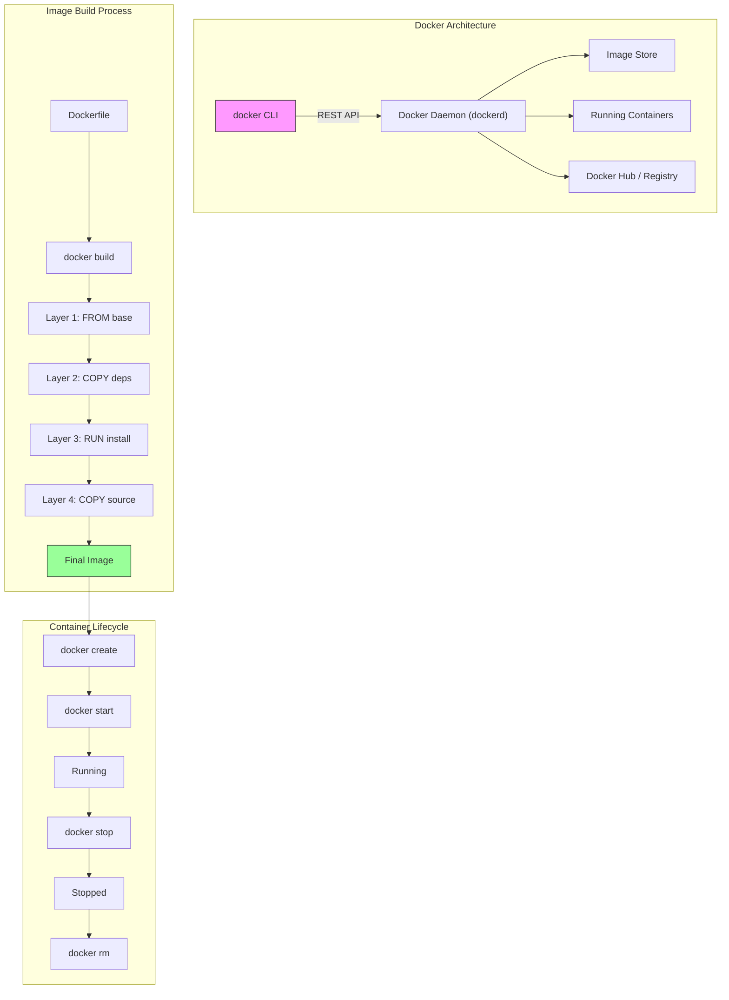

## Learning Objectives

- Understand the difference between images, containers, and the Docker daemon
- Write a Dockerfile that builds a production-ready image
- Explain how Docker layers and caching work to optimize build times
- Run, inspect, and manage containers from the command line
- Apply Dockerfile best practices for smaller, more secure images

## Prerequisites

- Basic command line / terminal familiarity
- Understanding of what a server process is
- Any programming language experience (examples use Go and Node.js)

## Core Concepts

### The Problem Docker Solves

"It works on my machine" was the defining frustration of software deployment before containers. An application that runs perfectly on a developer's laptop might fail in staging due to different library versions, OS patches, or missing configuration.

Docker solves this by packaging an application with **everything it needs to run** — code, runtime, libraries, environment variables, and configuration files — into a standardized unit called a **container**.

### Images, Containers, and the Daemon

- **Image** — A read-only template containing the application and its dependencies. Think of it as a snapshot or blueprint. Images are built from Dockerfiles and stored in registries (Docker Hub, GHCR, ECR).
- **Container** — A running instance of an image. It's an isolated process with its own filesystem, network, and process space. You can run multiple containers from the same image.
- **Docker Daemon** — The background service (`dockerd`) that manages images and containers on the host machine. The `docker` CLI communicates with the daemon via a socket.
- **Registry** — A storage service for Docker images. Docker Hub is the default public registry.

### Your First Dockerfile

A Dockerfile is a text file with instructions for building an image. Each instruction creates a **layer**.

```dockerfile
FROM node:20-alpine

WORKDIR /app

COPY package*.json ./

RUN npm ci --only=production

COPY . .

EXPOSE 3000

CMD ["node", "server.js"]
```

**Instruction breakdown:**

| Instruction | Purpose |
|-------------|---------|
| `FROM` | Base image — every Dockerfile starts with this |
| `WORKDIR` | Set the working directory inside the container |
| `COPY` | Copy files from host to container |
| `RUN` | Execute a command during build (installs deps, compiles code) |
| `EXPOSE` | Document which port the app listens on (doesn't publish it) |
| `CMD` | Default command to run when container starts |

### Building and Running

```bash
docker build -t my-app:1.0 .
docker run -d -p 3000:3000 --name my-app my-app:1.0
docker ps                            # List running containers
docker logs my-app                   # View container logs
docker exec -it my-app sh            # Shell into the container
docker stop my-app && docker rm my-app
```

**Flag reference:**

| Flag | Meaning |
|------|---------|
| `-t name:tag` | Tag the image |
| `-d` | Run in detached (background) mode |
| `-p 3000:3000` | Map host port to container port |
| `--name` | Assign a name to the container |
| `-it` | Interactive terminal |
| `--rm` | Automatically remove container when it stops |
| `-e KEY=VALUE` | Set environment variable |
| `-v host:container` | Mount a volume |

### Understanding Layers and Caching

Each Dockerfile instruction creates a layer. Docker caches layers and reuses them if the instruction and all preceding layers haven't changed.

```dockerfile
FROM node:20-alpine     # Layer 1: Base image (cached after first pull)
WORKDIR /app            # Layer 2: Set directory (always cached)
COPY package*.json ./   # Layer 3: Only rebuilds if package.json changes
RUN npm ci              # Layer 4: Only rebuilds if Layer 3 changed
COPY . .                # Layer 5: Rebuilds on any source code change
```

**The cache optimization principle:** Put instructions that change rarely at the top and instructions that change frequently at the bottom.

If you change `server.js`, Docker reuses layers 1-4 from cache and only rebuilds layer 5. But if you put `COPY . .` before `RUN npm ci`, changing any source file would also re-run `npm ci` — wasting minutes on every build.

### Docker Image Anatomy

```bash
docker history my-app:1.0
```

```
IMAGE          CREATED        SIZE      INSTRUCTION
a1b2c3d4e5f6   2 min ago     0B        CMD ["node" "server.js"]
f6e5d4c3b2a1   2 min ago     0B        EXPOSE 3000
b2a1f6e5d4c3   2 min ago     5.2MB     COPY . .
c3b2a1f6e5d4   2 min ago     45MB      RUN npm ci --only=production
d4c3b2a1f6e5   2 min ago     120B      COPY package*.json ./
e5d4c3b2a1f6   2 min ago     0B        WORKDIR /app
f6e5d4c3b2a1   3 weeks ago   180MB     FROM node:20-alpine
```

### A Go Application Dockerfile

Go's static binaries make it ideal for Docker:

```dockerfile
FROM golang:1.22-alpine AS builder

WORKDIR /app

COPY go.mod go.sum ./
RUN go mod download

COPY . .
RUN CGO_ENABLED=0 GOOS=linux go build -o /server ./cmd/server

FROM alpine:3.19

RUN apk --no-cache add ca-certificates

COPY --from=builder /server /server

EXPOSE 8080

USER nobody:nobody

CMD ["/server"]
```

This is a **multi-stage build** (covered in detail in the next lesson). The final image contains only the compiled binary and CA certificates — no Go toolchain, no source code.

### Essential Docker Commands

```bash
# Image management
docker images                         # List local images
docker pull nginx:latest              # Pull from registry
docker rmi my-app:1.0                # Remove an image
docker image prune -a                 # Remove all unused images

# Container management
docker ps                             # Running containers
docker ps -a                          # All containers (including stopped)
docker inspect my-app                 # Detailed container info (JSON)
docker stats                          # Live resource usage

# Troubleshooting
docker logs -f my-app                 # Follow logs (like tail -f)
docker logs --tail 50 my-app          # Last 50 lines
docker exec -it my-app sh             # Get a shell inside
docker cp my-app:/app/data.json .     # Copy file from container

# Cleanup
docker system prune -a                # Remove everything unused
docker volume prune                   # Remove unused volumes
```

### Dockerfile Best Practices

1. **Use specific base image tags** — `node:20.11-alpine`, not `node:latest`
2. **Run as non-root** — Add `USER nobody` or create a dedicated user
3. **Use `.dockerignore`** — Exclude `node_modules`, `.git`, build artifacts
4. **Minimize layers** — Combine related RUN commands with `&&`
5. **Don't install unnecessary packages** — No vim, curl, or debugging tools in production images

Create `.dockerignore`:

```
node_modules
.git
.gitignore
*.md
.env
dist
coverage
```

## Diagram



## Hands-On Exercise

### Exercise: Containerize a Simple App

**Step 1: Create a simple Node.js app**

Create a directory `docker-lab/` with these files:

`package.json`:

```json
{
  "name": "docker-lab",
  "version": "1.0.0",
  "scripts": {
    "start": "node server.js"
  }
}
```

`server.js`:

```javascript
const http = require('http')

const server = http.createServer((req, res) => {
  const info = {
    message: 'Hello from Docker!',
    hostname: require('os').hostname(),
    timestamp: new Date().toISOString(),
    uptime: process.uptime(),
    nodeVersion: process.version,
  }
  res.writeHead(200, { 'Content-Type': 'application/json' })
  res.end(JSON.stringify(info, null, 2))
})

const PORT = process.env.PORT || 3000
server.listen(PORT, () => {
  console.log(`Server running on port ${PORT}`)
})
```

**Step 2: Write a Dockerfile**

```dockerfile
FROM node:20-alpine
WORKDIR /app
COPY package*.json ./
RUN npm install --only=production
COPY . .
EXPOSE 3000
USER node
CMD ["npm", "start"]
```

**Step 3: Build and run**

```bash
docker build -t docker-lab:1.0 .
docker run -d -p 3000:3000 --name lab docker-lab:1.0
curl http://localhost:3000
```

**Step 4: Inspect and clean up**

```bash
docker logs lab
docker exec -it lab sh       # Look around inside
docker stop lab && docker rm lab
```

**Challenge:** Run 3 instances of the same image on different ports (3001, 3002, 3003). Hit each one with curl and notice the different hostnames — each container is isolated.

## Key Takeaways

- Docker packages applications with their complete runtime environment, eliminating "works on my machine" problems
- Images are read-only templates; containers are running instances of images
- Dockerfile layer ordering matters — put rarely-changing instructions first to maximize cache hits
- Always use specific base image tags, run as non-root, and maintain a `.dockerignore` file
- Docker's layer caching makes rebuilds fast when you structure your Dockerfile correctly
- Go's static binaries and Node's Alpine images are popular choices for minimal container images

## External Resources

- [Docker Documentation: Getting Started](https://docs.docker.com/get-started/) — Official step-by-step tutorial
- [Dockerfile Reference](https://docs.docker.com/engine/reference/builder/) — Complete instruction reference
- [Docker Best Practices](https://docs.docker.com/develop/develop-images/dockerfile_best-practices/) — Official best practices guide
- [Dive: Explore Docker Layers](https://github.com/wagoodman/dive) — Tool to visualize and optimize image layers
- [Docker Slim](https://github.com/slimtoolkit/slim) — Automatically minify Docker images

## Quiz

See the quiz.json file for this module's quiz questions.
