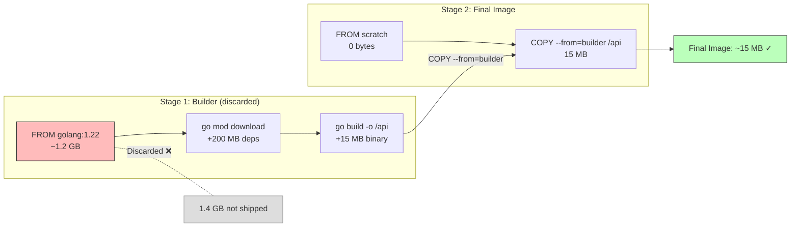

## Learning Objectives

- Understand why multi-stage builds dramatically reduce image size
- Write multi-stage Dockerfiles for Go and Node.js applications
- Leverage build cache effectively across stages
- Apply distroless and scratch base images for minimal attack surface
- Measure and compare image sizes before and after optimization

## Prerequisites

- Docker fundamentals: images, containers, Dockerfile basics (previous lesson)
- Basic understanding of compiled (Go) vs interpreted (Node.js) languages

## Core Concepts

### The Image Size Problem

A typical Go development image with the full toolchain weighs over 1 GB. A Node.js image with dev dependencies can be 800 MB+. But your production application only needs a tiny fraction of that.

| What's needed at build time | What's needed at runtime |
|----------------------------|--------------------------|
| Compiler (go, tsc, gcc)   | Compiled binary or bundled JS |
| Dev dependencies           | Production dependencies only |
| Source code                | Configuration files |
| Build tools                | CA certificates (for HTTPS) |
| Test frameworks            | Nothing else |

Multi-stage builds let you use a full toolchain image for building and a minimal image for running — without manual cleanup scripts.

### How Multi-Stage Builds Work

A multi-stage Dockerfile has multiple `FROM` instructions. Each `FROM` starts a new build stage. You can selectively copy artifacts from earlier stages into later stages, leaving behind everything else.

```dockerfile
# Stage 1: Build
FROM golang:1.22-alpine AS builder
WORKDIR /app
COPY go.mod go.sum ./
RUN go mod download
COPY . .
RUN CGO_ENABLED=0 GOOS=linux go build -ldflags="-s -w" -o /api ./cmd/api

# Stage 2: Run
FROM alpine:3.19
RUN apk --no-cache add ca-certificates tzdata
COPY --from=builder /api /api
USER nobody:nobody
EXPOSE 8080
CMD ["/api"]
```

**What happens:**
1. Stage 1 (builder) — Full Go toolchain compiles the binary
2. `COPY --from=builder /api /api` — Copies only the compiled binary into Stage 2
3. Stage 2 — Starts fresh from a minimal alpine image
4. The final image contains only: Alpine Linux (~7 MB) + CA certs + your binary

### Go: From 1.2 GB to 15 MB

**Single-stage (naive):**

```dockerfile
FROM golang:1.22
WORKDIR /app
COPY . .
RUN go build -o /api ./cmd/api
CMD ["/api"]
```

Image size: **~1.2 GB** (includes full Go toolchain, source code, build artifacts)

**Multi-stage (optimized):**

```dockerfile
FROM golang:1.22-alpine AS builder
WORKDIR /app
COPY go.mod go.sum ./
RUN go mod download
COPY . .
RUN CGO_ENABLED=0 GOOS=linux go build -ldflags="-s -w" -o /api ./cmd/api

FROM scratch
COPY --from=builder /etc/ssl/certs/ca-certificates.crt /etc/ssl/certs/
COPY --from=builder /api /api
USER 65534:65534
ENTRYPOINT ["/api"]
```

Image size: **~10-15 MB** (just the binary + CA certs)

The `-ldflags="-s -w"` flags strip debug info and symbol tables, reducing binary size by ~30%.

**`scratch`** is the empty Docker image — literally nothing. Since Go produces static binaries, that's all you need.

### Node.js: From 1 GB to 150 MB

Node.js can't use scratch because it needs the runtime, but we can still optimize dramatically:

```dockerfile
# Stage 1: Install all dependencies and build
FROM node:20-alpine AS builder
WORKDIR /app
COPY package*.json ./
RUN npm ci
COPY . .
RUN npm run build

# Stage 2: Production dependencies only
FROM node:20-alpine AS deps
WORKDIR /app
COPY package*.json ./
RUN npm ci --only=production && npm cache clean --force

# Stage 3: Final minimal image
FROM node:20-alpine
WORKDIR /app

COPY --from=deps /app/node_modules ./node_modules
COPY --from=builder /app/dist ./dist
COPY package.json ./

USER node
EXPOSE 3000
CMD ["node", "dist/server.js"]
```

**Three stages explained:**
1. **builder** — Installs all deps (including devDependencies) and runs the build
2. **deps** — Installs only production dependencies in a clean context
3. **final** — Copies just the build output and production node_modules

### React Frontend: Multi-Stage with Nginx

```dockerfile
# Stage 1: Build the React app
FROM node:20-alpine AS builder
WORKDIR /app
COPY package*.json ./
RUN npm ci
COPY . .
RUN npm run build

# Stage 2: Serve with Nginx
FROM nginx:1.25-alpine
COPY --from=builder /app/dist /usr/share/nginx/html
COPY nginx.conf /etc/nginx/conf.d/default.conf
EXPOSE 80
CMD ["nginx", "-g", "daemon off;"]
```

The final image is ~40 MB (Nginx + your bundled static files). No Node.js runtime, no source code, no node_modules.

### Build Cache Optimization

Docker caches each layer. To maximize cache hits:

```dockerfile
FROM golang:1.22-alpine AS builder
WORKDIR /app

# Copy dependency files first (rarely change)
COPY go.mod go.sum ./
RUN go mod download    # Cached unless go.mod/go.sum change

# Then copy source (changes frequently)
COPY . .
RUN go build -o /api ./cmd/api
```

**Cache-busting tip:** If you need to invalidate the cache at a specific point, use a build arg:

```dockerfile
ARG CACHEBUST=1
RUN go build -o /api ./cmd/api
```

```bash
docker build --build-arg CACHEBUST=$(date +%s) -t my-app .
```

### Distroless Images

Google's distroless images contain only your application and its runtime dependencies — no shell, no package manager, no other programs:

```dockerfile
FROM golang:1.22-alpine AS builder
WORKDIR /app
COPY . .
RUN CGO_ENABLED=0 go build -o /api ./cmd/api

FROM gcr.io/distroless/static-debian12
COPY --from=builder /api /api
USER nonroot:nonroot
ENTRYPOINT ["/api"]
```

**Comparison of base images:**

| Base Image | Size | Shell? | Package Manager? | Security |
|-----------|------|--------|------------------|----------|
| ubuntu:22.04 | ~77 MB | Yes | apt | Moderate |
| alpine:3.19 | ~7 MB | Yes (sh) | apk | Good |
| distroless/static | ~2 MB | No | No | Excellent |
| scratch | 0 bytes | No | No | Excellent |

### Size Comparison Summary

| Application | Single Stage | Multi-Stage (Alpine) | Multi-Stage (Scratch) |
|------------|-------------|---------------------|----------------------|
| Go API | ~1.2 GB | ~25 MB | ~12 MB |
| Node.js API | ~1 GB | ~150 MB | N/A |
| React Frontend | ~800 MB | ~40 MB (Nginx) | N/A |

## Diagram



## Hands-On Exercise

### Exercise: Reduce Image Size with Multi-Stage

**Step 1: Create a Go API**

Create `main.go`:

```go
package main

import (
	"encoding/json"
	"log"
	"net/http"
	"os"
	"runtime"
)

func main() {
	http.HandleFunc("/", func(w http.ResponseWriter, r *http.Request) {
		info := map[string]any{
			"message":    "Hello from multi-stage Docker!",
			"go_version": runtime.Version(),
			"os_arch":    runtime.GOOS + "/" + runtime.GOARCH,
			"hostname":   must(os.Hostname()),
		}
		w.Header().Set("Content-Type", "application/json")
		json.NewEncoder(w).Encode(info)
	})

	log.Println("Listening on :8080")
	log.Fatal(http.ListenAndServe(":8080", nil))
}

func must[T any](v T, _ error) T { return v }
```

Create `go.mod`:

```
module multistage-demo

go 1.22
```

**Step 2: Build with single-stage Dockerfile**

```dockerfile
FROM golang:1.22
WORKDIR /app
COPY . .
RUN go build -o /api
CMD ["/api"]
```

```bash
docker build -t demo:single -f Dockerfile.single .
docker images demo:single  # Note the size
```

**Step 3: Build with multi-stage Dockerfile**

```dockerfile
FROM golang:1.22-alpine AS builder
WORKDIR /app
COPY go.mod ./
RUN go mod download
COPY . .
RUN CGO_ENABLED=0 GOOS=linux go build -ldflags="-s -w" -o /api

FROM scratch
COPY --from=builder /etc/ssl/certs/ca-certificates.crt /etc/ssl/certs/
COPY --from=builder /api /api
ENTRYPOINT ["/api"]
```

```bash
docker build -t demo:multi -f Dockerfile.multi .
docker images | grep demo   # Compare sizes!
```

**Step 4: Verify both work**

```bash
docker run -d -p 8080:8080 --name single demo:single
curl http://localhost:8080
docker stop single && docker rm single

docker run -d -p 8080:8080 --name multi demo:multi
curl http://localhost:8080
docker stop multi && docker rm multi
```

**Challenge:** Add a health check endpoint (`/health`) and try using `gcr.io/distroless/static-debian12` instead of `scratch`. Compare the sizes.

## Key Takeaways

- Multi-stage builds separate build-time dependencies from runtime, reducing image size by 10-100x
- Go applications can use `scratch` (empty) images since Go produces static binaries
- Node.js apps benefit from 3-stage builds: build → production deps → final
- Layer ordering matters for cache: put dependency installation before source code copying
- Distroless images provide maximum security by removing all shell access and debugging tools
- The `-ldflags="-s -w"` flag strips Go binaries by ~30%, and `CGO_ENABLED=0` ensures static linking

## External Resources

- [Docker Multi-Stage Builds](https://docs.docker.com/build/building/multi-stage/) — Official documentation
- [Google Distroless Images](https://github.com/GoogleContainerTools/distroless) — Minimal container images
- [Hadolint](https://github.com/hadolint/hadolint) — Dockerfile linter for best practices
- [Docker Slim](https://github.com/slimtoolkit/slim) — Automatically analyze and slim Docker images
- [Chainguard Images](https://www.chainguard.dev/chainguard-images) — Ultra-minimal, zero-CVE container images

## Quiz

See the quiz.json file for this module's quiz questions.
