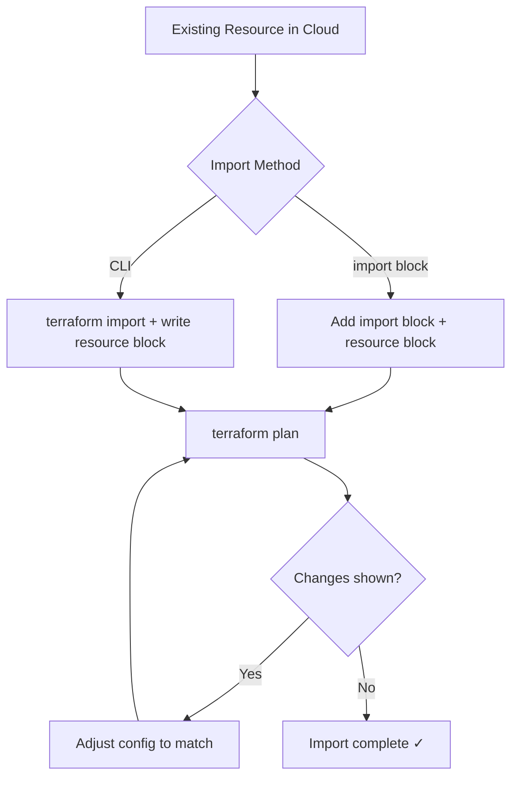

## Learning Objectives

- Use data sources to query existing infrastructure
- Build dynamic configurations with `for_each`, `for`, and dynamic blocks
- Implement conditional resource creation patterns
- Import existing infrastructure into Terraform management
- Manage complex dependencies with `depends_on` and `lifecycle` rules

## Prerequisites

- Terraform fundamentals (providers, resources, state, modules)
- Experience writing basic Terraform configurations
- Understanding of HCL variable types

## Data Sources

Data sources let you query information from your provider without creating resources — perfect for referencing existing infrastructure.

```hcl
# Look up the latest Ubuntu AMI
data "aws_ami" "ubuntu" {
  most_recent = true
  owners      = ["099720109477"]  # Canonical

  filter {
    name   = "name"
    values = ["ubuntu/images/hvm-ssd-gp3/ubuntu-noble-24.04-amd64-server-*"]
  }

  filter {
    name   = "virtualization-type"
    values = ["hvm"]
  }
}

# Reference existing VPC
data "aws_vpc" "existing" {
  tags = {
    Name = "production-vpc"
  }
}

# Get current AWS account info
data "aws_caller_identity" "current" {}
data "aws_region" "current" {}

# Look up Route53 zone
data "aws_route53_zone" "main" {
  name = "example.com."
}

# Use data sources in resources
resource "aws_instance" "web" {
  ami           = data.aws_ami.ubuntu.id
  instance_type = "t3.medium"
  subnet_id     = data.aws_vpc.existing.id

  tags = {
    Name    = "web-server"
    Account = data.aws_caller_identity.current.account_id
    Region  = data.aws_region.current.name
  }
}
```

### External Data Source

Call external programs to fetch dynamic values.

```hcl
data "external" "git_info" {
  program = ["bash", "-c", <<-EOT
    echo '{"commit": "'$(git rev-parse --short HEAD)'", "branch": "'$(git branch --show-current)'"}'
  EOT
  ]
}

resource "aws_instance" "app" {
  ami           = data.aws_ami.ubuntu.id
  instance_type = "t3.micro"

  tags = {
    GitCommit = data.external.git_info.result.commit
    GitBranch = data.external.git_info.result.branch
  }
}
```

## Dynamic Blocks

Dynamic blocks generate repeated nested blocks programmatically — essential for security groups, IAM policies, and other list-heavy resources.

```hcl
variable "ingress_rules" {
  description = "Security group ingress rules"
  type = list(object({
    port        = number
    protocol    = string
    cidr_blocks = list(string)
    description = string
  }))
  default = [
    { port = 443, protocol = "tcp", cidr_blocks = ["0.0.0.0/0"], description = "HTTPS" },
    { port = 80,  protocol = "tcp", cidr_blocks = ["0.0.0.0/0"], description = "HTTP" },
    { port = 22,  protocol = "tcp", cidr_blocks = ["10.0.0.0/8"], description = "SSH internal" },
  ]
}

resource "aws_security_group" "web" {
  name_prefix = "web-"
  vpc_id      = aws_vpc.main.id

  dynamic "ingress" {
    for_each = var.ingress_rules
    content {
      from_port   = ingress.value.port
      to_port     = ingress.value.port
      protocol    = ingress.value.protocol
      cidr_blocks = ingress.value.cidr_blocks
      description = ingress.value.description
    }
  }

  egress {
    from_port   = 0
    to_port     = 0
    protocol    = "-1"
    cidr_blocks = ["0.0.0.0/0"]
  }
}
```

### Nested Dynamic Blocks

```hcl
variable "load_balancer_listeners" {
  type = list(object({
    port     = number
    protocol = string
    actions = list(object({
      type             = string
      target_group_arn = string
    }))
  }))
}

resource "aws_lb_listener" "main" {
  for_each = { for l in var.load_balancer_listeners : l.port => l }

  load_balancer_arn = aws_lb.main.arn
  port              = each.value.port
  protocol          = each.value.protocol

  dynamic "default_action" {
    for_each = each.value.actions
    content {
      type             = default_action.value.type
      target_group_arn = default_action.value.target_group_arn
    }
  }
}
```

## for_each and for Expressions

### for_each with Maps

```hcl
variable "services" {
  type = map(object({
    port          = number
    cpu           = number
    memory        = number
    desired_count = number
  }))
  default = {
    api = { port = 8080, cpu = 512, memory = 1024, desired_count = 3 }
    web = { port = 3000, cpu = 256, memory = 512,  desired_count = 2 }
    worker = { port = 0, cpu = 1024, memory = 2048, desired_count = 1 }
  }
}

resource "aws_ecs_service" "service" {
  for_each = var.services

  name            = each.key
  cluster         = aws_ecs_cluster.main.id
  task_definition = aws_ecs_task_definition.task[each.key].arn
  desired_count   = each.value.desired_count
  launch_type     = "FARGATE"
}

resource "aws_ecs_task_definition" "task" {
  for_each = var.services

  family                   = each.key
  requires_compatibilities = ["FARGATE"]
  cpu                      = each.value.cpu
  memory                   = each.value.memory
  network_mode             = "awsvpc"

  container_definitions = jsonencode([{
    name  = each.key
    image = "${var.ecr_repo}/${each.key}:latest"
    portMappings = each.value.port > 0 ? [{
      containerPort = each.value.port
      protocol      = "tcp"
    }] : []
  }])
}
```

### for Expressions for Transformations

```hcl
locals {
  # Transform a list into a map
  subnet_map = { for s in aws_subnet.private : s.availability_zone => s.id }

  # Filter and transform
  public_services = {
    for name, config in var.services : name => config
    if config.port > 0
  }

  # Flatten nested structures
  service_env_pairs = flatten([
    for service_name, service in var.services : [
      for env_key, env_value in service.env_vars : {
        service = service_name
        key     = env_key
        value   = env_value
      }
    ]
  ])
}

output "private_subnets_by_az" {
  value = local.subnet_map
}
```

## Conditional Resources

```hcl
variable "enable_monitoring" {
  type    = bool
  default = true
}

variable "environment" {
  type = string
}

# Conditionally create a resource
resource "aws_cloudwatch_metric_alarm" "cpu" {
  count = var.enable_monitoring ? 1 : 0

  alarm_name          = "high-cpu-${var.environment}"
  comparison_operator = "GreaterThanThreshold"
  evaluation_periods  = 2
  metric_name         = "CPUUtilization"
  namespace           = "AWS/ECS"
  period              = 300
  statistic           = "Average"
  threshold           = 80
}

# Conditional values
resource "aws_instance" "web" {
  instance_type = var.environment == "production" ? "m5.xlarge" : "t3.medium"
  monitoring    = var.environment == "production"

  root_block_device {
    volume_size = var.environment == "production" ? 100 : 20
    volume_type = "gp3"
    encrypted   = true
  }
}

# for_each with conditional filtering
resource "aws_route53_record" "service" {
  for_each = { for name, svc in var.services : name => svc if svc.port > 0 }

  zone_id = data.aws_route53_zone.main.zone_id
  name    = "${each.key}.${var.domain}"
  type    = "A"

  alias {
    name                   = aws_lb.main.dns_name
    zone_id                = aws_lb.main.zone_id
    evaluate_target_health = true
  }
}
```

## Lifecycle Rules

Control how Terraform manages resource changes.

```hcl
resource "aws_instance" "web" {
  ami           = data.aws_ami.ubuntu.id
  instance_type = "t3.medium"

  lifecycle {
    # Create replacement before destroying the original
    create_before_destroy = true

    # Ignore changes made outside Terraform
    ignore_changes = [
      tags["LastModifiedBy"],
      ami,
    ]

    # Prevent accidental deletion
    prevent_destroy = true

    # Custom conditions
    precondition {
      condition     = data.aws_ami.ubuntu.architecture == "x86_64"
      error_message = "AMI must be x86_64 architecture."
    }

    postcondition {
      condition     = self.public_ip != ""
      error_message = "Instance must have a public IP."
    }
  }
}

# Replace when external values change
resource "aws_instance" "app" {
  ami           = data.aws_ami.ubuntu.id
  instance_type = "t3.medium"

  lifecycle {
    replace_triggered_by = [
      terraform_data.replacement.id
    ]
  }
}

resource "terraform_data" "replacement" {
  input = var.force_replacement_trigger
}
```

## Importing Existing Infrastructure

Bring manually-created resources under Terraform management.

```hcl
# Method 1: Import block (Terraform 1.5+)
import {
  to = aws_s3_bucket.legacy
  id = "my-existing-bucket-name"
}

resource "aws_s3_bucket" "legacy" {
  bucket = "my-existing-bucket-name"

  tags = {
    ManagedBy = "terraform"
  }
}
```

```bash
# Method 2: CLI import
terraform import aws_instance.web i-0abc123def456

# Generate configuration from import (Terraform 1.5+)
terraform plan -generate-config-out=generated.tf

# Verify the import
terraform plan  # Should show no changes
```



## Provisioners (Use Sparingly)

Provisioners run scripts on resources. They're a last resort when native resources don't exist.

```hcl
resource "aws_instance" "app" {
  ami           = data.aws_ami.ubuntu.id
  instance_type = "t3.medium"
  key_name      = aws_key_pair.deploy.key_name

  provisioner "remote-exec" {
    inline = [
      "sudo apt-get update",
      "sudo apt-get install -y docker.io",
      "sudo systemctl enable docker",
    ]

    connection {
      type        = "ssh"
      user        = "ubuntu"
      private_key = file("~/.ssh/deploy_key")
      host        = self.public_ip
    }
  }

  provisioner "local-exec" {
    command = "echo ${self.private_ip} >> inventory.txt"
  }
}
```

**Why to avoid provisioners:** They break the declarative model, aren't tracked in state, and can't be rolled back. Prefer **cloud-init**, **Packer images**, or **Ansible** instead.

## Hands-On Exercise: Dynamic Infrastructure

### Exercise: Build a Multi-Service Setup

```hcl
# Save as main.tf and run terraform plan

terraform {
  required_providers {
    local = {
      source  = "hashicorp/local"
      version = "~> 2.5"
    }
  }
}

variable "services" {
  default = {
    api     = { port = 8080, replicas = 3, public = true }
    worker  = { port = 0,    replicas = 2, public = false }
    web     = { port = 3000, replicas = 2, public = true }
  }
}

locals {
  public_services = {
    for name, svc in var.services : name => svc if svc.public
  }

  total_replicas = sum([for svc in var.services : svc.replicas])
}

resource "local_file" "service_config" {
  for_each = var.services

  filename = "${path.module}/output/${each.key}-config.json"
  content = jsonencode({
    name     = each.key
    port     = each.value.port
    replicas = each.value.replicas
    public   = each.value.public
  })
}

resource "local_file" "summary" {
  filename = "${path.module}/output/summary.txt"
  content  = <<-EOT
    Services: ${join(", ", keys(var.services))}
    Public:   ${join(", ", keys(local.public_services))}
    Total replicas: ${local.total_replicas}
  EOT
}

output "public_endpoints" {
  value = { for name, svc in local.public_services : name => "http://localhost:${svc.port}" }
}
```

```bash
mkdir -p output
terraform init
terraform plan
terraform apply -auto-approve
cat output/summary.txt
terraform destroy -auto-approve
rm -rf output .terraform* terraform.*
```

## Key Takeaways

- **Data sources** read existing infrastructure — use them to avoid hardcoding IDs
- **`for_each`** is preferred over `count` — it handles additions/removals gracefully
- **Dynamic blocks** reduce repetition in security groups, IAM policies, and similar resources
- **Lifecycle rules** protect critical resources from accidental destruction
- **Import blocks** (1.5+) are the modern way to bring existing resources under management
- Avoid **provisioners** — use cloud-init, Packer, or configuration management instead
- Use **`precondition`/`postcondition`** to validate assumptions at plan/apply time

## External Resources

- [Terraform Expressions](https://developer.hashicorp.com/terraform/language/expressions)
- [Dynamic Blocks](https://developer.hashicorp.com/terraform/language/expressions/dynamic-blocks)
- [Import Documentation](https://developer.hashicorp.com/terraform/language/import)
- [Lifecycle Meta-Argument](https://developer.hashicorp.com/terraform/language/meta-arguments/lifecycle)
- [Terraform Patterns and Anti-Patterns](https://developer.hashicorp.com/terraform/cloud-docs/recommended-practices)
