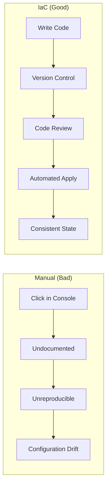
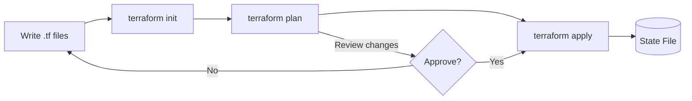
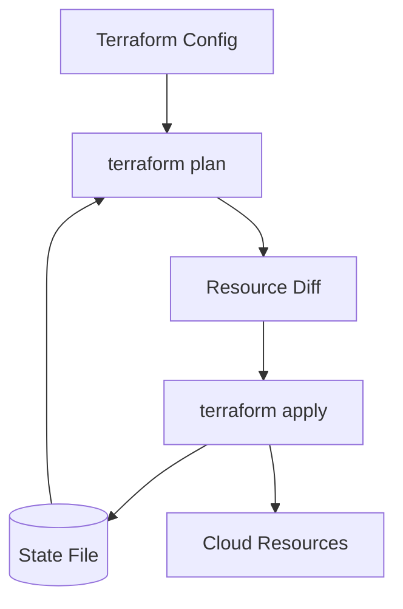

## Learning Objectives

- Understand Infrastructure as Code principles and why Terraform
- Write HCL configurations with providers, resources, and variables
- Manage Terraform state safely with remote backends and locking
- Organize code with modules for reusability
- Use workspaces to manage multiple environments

## Prerequisites

- Basic understanding of cloud infrastructure (VPCs, compute, storage)
- Command-line familiarity
- An AWS, GCP, or Azure account (free tier is sufficient)

## Why Infrastructure as Code?

Manual infrastructure management doesn't scale. IaC treats infrastructure the same as application code — versioned, reviewed, tested, and reproducible.



Terraform is **declarative** and **cloud-agnostic**: you describe what you want, and it figures out how to create it across any provider.

## HCL Basics

HashiCorp Configuration Language (HCL) is Terraform's domain-specific language.

```hcl
# Configure the AWS provider
terraform {
  required_version = ">= 1.9.0"

  required_providers {
    aws = {
      source  = "hashicorp/aws"
      version = "~> 5.0"
    }
  }
}

provider "aws" {
  region = var.aws_region

  default_tags {
    tags = {
      Environment = var.environment
      ManagedBy   = "terraform"
      Project     = var.project_name
    }
  }
}
```

### Variables and Outputs

```hcl
# variables.tf
variable "aws_region" {
  description = "AWS region for resources"
  type        = string
  default     = "us-east-1"
}

variable "environment" {
  description = "Environment name"
  type        = string
  validation {
    condition     = contains(["dev", "staging", "production"], var.environment)
    error_message = "Environment must be dev, staging, or production."
  }
}

variable "instance_config" {
  description = "EC2 instance configuration"
  type = object({
    instance_type = string
    volume_size   = number
    public        = bool
  })
  default = {
    instance_type = "t3.micro"
    volume_size   = 20
    public        = false
  }
}

# outputs.tf
output "vpc_id" {
  description = "VPC identifier"
  value       = aws_vpc.main.id
}

output "api_endpoint" {
  description = "API Gateway URL"
  value       = aws_apigateway_rest_api.main.execution_arn
  sensitive   = true
}
```

### Resources

```hcl
# VPC with public and private subnets
resource "aws_vpc" "main" {
  cidr_block           = "10.0.0.0/16"
  enable_dns_hostnames = true
  enable_dns_support   = true

  tags = {
    Name = "${var.project_name}-vpc"
  }
}

resource "aws_subnet" "public" {
  count             = length(var.availability_zones)
  vpc_id            = aws_vpc.main.id
  cidr_block        = cidrsubnet(aws_vpc.main.cidr_block, 8, count.index)
  availability_zone = var.availability_zones[count.index]

  map_public_ip_on_launch = true

  tags = {
    Name = "${var.project_name}-public-${count.index}"
    Tier = "public"
  }
}

resource "aws_subnet" "private" {
  count             = length(var.availability_zones)
  vpc_id            = aws_vpc.main.id
  cidr_block        = cidrsubnet(aws_vpc.main.cidr_block, 8, count.index + 10)
  availability_zone = var.availability_zones[count.index]

  tags = {
    Name = "${var.project_name}-private-${count.index}"
    Tier = "private"
  }
}

resource "aws_security_group" "web" {
  name_prefix = "${var.project_name}-web-"
  vpc_id      = aws_vpc.main.id

  ingress {
    from_port   = 443
    to_port     = 443
    protocol    = "tcp"
    cidr_blocks = ["0.0.0.0/0"]
  }

  egress {
    from_port   = 0
    to_port     = 0
    protocol    = "-1"
    cidr_blocks = ["0.0.0.0/0"]
  }

  lifecycle {
    create_before_destroy = true
  }
}
```

## The Terraform Workflow



```bash
# Initialize — downloads providers and modules
terraform init

# Format code
terraform fmt -recursive

# Validate configuration
terraform validate

# Plan — preview changes without applying
terraform plan -out=tfplan

# Apply — create/modify infrastructure
terraform apply tfplan

# Show current state
terraform show

# List resources in state
terraform state list

# Destroy everything
terraform destroy
```

## State Management

Terraform state maps your configuration to real infrastructure. It's the most critical piece to protect.



### Remote Backend with S3

```hcl
terraform {
  backend "s3" {
    bucket         = "mycompany-terraform-state"
    key            = "production/infrastructure.tfstate"
    region         = "us-east-1"
    encrypt        = true
    dynamodb_table = "terraform-locks"
  }
}
```

```bash
# Create the backend resources (do this once, manually or with a bootstrap script)
aws s3api create-bucket \
  --bucket mycompany-terraform-state \
  --region us-east-1

aws s3api put-bucket-versioning \
  --bucket mycompany-terraform-state \
  --versioning-configuration Status=Enabled

aws dynamodb create-table \
  --table-name terraform-locks \
  --attribute-definitions AttributeName=LockID,AttributeType=S \
  --key-schema AttributeName=LockID,KeyType=HASH \
  --billing-mode PAY_PER_REQUEST
```

**State safety rules:**
- Never edit state manually — use `terraform state mv`, `terraform state rm`
- Always use remote backends with locking in production
- Enable versioning on the S3 bucket for state recovery
- Encrypt state at rest — it contains sensitive data

## Modules

Modules are reusable packages of Terraform configuration. Think of them as functions.

```
infrastructure/
├── main.tf
├── variables.tf
├── outputs.tf
├── modules/
│   ├── vpc/
│   │   ├── main.tf
│   │   ├── variables.tf
│   │   └── outputs.tf
│   ├── ecs-service/
│   │   ├── main.tf
│   │   ├── variables.tf
│   │   └── outputs.tf
│   └── rds/
│       ├── main.tf
│       ├── variables.tf
│       └── outputs.tf
```

```hcl
# Using a local module
module "vpc" {
  source = "./modules/vpc"

  project_name       = var.project_name
  vpc_cidr           = "10.0.0.0/16"
  availability_zones = ["us-east-1a", "us-east-1b", "us-east-1c"]
  environment        = var.environment
}

# Using a registry module
module "eks" {
  source  = "terraform-aws-modules/eks/aws"
  version = "~> 20.0"

  cluster_name    = "${var.project_name}-${var.environment}"
  cluster_version = "1.30"
  vpc_id          = module.vpc.vpc_id
  subnet_ids      = module.vpc.private_subnet_ids

  eks_managed_node_groups = {
    general = {
      instance_types = ["m5.xlarge"]
      min_size       = 2
      max_size       = 10
      desired_size   = 3
    }
  }
}

# Using module outputs
resource "aws_route53_record" "api" {
  zone_id = var.hosted_zone_id
  name    = "api.${var.domain}"
  type    = "A"

  alias {
    name                   = module.eks.cluster_endpoint
    zone_id                = module.eks.cluster_zone_id
    evaluate_target_health = true
  }
}
```

## Workspaces

Workspaces let you manage multiple environments with the same configuration.

```bash
# Create and switch workspaces
terraform workspace new staging
terraform workspace new production
terraform workspace select staging

# List workspaces
terraform workspace list

# Reference current workspace in config
# terraform.workspace returns the workspace name
```

```hcl
locals {
  env_config = {
    staging = {
      instance_type = "t3.medium"
      min_size      = 1
      max_size      = 3
    }
    production = {
      instance_type = "m5.xlarge"
      min_size      = 3
      max_size      = 20
    }
  }

  config = local.env_config[terraform.workspace]
}

resource "aws_instance" "app" {
  instance_type = local.config.instance_type
  ami           = data.aws_ami.ubuntu.id

  tags = {
    Environment = terraform.workspace
  }
}
```

## Hands-On Exercise: Build a VPC

### Exercise: Create a Complete Network Stack

```hcl
# main.tf — create this file and run terraform plan
terraform {
  required_version = ">= 1.9.0"
  required_providers {
    aws = {
      source  = "hashicorp/aws"
      version = "~> 5.0"
    }
  }
}

provider "aws" {
  region = "us-east-1"
}

variable "project" {
  default = "tf-lab"
}

resource "aws_vpc" "lab" {
  cidr_block           = "10.0.0.0/16"
  enable_dns_hostnames = true
  tags = { Name = "${var.project}-vpc" }
}

resource "aws_internet_gateway" "lab" {
  vpc_id = aws_vpc.lab.id
  tags   = { Name = "${var.project}-igw" }
}

resource "aws_subnet" "public" {
  vpc_id                  = aws_vpc.lab.id
  cidr_block              = "10.0.1.0/24"
  map_public_ip_on_launch = true
  availability_zone       = "us-east-1a"
  tags                    = { Name = "${var.project}-public" }
}

resource "aws_route_table" "public" {
  vpc_id = aws_vpc.lab.id
  route {
    cidr_block = "0.0.0.0/0"
    gateway_id = aws_internet_gateway.lab.id
  }
  tags = { Name = "${var.project}-public-rt" }
}

resource "aws_route_table_association" "public" {
  subnet_id      = aws_subnet.public.id
  route_table_id = aws_route_table.public.id
}

output "vpc_id" {
  value = aws_vpc.lab.id
}

output "public_subnet_id" {
  value = aws_subnet.public.id
}
```

```bash
# Run the workflow
terraform init
terraform fmt
terraform validate
terraform plan
terraform apply -auto-approve

# Inspect state
terraform state list
terraform show

# Clean up
terraform destroy -auto-approve
```

## Key Takeaways

- **Declarative IaC** eliminates configuration drift and enables reproducibility
- Always use **remote backends** with state locking in shared environments
- **Modules** are the primary mechanism for code reuse — build a library of them
- **Variables with validation** catch errors before they reach the cloud
- **terraform plan** is your safety net — always review before applying
- Pin **provider versions** to avoid breaking changes
- Treat state files as sensitive — they contain resource IDs and sometimes secrets

## External Resources

- [Terraform Documentation](https://developer.hashicorp.com/terraform/docs)
- [Terraform Registry](https://registry.terraform.io/)
- [Terraform Best Practices](https://www.terraform-best-practices.com/)
- [HCL Language Specification](https://github.com/hashicorp/hcl/blob/main/hclsyntax/spec.md)
- [Terraform State Management Guide](https://developer.hashicorp.com/terraform/language/state)
