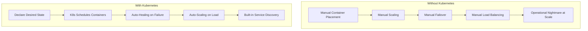
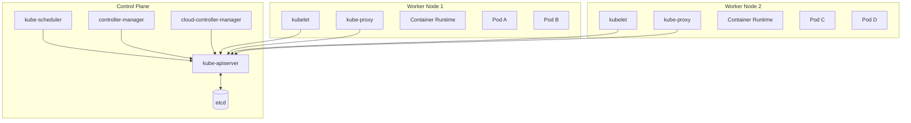
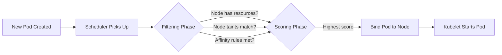
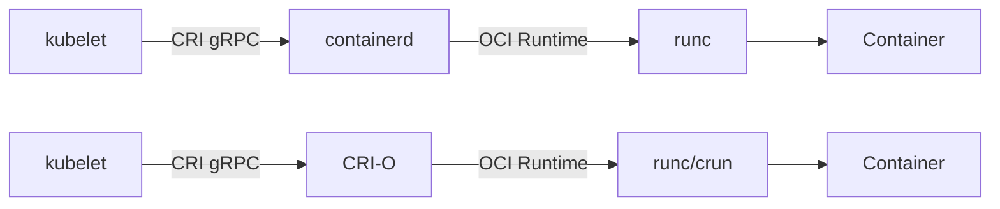
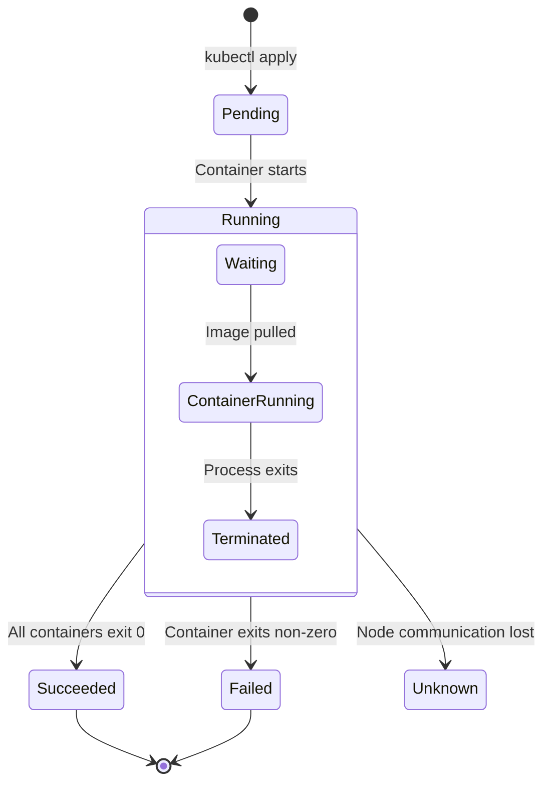
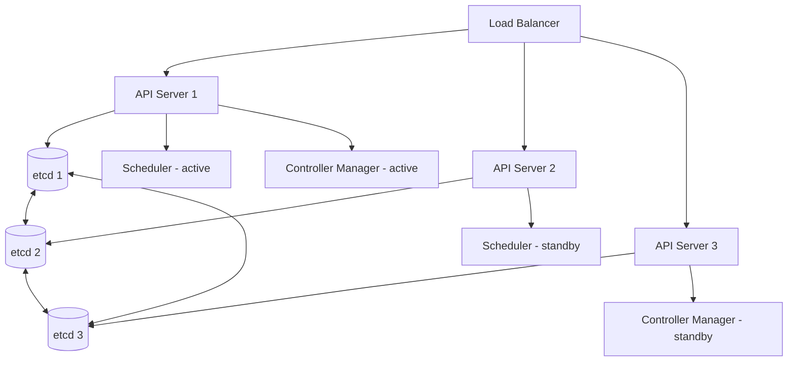

## Learning Objectives

- Understand the Kubernetes control plane and its core components
- Explain the role of etcd, API server, scheduler, and controller manager
- Describe worker node architecture including kubelet, kube-proxy, and container runtime
- Trace the full lifecycle of a pod from creation to termination
- Set up a local Kubernetes cluster for development

## Prerequisites

- Solid Docker fundamentals (containers, images, networking)
- Familiarity with YAML configuration
- Basic understanding of distributed systems concepts

## The Big Picture: Why Kubernetes?

Docker solves the "works on my machine" problem for a single host. Kubernetes solves it for an entire fleet. When you need to run hundreds of containers across dozens of machines with automatic failover, scaling, and zero-downtime deployments — that's where Kubernetes (K8s) comes in.



Kubernetes follows a **declarative model**: you tell it *what* you want (3 replicas of my API), not *how* to do it. The system continuously reconciles actual state with desired state.

## Control Plane Components

The control plane is the brain of Kubernetes. In production, it runs across multiple nodes for high availability.



### kube-apiserver

The API server is the front door to the cluster. Every interaction — `kubectl` commands, controller loops, kubelet reports — goes through this component.

```bash
# Every kubectl command is an API call
kubectl get pods
# Is equivalent to:
curl -k https://kube-apiserver:6443/api/v1/namespaces/default/pods \
  -H "Authorization: Bearer $TOKEN"

# Watch the API server process a request
kubectl get pods -v=8
```

Key responsibilities:
- **Authentication** — Who are you? (certificates, tokens, OIDC)
- **Authorization** — Are you allowed to do this? (RBAC)
- **Admission Control** — Should this be modified or rejected? (webhooks, policies)
- **Validation** — Is this a well-formed request?
- **Persistence** — Store the result in etcd

### etcd

etcd is a distributed key-value store that holds all cluster state. It's the single source of truth.

```bash
# Peek at what's stored in etcd (never do this in production)
ETCDCTL_API=3 etcdctl get /registry/pods/default --prefix --keys-only

# Example keys stored in etcd:
# /registry/pods/default/nginx-deployment-abc123
# /registry/deployments/default/nginx-deployment
# /registry/services/default/my-service
# /registry/secrets/default/db-credentials
```

**Production considerations for etcd:**

```yaml
# etcd cluster topology for HA — always use odd numbers
# 3 members: tolerates 1 failure
# 5 members: tolerates 2 failures
# 7 members: tolerates 3 failures (rare, adds latency)

# Backup etcd regularly
ETCDCTL_API=3 etcdctl snapshot save /backup/etcd-$(date +%Y%m%d).db \
  --endpoints=https://127.0.0.1:2379 \
  --cacert=/etc/etcd/ca.crt \
  --cert=/etc/etcd/server.crt \
  --key=/etc/etcd/server.key

# Verify backup integrity
ETCDCTL_API=3 etcdctl snapshot status /backup/etcd-20260513.db --write-table
```

### kube-scheduler

The scheduler watches for newly created pods with no assigned node and selects a node for them to run on.



The scheduling decision considers:
- **Resource requests** — Does the node have enough CPU/memory?
- **Taints and tolerations** — Is the pod allowed on this node?
- **Node affinity** — Does the pod prefer certain nodes?
- **Pod affinity/anti-affinity** — Should it be co-located or spread out?
- **Topology constraints** — Spread across availability zones

```yaml
# Example: Ensure pods spread across availability zones
apiVersion: v1
kind: Pod
metadata:
  name: zone-aware-pod
spec:
  topologySpreadConstraints:
    - maxSkew: 1
      topologyKey: topology.kubernetes.io/zone
      whenUnsatisfiable: DoNotSchedule
      labelSelector:
        matchLabels:
          app: web
  containers:
    - name: web
      image: nginx:1.27
      resources:
        requests:
          cpu: "250m"
          memory: "128Mi"
        limits:
          cpu: "500m"
          memory: "256Mi"
```

### controller-manager

Controllers are control loops that watch the state of the cluster and make changes to move the current state toward the desired state.

```bash
# Built-in controllers include:
# - Deployment controller     → manages ReplicaSets
# - ReplicaSet controller     → ensures correct pod count
# - Node controller           → monitors node health
# - Job controller            → runs batch workloads
# - EndpointSlice controller  → populates service endpoints
# - ServiceAccount controller → creates default accounts
```

The pattern every controller follows:

```
for {
    desired := getDesiredState()   // from API server
    current := getCurrentState()    // from API server
    diff := computeDiff(desired, current)
    act(diff)                       // create/update/delete resources
}
```

## Worker Node Components

### kubelet

The kubelet is an agent running on every node. It ensures containers described in PodSpecs are running and healthy.

```bash
# Check kubelet status on a node
systemctl status kubelet

# View kubelet logs
journalctl -u kubelet -f

# kubelet configuration (typical location)
cat /var/lib/kubelet/config.yaml
```

```yaml
# Key kubelet configuration parameters
apiVersion: kubelet.config.k8s.io/v1beta1
kind: KubeletConfiguration
clusterDNS:
  - 10.96.0.10
clusterDomain: cluster.local
maxPods: 110
podCIDR: 10.244.1.0/24
evictionHard:
  memory.available: "100Mi"
  nodefs.available: "10%"
  imagefs.available: "15%"
```

### kube-proxy

kube-proxy maintains network rules on nodes, enabling service abstraction — pods can talk to a service name and traffic gets routed to the right backend.

```bash
# kube-proxy modes:
# iptables (default) — uses iptables rules for routing
# IPVS              — uses Linux IPVS for better performance at scale
# nftables          — newer, uses nftables (K8s 1.29+)

# Check current mode
kubectl get configmap kube-proxy -n kube-system -o yaml | grep mode
```

### Container Runtime

Kubernetes doesn't run containers directly. It talks to a container runtime via the **Container Runtime Interface (CRI)**.



Common runtimes:
- **containerd** — Industry standard, used by most managed K8s services
- **CRI-O** — Lightweight, purpose-built for Kubernetes (used by OpenShift)

## Pod Lifecycle

A pod goes through distinct phases from creation to termination.



### Tracing a Pod Creation End-to-End

```bash
# 1. User submits pod manifest
kubectl apply -f pod.yaml

# 2. API server validates, stores in etcd
# 3. Scheduler notices unscheduled pod, assigns a node
# 4. Kubelet on that node detects new pod assignment
# 5. Kubelet pulls image, creates container via CRI
# 6. Kubelet reports status back to API server

# Watch the entire process
kubectl apply -f pod.yaml && kubectl get pod -w
```

```bash
# Inspect events to see the lifecycle in action
kubectl describe pod nginx-pod

# Events:
#   Type    Reason     Age   From               Message
#   ----    ------     ----  ----               -------
#   Normal  Scheduled  30s   default-scheduler  Successfully assigned default/nginx-pod to node-2
#   Normal  Pulling    29s   kubelet            Pulling image "nginx:1.27"
#   Normal  Pulled     25s   kubelet            Successfully pulled image "nginx:1.27"
#   Normal  Created    25s   kubelet            Created container nginx
#   Normal  Started    24s   kubelet            Started container nginx
```

## Setting Up a Local Cluster

### Using kind (Kubernetes in Docker)

```bash
# Install kind
go install sigs.k8s.io/kind@latest
# or on macOS
brew install kind

# Create a multi-node cluster
cat <<EOF | kind create cluster --config=-
kind: Cluster
apiVersion: kind.x-k8s.io/v1alpha4
nodes:
  - role: control-plane
  - role: worker
  - role: worker
EOF

# Verify the cluster
kubectl cluster-info
kubectl get nodes -o wide
```

### Using minikube

```bash
# Start minikube with specific resources
minikube start --cpus=4 --memory=8192 --driver=docker

# Enable common addons
minikube addons enable metrics-server
minikube addons enable ingress
minikube addons enable dashboard

# Access the dashboard
minikube dashboard
```

## Inspecting Cluster Components

```bash
# View all control plane pods
kubectl get pods -n kube-system

# Check component health
kubectl get componentstatuses  # deprecated but still works
kubectl get --raw='/readyz?verbose'

# View cluster resources
kubectl top nodes
kubectl describe node <node-name>

# Check API resources available
kubectl api-resources | head -20

# View API versions
kubectl api-versions
```

## Production Architecture Patterns

### High Availability Control Plane



Key decisions for production:
- **Managed vs self-managed** — EKS, GKE, AKS handle the control plane for you
- **etcd topology** — Stacked (co-located with control plane) vs external
- **Node pools** — Separate pools for different workload types
- **Cluster sizing** — Start small, scale based on workload needs

```bash
# EKS cluster creation example
eksctl create cluster \
  --name production \
  --version 1.30 \
  --region us-east-1 \
  --nodegroup-name workers \
  --node-type m5.xlarge \
  --nodes 3 \
  --nodes-min 2 \
  --nodes-max 10 \
  --managed
```

## Hands-On Exercise: Explore a Running Cluster

### Exercise 1: Cluster Discovery

```bash
# Create a kind cluster
kind create cluster --name explore-lab

# 1. List all namespaces
kubectl get namespaces

# 2. Explore kube-system namespace
kubectl get all -n kube-system

# 3. Describe the API server pod
kubectl describe pod -n kube-system -l component=kube-apiserver

# 4. Check etcd health
kubectl exec -n kube-system etcd-explore-lab-control-plane -- \
  etcdctl endpoint health \
  --cacert=/etc/kubernetes/pki/etcd/ca.crt \
  --cert=/etc/kubernetes/pki/etcd/server.crt \
  --key=/etc/kubernetes/pki/etcd/server.key
```

### Exercise 2: Watch the Scheduler in Action

```bash
# In terminal 1 — watch events
kubectl get events -w

# In terminal 2 — create a pod and observe scheduling
kubectl run test-pod --image=nginx:1.27

# Questions to answer:
# - Which node was the pod scheduled on?
# - How long did scheduling take?
# - What events were generated?

# Clean up
kubectl delete pod test-pod
kind delete cluster --name explore-lab
```

## Key Takeaways

- Kubernetes follows a **declarative, reconciliation-based** architecture
- The **API server** is the only component that talks to etcd — everything else goes through it
- The **scheduler** assigns pods to nodes based on resource availability and constraints
- **Controllers** continuously reconcile desired state with actual state
- The **kubelet** on each node is responsible for actually running containers
- In production, the control plane must be highly available (3+ replicas)
- etcd is the single source of truth — back it up regularly

## External Resources

- [Kubernetes Official Documentation — Components](https://kubernetes.io/docs/concepts/overview/components/)
- [Kubernetes The Hard Way — Kelsey Hightower](https://github.com/kelseyhightower/kubernetes-the-hard-way)
- [CNCF Kubernetes Architecture Guide](https://www.cncf.io/blog/2019/08/19/how-kubernetes-works/)
- [etcd Documentation](https://etcd.io/docs/)
- [kind Quick Start](https://kind.sigs.k8s.io/docs/user/quick-start/)
