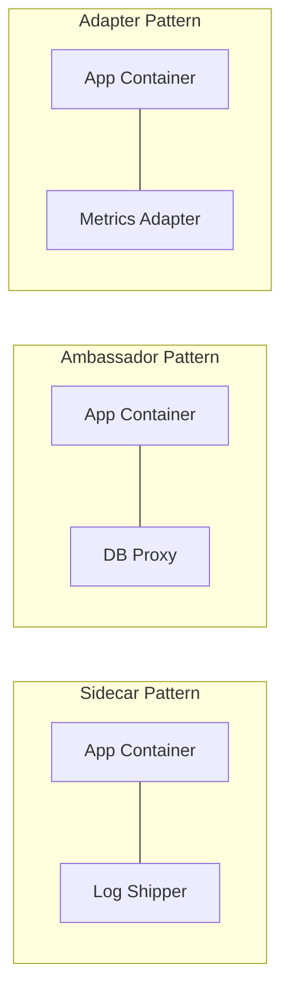
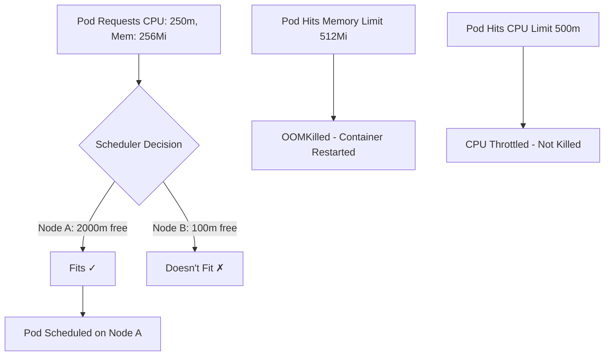
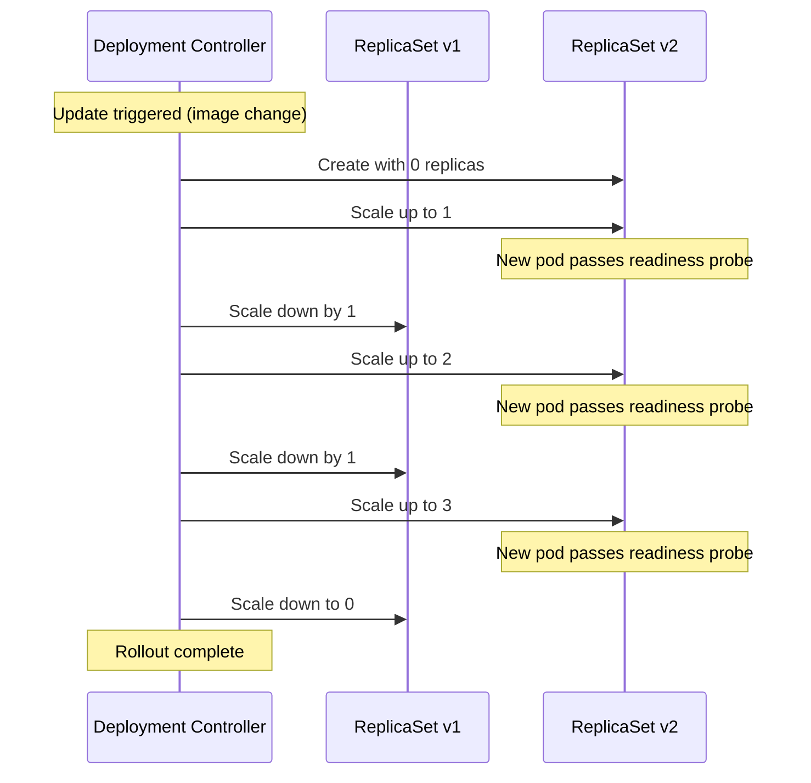
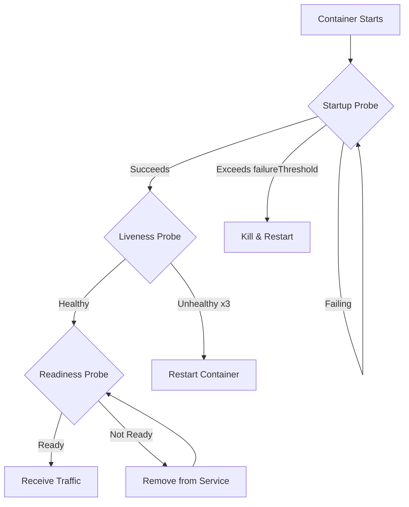

## Learning Objectives

- Write pod specifications with resource management and lifecycle hooks
- Create and manage Deployments with rolling update strategies
- Configure readiness and liveness probes for production workloads
- Implement Horizontal Pod Autoscaling based on custom metrics
- Perform rollbacks and debug failed deployments

## Prerequisites

- Understanding of Kubernetes architecture (control plane, nodes, kubelet)
- `kubectl` installed with a running cluster (kind, minikube, or managed)
- Familiarity with container images and Docker

## Pods: The Atomic Unit

A Pod is the smallest deployable unit in Kubernetes — a wrapper around one or more containers that share network and storage.

```yaml
# A basic single-container pod
apiVersion: v1
kind: Pod
metadata:
  name: web-server
  labels:
    app: web
    environment: dev
  annotations:
    team: platform
spec:
  containers:
    - name: nginx
      image: nginx:1.27-alpine
      ports:
        - containerPort: 80
          protocol: TCP
      resources:
        requests:
          cpu: "100m"
          memory: "64Mi"
        limits:
          cpu: "200m"
          memory: "128Mi"
```

### Multi-Container Pod Patterns



```yaml
# Sidecar pattern — log shipping
apiVersion: v1
kind: Pod
metadata:
  name: app-with-sidecar
spec:
  volumes:
    - name: shared-logs
      emptyDir: {}
  containers:
    - name: app
      image: my-app:2.1
      volumeMounts:
        - name: shared-logs
          mountPath: /var/log/app
    - name: log-shipper
      image: fluent/fluent-bit:3.0
      volumeMounts:
        - name: shared-logs
          mountPath: /var/log/app
          readOnly: true
```

### Init Containers

Init containers run before app containers start. They're perfect for setup tasks.

```yaml
apiVersion: v1
kind: Pod
metadata:
  name: app-with-init
spec:
  initContainers:
    - name: wait-for-db
      image: busybox:1.36
      command:
        - sh
        - -c
        - |
          until nc -z postgres-service 5432; do
            echo "Waiting for database..."
            sleep 2
          done
    - name: run-migrations
      image: my-app:2.1
      command: ["python", "manage.py", "migrate"]
  containers:
    - name: app
      image: my-app:2.1
      ports:
        - containerPort: 8000
```

## Resource Management

Every production container must define resource requests and limits. Without them, a single pod can starve the entire node.

```yaml
resources:
  requests:        # Scheduler uses these to find a node
    cpu: "250m"    # 250 millicores = 0.25 CPU
    memory: "256Mi"
  limits:          # Kubelet enforces these at runtime
    cpu: "500m"    # Throttled if exceeded
    memory: "512Mi" # OOMKilled if exceeded
```



**Best practices for resource management:**
- Always set requests — they determine scheduling
- Set memory limits equal to requests to avoid OOM surprises
- CPU limits are controversial — consider leaving them unset to avoid throttling
- Use LimitRanges and ResourceQuotas for namespace-level guardrails

```yaml
# Namespace-level resource quota
apiVersion: v1
kind: ResourceQuota
metadata:
  name: team-quota
  namespace: team-alpha
spec:
  hard:
    requests.cpu: "10"
    requests.memory: "20Gi"
    limits.cpu: "20"
    limits.memory: "40Gi"
    pods: "50"
```

## Deployments

You should never create bare pods in production. Deployments manage the full lifecycle: creation, scaling, updates, and rollbacks.

```yaml
apiVersion: apps/v1
kind: Deployment
metadata:
  name: api-server
  labels:
    app: api
spec:
  replicas: 3
  selector:
    matchLabels:
      app: api
  template:
    metadata:
      labels:
        app: api
        version: v2.1.0
    spec:
      containers:
        - name: api
          image: my-company/api:2.1.0
          ports:
            - containerPort: 8080
          env:
            - name: LOG_LEVEL
              value: "info"
            - name: DB_HOST
              valueFrom:
                configMapKeyRef:
                  name: api-config
                  key: db_host
          resources:
            requests:
              cpu: "250m"
              memory: "256Mi"
            limits:
              memory: "512Mi"
          readinessProbe:
            httpGet:
              path: /healthz
              port: 8080
            initialDelaySeconds: 5
            periodSeconds: 10
          livenessProbe:
            httpGet:
              path: /healthz
              port: 8080
            initialDelaySeconds: 15
            periodSeconds: 20
```

### Rolling Updates

```yaml
spec:
  strategy:
    type: RollingUpdate
    rollingUpdate:
      maxUnavailable: 1    # At most 1 pod down during update
      maxSurge: 1           # At most 1 extra pod during update
```



```bash
# Trigger a rolling update
kubectl set image deployment/api-server api=my-company/api:2.2.0

# Watch the rollout progress
kubectl rollout status deployment/api-server

# View rollout history
kubectl rollout history deployment/api-server

# Roll back to previous version
kubectl rollout undo deployment/api-server

# Roll back to a specific revision
kubectl rollout undo deployment/api-server --to-revision=3

# Pause/resume a rollout
kubectl rollout pause deployment/api-server
kubectl rollout resume deployment/api-server
```

## Health Probes

Probes tell Kubernetes whether your application is alive and ready to receive traffic.

```yaml
# Three types of probes
containers:
  - name: app
    image: my-app:2.1
    # Readiness: Is the pod ready for traffic?
    readinessProbe:
      httpGet:
        path: /ready
        port: 8080
      initialDelaySeconds: 5
      periodSeconds: 10
      failureThreshold: 3
      successThreshold: 1

    # Liveness: Is the pod alive? (restart if not)
    livenessProbe:
      httpGet:
        path: /healthz
        port: 8080
      initialDelaySeconds: 15
      periodSeconds: 20
      failureThreshold: 3

    # Startup: Has the pod finished starting?
    startupProbe:
      httpGet:
        path: /healthz
        port: 8080
      failureThreshold: 30
      periodSeconds: 10
      # Gives the app 300s to start before liveness kicks in
```



**Probe types beyond HTTP:**

```yaml
# TCP check — useful for databases
livenessProbe:
  tcpSocket:
    port: 5432
  periodSeconds: 15

# Command check — run a script
livenessProbe:
  exec:
    command:
      - /bin/sh
      - -c
      - pg_isready -U postgres
  periodSeconds: 15

# gRPC check (K8s 1.27+)
livenessProbe:
  grpc:
    port: 50051
  periodSeconds: 10
```

## Horizontal Pod Autoscaler (HPA)

HPA automatically scales pod count based on observed metrics.

```yaml
apiVersion: autoscaling/v2
kind: HorizontalPodAutoscaler
metadata:
  name: api-hpa
spec:
  scaleTargetRef:
    apiVersion: apps/v1
    kind: Deployment
    name: api-server
  minReplicas: 3
  maxReplicas: 20
  behavior:
    scaleUp:
      stabilizationWindowSeconds: 60
      policies:
        - type: Percent
          value: 50
          periodSeconds: 60
    scaleDown:
      stabilizationWindowSeconds: 300
      policies:
        - type: Pods
          value: 1
          periodSeconds: 120
  metrics:
    - type: Resource
      resource:
        name: cpu
        target:
          type: Utilization
          averageUtilization: 70
    - type: Resource
      resource:
        name: memory
        target:
          type: Utilization
          averageUtilization: 80
```

```bash
# Check HPA status
kubectl get hpa
kubectl describe hpa api-hpa

# Generate load to trigger scaling
kubectl run load-gen --image=busybox:1.36 --restart=Never -- \
  /bin/sh -c "while true; do wget -q -O- http://api-server:8080/; done"

# Watch scaling in action
kubectl get hpa -w
```

## Hands-On Exercise: Production Deployment

### Exercise 1: Deploy with Health Checks

```bash
# Create namespace
kubectl create namespace exercise

# Apply the deployment
cat <<'EOF' | kubectl apply -n exercise -f -
apiVersion: apps/v1
kind: Deployment
metadata:
  name: demo-app
spec:
  replicas: 3
  selector:
    matchLabels:
      app: demo
  strategy:
    type: RollingUpdate
    rollingUpdate:
      maxSurge: 1
      maxUnavailable: 0
  template:
    metadata:
      labels:
        app: demo
    spec:
      containers:
        - name: app
          image: hashicorp/http-echo:1.0
          args: ["-text=v1", "-listen=:8080"]
          ports:
            - containerPort: 8080
          readinessProbe:
            httpGet:
              path: /
              port: 8080
            initialDelaySeconds: 2
            periodSeconds: 5
          resources:
            requests:
              cpu: "50m"
              memory: "32Mi"
            limits:
              memory: "64Mi"
EOF

# Watch pods come up
kubectl get pods -n exercise -w
```

### Exercise 2: Rolling Update and Rollback

```bash
# Update to v2
kubectl set image deployment/demo-app app=hashicorp/http-echo:1.0 -n exercise -- \
  && kubectl patch deployment demo-app -n exercise \
  --type='json' -p='[{"op":"replace","path":"/spec/template/spec/containers/0/args","value":["-text=v2","-listen=:8080"]}]'

# Watch the rolling update
kubectl rollout status deployment/demo-app -n exercise

# View history
kubectl rollout history deployment/demo-app -n exercise

# Simulate a bad deploy (nonexistent image)
kubectl set image deployment/demo-app app=hashicorp/http-echo:99.99 -n exercise

# Watch it fail
kubectl get pods -n exercise

# Roll back
kubectl rollout undo deployment/demo-app -n exercise

# Clean up
kubectl delete namespace exercise
```

## Key Takeaways

- **Never run bare pods** — always use Deployments (or Jobs/StatefulSets)
- **Always set resource requests** — without them, the scheduler is guessing
- **Readiness probes** gate traffic; **liveness probes** trigger restarts — don't confuse them
- **Startup probes** protect slow-starting applications from premature liveness kills
- **Rolling updates** with `maxUnavailable: 0` guarantee zero downtime
- **HPA stabilization windows** prevent thrashing during traffic spikes
- Keep rollout history (`revisionHistoryLimit`) to enable fast rollbacks

## External Resources

- [Kubernetes Deployments Documentation](https://kubernetes.io/docs/concepts/workloads/controllers/deployment/)
- [Pod Lifecycle](https://kubernetes.io/docs/concepts/workloads/pods/pod-lifecycle/)
- [Configure Liveness, Readiness and Startup Probes](https://kubernetes.io/docs/tasks/configure-pod-container/configure-liveness-readiness-startup-probes/)
- [Horizontal Pod Autoscaling](https://kubernetes.io/docs/tasks/run-application/horizontal-pod-autoscale/)
- [Managing Resources for Containers](https://kubernetes.io/docs/concepts/configuration/manage-resources-containers/)
