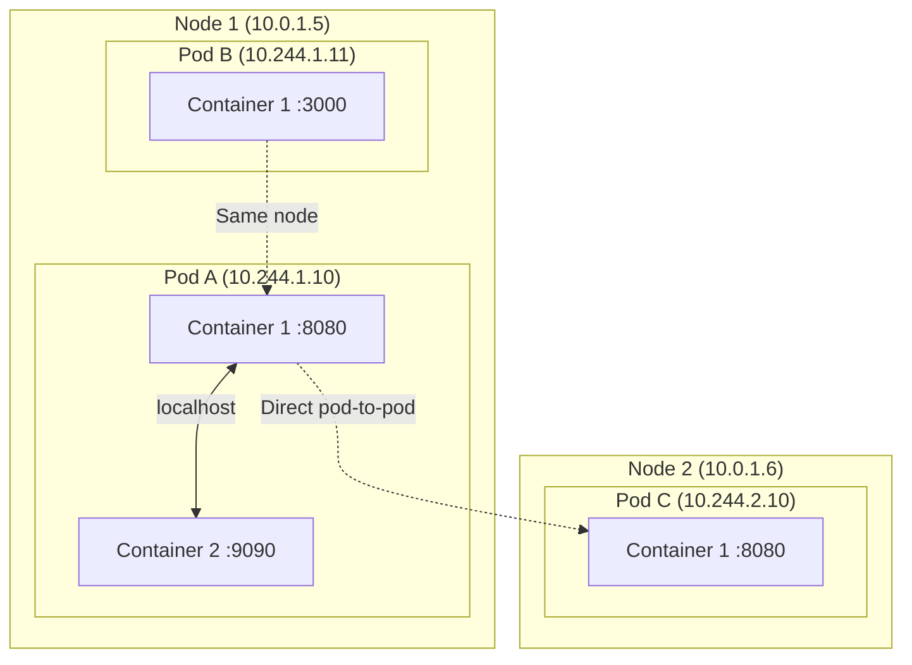
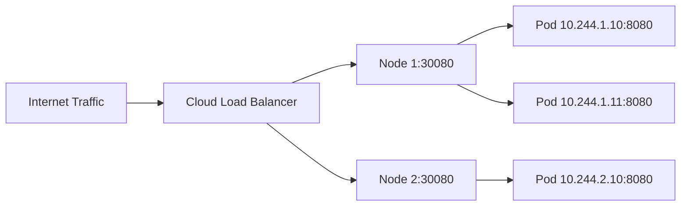
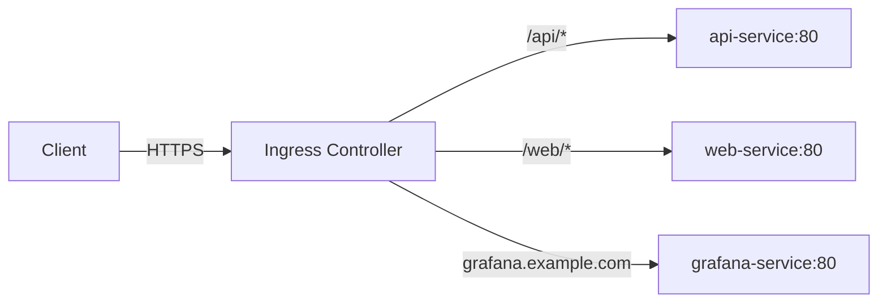
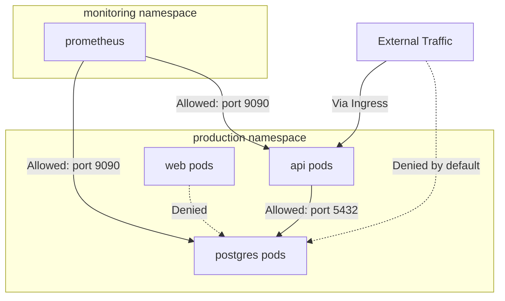

## Learning Objectives

- Understand Kubernetes networking model and pod-to-pod communication
- Configure ClusterIP, NodePort, and LoadBalancer services
- Set up Ingress controllers for HTTP routing with TLS termination
- Define NetworkPolicies for microsegmentation
- Understand DNS resolution and service discovery in Kubernetes

## Prerequisites

- Working knowledge of pods and deployments
- Basic networking concepts (IP addresses, ports, DNS)
- A running Kubernetes cluster with an Ingress controller

## The Kubernetes Networking Model

Every pod gets its own IP address. Containers within a pod share the network namespace (they communicate over `localhost`). Pods can reach other pods across nodes without NAT.



This model is implemented by a **CNI (Container Network Interface) plugin**: Calico, Cilium, Flannel, or Weave.

## Service Types

Pods are ephemeral — their IPs change on restart. Services provide a stable endpoint to reach a group of pods.

### ClusterIP (Default)

```yaml
apiVersion: v1
kind: Service
metadata:
  name: api-service
spec:
  type: ClusterIP
  selector:
    app: api
  ports:
    - port: 80          # Service port
      targetPort: 8080   # Container port
      protocol: TCP
```

```bash
# ClusterIP is only reachable from inside the cluster
kubectl run curl-test --image=curlimages/curl --rm -it -- \
  curl http://api-service.default.svc.cluster.local/healthz
```

### NodePort

Exposes the service on each node's IP at a static port (30000-32767).

```yaml
apiVersion: v1
kind: Service
metadata:
  name: api-nodeport
spec:
  type: NodePort
  selector:
    app: api
  ports:
    - port: 80
      targetPort: 8080
      nodePort: 30080    # Optional: auto-assigned if omitted
```

### LoadBalancer

Provisions an external load balancer (works with cloud providers).

```yaml
apiVersion: v1
kind: Service
metadata:
  name: api-lb
  annotations:
    service.beta.kubernetes.io/aws-load-balancer-type: "nlb"
    service.beta.kubernetes.io/aws-load-balancer-scheme: "internet-facing"
spec:
  type: LoadBalancer
  selector:
    app: api
  ports:
    - port: 443
      targetPort: 8080
      protocol: TCP
```



### Headless Service

For StatefulSets or when you need direct pod DNS records.

```yaml
apiVersion: v1
kind: Service
metadata:
  name: db-headless
spec:
  clusterIP: None    # This makes it headless
  selector:
    app: postgres
  ports:
    - port: 5432
# Creates DNS records: pod-0.db-headless.default.svc.cluster.local
```

## Ingress

Ingress manages external HTTP/HTTPS access to services, providing path-based routing, virtual hosts, and TLS termination in a single resource.



```yaml
apiVersion: networking.k8s.io/v1
kind: Ingress
metadata:
  name: app-ingress
  annotations:
    nginx.ingress.kubernetes.io/ssl-redirect: "true"
    nginx.ingress.kubernetes.io/rate-limit: "100"
    cert-manager.io/cluster-issuer: "letsencrypt-prod"
spec:
  ingressClassName: nginx
  tls:
    - hosts:
        - app.example.com
        - api.example.com
      secretName: app-tls-cert
  rules:
    - host: app.example.com
      http:
        paths:
          - path: /
            pathType: Prefix
            backend:
              service:
                name: web-service
                port:
                  number: 80
          - path: /api
            pathType: Prefix
            backend:
              service:
                name: api-service
                port:
                  number: 80
    - host: api.example.com
      http:
        paths:
          - path: /
            pathType: Prefix
            backend:
              service:
                name: api-service
                port:
                  number: 80
```

```bash
# Install NGINX Ingress Controller
kubectl apply -f https://raw.githubusercontent.com/kubernetes/ingress-nginx/main/deploy/static/provider/cloud/deploy.yaml

# Verify installation
kubectl get pods -n ingress-nginx
kubectl get svc -n ingress-nginx
```

## DNS and Service Discovery

CoreDNS runs inside the cluster and provides DNS resolution for services and pods.

```bash
# Service DNS format
<service-name>.<namespace>.svc.cluster.local

# Examples:
# api-service.default.svc.cluster.local
# postgres.database.svc.cluster.local

# Within the same namespace, short names work
curl http://api-service/healthz

# Inspect CoreDNS configuration
kubectl get configmap coredns -n kube-system -o yaml

# Debug DNS resolution
kubectl run dns-debug --image=busybox:1.36 --rm -it -- nslookup api-service
```

```yaml
# Custom DNS configuration for a pod
apiVersion: v1
kind: Pod
metadata:
  name: custom-dns
spec:
  dnsPolicy: "None"
  dnsConfig:
    nameservers:
      - 10.96.0.10
    searches:
      - default.svc.cluster.local
      - svc.cluster.local
    options:
      - name: ndots
        value: "5"
  containers:
    - name: app
      image: nginx:1.27
```

## NetworkPolicies

By default, all pods can talk to all other pods. NetworkPolicies let you restrict traffic for zero-trust networking.

```yaml
# Deny all ingress to a namespace
apiVersion: networking.k8s.io/v1
kind: NetworkPolicy
metadata:
  name: default-deny-ingress
  namespace: production
spec:
  podSelector: {}    # Applies to all pods
  policyTypes:
    - Ingress

---
# Allow only API pods to reach the database
apiVersion: networking.k8s.io/v1
kind: NetworkPolicy
metadata:
  name: allow-api-to-db
  namespace: production
spec:
  podSelector:
    matchLabels:
      app: postgres
  policyTypes:
    - Ingress
  ingress:
    - from:
        - podSelector:
            matchLabels:
              app: api
      ports:
        - protocol: TCP
          port: 5432

---
# Allow traffic from specific namespace
apiVersion: networking.k8s.io/v1
kind: NetworkPolicy
metadata:
  name: allow-monitoring
  namespace: production
spec:
  podSelector: {}
  policyTypes:
    - Ingress
  ingress:
    - from:
        - namespaceSelector:
            matchLabels:
              purpose: monitoring
      ports:
        - protocol: TCP
          port: 9090
```



## Hands-On Exercise: Full Networking Stack

### Exercise 1: Service Discovery

```bash
kubectl create namespace net-lab

# Deploy backend
cat <<'EOF' | kubectl apply -n net-lab -f -
apiVersion: apps/v1
kind: Deployment
metadata:
  name: backend
spec:
  replicas: 3
  selector:
    matchLabels:
      app: backend
  template:
    metadata:
      labels:
        app: backend
    spec:
      containers:
        - name: echo
          image: hashicorp/http-echo:1.0
          args: ["-text=Hello from backend", "-listen=:5000"]
          ports:
            - containerPort: 5000
---
apiVersion: v1
kind: Service
metadata:
  name: backend-svc
spec:
  selector:
    app: backend
  ports:
    - port: 80
      targetPort: 5000
EOF

# Test DNS resolution from inside the cluster
kubectl run -n net-lab dns-test --image=busybox:1.36 --rm -it -- \
  sh -c "nslookup backend-svc && wget -qO- http://backend-svc"
```

### Exercise 2: NetworkPolicy Enforcement

```bash
# Apply default deny
cat <<'EOF' | kubectl apply -n net-lab -f -
apiVersion: networking.k8s.io/v1
kind: NetworkPolicy
metadata:
  name: default-deny
spec:
  podSelector: {}
  policyTypes:
    - Ingress
    - Egress
EOF

# Verify traffic is blocked
kubectl run -n net-lab test-blocked --image=busybox:1.36 --rm -it -- \
  wget --timeout=3 -qO- http://backend-svc || echo "Blocked!"

# Allow specific traffic
cat <<'EOF' | kubectl apply -n net-lab -f -
apiVersion: networking.k8s.io/v1
kind: NetworkPolicy
metadata:
  name: allow-frontend-to-backend
spec:
  podSelector:
    matchLabels:
      app: backend
  ingress:
    - from:
        - podSelector:
            matchLabels:
              role: frontend
      ports:
        - port: 5000
  egress:
    - to:
        - podSelector:
            matchLabels:
              app: backend
EOF

# Clean up
kubectl delete namespace net-lab
```

## Key Takeaways

- Every pod gets a unique IP — no NAT between pods across nodes
- **ClusterIP** for internal traffic, **NodePort** for debugging, **LoadBalancer** for production external access
- **Ingress** consolidates routing rules — one load balancer for many services
- **NetworkPolicies** are additive — start with default-deny, then allow specific flows
- DNS resolution uses `<service>.<namespace>.svc.cluster.local` format
- Choose your CNI carefully — it determines NetworkPolicy support and performance

## External Resources

- [Kubernetes Services Documentation](https://kubernetes.io/docs/concepts/services-networking/service/)
- [Ingress Controllers](https://kubernetes.io/docs/concepts/services-networking/ingress-controllers/)
- [NetworkPolicy Guide](https://kubernetes.io/docs/concepts/services-networking/network-policies/)
- [NGINX Ingress Controller Docs](https://kubernetes.github.io/ingress-nginx/)
- [Calico NetworkPolicy Tutorial](https://docs.projectcalico.org/security/tutorials/kubernetes-policy-basic)
