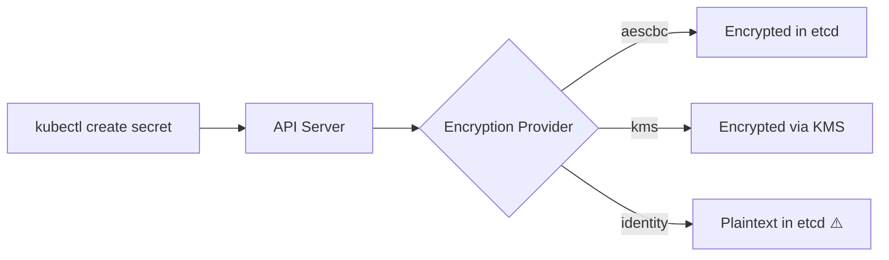
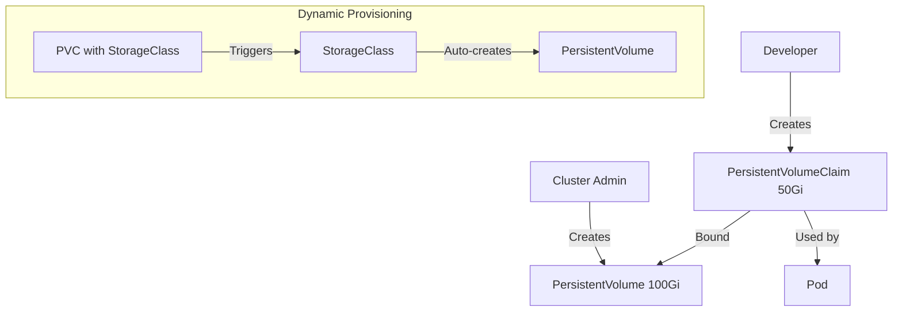
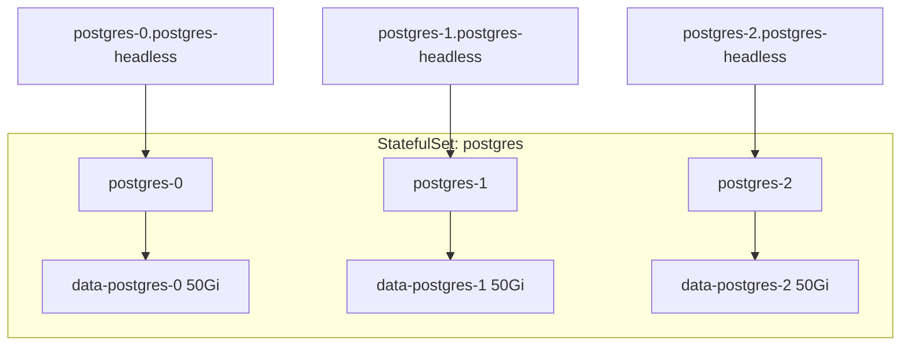

## Learning Objectives

- Manage application configuration with ConfigMaps and Secrets
- Provision persistent storage using PersistentVolumes and PersistentVolumeClaims
- Understand StorageClasses and dynamic provisioning
- Deploy stateful applications with StatefulSets
- Implement secure secret management patterns

## Prerequisites

- Kubernetes services and networking concepts
- Running cluster with a CSI driver or default StorageClass
- Familiarity with environment variables and file-based configuration

## ConfigMaps

ConfigMaps decouple configuration from container images. Change config without rebuilding.

```yaml
# ConfigMap from literal values
apiVersion: v1
kind: ConfigMap
metadata:
  name: app-config
data:
  LOG_LEVEL: "info"
  MAX_CONNECTIONS: "100"
  FEATURE_FLAGS: "dark-mode=true,beta-api=false"

---
# ConfigMap from a config file
apiVersion: v1
kind: ConfigMap
metadata:
  name: nginx-config
data:
  nginx.conf: |
    server {
        listen 80;
        server_name _;

        location / {
            proxy_pass http://backend:8080;
            proxy_set_header Host $host;
            proxy_set_header X-Real-IP $remote_addr;
            proxy_read_timeout 30s;
        }

        location /health {
            return 200 'OK';
            add_header Content-Type text/plain;
        }
    }
```

```bash
# Create ConfigMap from file
kubectl create configmap app-props --from-file=application.properties

# Create from directory (each file becomes a key)
kubectl create configmap configs --from-file=./config-dir/

# Create from env file
kubectl create configmap env-config --from-env-file=.env.production
```

### Using ConfigMaps in Pods

```yaml
apiVersion: v1
kind: Pod
metadata:
  name: configured-app
spec:
  containers:
    - name: app
      image: my-app:2.1
      # Method 1: Environment variables
      env:
        - name: LOG_LEVEL
          valueFrom:
            configMapKeyRef:
              name: app-config
              key: LOG_LEVEL
      # Method 2: All keys as env vars
      envFrom:
        - configMapRef:
            name: app-config
          prefix: APP_   # Optional: prefix all keys
      # Method 3: Mount as files
      volumeMounts:
        - name: nginx-conf
          mountPath: /etc/nginx/conf.d
          readOnly: true
  volumes:
    - name: nginx-conf
      configMap:
        name: nginx-config
        items:
          - key: nginx.conf
            path: default.conf
```

## Secrets

Secrets store sensitive data — passwords, tokens, TLS certificates. They're base64-encoded (not encrypted) by default.

```yaml
apiVersion: v1
kind: Secret
metadata:
  name: db-credentials
type: Opaque
stringData:              # Use stringData for plain text input
  username: admin
  password: "s3cur3-p@ss!"
  connection-string: "postgresql://admin:s3cur3-p@ss!@db:5432/myapp"

---
# TLS Secret
apiVersion: v1
kind: Secret
metadata:
  name: tls-cert
type: kubernetes.io/tls
data:
  tls.crt: <base64-encoded-cert>
  tls.key: <base64-encoded-key>
```

```bash
# Create secret from literals
kubectl create secret generic api-keys \
  --from-literal=stripe-key=sk_live_xxx \
  --from-literal=sendgrid-key=SG.xxx

# Create from file
kubectl create secret generic ssh-key --from-file=id_rsa=~/.ssh/id_rsa

# View decoded secret (careful in shared terminals!)
kubectl get secret db-credentials -o jsonpath='{.data.password}' | base64 -d
```

### Encrypting Secrets at Rest

```yaml
# EncryptionConfiguration for the API server
apiVersion: apiserver.config.k8s.io/v1
kind: EncryptionConfiguration
resources:
  - resources:
      - secrets
    providers:
      - aescbc:
          keys:
            - name: key1
              secret: <base64-encoded-32-byte-key>
      - identity: {}   # Fallback for reading unencrypted secrets
```



## PersistentVolumes and Claims

The PV/PVC model separates storage provisioning (admin) from storage consumption (developer).



```yaml
# Static PersistentVolume (admin creates)
apiVersion: v1
kind: PersistentVolume
metadata:
  name: nfs-data
spec:
  capacity:
    storage: 100Gi
  accessModes:
    - ReadWriteMany
  persistentVolumeReclaimPolicy: Retain
  nfs:
    server: nfs-server.example.com
    path: /exports/data

---
# PersistentVolumeClaim (developer creates)
apiVersion: v1
kind: PersistentVolumeClaim
metadata:
  name: app-data
spec:
  accessModes:
    - ReadWriteOnce
  resources:
    requests:
      storage: 20Gi
  storageClassName: gp3-encrypted
```

### Access Modes

| Mode | Abbreviation | Description |
|------|-------------|-------------|
| ReadWriteOnce | RWO | Single node read-write |
| ReadOnlyMany | ROX | Multiple nodes read-only |
| ReadWriteMany | RWX | Multiple nodes read-write |
| ReadWriteOncePod | RWOP | Single pod read-write (K8s 1.27+) |

### Using PVCs in Pods

```yaml
apiVersion: v1
kind: Pod
metadata:
  name: app-with-storage
spec:
  containers:
    - name: app
      image: my-app:2.1
      volumeMounts:
        - name: data
          mountPath: /app/data
        - name: cache
          mountPath: /tmp/cache
  volumes:
    - name: data
      persistentVolumeClaim:
        claimName: app-data
    - name: cache
      emptyDir:
        sizeLimit: 1Gi    # Ephemeral, dies with the pod
```

## StorageClasses

StorageClasses enable dynamic provisioning — PVCs automatically create PVs on demand.

```yaml
apiVersion: storage.k8s.io/v1
kind: StorageClass
metadata:
  name: gp3-encrypted
  annotations:
    storageclass.kubernetes.io/is-default-class: "true"
provisioner: ebs.csi.aws.com
parameters:
  type: gp3
  encrypted: "true"
  iops: "3000"
  throughput: "125"
reclaimPolicy: Delete
volumeBindingMode: WaitForFirstConsumer
allowVolumeExpansion: true
```

```bash
# List available storage classes
kubectl get storageclass

# Check PV/PVC status
kubectl get pv,pvc -A

# Expand a PVC (if StorageClass allows it)
kubectl patch pvc app-data -p '{"spec":{"resources":{"requests":{"storage":"50Gi"}}}}'
```

## StatefulSets

StatefulSets manage stateful applications with stable identities and persistent storage.

```yaml
apiVersion: apps/v1
kind: StatefulSet
metadata:
  name: postgres
spec:
  serviceName: postgres-headless
  replicas: 3
  selector:
    matchLabels:
      app: postgres
  template:
    metadata:
      labels:
        app: postgres
    spec:
      containers:
        - name: postgres
          image: postgres:16-alpine
          ports:
            - containerPort: 5432
          env:
            - name: POSTGRES_PASSWORD
              valueFrom:
                secretKeyRef:
                  name: db-credentials
                  key: password
            - name: PGDATA
              value: /var/lib/postgresql/data/pgdata
          volumeMounts:
            - name: data
              mountPath: /var/lib/postgresql/data
          resources:
            requests:
              cpu: "500m"
              memory: "1Gi"
            limits:
              memory: "2Gi"
  volumeClaimTemplates:
    - metadata:
        name: data
      spec:
        accessModes: ["ReadWriteOnce"]
        storageClassName: gp3-encrypted
        resources:
          requests:
            storage: 50Gi
---
apiVersion: v1
kind: Service
metadata:
  name: postgres-headless
spec:
  clusterIP: None
  selector:
    app: postgres
  ports:
    - port: 5432
```



**StatefulSet guarantees:**
- Ordered deployment and scaling (0, 1, 2)
- Stable network identities (`pod-name.service-name`)
- Persistent storage that follows the pod across rescheduling
- Ordered, graceful termination (2, 1, 0)

## Hands-On Exercise: Stateful Application

### Exercise 1: ConfigMap and Secret Wiring

```bash
kubectl create namespace config-lab

# Create config and secret
kubectl create configmap app-settings \
  --from-literal=THEME=dark \
  --from-literal=API_URL=https://api.example.com \
  -n config-lab

kubectl create secret generic app-secrets \
  --from-literal=API_KEY=my-secret-key-123 \
  --from-literal=DB_PASSWORD=supersecret \
  -n config-lab

# Deploy a pod that uses them
cat <<'EOF' | kubectl apply -n config-lab -f -
apiVersion: v1
kind: Pod
metadata:
  name: config-demo
spec:
  containers:
    - name: app
      image: busybox:1.36
      command: ["sh", "-c", "env | sort && sleep 3600"]
      envFrom:
        - configMapRef:
            name: app-settings
        - secretRef:
            name: app-secrets
EOF

# Check the environment
kubectl logs config-demo -n config-lab | grep -E "THEME|API|DB"
```

### Exercise 2: Persistent Storage

```bash
# Create a PVC and write data
cat <<'EOF' | kubectl apply -n config-lab -f -
apiVersion: v1
kind: PersistentVolumeClaim
metadata:
  name: test-pvc
spec:
  accessModes: ["ReadWriteOnce"]
  resources:
    requests:
      storage: 1Gi
---
apiVersion: v1
kind: Pod
metadata:
  name: writer
spec:
  containers:
    - name: writer
      image: busybox:1.36
      command: ["sh", "-c", "echo 'Data survives pod restarts' > /data/test.txt && sleep 3600"]
      volumeMounts:
        - name: storage
          mountPath: /data
  volumes:
    - name: storage
      persistentVolumeClaim:
        claimName: test-pvc
EOF

# Delete the pod and verify data persists
kubectl delete pod writer -n config-lab
cat <<'EOF' | kubectl apply -n config-lab -f -
apiVersion: v1
kind: Pod
metadata:
  name: reader
spec:
  containers:
    - name: reader
      image: busybox:1.36
      command: ["sh", "-c", "cat /data/test.txt && sleep 3600"]
      volumeMounts:
        - name: storage
          mountPath: /data
  volumes:
    - name: storage
      persistentVolumeClaim:
        claimName: test-pvc
EOF

kubectl logs reader -n config-lab
# Output: Data survives pod restarts

kubectl delete namespace config-lab
```

## Key Takeaways

- **ConfigMaps** for non-sensitive config, **Secrets** for sensitive data
- Secrets are base64-encoded, not encrypted — enable encryption at rest in production
- **PVCs** abstract storage provisioning — developers request storage, admins provision it
- **StorageClasses** automate PV creation with dynamic provisioning
- **StatefulSets** provide stable identities and persistent storage for databases and queues
- Always set `reclaimPolicy: Retain` for production data volumes
- Use `volumeBindingMode: WaitForFirstConsumer` to ensure PVs are created in the right zone

## External Resources

- [ConfigMaps Documentation](https://kubernetes.io/docs/concepts/configuration/configmap/)
- [Secrets Documentation](https://kubernetes.io/docs/concepts/configuration/secret/)
- [Persistent Volumes](https://kubernetes.io/docs/concepts/storage/persistent-volumes/)
- [StatefulSets](https://kubernetes.io/docs/concepts/workloads/controllers/statefulset/)
- [Encrypting Secrets at Rest](https://kubernetes.io/docs/tasks/administer-cluster/encrypt-data/)
