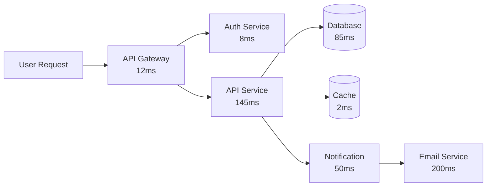
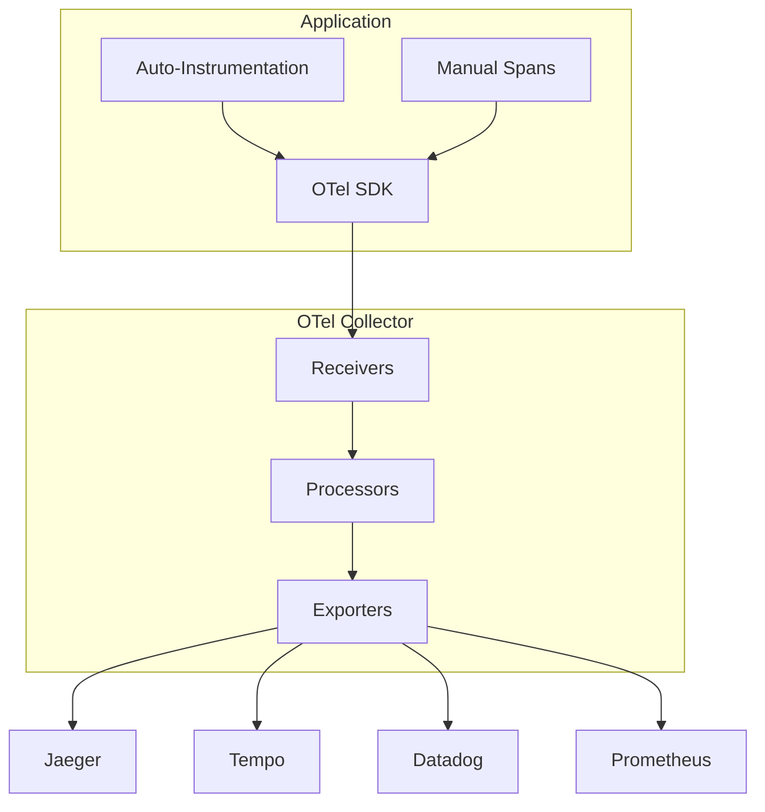
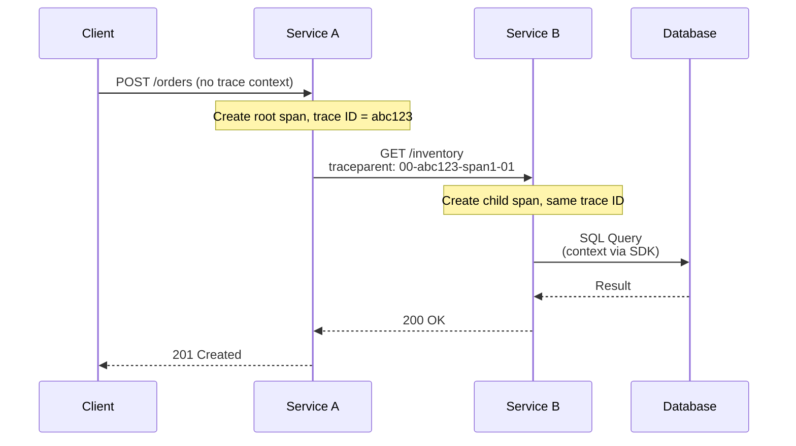
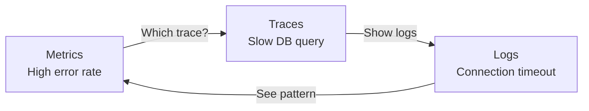

## Learning Objectives

- Understand distributed tracing concepts: traces, spans, and context propagation
- Instrument applications with OpenTelemetry SDK
- Deploy and use Jaeger for trace visualization
- Configure sampling strategies for production traffic
- Correlate traces with logs and metrics for full observability

## Prerequisites

- Prometheus and Grafana fundamentals
- Centralized logging concepts
- Experience with microservices or multi-service applications

## Why Distributed Tracing?

When a user request flows through 10 services, how do you find the bottleneck? Logs tell you what happened in one service. Traces show the entire journey.



Without tracing, you'd see the API service is "slow" — but you couldn't tell that the database query is the real cause.

## Traces, Spans, and Context

```mermaid
gantt
    title Trace: POST /api/orders
    dateFormat X
    axisFormat %L ms

    section API Gateway
    gateway.request      :0, 250

    section Auth Service
    auth.validate_token  :10, 30

    section Order Service
    order.create         :35, 200
    db.insert            :40, 120
    cache.invalidate     :165, 10

    section Notification
    notify.send          :180, 60
    email.dispatch       :190, 45
```



### Key Concepts

- **Trace**: The entire journey of a request across all services
- **Span**: A single operation within a trace (e.g., a database query)
- **Span Context**: The trace ID + span ID + flags propagated between services
- **Baggage**: Key-value pairs propagated alongside the trace context

```json
{
  "traceId": "abc123def456789000000000deadbeef",
  "spanId": "1234567890abcdef",
  "parentSpanId": "fedcba0987654321",
  "operationName": "db.query",
  "serviceName": "order-service",
  "startTime": "2026-05-13T10:23:45.123Z",
  "duration": 85000,
  "tags": {
    "db.system": "postgresql",
    "db.statement": "INSERT INTO orders ...",
    "db.name": "orders_db",
    "http.status_code": 200
  },
  "logs": [
    {
      "timestamp": "2026-05-13T10:23:45.130Z",
      "fields": { "event": "query.start", "rows_affected": 1 }
    }
  ]
}
```

## OpenTelemetry

OpenTelemetry (OTel) is the CNCF standard for telemetry — it provides vendor-neutral instrumentation for traces, metrics, and logs.



### Instrumenting a Node.js Application

```typescript
// tracing.ts — initialize before anything else
import { NodeSDK } from '@opentelemetry/sdk-node';
import { getNodeAutoInstrumentations } from '@opentelemetry/auto-instrumentations-node';
import { OTLPTraceExporter } from '@opentelemetry/exporter-trace-otlp-http';
import { Resource } from '@opentelemetry/resources';
import {
  ATTR_SERVICE_NAME,
  ATTR_SERVICE_VERSION,
} from '@opentelemetry/semantic-conventions';

const sdk = new NodeSDK({
  resource: new Resource({
    [ATTR_SERVICE_NAME]: 'order-service',
    [ATTR_SERVICE_VERSION]: '2.1.0',
    environment: process.env.NODE_ENV || 'development',
  }),
  traceExporter: new OTLPTraceExporter({
    url: process.env.OTEL_EXPORTER_OTLP_ENDPOINT || 'http://localhost:4318/v1/traces',
  }),
  instrumentations: [
    getNodeAutoInstrumentations({
      '@opentelemetry/instrumentation-http': {
        ignoreIncomingPaths: ['/health', '/ready', '/metrics'],
      },
      '@opentelemetry/instrumentation-pg': { enabled: true },
      '@opentelemetry/instrumentation-redis': { enabled: true },
    }),
  ],
});

sdk.start();
process.on('SIGTERM', () => sdk.shutdown());
```

### Adding Custom Spans

```typescript
import { trace, SpanStatusCode, SpanKind } from '@opentelemetry/api';

const tracer = trace.getTracer('order-service');

async function createOrder(userId: string, items: OrderItem[]) {
  return tracer.startActiveSpan('order.create', {
    kind: SpanKind.INTERNAL,
    attributes: {
      'user.id': userId,
      'order.item_count': items.length,
    },
  }, async (span) => {
    try {
      const total = await tracer.startActiveSpan('order.calculate_total', async (calcSpan) => {
        const result = calculateTotal(items);
        calcSpan.setAttribute('order.total', result);
        calcSpan.end();
        return result;
      });

      const order = await tracer.startActiveSpan('db.insert_order', async (dbSpan) => {
        dbSpan.setAttribute('db.system', 'postgresql');
        dbSpan.setAttribute('db.operation', 'INSERT');
        const result = await db.orders.create({ userId, items, total });
        dbSpan.end();
        return result;
      });

      span.setAttribute('order.id', order.id);
      span.setStatus({ code: SpanStatusCode.OK });
      return order;
    } catch (error) {
      span.setStatus({
        code: SpanStatusCode.ERROR,
        message: error.message,
      });
      span.recordException(error);
      throw error;
    } finally {
      span.end();
    }
  });
}
```

### Instrumenting a Python Application

```python
# tracing.py
from opentelemetry import trace
from opentelemetry.sdk.trace import TracerProvider
from opentelemetry.sdk.trace.export import BatchSpanProcessor
from opentelemetry.exporter.otlp.proto.grpc.trace_exporter import OTLPSpanExporter
from opentelemetry.sdk.resources import Resource
from opentelemetry.instrumentation.flask import FlaskInstrumentor
from opentelemetry.instrumentation.sqlalchemy import SQLAlchemyInstrumentor
from opentelemetry.instrumentation.requests import RequestsInstrumentor

resource = Resource.create({
    "service.name": "payment-service",
    "service.version": "1.5.0",
})

provider = TracerProvider(resource=resource)
processor = BatchSpanProcessor(
    OTLPSpanExporter(endpoint="http://otel-collector:4317")
)
provider.add_span_processor(processor)
trace.set_tracer_provider(provider)

FlaskInstrumentor().instrument()
SQLAlchemyInstrumentor().instrument()
RequestsInstrumentor().instrument()
```

## Context Propagation

Trace context must flow between services. This happens via HTTP headers.

```
# W3C Trace Context headers (standard)
traceparent: 00-abc123def456789000000000deadbeef-1234567890abcdef-01
tracestate: vendor1=value1,vendor2=value2

# B3 headers (Zipkin-style)
X-B3-TraceId: abc123def456789000000000deadbeef
X-B3-SpanId: 1234567890abcdef
X-B3-ParentSpanId: fedcba0987654321
X-B3-Sampled: 1
```



## Jaeger

Jaeger is an open-source distributed tracing platform from Uber.

```yaml
# Deploy Jaeger for development
services:
  jaeger:
    image: jaegertracing/all-in-one:1.58
    environment:
      - COLLECTOR_OTLP_ENABLED=true
    ports:
      - "16686:16686"   # UI
      - "4317:4317"     # OTLP gRPC
      - "4318:4318"     # OTLP HTTP
```

```bash
# Deploy Jaeger on Kubernetes with the Jaeger Operator
kubectl create namespace observability

helm repo add jaegertracing https://jaegertracing.github.io/helm-charts
helm install jaeger-operator jaegertracing/jaeger-operator \
  --namespace observability

# Create a Jaeger instance
cat <<'EOF' | kubectl apply -f -
apiVersion: jaegertracing.io/v1
kind: Jaeger
metadata:
  name: production
  namespace: observability
spec:
  strategy: production
  storage:
    type: elasticsearch
    options:
      es:
        server-urls: http://elasticsearch:9200
  collector:
    maxReplicas: 5
  query:
    replicas: 2
EOF
```

## Sampling Strategies

Tracing every request in production is expensive. Sampling balances observability with cost.

```yaml
# OTel Collector configuration with tail-based sampling
receivers:
  otlp:
    protocols:
      grpc:
        endpoint: 0.0.0.0:4317
      http:
        endpoint: 0.0.0.0:4318

processors:
  tail_sampling:
    decision_wait: 10s
    policies:
      - name: errors-policy
        type: status_code
        status_code:
          status_codes: [ERROR]
      - name: slow-traces
        type: latency
        latency:
          threshold_ms: 1000
      - name: percentage-sample
        type: probabilistic
        probabilistic:
          sampling_percentage: 10

  batch:
    timeout: 5s
    send_batch_size: 1000

exporters:
  otlp/jaeger:
    endpoint: jaeger-collector:4317
    tls:
      insecure: true

service:
  pipelines:
    traces:
      receivers: [otlp]
      processors: [tail_sampling, batch]
      exporters: [otlp/jaeger]
```

**Sampling strategies:**
- **Head-based**: Decide at the start (fast, but might miss errors)
- **Tail-based**: Decide after the trace completes (captures all errors and slow traces)
- **Probabilistic**: Sample X% of all traces
- **Rate-limiting**: Sample N traces per second

## Correlating Traces, Logs, and Metrics

The holy grail of observability: jump between metrics, logs, and traces seamlessly.



```typescript
// Include trace context in log lines
import { trace, context } from '@opentelemetry/api';

function logWithTrace(level: string, message: string, data: object) {
  const span = trace.getSpan(context.active());
  const traceContext = span ? {
    trace_id: span.spanContext().traceId,
    span_id: span.spanContext().spanId,
  } : {};

  logger[level]({ ...data, ...traceContext, msg: message });
}
```

## Hands-On Exercise: Trace a Request

### Exercise: Local Tracing Setup

```bash
cat <<'EOF' > docker-compose-tracing.yml
services:
  jaeger:
    image: jaegertracing/all-in-one:1.58
    environment:
      - COLLECTOR_OTLP_ENABLED=true
    ports:
      - "16686:16686"
      - "4318:4318"
EOF

docker compose -f docker-compose-tracing.yml up -d

# Send a test trace via OTLP HTTP
curl -X POST http://localhost:4318/v1/traces \
  -H "Content-Type: application/json" \
  -d '{
    "resourceSpans": [{
      "resource": {
        "attributes": [{"key": "service.name", "value": {"stringValue": "test-service"}}]
      },
      "scopeSpans": [{
        "spans": [{
          "traceId": "5B8EFFF798038103D269B633813FC60C",
          "spanId": "EEE19B7EC3C1B174",
          "name": "test-span",
          "kind": 1,
          "startTimeUnixNano": "1715600000000000000",
          "endTimeUnixNano": "1715600001000000000",
          "attributes": [{"key": "http.method", "value": {"stringValue": "GET"}}]
        }]
      }]
    }]
  }'

# Open Jaeger UI: http://localhost:16686
# Select "test-service" from the dropdown

docker compose -f docker-compose-tracing.yml down
rm docker-compose-tracing.yml
```

## Key Takeaways

- **Distributed tracing** shows the full request journey across services
- **OpenTelemetry** is the vendor-neutral standard — invest in it over proprietary SDKs
- **Auto-instrumentation** covers HTTP, database, and cache calls with zero code changes
- **Tail-based sampling** ensures errors and slow traces are always captured
- **Context propagation** via W3C `traceparent` header is the standard mechanism
- Correlate **traces + logs + metrics** for complete observability
- Start with **auto-instrumentation**, then add **manual spans** for business logic

## External Resources

- [OpenTelemetry Documentation](https://opentelemetry.io/docs/)
- [Jaeger Documentation](https://www.jaegertracing.io/docs/)
- [W3C Trace Context](https://www.w3.org/TR/trace-context/)
- [Distributed Tracing — Lightstep](https://lightstep.com/distributed-tracing)
- [OpenTelemetry Collector Configuration](https://opentelemetry.io/docs/collector/configuration/)
