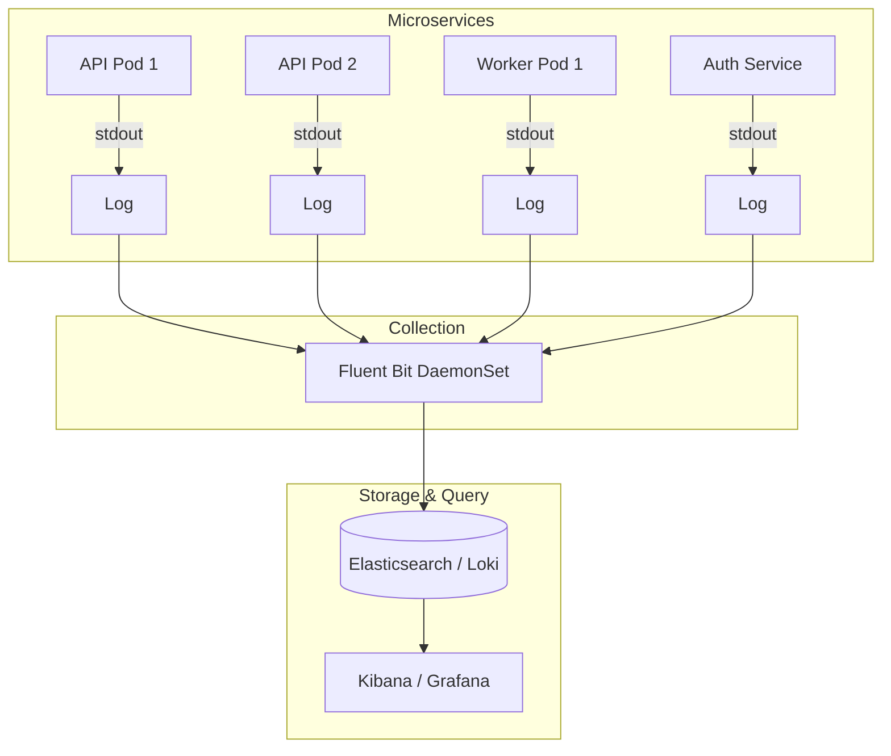
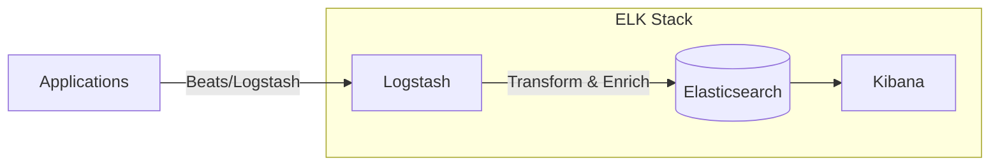
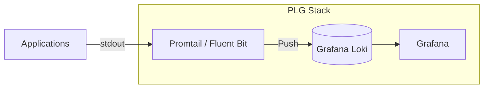
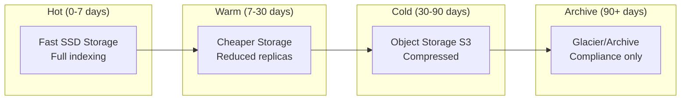

## Learning Objectives

- Design a centralized logging architecture for distributed systems
- Compare ELK, EFK, and PLG (Promtail-Loki-Grafana) stacks
- Implement structured logging in applications
- Configure log aggregation with Fluentd and Fluent Bit
- Set up retention policies and cost-effective log storage

## Prerequisites

- Basic understanding of Prometheus and Grafana
- Docker and Kubernetes fundamentals
- Familiarity with JSON and regular expressions

## Why Centralized Logging?

In a distributed system, logs are scattered across dozens of containers. You can't SSH into each one.



## Structured Logging

Raw text logs are human-readable but machine-hostile. Structured logs (JSON) unlock filtering, searching, and aggregation.

```json
// BAD: Unstructured log
"2026-05-13 10:23:45 ERROR Failed to process payment for user 12345 - timeout after 30s"

// GOOD: Structured log
{
  "timestamp": "2026-05-13T10:23:45.123Z",
  "level": "error",
  "service": "payment-service",
  "message": "Payment processing failed",
  "user_id": "12345",
  "payment_id": "pay_abc123",
  "error": "timeout",
  "duration_ms": 30000,
  "trace_id": "abc123def456",
  "span_id": "789xyz"
}
```

```python
# Python structured logging with structlog
import structlog

logger = structlog.get_logger()

logger.info(
    "payment_processed",
    user_id="12345",
    amount=99.99,
    currency="USD",
    duration_ms=150,
)
```

```typescript
// Node.js with pino
import pino from 'pino';

const logger = pino({
  level: process.env.LOG_LEVEL || 'info',
  formatters: {
    level: (label) => ({ level: label }),
  },
  timestamp: pino.stdTimeFunctions.isoTime,
});

logger.info({
  msg: 'Payment processed',
  userId: '12345',
  amount: 99.99,
  durationMs: 150,
});
```

### Log Levels

| Level | When to Use |
|-------|-------------|
| `TRACE` | Extremely detailed debugging (usually off) |
| `DEBUG` | Diagnostic info for developers |
| `INFO` | Normal operations — request handled, job completed |
| `WARN` | Something unexpected but recoverable |
| `ERROR` | Operation failed — needs attention |
| `FATAL` | Application cannot continue |

## ELK Stack (Elasticsearch, Logstash, Kibana)



```yaml
# docker-compose for ELK
services:
  elasticsearch:
    image: docker.elastic.co/elasticsearch/elasticsearch:8.14.0
    environment:
      - discovery.type=single-node
      - xpack.security.enabled=false
      - "ES_JAVA_OPTS=-Xms1g -Xmx1g"
    ports:
      - "9200:9200"
    volumes:
      - es-data:/usr/share/elasticsearch/data

  logstash:
    image: docker.elastic.co/logstash/logstash:8.14.0
    volumes:
      - ./logstash.conf:/usr/share/logstash/pipeline/logstash.conf
    depends_on:
      - elasticsearch

  kibana:
    image: docker.elastic.co/kibana/kibana:8.14.0
    ports:
      - "5601:5601"
    environment:
      - ELASTICSEARCH_HOSTS=http://elasticsearch:9200
    depends_on:
      - elasticsearch

volumes:
  es-data:
```

```ruby
# logstash.conf
input {
  beats {
    port => 5044
  }
}

filter {
  if [message] =~ /^{/ {
    json {
      source => "message"
    }
  }

  date {
    match => ["timestamp", "ISO8601"]
  }

  mutate {
    remove_field => ["host", "agent"]
  }
}

output {
  elasticsearch {
    hosts => ["http://elasticsearch:9200"]
    index => "logs-%{[service]}-%{+YYYY.MM.dd}"
  }
}
```

## PLG Stack (Promtail, Loki, Grafana)

Loki is the "Prometheus for logs" — it indexes labels, not full text, making it much cheaper to operate.



```yaml
# Loki configuration
auth_enabled: false

server:
  http_listen_port: 3100

common:
  ring:
    kvstore:
      store: inmemory
  replication_factor: 1
  path_prefix: /loki

schema_config:
  configs:
    - from: "2024-01-01"
      store: tsdb
      object_store: filesystem
      schema: v13
      index:
        prefix: index_
        period: 24h

storage_config:
  filesystem:
    directory: /loki/chunks

limits_config:
  retention_period: 30d
  max_query_length: 721h

compactor:
  working_directory: /loki/compactor
  retention_enabled: true
```

### LogQL — Loki's Query Language

```logql
# Basic label matching
{namespace="production", app="api-server"}

# Filter by content
{app="api-server"} |= "error"
{app="api-server"} !~ "health|ready"

# Parse JSON logs and filter
{app="api-server"} | json | level="error" | duration_ms > 1000

# Aggregations
sum(rate({app="api-server"} |= "error" [5m])) by (service)

# Top 10 slowest endpoints
topk(10,
  avg_over_time(
    {app="api-server"} | json | unwrap duration_ms [5m]
  ) by (path)
)
```

## Fluentd and Fluent Bit

### Fluent Bit (Lightweight — for Kubernetes)

```yaml
# Fluent Bit DaemonSet configuration
apiVersion: v1
kind: ConfigMap
metadata:
  name: fluent-bit-config
  namespace: logging
data:
  fluent-bit.conf: |
    [SERVICE]
        Flush         5
        Log_Level     info
        Daemon        off
        Parsers_File  parsers.conf

    [INPUT]
        Name              tail
        Path              /var/log/containers/*.log
        Parser            cri
        Tag               kube.*
        Mem_Buf_Limit     50MB
        Skip_Long_Lines   On
        Refresh_Interval  10

    [FILTER]
        Name                kubernetes
        Match               kube.*
        Kube_URL            https://kubernetes.default.svc:443
        Kube_Tag_Prefix     kube.var.log.containers.
        Merge_Log           On
        Keep_Log            Off
        K8S-Logging.Parser  On

    [FILTER]
        Name    modify
        Match   kube.*
        Remove  stream
        Remove  logtag

    [OUTPUT]
        Name        loki
        Match       kube.*
        Host        loki.logging.svc.cluster.local
        Port        3100
        Labels      job=fluent-bit, namespace=$kubernetes['namespace_name'], app=$kubernetes['labels']['app']
        Auto_Kubernetes_Labels Off
```

### Fluentd (Full-featured — for complex pipelines)

```yaml
# fluentd.conf
<source>
  @type forward
  port 24224
</source>

<filter **>
  @type parser
  key_name log
  reserve_data true
  <parse>
    @type json
  </parse>
</filter>

<filter **>
  @type record_transformer
  <record>
    cluster "production-us-east-1"
    ingested_at ${Time.now.utc.iso8601}
  </record>
</filter>

<match production.**>
  @type elasticsearch
  host elasticsearch.logging.svc.cluster.local
  port 9200
  index_name logs-${tag_parts[1]}-%Y%m%d
  <buffer tag, time>
    @type file
    path /var/log/fluentd-buffers/
    flush_interval 30s
    chunk_limit_size 8MB
    retry_max_interval 30
    retry_forever true
  </buffer>
</match>

<match staging.**>
  @type loki
  url http://loki.logging.svc.cluster.local:3100
  <label>
    environment staging
    service ${tag_parts[1]}
  </label>
</match>
```

## Retention Policies

Logs are expensive to store. Define clear retention policies based on value.



```bash
# Elasticsearch Index Lifecycle Management (ILM)
curl -X PUT "localhost:9200/_ilm/policy/logs-policy" -H 'Content-Type: application/json' -d'
{
  "policy": {
    "phases": {
      "hot": {
        "min_age": "0ms",
        "actions": {
          "rollover": { "max_size": "50gb", "max_age": "1d" }
        }
      },
      "warm": {
        "min_age": "7d",
        "actions": {
          "shrink": { "number_of_shards": 1 },
          "forcemerge": { "max_num_segments": 1 }
        }
      },
      "cold": {
        "min_age": "30d",
        "actions": {
          "searchable_snapshot": { "snapshot_repository": "s3-backup" }
        }
      },
      "delete": {
        "min_age": "90d",
        "actions": { "delete": {} }
      }
    }
  }
}'
```

## Hands-On Exercise: Local Logging Stack

### Exercise: Loki + Grafana

```bash
cat <<'EOF' > docker-compose-logging.yml
services:
  loki:
    image: grafana/loki:3.1.0
    ports:
      - "3100:3100"
    command: -config.file=/etc/loki/local-config.yaml

  grafana:
    image: grafana/grafana:11.1.0
    ports:
      - "3000:3000"
    environment:
      - GF_SECURITY_ADMIN_PASSWORD=admin

  app:
    image: alpine:3.20
    command: >
      sh -c 'while true; do
        echo "{\"level\":\"info\",\"msg\":\"request handled\",\"path\":\"/api/users\",\"status\":200,\"duration_ms\":$(shuf -i 10-500 -n 1)}"
        sleep 1
      done'
    logging:
      driver: loki
      options:
        loki-url: "http://host.docker.internal:3100/loki/api/v1/push"
        labels: "app=demo-api,environment=local"
EOF

docker compose -f docker-compose-logging.yml up -d

# Open Grafana at http://localhost:3000
# Add Loki data source: http://loki:3100
# Explore with: {app="demo-api"} | json | duration_ms > 250

docker compose -f docker-compose-logging.yml down
rm docker-compose-logging.yml
```

## Key Takeaways

- **Structured logging** (JSON) is non-negotiable for production systems
- **Loki** is simpler and cheaper than Elasticsearch for most Kubernetes logging needs
- **Fluent Bit** for collection in Kubernetes, **Fluentd** for complex routing pipelines
- Define **retention policies** from day one — log storage costs grow fast
- Include **trace IDs** in logs to correlate with distributed traces
- Log **what happened**, not **how the code works** — business events, not debug noise
- Always log to **stdout/stderr** in containers — let the platform handle collection

## External Resources

- [Grafana Loki Documentation](https://grafana.com/docs/loki/latest/)
- [Elasticsearch Guide](https://www.elastic.co/guide/en/elasticsearch/reference/current/index.html)
- [Fluent Bit Documentation](https://docs.fluentbit.io/)
- [12-Factor App: Logs](https://12factor.net/logs)
- [LogQL Reference](https://grafana.com/docs/loki/latest/query/)
