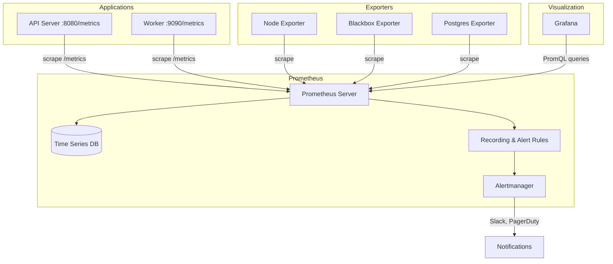
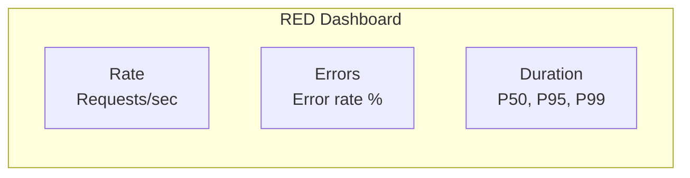

## Learning Objectives

- Understand the four types of Prometheus metrics and when to use each
- Write PromQL queries for monitoring and alerting
- Configure recording rules and alerting rules
- Build effective Grafana dashboards for production monitoring
- Deploy the Prometheus stack on Kubernetes with exporters

## Prerequisites

- Kubernetes basics (pods, services, deployments)
- Understanding of HTTP APIs and time-series data
- Basic familiarity with SQL-like query concepts

## The Observability Stack



## Metric Types

Prometheus defines four core metric types. Choosing the right one matters.

### Counter

A monotonically increasing value. Only goes up (and resets to 0 on restart).

```go
// Application code (Go example)
var httpRequestsTotal = prometheus.NewCounterVec(
    prometheus.CounterOpts{
        Name: "http_requests_total",
        Help: "Total number of HTTP requests",
    },
    []string{"method", "status", "path"},
)

// Increment on each request
httpRequestsTotal.WithLabelValues("GET", "200", "/api/users").Inc()
```

```promql
# Request rate over the last 5 minutes
rate(http_requests_total[5m])

# Error rate (5xx responses)
rate(http_requests_total{status=~"5.."}[5m])
/ rate(http_requests_total[5m])
```

### Gauge

A value that can go up and down — temperature, queue depth, active connections.

```promql
# Current memory usage
process_resident_memory_bytes

# Active connections across all pods
sum(active_connections)

# Queue depth with prediction
predict_linear(queue_depth[1h], 3600)
```

### Histogram

Samples observations into configurable buckets — ideal for latencies and sizes.

```go
var requestDuration = prometheus.NewHistogramVec(
    prometheus.HistogramOpts{
        Name:    "http_request_duration_seconds",
        Help:    "HTTP request latency",
        Buckets: []float64{.005, .01, .025, .05, .1, .25, .5, 1, 2.5, 5, 10},
    },
    []string{"method", "path"},
)
```

```promql
# 95th percentile latency
histogram_quantile(0.95, rate(http_request_duration_seconds_bucket[5m]))

# 99th percentile by endpoint
histogram_quantile(0.99,
  sum(rate(http_request_duration_seconds_bucket[5m])) by (le, path)
)

# Average request duration
rate(http_request_duration_seconds_sum[5m])
/ rate(http_request_duration_seconds_count[5m])
```

### Summary

Pre-calculated quantiles on the client side. Use histograms instead in most cases — they're more flexible and aggregatable.

## PromQL Essentials

```promql
# Instant vector — current value
up{job="api-server"}

# Range vector — values over time
http_requests_total{method="GET"}[5m]

# Rate — per-second average rate of increase
rate(http_requests_total[5m])

# Increase — total increase over time window
increase(http_requests_total[1h])

# Aggregations
sum(rate(http_requests_total[5m])) by (status)
avg(node_cpu_seconds_total{mode="idle"}) by (instance)
topk(5, rate(http_requests_total[5m]))

# Math operations
(node_memory_MemTotal_bytes - node_memory_MemAvailable_bytes)
/ node_memory_MemTotal_bytes * 100

# Subqueries — rate of rate
max_over_time(rate(http_requests_total[5m])[1h:1m])
```

## Prometheus Configuration

```yaml
# prometheus.yml
global:
  scrape_interval: 15s
  evaluation_interval: 15s

rule_files:
  - "recording_rules.yml"
  - "alerting_rules.yml"

alerting:
  alertmanagers:
    - static_configs:
        - targets: ["alertmanager:9093"]

scrape_configs:
  - job_name: "api-server"
    kubernetes_sd_configs:
      - role: pod
    relabel_configs:
      - source_labels: [__meta_kubernetes_pod_annotation_prometheus_io_scrape]
        action: keep
        regex: true
      - source_labels: [__meta_kubernetes_pod_annotation_prometheus_io_path]
        action: replace
        target_label: __metrics_path__
        regex: (.+)
      - source_labels: [__meta_kubernetes_pod_annotation_prometheus_io_port, __meta_kubernetes_pod_ip]
        action: replace
        target_label: __address__
        regex: (.+);(.+)
        replacement: $2:$1

  - job_name: "node-exporter"
    static_configs:
      - targets: ["node-exporter:9100"]
```

## Recording Rules

Pre-compute expensive queries to speed up dashboards and alerting.

```yaml
# recording_rules.yml
groups:
  - name: api_metrics
    interval: 30s
    rules:
      - record: api:request_rate:5m
        expr: sum(rate(http_requests_total[5m])) by (service)

      - record: api:error_rate:5m
        expr: |
          sum(rate(http_requests_total{status=~"5.."}[5m])) by (service)
          / sum(rate(http_requests_total[5m])) by (service)

      - record: api:latency_p99:5m
        expr: |
          histogram_quantile(0.99,
            sum(rate(http_request_duration_seconds_bucket[5m])) by (le, service)
          )
```

## Alerting Rules

```yaml
# alerting_rules.yml
groups:
  - name: slo_alerts
    rules:
      - alert: HighErrorRate
        expr: api:error_rate:5m > 0.01
        for: 5m
        labels:
          severity: critical
          team: platform
        annotations:
          summary: "High error rate on {{ $labels.service }}"
          description: "Error rate is {{ $value | humanizePercentage }} (threshold: 1%)"
          runbook: "https://wiki.example.com/runbooks/high-error-rate"

      - alert: HighLatency
        expr: api:latency_p99:5m > 1.0
        for: 10m
        labels:
          severity: warning
        annotations:
          summary: "P99 latency above 1s on {{ $labels.service }}"

      - alert: PodCrashLooping
        expr: rate(kube_pod_container_status_restarts_total[15m]) > 0
        for: 5m
        labels:
          severity: critical
        annotations:
          summary: "Pod {{ $labels.pod }} is crash looping"

      - alert: DiskSpaceLow
        expr: |
          (node_filesystem_avail_bytes{mountpoint="/"} 
          / node_filesystem_size_bytes{mountpoint="/"}) < 0.1
        for: 10m
        labels:
          severity: warning
        annotations:
          summary: "Disk space below 10% on {{ $labels.instance }}"
```

## Grafana Dashboards

### Dashboard as Code

```json
{
  "dashboard": {
    "title": "API Service Overview",
    "panels": [
      {
        "title": "Request Rate",
        "type": "timeseries",
        "targets": [
          {
            "expr": "sum(rate(http_requests_total[5m])) by (status)",
            "legendFormat": "{{status}}"
          }
        ],
        "fieldConfig": {
          "defaults": {
            "unit": "reqps"
          }
        }
      },
      {
        "title": "P95 Latency",
        "type": "timeseries",
        "targets": [
          {
            "expr": "histogram_quantile(0.95, sum(rate(http_request_duration_seconds_bucket[5m])) by (le))",
            "legendFormat": "p95"
          }
        ],
        "fieldConfig": {
          "defaults": {
            "unit": "s",
            "thresholds": {
              "steps": [
                { "color": "green", "value": null },
                { "color": "yellow", "value": 0.5 },
                { "color": "red", "value": 1.0 }
              ]
            }
          }
        }
      }
    ]
  }
}
```

### The RED Method Dashboard

The RED method monitors **Rate**, **Errors**, and **Duration** for request-driven services.



## Deploying on Kubernetes

```bash
# Install kube-prometheus-stack via Helm
helm repo add prometheus-community https://prometheus-community.github.io/helm-charts
helm repo update

helm install monitoring prometheus-community/kube-prometheus-stack \
  --namespace monitoring \
  --create-namespace \
  --set grafana.adminPassword=admin \
  --set prometheus.prometheusSpec.retention=30d \
  --set prometheus.prometheusSpec.storageSpec.volumeClaimTemplate.spec.resources.requests.storage=50Gi
```

```yaml
# Instrument your pods with annotations
apiVersion: apps/v1
kind: Deployment
metadata:
  name: api-server
spec:
  template:
    metadata:
      annotations:
        prometheus.io/scrape: "true"
        prometheus.io/port: "8080"
        prometheus.io/path: "/metrics"
    spec:
      containers:
        - name: api
          image: my-api:2.1
          ports:
            - containerPort: 8080
```

## Hands-On Exercise: Monitor an Application

### Exercise: Set Up Monitoring Locally

```bash
# docker-compose.yml for a local monitoring stack
cat <<'EOF' > docker-compose-monitoring.yml
services:
  prometheus:
    image: prom/prometheus:v2.53.0
    ports:
      - "9090:9090"
    volumes:
      - ./prometheus.yml:/etc/prometheus/prometheus.yml

  grafana:
    image: grafana/grafana:11.1.0
    ports:
      - "3000:3000"
    environment:
      - GF_SECURITY_ADMIN_PASSWORD=admin

  node-exporter:
    image: prom/node-exporter:v1.8.1
    ports:
      - "9100:9100"
EOF

# Start the stack
docker compose -f docker-compose-monitoring.yml up -d

# Access:
# Prometheus: http://localhost:9090
# Grafana:    http://localhost:3000 (admin/admin)

# Try these PromQL queries in Prometheus UI:
# up
# rate(node_cpu_seconds_total{mode="idle"}[5m])
# node_memory_MemAvailable_bytes / node_memory_MemTotal_bytes * 100

# Clean up
docker compose -f docker-compose-monitoring.yml down
rm docker-compose-monitoring.yml
```

## Key Takeaways

- **Counters** for totals (requests, errors), **gauges** for current values, **histograms** for distributions
- **`rate()`** is your most-used function — always apply it to counters
- **Recording rules** pre-compute expensive queries for fast dashboards
- **Alerting rules** should include runbook links and meaningful annotations
- The **RED method** (Rate, Errors, Duration) covers most service monitoring needs
- **kube-prometheus-stack** gives you a production-ready setup in one Helm install
- Store dashboards as code in version control — never rely on manual UI configuration

## External Resources

- [Prometheus Documentation](https://prometheus.io/docs/introduction/overview/)
- [PromQL Cheat Sheet](https://promlabs.com/promql-cheat-sheet/)
- [Grafana Documentation](https://grafana.com/docs/grafana/latest/)
- [SRE Workbook: Monitoring](https://sre.google/workbook/monitoring/)
- [RED Method — Tom Wilkie](https://grafana.com/blog/2018/08/02/the-red-method-how-to-instrument-your-services/)
