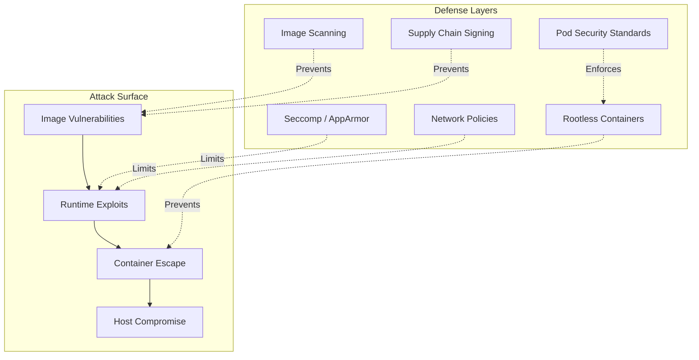
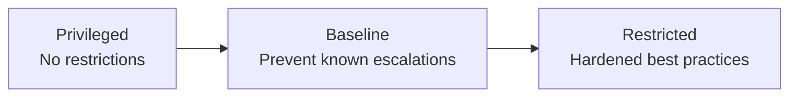
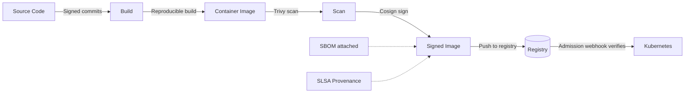

## Learning Objectives

- Scan container images for vulnerabilities and misconfigurations
- Build and run rootless containers for defense in depth
- Apply Linux security modules: seccomp and AppArmor
- Implement Kubernetes Pod Security Standards
- Secure the container supply chain from build to runtime

## Prerequisites

- Docker image building and multi-stage builds
- Kubernetes architecture and pod specifications
- Basic Linux security concepts (users, permissions)

## The Container Threat Model



## Image Scanning

Scan every image in CI before it reaches production. Scanning catches known CVEs in OS packages and application dependencies.

```bash
# Trivy — the industry standard scanner
trivy image nginx:1.27
trivy image --severity HIGH,CRITICAL my-app:latest
trivy image --exit-code 1 --severity CRITICAL my-app:latest

# Scan a Dockerfile for misconfigurations
trivy config Dockerfile

# Scan a Kubernetes manifest
trivy config deployment.yaml

# Scan filesystem for secrets
trivy fs --scanners secret .
```

```yaml
# GitHub Actions — scan in CI
- name: Run Trivy vulnerability scanner
  uses: aquasecurity/trivy-action@master
  with:
    image-ref: '${{ env.REGISTRY }}/${{ env.IMAGE_NAME }}:${{ github.sha }}'
    format: 'sarif'
    output: 'trivy-results.sarif'
    severity: 'CRITICAL,HIGH'
    exit-code: '1'

- name: Upload scan results to GitHub Security
  uses: github/codeql-action/upload-sarif@v3
  with:
    sarif_file: 'trivy-results.sarif'
```

### Dockerfile Best Practices for Security

```dockerfile
# Use specific digest, not just tag
FROM node:20-alpine@sha256:abc123... AS builder

# Don't run as root
RUN addgroup -g 1001 appgroup && \
    adduser -u 1001 -G appgroup -D appuser

WORKDIR /app
COPY package*.json ./
RUN npm ci --omit=dev

COPY --chown=appuser:appgroup . .

# Drop all capabilities, run as non-root
USER appuser:appgroup

# Use COPY instead of ADD (ADD can fetch URLs and extract archives)
# Don't store secrets in the image
# Use .dockerignore to exclude sensitive files

EXPOSE 8080
CMD ["node", "server.js"]
```

## Rootless Containers

Running containers as root inside the container means a container escape could give root on the host. Rootless containers map the container root to an unprivileged host user.

```yaml
# Kubernetes: Enforce non-root
apiVersion: v1
kind: Pod
metadata:
  name: secure-app
spec:
  securityContext:
    runAsNonRoot: true
    runAsUser: 1001
    runAsGroup: 1001
    fsGroup: 1001
    seccompProfile:
      type: RuntimeDefault
  containers:
    - name: app
      image: my-app:2.1
      securityContext:
        allowPrivilegeEscalation: false
        readOnlyRootFilesystem: true
        capabilities:
          drop:
            - ALL
      volumeMounts:
        - name: tmp
          mountPath: /tmp
        - name: cache
          mountPath: /app/.cache
  volumes:
    - name: tmp
      emptyDir: {}
    - name: cache
      emptyDir: {}
```

```bash
# Docker: Run as non-root
docker run --user 1001:1001 \
  --read-only \
  --tmpfs /tmp \
  --cap-drop ALL \
  --security-opt no-new-privileges \
  my-app:2.1
```

## Seccomp Profiles

Seccomp (Secure Computing Mode) filters system calls. Most containerized apps only need ~40-50 syscalls out of 300+.

```json
{
  "defaultAction": "SCMP_ACT_ERRNO",
  "architectures": ["SCMP_ARCH_X86_64"],
  "syscalls": [
    {
      "names": [
        "accept4", "bind", "clone", "close", "connect",
        "epoll_create1", "epoll_ctl", "epoll_wait",
        "exit_group", "fstat", "futex", "getpid",
        "listen", "mmap", "open", "openat", "read",
        "recvfrom", "sendto", "socket", "write"
      ],
      "action": "SCMP_ACT_ALLOW"
    }
  ]
}
```

```yaml
# Use in Kubernetes
apiVersion: v1
kind: Pod
metadata:
  name: seccomp-app
spec:
  securityContext:
    seccompProfile:
      type: RuntimeDefault  # Docker's default seccomp profile
  containers:
    - name: app
      image: my-app:2.1
```

```bash
# Generate a custom seccomp profile by tracing an app
# Using oci-seccomp-bpf-hook or security-profiles-operator
kubectl apply -f - <<'EOF'
apiVersion: security-profiles-operator.x-k8s.io/v1beta1
kind: SeccompProfile
metadata:
  name: my-app-profile
spec:
  defaultAction: SCMP_ACT_ERRNO
  syscalls:
    - action: SCMP_ACT_ALLOW
      names:
        - accept4
        - bind
        - close
        - connect
        - epoll_ctl
        - epoll_wait
        - exit_group
        - futex
        - getpid
        - read
        - write
EOF
```

## AppArmor

AppArmor confines programs to a set of allowed file paths, capabilities, and network access.

```
# /etc/apparmor.d/my-app-profile
#include <tunables/global>

profile my-app-profile flags=(attach_disconnected) {
  #include <abstractions/base>
  #include <abstractions/nameservice>

  # Allow reading app files
  /app/** r,
  /app/server.js ix,

  # Allow tmp and log writes
  /tmp/** rw,
  /var/log/app/** w,

  # Deny sensitive paths
  deny /etc/shadow r,
  deny /etc/passwd w,
  deny /proc/*/mem rw,
  deny /sys/** w,

  # Network access
  network tcp,
  network udp,
}
```

```yaml
# Apply AppArmor profile to a pod
apiVersion: v1
kind: Pod
metadata:
  name: apparmor-app
  annotations:
    container.apparmor.security.beta.kubernetes.io/app: localhost/my-app-profile
spec:
  containers:
    - name: app
      image: my-app:2.1
```

## Pod Security Standards

Kubernetes Pod Security Standards (PSS) define three security levels enforced by the built-in Pod Security Admission controller.



```yaml
# Enforce restricted security at namespace level
apiVersion: v1
kind: Namespace
metadata:
  name: production
  labels:
    pod-security.kubernetes.io/enforce: restricted
    pod-security.kubernetes.io/enforce-version: latest
    pod-security.kubernetes.io/audit: restricted
    pod-security.kubernetes.io/warn: restricted
```

**Restricted profile requirements:**
- Must run as non-root
- Must drop ALL capabilities
- Must not allow privilege escalation
- Must use a read-only root filesystem
- Must set a seccomp profile
- Must not use hostNetwork, hostPID, or hostIPC

```yaml
# A pod that passes the restricted policy
apiVersion: v1
kind: Pod
metadata:
  name: compliant-pod
spec:
  securityContext:
    runAsNonRoot: true
    runAsUser: 65534
    fsGroup: 65534
    seccompProfile:
      type: RuntimeDefault
  containers:
    - name: app
      image: my-app:2.1
      securityContext:
        allowPrivilegeEscalation: false
        readOnlyRootFilesystem: true
        capabilities:
          drop: ["ALL"]
      resources:
        requests:
          cpu: "100m"
          memory: "128Mi"
        limits:
          memory: "256Mi"
```

## Supply Chain Security

Secure every step from source code to running container.



```yaml
# Kyverno policy — only allow signed images
apiVersion: kyverno.io/v1
kind: ClusterPolicy
metadata:
  name: verify-image-signatures
spec:
  validationFailureAction: Enforce
  rules:
    - name: verify-cosign-signature
      match:
        any:
          - resources:
              kinds:
                - Pod
      verifyImages:
        - imageReferences:
            - "ghcr.io/myorg/*"
          attestors:
            - entries:
                - keyless:
                    subject: "https://github.com/myorg/*"
                    issuer: "https://token.actions.githubusercontent.com"
```

## Hands-On Exercise: Secure a Container

### Exercise: Harden a Deployment

```bash
# Start with an insecure deployment
cat <<'EOF' | kubectl apply -f -
apiVersion: apps/v1
kind: Deployment
metadata:
  name: insecure-app
  namespace: default
spec:
  replicas: 1
  selector:
    matchLabels:
      app: insecure
  template:
    metadata:
      labels:
        app: insecure
    spec:
      containers:
        - name: app
          image: nginx:1.27
          # No security context!
          # Runs as root!
          # Full capabilities!
EOF

# Scan the image
trivy image nginx:1.27

# Now apply the hardened version
cat <<'EOF' | kubectl apply -f -
apiVersion: apps/v1
kind: Deployment
metadata:
  name: secure-app
  namespace: default
spec:
  replicas: 1
  selector:
    matchLabels:
      app: secure
  template:
    metadata:
      labels:
        app: secure
    spec:
      automountServiceAccountToken: false
      securityContext:
        runAsNonRoot: true
        runAsUser: 101
        runAsGroup: 101
        fsGroup: 101
        seccompProfile:
          type: RuntimeDefault
      containers:
        - name: app
          image: nginx:1.27-alpine
          securityContext:
            allowPrivilegeEscalation: false
            readOnlyRootFilesystem: true
            capabilities:
              drop: ["ALL"]
          volumeMounts:
            - name: tmp
              mountPath: /tmp
            - name: cache
              mountPath: /var/cache/nginx
            - name: run
              mountPath: /var/run
          resources:
            requests:
              cpu: "50m"
              memory: "64Mi"
            limits:
              memory: "128Mi"
      volumes:
        - name: tmp
          emptyDir: {}
        - name: cache
          emptyDir: {}
        - name: run
          emptyDir: {}
EOF

kubectl delete deployment insecure-app secure-app
```

## Key Takeaways

- **Scan images in CI** — block deployments with critical vulnerabilities
- **Never run as root** — use `runAsNonRoot: true` and drop all capabilities
- **Read-only root filesystem** — forces explicit writable volume mounts
- **Seccomp profiles** restrict system calls — use `RuntimeDefault` at minimum
- **Pod Security Standards** (Restricted) enforce a comprehensive security baseline
- **Sign images with Cosign** and verify at admission with Kyverno or OPA
- **Defense in depth** — no single layer is sufficient; combine all these controls

## External Resources

- [Trivy Documentation](https://aquasecurity.github.io/trivy/)
- [Kubernetes Pod Security Standards](https://kubernetes.io/docs/concepts/security/pod-security-standards/)
- [SLSA Framework](https://slsa.dev/)
- [Kyverno — Kubernetes Policy Engine](https://kyverno.io/)
- [Container Security by Liz Rice](https://www.oreilly.com/library/view/container-security/9781492056690/)
- [CIS Kubernetes Benchmark](https://www.cisecurity.org/benchmark/kubernetes)
