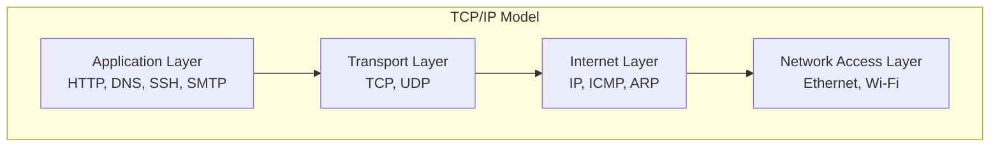
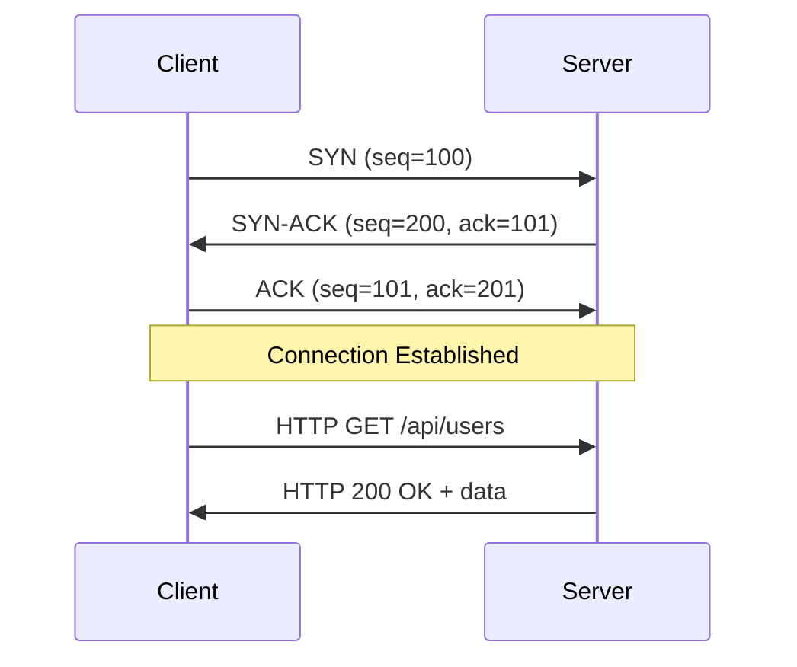
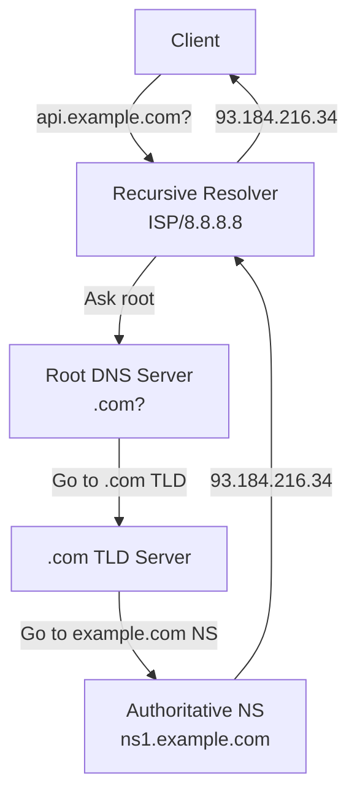
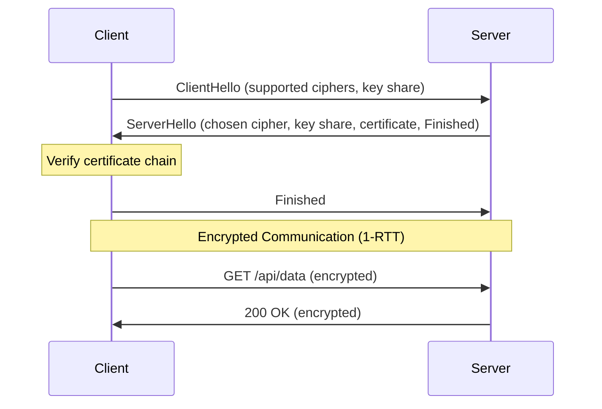
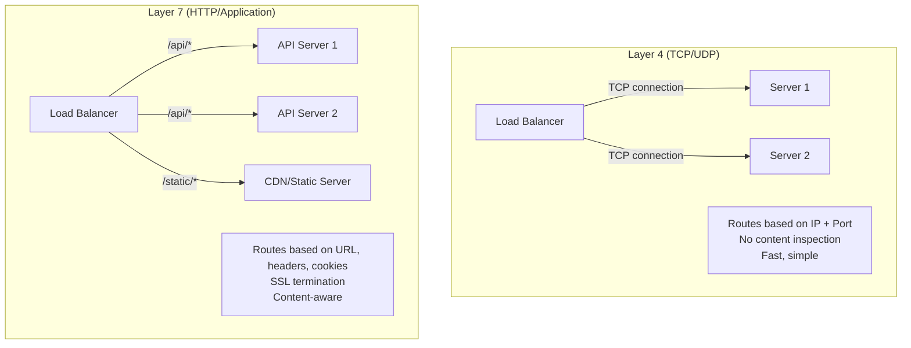
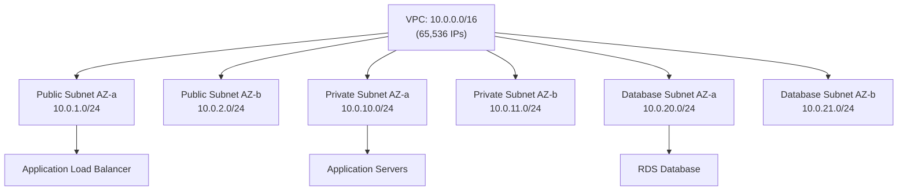
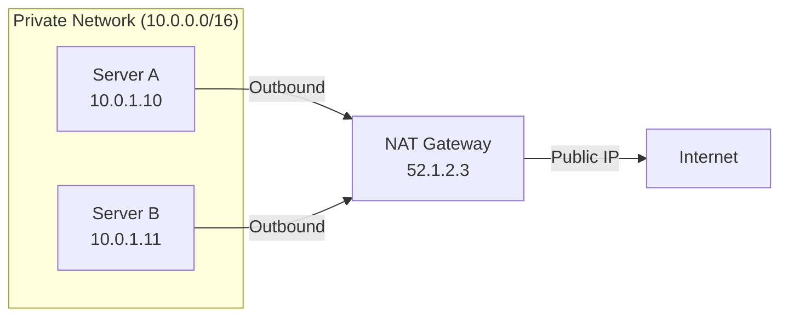

## Learning Objectives

- Understand the TCP/IP model and how data flows across networks
- Work with DNS resolution, records, and troubleshooting
- Explain HTTP/2, TLS handshakes, and certificate management
- Configure load balancers and reverse proxies
- Calculate subnets with CIDR notation and plan network architectures

## Prerequisites

- Basic command-line skills
- Understanding of client-server architecture
- Docker networking basics

## The TCP/IP Model

Every DevOps engineer needs to understand how data moves across networks. The TCP/IP model has four layers.



### TCP vs UDP

| Feature | TCP | UDP |
|---------|-----|-----|
| Connection | Connection-oriented (3-way handshake) | Connectionless |
| Reliability | Guaranteed delivery, ordering | Best-effort, no guarantees |
| Speed | Slower (overhead) | Faster (minimal overhead) |
| Use cases | HTTP, SSH, databases | DNS, video streaming, gaming |

### The TCP Three-Way Handshake



```bash
# Watch a TCP handshake
sudo tcpdump -i any -nn port 443 -c 10

# Check open connections
ss -tunapl

# Test TCP connectivity
nc -zv example.com 443
telnet example.com 80
```

## DNS (Domain Name System)

DNS translates domain names to IP addresses. It's the phonebook of the internet.



### DNS Record Types

```bash
# A Record — maps name to IPv4
api.example.com.    300  IN  A     93.184.216.34

# AAAA Record — maps name to IPv6
api.example.com.    300  IN  AAAA  2606:2800:220:1:248:1893:25c8:1946

# CNAME — alias to another name
www.example.com.    300  IN  CNAME example.com.

# MX — mail server
example.com.        300  IN  MX    10 mail.example.com.

# TXT — arbitrary text (SPF, DKIM, verification)
example.com.        300  IN  TXT   "v=spf1 include:_spf.google.com ~all"

# SRV — service discovery
_http._tcp.example.com. 300 IN SRV 10 0 80 web.example.com.

# NS — nameserver delegation
example.com.        86400 IN NS    ns1.example.com.
```

```bash
# DNS troubleshooting commands
dig api.example.com A +short
dig api.example.com ANY +trace
nslookup -type=MX example.com
host -t CNAME www.example.com

# Check TTL
dig api.example.com | grep -A1 "ANSWER SECTION"

# Query specific DNS server
dig @8.8.8.8 api.example.com

# Reverse DNS lookup
dig -x 93.184.216.34
```

## HTTP/2 and TLS

### TLS Handshake (TLS 1.3)



```bash
# Inspect TLS certificate
openssl s_client -connect api.example.com:443 -servername api.example.com </dev/null 2>/dev/null | openssl x509 -text -noout

# Check certificate expiry
echo | openssl s_client -connect api.example.com:443 2>/dev/null | openssl x509 -noout -dates

# Test specific TLS version
openssl s_client -connect api.example.com:443 -tls1_3

# Generate self-signed certificate for development
openssl req -x509 -newkey rsa:4096 -keyout key.pem -out cert.pem -sha256 -days 365 -nodes \
  -subj "/CN=localhost"
```

### HTTP/2 Features

```
HTTP/1.1                          HTTP/2
┌─────────────┐                   ┌─────────────┐
│ Request 1   │ ──────────►       │ Stream 1    │ ──►
│ Response 1  │ ◄──────────       │ Stream 3    │ ──►
│ Request 2   │ ──────────►       │ Stream 5    │ ──►
│ Response 2  │ ◄──────────       │ (Multiplexed)│
│ Request 3   │ ──────────►       │             │
│ Response 3  │ ◄──────────       └─────────────┘
└─────────────┘                   
Sequential (head-of-line          Parallel streams
blocking)                         over single connection
```

Key improvements in HTTP/2:
- **Multiplexing** — multiple requests over a single TCP connection
- **Header compression** (HPACK) — reduces redundant header data
- **Server push** — server can proactively send resources
- **Binary framing** — more efficient parsing than text-based HTTP/1.1

## Load Balancing

### Layer 4 vs Layer 7



### Load Balancing Algorithms

```
Round Robin:        1 → 2 → 3 → 1 → 2 → 3
Weighted:           1 → 1 → 1 → 2 → 3 (weight: 3,1,1)
Least Connections:  → server with fewest active connections
IP Hash:            → consistent mapping by client IP
Random:             → random server selection
```

## Reverse Proxy with Nginx

```nginx
# /etc/nginx/conf.d/api.conf
upstream api_backend {
    least_conn;
    server api-1:8080 weight=3;
    server api-2:8080 weight=2;
    server api-3:8080 weight=1;
    server api-4:8080 backup;

    keepalive 32;
}

server {
    listen 443 ssl http2;
    server_name api.example.com;

    ssl_certificate     /etc/ssl/certs/api.example.com.crt;
    ssl_certificate_key /etc/ssl/private/api.example.com.key;
    ssl_protocols       TLSv1.2 TLSv1.3;
    ssl_ciphers         HIGH:!aNULL:!MD5;

    location / {
        proxy_pass http://api_backend;
        proxy_http_version 1.1;
        proxy_set_header Connection "";
        proxy_set_header Host $host;
        proxy_set_header X-Real-IP $remote_addr;
        proxy_set_header X-Forwarded-For $proxy_add_x_forwarded_for;
        proxy_set_header X-Forwarded-Proto $scheme;

        proxy_connect_timeout 5s;
        proxy_read_timeout 30s;
        proxy_send_timeout 30s;
    }

    location /health {
        return 200 '{"status":"healthy"}';
        add_header Content-Type application/json;
    }
}
```

## CIDR Notation and Subnetting

CIDR (Classless Inter-Domain Routing) notation defines IP ranges.

```
10.0.0.0/8     → 10.0.0.0    – 10.255.255.255   (16,777,216 IPs)
172.16.0.0/12  → 172.16.0.0  – 172.31.255.255   (1,048,576 IPs)
192.168.0.0/16 → 192.168.0.0 – 192.168.255.255  (65,536 IPs)

10.0.0.0/16    → 10.0.0.0    – 10.0.255.255     (65,536 IPs)
10.0.1.0/24    → 10.0.1.0    – 10.0.1.255       (256 IPs)
10.0.1.0/28    → 10.0.1.0    – 10.0.1.15        (16 IPs)
```

### VPC Subnet Planning



```bash
# Calculate CIDR ranges
ipcalc 10.0.0.0/24
# Network:   10.0.0.0/24
# Broadcast: 10.0.0.255
# HostMin:   10.0.0.1
# HostMax:   10.0.0.254
# Hosts:     254

# Check if IP is in a CIDR range
python3 -c "
import ipaddress
net = ipaddress.ip_network('10.0.1.0/24')
print('10.0.1.50' in net)     # True
print('10.0.2.1' in net)      # False
print(f'Hosts: {net.num_addresses - 2}')
"
```

## NAT (Network Address Translation)

NAT allows private IP addresses to access the internet through a public IP.



```hcl
# AWS NAT Gateway in Terraform
resource "aws_nat_gateway" "main" {
  allocation_id = aws_eip.nat.id
  subnet_id     = aws_subnet.public.id

  tags = { Name = "main-nat" }
}

resource "aws_route_table" "private" {
  vpc_id = aws_vpc.main.id

  route {
    cidr_block     = "0.0.0.0/0"
    nat_gateway_id = aws_nat_gateway.main.id
  }
}
```

## Hands-On Exercise: Network Diagnostics

### Exercise: Troubleshoot Connectivity

```bash
# 1. DNS resolution chain
dig +trace api.example.com

# 2. Test TCP connectivity at different layers
ping -c 3 api.example.com         # ICMP (Layer 3)
nc -zv api.example.com 443        # TCP (Layer 4)
curl -Iv https://api.example.com  # HTTP (Layer 7)

# 3. Trace the network path
traceroute api.example.com
mtr api.example.com

# 4. Inspect HTTP headers and timing
curl -o /dev/null -s -w "\
  DNS:        %{time_namelookup}s\n\
  Connect:    %{time_connect}s\n\
  TLS:        %{time_appconnect}s\n\
  First byte: %{time_starttransfer}s\n\
  Total:      %{time_total}s\n" \
  https://api.example.com

# 5. Watch network traffic
sudo tcpdump -i any -nn host api.example.com -c 20
```

## Key Takeaways

- **TCP** provides reliable, ordered delivery; **UDP** provides speed with no guarantees
- **DNS** is hierarchical — understand caching and TTLs to debug resolution issues
- **TLS 1.3** reduces the handshake to 1-RTT — always enforce it in production
- **Layer 7 load balancers** enable content-based routing, SSL termination, and observability
- **CIDR notation** is essential for VPC planning — practice subnet calculations
- **NAT gateways** allow private subnets to reach the internet without exposure
- Master `dig`, `curl`, `tcpdump`, and `ss` — they're your network debugging toolkit

## External Resources

- [High Performance Browser Networking](https://hpbn.co/)
- [Cloudflare Learning Center — DNS](https://www.cloudflare.com/learning/dns/what-is-dns/)
- [Mozilla — HTTP/2](https://developer.mozilla.org/en-US/docs/Web/HTTP/Overview)
- [Nginx Documentation](https://nginx.org/en/docs/)
- [CIDR Calculator](https://www.ipaddressguide.com/cidr)
- [Julia Evans — Networking Zines](https://jvns.ca/categories/networking/)
