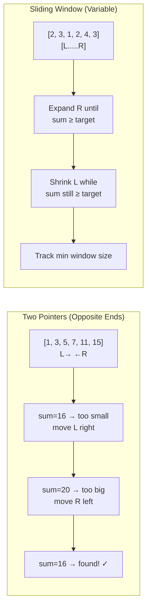

## Learning Objectives

- Analyze time and space complexity of core array operations
- Apply the two-pointer technique to solve sorted array problems efficiently
- Use the sliding window approach for contiguous subarray problems
- Implement solutions in both Go and Python with complexity analysis
- Recognize which technique to apply based on problem patterns

## Prerequisites

- Basic programming in Go or Python (loops, arrays/slices, conditionals)
- Understanding of Big-O notation (O(1), O(n), O(n²))

## Core Concepts

### Array Operations Complexity

Before solving problems, understand the cost of basic operations:

| Operation | Array (Go/Python) | Notes |
|-----------|-------------------|-------|
| Access by index | O(1) | Direct memory offset |
| Search (unsorted) | O(n) | Linear scan |
| Search (sorted) | O(log n) | Binary search |
| Insert at end | O(1) amortized | May trigger resize |
| Insert at index | O(n) | Shift elements right |
| Delete at index | O(n) | Shift elements left |
| Delete at end | O(1) | No shifting needed |

In Go, **slices** (not arrays) are the standard dynamic collection. In Python, **lists** serve the same purpose.

```go
// Go: Slices are backed by arrays with length and capacity
nums := make([]int, 0, 10)  // len=0, cap=10
nums = append(nums, 1, 2, 3)
fmt.Println(len(nums), cap(nums))  // 3, 10
```

```python
# Python: Lists are dynamic arrays
nums = []
nums.append(1)  # O(1) amortized
nums.insert(0, 0)  # O(n) — shifts everything
```

### Two Pointers Technique

The two-pointer technique uses two indices that move through an array, typically from opposite ends or at different speeds. It reduces O(n²) brute-force solutions to O(n).

**When to use:** The array is sorted, or you need to compare elements at different positions.

#### Problem: Two Sum (Sorted Array)

Given a sorted array and a target sum, find two numbers that add up to the target.

**Brute force:** Check all pairs — O(n²)

**Two pointers:** O(n)

```python
def two_sum_sorted(nums: list[int], target: int) -> list[int]:
    left, right = 0, len(nums) - 1

    while left < right:
        current_sum = nums[left] + nums[right]
        if current_sum == target:
            return [left, right]
        elif current_sum < target:
            left += 1     # Need a bigger sum → move left pointer right
        else:
            right -= 1    # Need a smaller sum → move right pointer left

    return []  # No solution found

print(two_sum_sorted([1, 3, 5, 7, 11, 15], 16))  # [2, 4] → 5 + 11
```

```go
func twoSumSorted(nums []int, target int) [2]int {
	left, right := 0, len(nums)-1

	for left < right {
		sum := nums[left] + nums[right]
		switch {
		case sum == target:
			return [2]int{left, right}
		case sum < target:
			left++
		default:
			right--
		}
	}

	return [2]int{-1, -1}
}
```

**Why this works:** Since the array is sorted, if the sum is too small, the only way to increase it is to move the left pointer right (to a larger value). If the sum is too large, move the right pointer left.

#### Problem: Remove Duplicates In-Place

Remove duplicates from a sorted array in-place, returning the new length.

```python
def remove_duplicates(nums: list[int]) -> int:
    if not nums:
        return 0

    write = 1  # Slow pointer — where to write next unique element

    for read in range(1, len(nums)):  # Fast pointer — scans ahead
        if nums[read] != nums[write - 1]:
            nums[write] = nums[read]
            write += 1

    return write

nums = [1, 1, 2, 2, 3, 4, 4, 5]
k = remove_duplicates(nums)
print(nums[:k])  # [1, 2, 3, 4, 5]
```

```go
func removeDuplicates(nums []int) int {
	if len(nums) == 0 {
		return 0
	}

	write := 1
	for read := 1; read < len(nums); read++ {
		if nums[read] != nums[write-1] {
			nums[write] = nums[read]
			write++
		}
	}

	return write
}
```

**Complexity:** O(n) time, O(1) space — we modify the array in-place.

### Sliding Window Technique

The sliding window maintains a contiguous subarray (window) that "slides" through the array. You expand the window by moving the right boundary and shrink it by moving the left boundary.

**When to use:** Problems involving contiguous subarrays or substrings with a constraint (max sum, min length, at most k distinct elements).

#### Problem: Maximum Sum Subarray of Size K (Fixed Window)

```python
def max_sum_subarray(nums: list[int], k: int) -> int:
    if len(nums) < k:
        return 0

    window_sum = sum(nums[:k])
    max_sum = window_sum

    for i in range(k, len(nums)):
        window_sum += nums[i] - nums[i - k]  # Slide: add right, remove left
        max_sum = max(max_sum, window_sum)

    return max_sum

print(max_sum_subarray([2, 1, 5, 1, 3, 2], 3))  # 9 (subarray [5, 1, 3])
```

```go
func maxSumSubarray(nums []int, k int) int {
	if len(nums) < k {
		return 0
	}

	windowSum := 0
	for i := 0; i < k; i++ {
		windowSum += nums[i]
	}
	maxSum := windowSum

	for i := k; i < len(nums); i++ {
		windowSum += nums[i] - nums[i-k]
		if windowSum > maxSum {
			maxSum = windowSum
		}
	}

	return maxSum
}
```

**Complexity:** O(n) time, O(1) space — each element is visited exactly once.

#### Problem: Smallest Subarray with Sum ≥ Target (Variable Window)

```python
def min_subarray_len(target: int, nums: list[int]) -> int:
    min_length = float('inf')
    window_sum = 0
    left = 0

    for right in range(len(nums)):
        window_sum += nums[right]       # Expand window

        while window_sum >= target:      # Shrink while constraint met
            min_length = min(min_length, right - left + 1)
            window_sum -= nums[left]
            left += 1

    return min_length if min_length != float('inf') else 0

print(min_subarray_len(7, [2, 3, 1, 2, 4, 3]))  # 2 (subarray [4, 3])
```

```go
func minSubarrayLen(target int, nums []int) int {
	minLen := len(nums) + 1
	windowSum := 0
	left := 0

	for right := 0; right < len(nums); right++ {
		windowSum += nums[right]

		for windowSum >= target {
			if right-left+1 < minLen {
				minLen = right - left + 1
			}
			windowSum -= nums[left]
			left++
		}
	}

	if minLen > len(nums) {
		return 0
	}
	return minLen
}
```

#### Problem: Longest Substring Without Repeating Characters

```python
def length_of_longest_substring(s: str) -> int:
    char_set = set()
    left = 0
    max_length = 0

    for right in range(len(s)):
        while s[right] in char_set:
            char_set.remove(s[left])
            left += 1
        char_set.add(s[right])
        max_length = max(max_length, right - left + 1)

    return max_length

print(length_of_longest_substring("abcabcbb"))  # 3 ("abc")
print(length_of_longest_substring("pwwkew"))     # 3 ("wke")
```

```go
func lengthOfLongestSubstring(s string) int {
	charSet := make(map[byte]bool)
	left, maxLen := 0, 0

	for right := 0; right < len(s); right++ {
		for charSet[s[right]] {
			delete(charSet, s[left])
			left++
		}
		charSet[s[right]] = true
		if right-left+1 > maxLen {
			maxLen = right - left + 1
		}
	}

	return maxLen
}
```

### Choosing the Right Technique

| Problem Pattern | Technique | Clue Words |
|----------------|-----------|------------|
| Pair with target sum in sorted array | Two Pointers (opposite ends) | "sorted", "pair", "sum" |
| Remove/rearrange in-place | Two Pointers (fast/slow) | "in-place", "remove", "move" |
| Fixed-size contiguous subarray | Fixed Sliding Window | "subarray of size k", "window" |
| Variable-size subarray with constraint | Variable Sliding Window | "minimum/maximum subarray", "at most k" |
| Cycle detection in linked list | Two Pointers (fast/slow) | "cycle", "duplicate", "linked list" |

## Diagram



## Hands-On Exercise

### Exercise: Solve 3 Problems

**Problem 1: Container With Most Water** (Two Pointers)

Given `heights` array, find two lines that together with the x-axis form a container holding the most water.

```python
def max_area(heights: list[int]) -> int:
    left, right = 0, len(heights) - 1
    max_water = 0

    while left < right:
        width = right - left
        height = min(heights[left], heights[right])
        max_water = max(max_water, width * height)

        if heights[left] < heights[right]:
            left += 1
        else:
            right -= 1

    return max_water

print(max_area([1, 8, 6, 2, 5, 4, 8, 3, 7]))  # 49
```

**Problem 2: Maximum Average Subarray I** (Fixed Window)

Find the contiguous subarray of length `k` with the maximum average value.

Try solving this yourself first, then check your solution.

**Problem 3: Minimum Window Substring** (Variable Window — Hard)

Given strings `s` and `t`, find the minimum window in `s` that contains all characters of `t`.

Hints:
- Use a frequency counter for characters in `t`
- Expand the window to include all needed characters
- Shrink from the left to find the minimum valid window
- Track how many unique characters are "satisfied"

**Challenge:** Implement all three in both Go and Python. Compare the code structure and idiomatic differences.

## Key Takeaways

- Two pointers reduce O(n²) pair-finding to O(n) on sorted arrays by leveraging sort order to eliminate impossible combinations
- The sliding window technique processes contiguous subarrays in O(n) by maintaining a running state (sum, count, set) that updates incrementally
- Fixed windows slide right by adding one element and removing one; variable windows expand right and shrink left based on a constraint
- Most array problems can be categorized: brute force → optimize with two pointers, sliding window, or hash map
- Always clarify: is the input sorted? Can we modify in-place? Are there negative numbers? These determine which technique applies

## External Resources

- [LeetCode: Two Pointers Pattern](https://leetcode.com/tag/two-pointers/) — Curated problems for practice
- [LeetCode: Sliding Window Pattern](https://leetcode.com/tag/sliding-window/) — Problems organized by difficulty
- [NeetCode Roadmap](https://neetcode.io/roadmap) — Structured DSA learning path with video explanations
- [Go Slices: Usage and Internals](https://go.dev/blog/slices-intro) — Official guide to Go's slice implementation
- [Visualgo](https://visualgo.net/) — Interactive algorithm visualizations

## Quiz

See the quiz.json file for this module's quiz questions.
