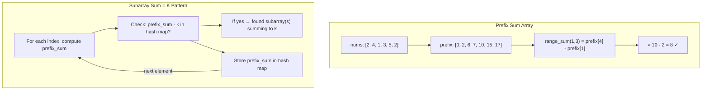

## Learning Objectives

- Build and query prefix sum arrays for O(1) range sum lookups
- Apply hash maps for O(1) lookups, frequency counting, and two-sum patterns
- Combine prefix sums with hash maps to solve subarray sum problems
- Implement the "subarray sum equals K" pattern that appears in many variations
- Analyze time-space trade-offs between brute force and hash-based solutions

## Prerequisites

- Array fundamentals: two pointers and sliding window (previous lessons)
- Understanding of hash maps / dictionaries and O(1) lookup

## Core Concepts

### Prefix Sum Technique

A **prefix sum** array stores cumulative sums. `prefix[i]` = sum of elements from index 0 to i-1.

This transforms any range sum query from O(n) to O(1):

```
Original:  [2, 4, 1, 3, 5, 2]
Prefix:    [0, 2, 6, 7, 10, 15, 17]

Sum of elements from index 1 to 3:
  prefix[4] - prefix[1] = 10 - 2 = 8  (which is 4 + 1 + 3)
```

The formula: **sum(i, j) = prefix[j+1] - prefix[i]**

```python
def build_prefix_sum(nums: list[int]) -> list[int]:
    prefix = [0] * (len(nums) + 1)
    for i in range(len(nums)):
        prefix[i + 1] = prefix[i] + nums[i]
    return prefix

def range_sum(prefix: list[int], left: int, right: int) -> int:
    return prefix[right + 1] - prefix[left]

nums = [2, 4, 1, 3, 5, 2]
prefix = build_prefix_sum(nums)
print(f"Sum [1..3] = {range_sum(prefix, 1, 3)}")  # 8
print(f"Sum [0..5] = {range_sum(prefix, 0, 5)}")  # 17
print(f"Sum [2..4] = {range_sum(prefix, 2, 4)}")  # 9
```

```go
func buildPrefixSum(nums []int) []int {
	prefix := make([]int, len(nums)+1)
	for i, num := range nums {
		prefix[i+1] = prefix[i] + num
	}
	return prefix
}

func rangeSum(prefix []int, left, right int) int {
	return prefix[right+1] - prefix[left]
}
```

### Hash Map for O(1) Lookup

Hash maps trade space for time, turning O(n) searches into O(1) lookups.

#### Two Sum (Unsorted Array)

The classic problem: find two indices whose values sum to target.

```python
def two_sum(nums: list[int], target: int) -> list[int]:
    seen = {}  # value → index

    for i, num in enumerate(nums):
        complement = target - num
        if complement in seen:
            return [seen[complement], i]
        seen[num] = i

    return []

print(two_sum([2, 7, 11, 15], 9))   # [0, 1]
print(two_sum([3, 2, 4], 6))         # [1, 2]
```

```go
func twoSum(nums []int, target int) [2]int {
	seen := make(map[int]int) // value → index

	for i, num := range nums {
		complement := target - num
		if j, exists := seen[complement]; exists {
			return [2]int{j, i}
		}
		seen[num] = i
	}

	return [2]int{-1, -1}
}
```

**Complexity:** O(n) time, O(n) space — one pass through the array.

#### Frequency Counting

```python
def top_k_frequent(nums: list[int], k: int) -> list[int]:
    freq = {}
    for num in nums:
        freq[num] = freq.get(num, 0) + 1

    # Bucket sort: index = frequency, value = list of numbers
    buckets = [[] for _ in range(len(nums) + 1)]
    for num, count in freq.items():
        buckets[count].append(num)

    result = []
    for i in range(len(buckets) - 1, 0, -1):
        for num in buckets[i]:
            result.append(num)
            if len(result) == k:
                return result

    return result

print(top_k_frequent([1, 1, 1, 2, 2, 3], 2))  # [1, 2]
```

### Prefix Sum + Hash Map: The Power Combination

The most important pattern in this module: combining prefix sums with hash maps to find subarrays with a given sum.

#### Problem: Subarray Sum Equals K

Given an array and integer k, count the number of contiguous subarrays whose sum equals k.

**Brute force:** Check all O(n²) subarrays — too slow for large inputs.

**Key insight:** If `prefix[j] - prefix[i] == k`, then the subarray from index i to j-1 sums to k. This means we need to find pairs where `prefix[j] - k == prefix[i]`.

As we scan, we store prefix sums in a hash map and check if `current_prefix - k` has been seen before.

```python
def subarray_sum(nums: list[int], k: int) -> int:
    count = 0
    prefix_sum = 0
    prefix_counts = {0: 1}  # Base case: empty prefix has sum 0

    for num in nums:
        prefix_sum += num
        complement = prefix_sum - k

        if complement in prefix_counts:
            count += prefix_counts[complement]

        prefix_counts[prefix_sum] = prefix_counts.get(prefix_sum, 0) + 1

    return count

print(subarray_sum([1, 1, 1], 2))          # 2 ([1,1] at index 0-1 and 1-2)
print(subarray_sum([1, 2, 3], 3))           # 2 ([1,2] and [3])
print(subarray_sum([1, -1, 0], 0))          # 3 ([1,-1], [-1,0], [1,-1,0])
```

```go
func subarraySum(nums []int, k int) int {
	count := 0
	prefixSum := 0
	prefixCounts := map[int]int{0: 1}

	for _, num := range nums {
		prefixSum += num
		complement := prefixSum - k

		if c, exists := prefixCounts[complement]; exists {
			count += c
		}

		prefixCounts[prefixSum]++
	}

	return count
}
```

**Walkthrough** for `nums = [1, 2, 3], k = 3`:

| Step | num | prefixSum | complement (prefix-k) | prefixCounts has it? | count | prefixCounts |
|------|-----|-----------|----------------------|---------------------|-------|-------------|
| init | — | 0 | — | — | 0 | {0:1} |
| 1 | 1 | 1 | 1-3 = -2 | No | 0 | {0:1, 1:1} |
| 2 | 2 | 3 | 3-3 = 0 | Yes (1×) | 1 | {0:1, 1:1, 3:1} |
| 3 | 3 | 6 | 6-3 = 3 | Yes (1×) | 2 | {0:1, 1:1, 3:1, 6:1} |

**Complexity:** O(n) time, O(n) space.

### Variations of the Prefix Sum + Hash Map Pattern

#### Contiguous Array (Equal 0s and 1s)

Find the longest subarray with equal numbers of 0s and 1s. Transform: replace 0 with -1, then find longest subarray with sum 0.

```python
def find_max_length(nums: list[int]) -> int:
    prefix_sum = 0
    first_seen = {0: -1}  # sum → first index where this sum occurred
    max_length = 0

    for i, num in enumerate(nums):
        prefix_sum += 1 if num == 1 else -1

        if prefix_sum in first_seen:
            max_length = max(max_length, i - first_seen[prefix_sum])
        else:
            first_seen[prefix_sum] = i

    return max_length

print(find_max_length([0, 1, 0]))           # 2
print(find_max_length([0, 1, 0, 0, 1, 1]))  # 6
```

#### Product of Array Except Self

```python
def product_except_self(nums: list[int]) -> list[int]:
    n = len(nums)
    result = [1] * n

    prefix = 1
    for i in range(n):
        result[i] = prefix
        prefix *= nums[i]

    suffix = 1
    for i in range(n - 1, -1, -1):
        result[i] *= suffix
        suffix *= nums[i]

    return result

print(product_except_self([1, 2, 3, 4]))  # [24, 12, 8, 6]
```

```go
func productExceptSelf(nums []int) []int {
	n := len(nums)
	result := make([]int, n)

	prefix := 1
	for i := 0; i < n; i++ {
		result[i] = prefix
		prefix *= nums[i]
	}

	suffix := 1
	for i := n - 1; i >= 0; i-- {
		result[i] *= suffix
		suffix *= nums[i]
	}

	return result
}
```

## Diagram



## Hands-On Exercise

### Exercise: Solve Subarray Sum Equals K

**Problem:** Given an integer array `nums` and an integer `k`, return the total number of subarrays whose sum equals `k`.

**Step 1:** Implement the brute force O(n²) solution first:

```python
def subarray_sum_brute(nums: list[int], k: int) -> int:
    count = 0
    for i in range(len(nums)):
        current_sum = 0
        for j in range(i, len(nums)):
            current_sum += nums[j]
            if current_sum == k:
                count += 1
    return count
```

**Step 2:** Implement the O(n) prefix sum + hash map solution (shown above).

**Step 3:** Test with edge cases:

```python
test_cases = [
    ([1, 1, 1], 2, 2),
    ([1, 2, 3], 3, 2),
    ([1], 0, 0),
    ([1, -1, 0], 0, 3),
    ([-1, -1, 1], 0, 1),
    ([0, 0, 0, 0], 0, 10),
]

for nums, k, expected in test_cases:
    brute = subarray_sum_brute(nums, k)
    optimized = subarray_sum(nums, k)
    status = "✓" if brute == optimized == expected else "✗"
    print(f"{status} nums={nums}, k={k} → brute={brute}, optimized={optimized}, expected={expected}")
```

**Step 4:** Benchmark both solutions with a large random array to see the O(n²) vs O(n) difference.

**Challenge:** Solve "Subarray Sum Divisible by K" — count subarrays whose sum is divisible by k. Hint: use `prefix_sum % k` as the hash key.

## Key Takeaways

- Prefix sums precompute cumulative sums, enabling O(1) range sum queries after O(n) preprocessing
- Hash maps trade O(n) space for O(1) lookup time — the most common trade-off in DSA
- The "prefix sum + hash map" pattern solves subarray-sum problems in O(n) by checking if `prefix_sum - k` has been seen
- Initialize the hash map with `{0: 1}` to handle subarrays starting from index 0
- This pattern extends to many variations: equal 0s/1s (transform then sum=0), divisible by k (use modulo), etc.
- Always verify with negative numbers and zeros — they're the most common edge case source

## External Resources

- [LeetCode 560: Subarray Sum Equals K](https://leetcode.com/problems/subarray-sum-equals-k/) — Practice the core pattern
- [LeetCode 238: Product of Array Except Self](https://leetcode.com/problems/product-of-array-except-self/) — Prefix/suffix product
- [LeetCode 525: Contiguous Array](https://leetcode.com/problems/contiguous-array/) — Prefix sum with 0/1 transformation
- [Prefix Sum — CP Algorithms](https://cp-algorithms.com/data_structures/prefix-sums.html) — Mathematical treatment with 2D extension
- [NeetCode: Prefix Sum Playlist](https://neetcode.io/) — Video walkthroughs of prefix sum problems

## Quiz

See the quiz.json file for this module's quiz questions.
