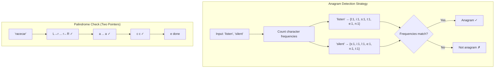

## Learning Objectives

- Solve pattern matching, anagram, and palindrome problems efficiently
- Use hash maps for character frequency analysis
- Apply Go's strings.Builder for efficient string construction
- Understand string immutability and its performance implications
- Implement solutions in both Go and Python with complexity analysis

## Prerequisites

- Array fundamentals: two pointers and sliding window (previous lesson)
- Understanding of hash maps / dictionaries

## Core Concepts

### String Immutability

In both Go and Python, strings are **immutable**. Concatenating strings in a loop creates a new string each time, leading to O(n²) performance.

```python
# ❌ O(n²) — creates a new string each iteration
result = ""
for char in "hello world":
    result += char.upper()

# ✅ O(n) — builds efficiently
result = "".join(char.upper() for char in "hello world")
```

```go
// ❌ O(n²) — allocates new string each iteration
result := ""
for _, ch := range "hello world" {
	result += string(unicode.ToUpper(ch))
}

// ✅ O(n) — uses a growable buffer
var builder strings.Builder
for _, ch := range "hello world" {
	builder.WriteRune(unicode.ToUpper(ch))
}
result := builder.String()
```

### Palindrome Check

A palindrome reads the same forwards and backwards. The two-pointer approach is optimal.

```python
def is_palindrome(s: str) -> bool:
    left, right = 0, len(s) - 1
    while left < right:
        while left < right and not s[left].isalnum():
            left += 1
        while left < right and not s[right].isalnum():
            right -= 1
        if s[left].lower() != s[right].lower():
            return False
        left += 1
        right -= 1
    return True

print(is_palindrome("A man, a plan, a canal: Panama"))  # True
print(is_palindrome("race a car"))                       # False
```

```go
func isPalindrome(s string) bool {
	left, right := 0, len(s)-1
	for left < right {
		for left < right && !isAlphanumeric(s[left]) {
			left++
		}
		for left < right && !isAlphanumeric(s[right]) {
			right--
		}
		if toLower(s[left]) != toLower(s[right]) {
			return false
		}
		left++
		right--
	}
	return true
}

func isAlphanumeric(b byte) bool {
	return (b >= 'a' && b <= 'z') || (b >= 'A' && b <= 'Z') || (b >= '0' && b <= '9')
}

func toLower(b byte) byte {
	if b >= 'A' && b <= 'Z' {
		return b + 32
	}
	return b
}
```

**Complexity:** O(n) time, O(1) space.

### Anagram Detection

Two strings are anagrams if they contain the same characters with the same frequencies. The optimal approach uses character frequency counting.

```python
from collections import Counter

def is_anagram(s: str, t: str) -> bool:
    if len(s) != len(t):
        return False
    return Counter(s) == Counter(t)

print(is_anagram("anagram", "nagaram"))  # True
print(is_anagram("rat", "car"))          # False
```

**Without Counter (more instructive):**

```python
def is_anagram_manual(s: str, t: str) -> bool:
    if len(s) != len(t):
        return False

    freq = {}
    for c in s:
        freq[c] = freq.get(c, 0) + 1

    for c in t:
        if c not in freq or freq[c] == 0:
            return False
        freq[c] -= 1

    return True
```

```go
func isAnagram(s, t string) bool {
	if len(s) != len(t) {
		return false
	}

	freq := make(map[rune]int)
	for _, c := range s {
		freq[c]++
	}
	for _, c := range t {
		freq[c]--
		if freq[c] < 0 {
			return false
		}
	}
	return true
}
```

**Complexity:** O(n) time, O(1) space (since the character set is bounded — at most 26 lowercase letters).

### Group Anagrams

Given a list of strings, group the anagrams together. The key insight: anagrams produce the same sorted string.

```python
from collections import defaultdict

def group_anagrams(strs: list[str]) -> list[list[str]]:
    groups = defaultdict(list)
    for s in strs:
        key = "".join(sorted(s))  # Sorted chars as key
        groups[key].append(s)
    return list(groups.values())

result = group_anagrams(["eat", "tea", "tan", "ate", "nat", "bat"])
print(result)  # [["eat","tea","ate"], ["tan","nat"], ["bat"]]
```

**Optimization:** Instead of sorting (O(k log k) per string), use a character count tuple as the key:

```python
def group_anagrams_optimized(strs: list[str]) -> list[list[str]]:
    groups = defaultdict(list)
    for s in strs:
        count = [0] * 26
        for c in s:
            count[ord(c) - ord('a')] += 1
        groups[tuple(count)].append(s)
    return list(groups.values())
```

```go
func groupAnagrams(strs []string) [][]string {
	groups := make(map[[26]int][]string)

	for _, s := range strs {
		var key [26]int
		for _, c := range s {
			key[c-'a']++
		}
		groups[key] = append(groups[key], s)
	}

	result := make([][]string, 0, len(groups))
	for _, group := range groups {
		result = append(result, group)
	}
	return result
}
```

**Complexity:** O(n × k) where n is the number of strings and k is the maximum string length.

### Pattern Matching: Find All Anagrams in a String

Given a string `s` and a pattern `p`, find all start indices of `p`'s anagrams in `s`. This combines sliding window with frequency counting.

```python
def find_anagrams(s: str, p: str) -> list[int]:
    if len(p) > len(s):
        return []

    p_count = [0] * 26
    s_count = [0] * 26
    result = []

    for c in p:
        p_count[ord(c) - ord('a')] += 1

    for i in range(len(s)):
        s_count[ord(s[i]) - ord('a')] += 1

        if i >= len(p):
            s_count[ord(s[i - len(p)]) - ord('a')] -= 1

        if s_count == p_count:
            result.append(i - len(p) + 1)

    return result

print(find_anagrams("cbaebabacd", "abc"))  # [0, 6]
```

```go
func findAnagrams(s, p string) []int {
	if len(p) > len(s) {
		return nil
	}

	var pCount, sCount [26]int
	for _, c := range p {
		pCount[c-'a']++
	}

	var result []int
	for i := 0; i < len(s); i++ {
		sCount[s[i]-'a']++
		if i >= len(p) {
			sCount[s[i-len(p)]-'a']--
		}
		if sCount == pCount {
			result = append(result, i-len(p)+1)
		}
	}

	return result
}
```

### Longest Palindromic Substring

Expand from each center (including between-character centers) to find palindromes:

```python
def longest_palindrome(s: str) -> str:
    if len(s) < 2:
        return s

    start, max_len = 0, 1

    def expand(left: int, right: int):
        nonlocal start, max_len
        while left >= 0 and right < len(s) and s[left] == s[right]:
            if right - left + 1 > max_len:
                start = left
                max_len = right - left + 1
            left -= 1
            right += 1

    for i in range(len(s)):
        expand(i, i)       # Odd-length palindromes
        expand(i, i + 1)   # Even-length palindromes

    return s[start:start + max_len]

print(longest_palindrome("babad"))   # "bab" or "aba"
print(longest_palindrome("cbbd"))    # "bb"
```

**Complexity:** O(n²) time, O(1) space.

## Diagram



## Hands-On Exercise

### Exercise: Implement an Anagram Checker

Build a comprehensive anagram utility:

```python
class AnagramChecker:
    def __init__(self):
        self.word_groups: dict[str, list[str]] = {}

    def _normalize(self, word: str) -> str:
        return "".join(sorted(word.lower().replace(" ", "")))

    def are_anagrams(self, word1: str, word2: str) -> bool:
        return self._normalize(word1) == self._normalize(word2)

    def add_word(self, word: str) -> None:
        key = self._normalize(word)
        if key not in self.word_groups:
            self.word_groups[key] = []
        if word not in self.word_groups[key]:
            self.word_groups[key].append(word)

    def find_anagrams(self, word: str) -> list[str]:
        key = self._normalize(word)
        return [w for w in self.word_groups.get(key, []) if w != word]

checker = AnagramChecker()
words = ["listen", "silent", "enlist", "hello", "world", "inlets", "tinsel"]
for w in words:
    checker.add_word(w)

print(checker.are_anagrams("listen", "silent"))    # True
print(checker.find_anagrams("listen"))              # ["silent", "enlist", "inlets", "tinsel"]
```

**Challenge:** Implement `find_anagrams_in_text(s, pattern)` that returns all positions where an anagram of `pattern` starts in string `s`. Use the sliding window approach.

## Key Takeaways

- String immutability means naive concatenation is O(n²); use builders or join for O(n) construction
- Character frequency counting (hash map or array[26]) is the fundamental tool for anagram problems
- Two pointers handle palindrome checking in O(n) time and O(1) space
- The sliding window + frequency count combination solves "find all anagram positions" in O(n)
- Sorting a string gives a canonical key for grouping anagrams, but counting is asymptotically faster
- Always consider: ASCII only or Unicode? Case-sensitive or not? These affect space complexity

## External Resources

- [LeetCode: String Problems](https://leetcode.com/tag/string/) — Curated problems for practice
- [Go strings Package](https://pkg.go.dev/strings) — Standard library string utilities
- [Python String Methods](https://docs.python.org/3/library/stdtypes.html#string-methods) — Built-in string operations
- [Rabin-Karp Algorithm](https://en.wikipedia.org/wiki/Rabin%E2%80%93Karp_algorithm) — Rolling hash for substring matching
- [KMP Algorithm Visualization](https://www.youtube.com/watch?v=JoF0Z7nVSrA) — Visual guide to Knuth-Morris-Pratt

## Quiz

See the quiz.json file for this module's quiz questions.
