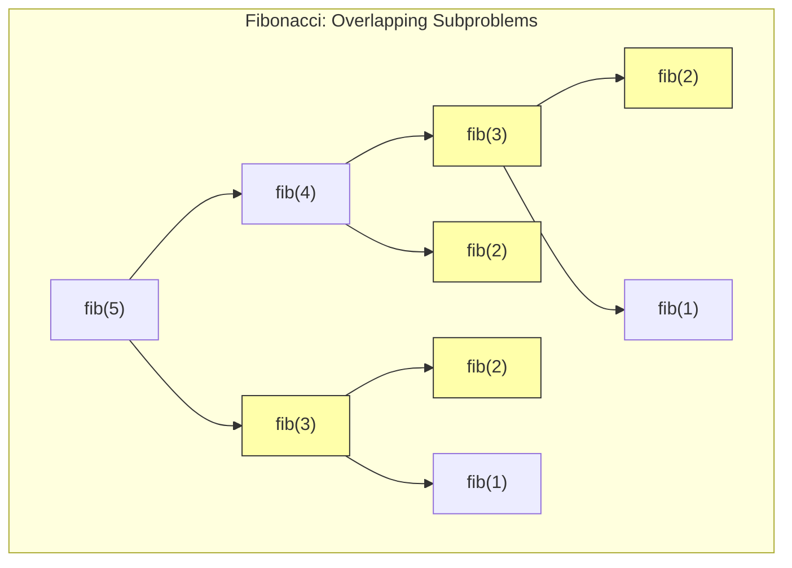
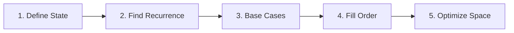

## Learning Objectives

- Understand the two properties that make a problem suitable for DP: overlapping subproblems and optimal substructure
- Implement solutions using both top-down (memoization) and bottom-up (tabulation) approaches
- Analyze time and space complexity of DP solutions
- Apply space optimization techniques to reduce memory usage
- Solve foundational DP problems: Fibonacci, climbing stairs, house robber, coin change

## Prerequisites

- Recursion and recursive problem decomposition
- Array operations
- Big-O analysis
- Hash maps / dictionaries

## What Is Dynamic Programming?

Dynamic Programming (DP) is an optimization technique that solves complex problems by breaking them into **overlapping subproblems**, solving each subproblem once, and storing the result to avoid redundant computation.

### The Two Required Properties

1. **Overlapping Subproblems**: The same subproblem is solved multiple times in the recursive solution
2. **Optimal Substructure**: The optimal solution can be constructed from optimal solutions of subproblems



`fib(3)` is computed twice, `fib(2)` three times. Without DP, the naive recursive Fibonacci is **O(2ⁿ)**.

## Approach 1: Top-Down (Memoization)

Start with the original recursive solution and **cache** results of subproblems. When a subproblem is encountered again, return the cached result.

```python
def fib_memo(n, memo=None):
    if memo is None:
        memo = {}
    if n <= 1:
        return n
    if n in memo:
        return memo[n]
    memo[n] = fib_memo(n - 1, memo) + fib_memo(n - 2, memo)
    return memo[n]
```

Using Python's `@functools.cache` decorator:

```python
from functools import cache

@cache
def fib(n):
    if n <= 1:
        return n
    return fib(n - 1) + fib(n - 2)
```

**Time**: O(n) — each subproblem computed once. **Space**: O(n) for memo + call stack.

## Approach 2: Bottom-Up (Tabulation)

Build the solution iteratively from the smallest subproblems upward. Fill a table (usually an array) in order of increasing subproblem size.

```python
def fib_tab(n):
    if n <= 1:
        return n
    dp = [0] * (n + 1)
    dp[1] = 1
    for i in range(2, n + 1):
        dp[i] = dp[i - 1] + dp[i - 2]
    return dp[n]
```

```go
func fib(n int) int {
    if n <= 1 {
        return n
    }
    dp := make([]int, n+1)
    dp[1] = 1
    for i := 2; i <= n; i++ {
        dp[i] = dp[i-1] + dp[i-2]
    }
    return dp[n]
}
```

**Time**: O(n). **Space**: O(n).

## Space Optimization

When the DP recurrence only depends on a fixed number of previous states, we can reduce space from O(n) to O(1).

```python
def fib_optimized(n):
    if n <= 1:
        return n
    prev2, prev1 = 0, 1
    for _ in range(2, n + 1):
        prev2, prev1 = prev1, prev2 + prev1
    return prev1
```

**Time**: O(n). **Space**: O(1).

### Top-Down vs Bottom-Up

| Aspect | Top-Down (Memo) | Bottom-Up (Tab) |
|--------|----------------|-----------------|
| Implementation | Add cache to recursion | Iterative with table |
| Subproblems solved | Only needed ones | All subproblems |
| Stack overflow risk | Yes (deep recursion) | No |
| Easier to write | Usually yes | Sometimes |
| Space optimization | Harder | Easier |

## Problem 1: Climbing Stairs (LeetCode 70)

You can climb 1 or 2 steps at a time. How many ways to reach step n?

**Recurrence**: `ways(n) = ways(n-1) + ways(n-2)` — this IS Fibonacci.

```python
def climb_stairs(n):
    if n <= 2:
        return n
    a, b = 1, 2
    for _ in range(3, n + 1):
        a, b = b, a + b
    return b
```

### Generalized: K Steps

```python
def climb_stairs_k(n, k):
    dp = [0] * (n + 1)
    dp[0] = 1
    for i in range(1, n + 1):
        for step in range(1, min(k, i) + 1):
            dp[i] += dp[i - step]
    return dp[n]
```

## Problem 2: House Robber (LeetCode 198)

Rob houses along a street — can't rob two adjacent houses. Maximize total money.

**Recurrence**: `rob(i) = max(rob(i-1), rob(i-2) + nums[i])`

At each house, you either skip it (take previous best) or rob it (add its value to best from two houses back).

```python
def rob(nums):
    if not nums:
        return 0
    if len(nums) == 1:
        return nums[0]

    prev2, prev1 = 0, 0
    for num in nums:
        prev2, prev1 = prev1, max(prev1, prev2 + num)
    return prev1
```

```go
func rob(nums []int) int {
    prev2, prev1 := 0, 0
    for _, num := range nums {
        prev2, prev1 = prev1, max(prev1, prev2+num)
    }
    return prev1
}

func max(a, b int) int {
    if a > b { return a }
    return b
}
```

**Time**: O(n). **Space**: O(1).

### House Robber II (Circular) — LeetCode 213

Houses are in a circle. Solve twice: once excluding the first house, once excluding the last.

```python
def rob_circular(nums):
    if len(nums) == 1:
        return nums[0]
    return max(rob(nums[1:]), rob(nums[:-1]))
```

## Problem 3: Min Cost Climbing Stairs (LeetCode 746)

```python
def min_cost_climbing_stairs(cost):
    n = len(cost)
    a, b = cost[0], cost[1]
    for i in range(2, n):
        a, b = b, cost[i] + min(a, b)
    return min(a, b)
```

## Problem 4: Decode Ways (LeetCode 91)

Given a string of digits, count ways to decode it (1→A, 2→B, ..., 26→Z).

```python
def num_decodings(s):
    if not s or s[0] == '0':
        return 0
    n = len(s)
    prev2, prev1 = 1, 1

    for i in range(1, n):
        curr = 0
        if s[i] != '0':
            curr += prev1
        two_digit = int(s[i-1:i+1])
        if 10 <= two_digit <= 26:
            curr += prev2
        prev2, prev1 = prev1, curr

    return prev1
```

## The DP Problem-Solving Framework

1. **Define the state**: What does `dp[i]` (or `dp[i][j]`) represent?
2. **Find the recurrence**: How does `dp[i]` relate to smaller subproblems?
3. **Identify base cases**: What are the smallest subproblems with known answers?
4. **Determine the order**: In which order should subproblems be solved?
5. **Optimize space**: Can we reduce the table to a few variables?



## Common Pitfalls

1. **Forgetting base cases**: Always handle n=0, n=1, empty input
2. **Off-by-one in table size**: If you need `dp[n]`, allocate `n+1` entries
3. **Wrong fill order**: Bottom-up must process subproblems before the problems that depend on them
4. **Premature optimization**: Get the O(n) or O(n²) DP working first, then optimize space
5. **Not recognizing DP**: If a recursive solution has exponential time due to repeated work, it's likely a DP problem

## Hands-On Exercises

### Exercise 1: Maximum Subarray (LeetCode 53) — Kadane's Algorithm

```python
def max_subarray(nums):
    max_sum = curr_sum = nums[0]
    for num in nums[1:]:
        curr_sum = max(num, curr_sum + num)
        max_sum = max(max_sum, curr_sum)
    return max_sum
```

**DP interpretation**: `dp[i]` = max subarray sum ending at index i. `dp[i] = max(nums[i], dp[i-1] + nums[i])`.

### Exercise 2: Unique Paths (LeetCode 62)

```python
def unique_paths(m, n):
    dp = [1] * n
    for _ in range(1, m):
        for j in range(1, n):
            dp[j] += dp[j - 1]
    return dp[-1]
```

### Exercise 3: Word Break (LeetCode 139)

```python
def word_break(s, word_dict):
    words = set(word_dict)
    n = len(s)
    dp = [False] * (n + 1)
    dp[0] = True

    for i in range(1, n + 1):
        for j in range(i):
            if dp[j] and s[j:i] in words:
                dp[i] = True
                break
    return dp[n]
```

## Key Takeaways

- DP requires **overlapping subproblems** + **optimal substructure** — if your recursion repeats work, DP can help
- **Memoization** (top-down) adds caching to recursion; **tabulation** (bottom-up) builds iteratively
- Space optimization is often possible when the recurrence depends on only a few previous values
- The **5-step framework** (state → recurrence → base → order → optimize) works for every DP problem
- Start with brute-force recursion, add memoization, then convert to bottom-up, then optimize space

## External Resources

- [LeetCode DP Study Plan](https://leetcode.com/study-plan/dynamic-programming/)
- [MIT OCW: Dynamic Programming](https://ocw.mit.edu/courses/6-006-introduction-to-algorithms-spring-2020/)
- [NeetCode: DP Playlist](https://www.youtube.com/playlist?list=PLot-Xpze53lcvx_yhUmHaFbatmJr_X-cL)
- [Aditya Verma: DP Playlist](https://www.youtube.com/playlist?list=PL_z_8CaSLPWekqhdCPmFohncHwz8TY2Go)
