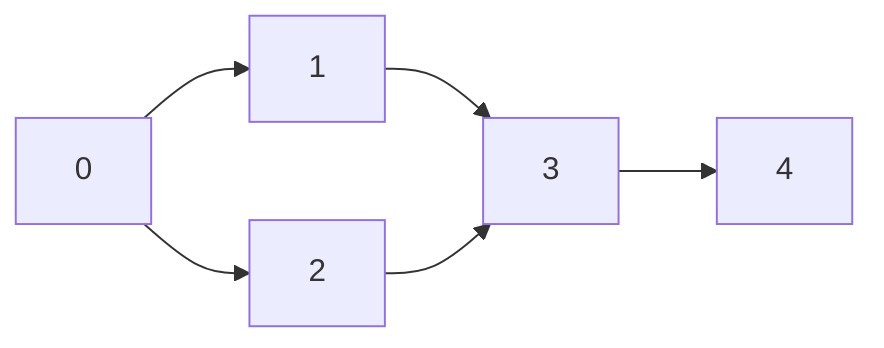

## Learning Objectives

- Implement topological sort for DAGs using both DFS and Kahn's (BFS) algorithm
- Use Union-Find (Disjoint Set Union) for efficient connectivity queries
- Implement Kruskal's and Prim's algorithms for Minimum Spanning Trees
- Understand strongly connected components (Tarjan's/Kosaraju's algorithm)
- Recognize which advanced graph algorithm applies to each problem type

## Prerequisites

- BFS and DFS traversals
- Dijkstra's shortest path algorithm
- Priority queue / min-heap
- Cycle detection in directed graphs

## Topological Sort

A **topological ordering** of a directed acyclic graph (DAG) is a linear ordering of vertices such that for every edge (u, v), u appears before v. It's used for dependency resolution.



Valid orderings: `[0, 1, 2, 3, 4]` or `[0, 2, 1, 3, 4]`

### Kahn's Algorithm (BFS-based)

Track in-degrees. Repeatedly process nodes with in-degree 0.

```python
from collections import deque, defaultdict

def topological_sort_kahn(n: int, edges: list) -> list:
    graph = defaultdict(list)
    in_degree = [0] * n

    for u, v in edges:
        graph[u].append(v)
        in_degree[v] += 1

    queue = deque(i for i in range(n) if in_degree[i] == 0)
    order = []

    while queue:
        node = queue.popleft()
        order.append(node)
        for neighbor in graph[node]:
            in_degree[neighbor] -= 1
            if in_degree[neighbor] == 0:
                queue.append(neighbor)

    if len(order) != n:
        return []  # cycle detected — not a DAG
    return order
```

```go
func topologicalSortKahn(n int, edges [][]int) []int {
    graph := make(map[int][]int)
    inDegree := make([]int, n)

    for _, e := range edges {
        graph[e[0]] = append(graph[e[0]], e[1])
        inDegree[e[1]]++
    }

    queue := []int{}
    for i := 0; i < n; i++ {
        if inDegree[i] == 0 {
            queue = append(queue, i)
        }
    }

    order := []int{}
    for len(queue) > 0 {
        node := queue[0]
        queue = queue[1:]
        order = append(order, node)
        for _, neighbor := range graph[node] {
            inDegree[neighbor]--
            if inDegree[neighbor] == 0 {
                queue = append(queue, neighbor)
            }
        }
    }

    if len(order) != n {
        return nil // cycle
    }
    return order
}
```

### DFS-based Topological Sort

Post-order DFS, then reverse. Completed nodes (fully explored) are appended; reversing gives topological order.

```python
def topological_sort_dfs(n: int, edges: list) -> list:
    graph = defaultdict(list)
    for u, v in edges:
        graph[u].append(v)

    WHITE, GRAY, BLACK = 0, 1, 2
    color = [WHITE] * n
    order = []
    has_cycle = False

    def dfs(node):
        nonlocal has_cycle
        color[node] = GRAY
        for neighbor in graph[node]:
            if color[neighbor] == GRAY:
                has_cycle = True
                return
            if color[neighbor] == WHITE:
                dfs(neighbor)
        color[node] = BLACK
        order.append(node)

    for i in range(n):
        if color[i] == WHITE:
            dfs(i)

    if has_cycle:
        return []
    return order[::-1]
```

**Time**: O(V + E). **Space**: O(V).

### Applications

- **Build systems**: Makefile dependency resolution
- **Course scheduling**: Prerequisites ordering
- **Package managers**: npm/pip install order
- **Spreadsheet evaluation**: Cell dependency chains

## Union-Find (Disjoint Set Union)

Union-Find tracks a collection of disjoint sets and supports two operations:
- **Find**: Which set does element x belong to?
- **Union**: Merge two sets

With **path compression** and **union by rank**, both operations run in nearly O(1) — specifically O(α(n)) where α is the inverse Ackermann function.

```python
class UnionFind:
    def __init__(self, n: int):
        self.parent = list(range(n))
        self.rank = [0] * n
        self.count = n  # number of connected components

    def find(self, x: int) -> int:
        if self.parent[x] != x:
            self.parent[x] = self.find(self.parent[x])  # path compression
        return self.parent[x]

    def union(self, x: int, y: int) -> bool:
        px, py = self.find(x), self.find(y)
        if px == py:
            return False  # already connected
        # Union by rank
        if self.rank[px] < self.rank[py]:
            px, py = py, px
        self.parent[py] = px
        if self.rank[px] == self.rank[py]:
            self.rank[px] += 1
        self.count -= 1
        return True

    def connected(self, x: int, y: int) -> bool:
        return self.find(x) == self.find(y)
```

```go
type UnionFind struct {
    parent []int
    rank   []int
    count  int
}

func NewUnionFind(n int) *UnionFind {
    parent := make([]int, n)
    for i := range parent {
        parent[i] = i
    }
    return &UnionFind{parent: parent, rank: make([]int, n), count: n}
}

func (uf *UnionFind) Find(x int) int {
    if uf.parent[x] != x {
        uf.parent[x] = uf.Find(uf.parent[x])
    }
    return uf.parent[x]
}

func (uf *UnionFind) Union(x, y int) bool {
    px, py := uf.Find(x), uf.Find(y)
    if px == py {
        return false
    }
    if uf.rank[px] < uf.rank[py] {
        px, py = py, px
    }
    uf.parent[py] = px
    if uf.rank[px] == uf.rank[py] {
        uf.rank[px]++
    }
    uf.count--
    return true
}
```

### Why Path Compression Works

Without optimization, Find can be O(n) in a chain. Path compression makes every node point directly to the root, flattening the tree. Combined with union by rank (always attach smaller tree under larger), the amortized cost drops to O(α(n)) ≈ O(1).

## Minimum Spanning Tree (MST)

An MST connects all vertices with the minimum total edge weight and no cycles. For a graph with V vertices, the MST has exactly V-1 edges.

### Kruskal's Algorithm

Sort edges by weight. Add edges in order, skipping those that would create a cycle (detected by Union-Find).

```python
def kruskal(n: int, edges: list) -> tuple:
    edges.sort(key=lambda e: e[2])  # sort by weight
    uf = UnionFind(n)
    mst_edges = []
    mst_weight = 0

    for u, v, w in edges:
        if uf.union(u, v):
            mst_edges.append((u, v, w))
            mst_weight += w
            if len(mst_edges) == n - 1:
                break

    if len(mst_edges) != n - 1:
        return -1, []  # graph not connected
    return mst_weight, mst_edges
```

**Time**: O(E log E) for sorting. Union-Find operations are nearly O(1) each.

### Prim's Algorithm

Start from any vertex. Repeatedly add the cheapest edge connecting the MST to a non-MST vertex. Uses a priority queue.

```python
def prim(n: int, adj: dict) -> int:
    visited = set()
    heap = [(0, 0)]  # (weight, node)
    mst_weight = 0

    while heap and len(visited) < n:
        w, u = heapq.heappop(heap)
        if u in visited:
            continue
        visited.add(u)
        mst_weight += w
        for v, weight in adj[u]:
            if v not in visited:
                heapq.heappush(heap, (weight, v))

    return mst_weight if len(visited) == n else -1
```

**Time**: O(E log V). **Space**: O(V + E).

### Kruskal vs Prim

| Aspect | Kruskal | Prim |
|--------|---------|------|
| Approach | Edge-centric | Vertex-centric |
| Data structure | Union-Find | Priority queue |
| Better for | Sparse graphs | Dense graphs |
| Time | O(E log E) | O(E log V) |

## Strongly Connected Components (SCCs)

A **strongly connected component** is a maximal set of vertices where every vertex is reachable from every other vertex (in a directed graph).

### Kosaraju's Algorithm

1. Perform DFS and record finish order (like topological sort)
2. Transpose the graph (reverse all edges)
3. DFS on transposed graph in reverse finish order — each DFS tree is an SCC

```python
def kosaraju(n: int, edges: list) -> list:
    graph = defaultdict(list)
    reverse_graph = defaultdict(list)
    for u, v in edges:
        graph[u].append(v)
        reverse_graph[v].append(u)

    # Step 1: DFS to get finish order
    visited = set()
    finish_order = []

    def dfs1(node):
        visited.add(node)
        for neighbor in graph[node]:
            if neighbor not in visited:
                dfs1(neighbor)
        finish_order.append(node)

    for i in range(n):
        if i not in visited:
            dfs1(i)

    # Step 2: DFS on reverse graph in reverse finish order
    visited.clear()
    sccs = []

    def dfs2(node, component):
        visited.add(node)
        component.append(node)
        for neighbor in reverse_graph[node]:
            if neighbor not in visited:
                dfs2(neighbor, component)

    for node in reversed(finish_order):
        if node not in visited:
            component = []
            dfs2(node, component)
            sccs.append(component)

    return sccs
```

**Time**: O(V + E). **Space**: O(V).

### Applications of SCCs

- **Compiler optimization**: Detecting mutual recursion
- **Social networks**: Finding tightly-knit communities
- **Web crawling**: Grouping interlinked pages
- **2-SAT problems**: Solving satisfiability via implication graphs

## Hands-On Exercises

### Exercise 1: Course Schedule II (LeetCode 210)

Return a valid course order (topological sort) or empty if impossible.

```python
def find_order(num_courses: int, prerequisites: list) -> list:
    edges = [(prereq, course) for course, prereq in prerequisites]
    return topological_sort_kahn(num_courses, edges)
```

### Exercise 2: Redundant Connection (LeetCode 684)

Find the edge that, when removed, makes the graph a tree. Union-Find detects the first edge that connects two already-connected components.

```python
def find_redundant_connection(edges: list) -> list:
    uf = UnionFind(len(edges) + 1)
    for u, v in edges:
        if not uf.union(u, v):
            return [u, v]
    return []
```

### Exercise 3: Min Cost to Connect All Points (LeetCode 1584)

```python
def min_cost_connect_points(points: list) -> int:
    n = len(points)
    edges = []
    for i in range(n):
        for j in range(i + 1, n):
            dist = abs(points[i][0] - points[j][0]) + abs(points[i][1] - points[j][1])
            edges.append((i, j, dist))

    cost, _ = kruskal(n, edges)
    return cost
```

## Key Takeaways

- **Topological sort** linearizes DAG dependencies — Kahn's (BFS) is more intuitive, DFS-based is more concise
- **Union-Find** with path compression + union by rank gives near-O(1) operations — essential for dynamic connectivity
- **Kruskal's** (sort + Union-Find) and **Prim's** (greedy + heap) both find MSTs; choose based on graph density
- **SCCs** partition a directed graph into maximal mutually-reachable groups
- Many "advanced" graph problems reduce to one of these four patterns — identify the right abstraction

## External Resources

- [Visualgo: MST Visualization](https://visualgo.net/en/mst)
- [CP Algorithms: Topological Sort](https://cp-algorithms.com/graph/topological-sort.html)
- [CP Algorithms: Disjoint Set Union](https://cp-algorithms.com/data_structures/disjoint_set_union.html)
- [William Fiset: Graph Theory Playlist](https://www.youtube.com/playlist?list=PLDV1Zeh2NRsDGO4--qE8yH72HFL1Km93I)
