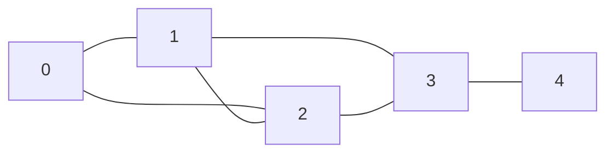

## Learning Objectives

- Represent graphs using adjacency lists and adjacency matrices
- Classify graphs: directed, undirected, weighted, unweighted, cyclic, acyclic
- Implement BFS and DFS on graphs with full complexity analysis
- Detect cycles in both directed and undirected graphs
- Apply graph traversals to connected components and grid problems

## Prerequisites

- Binary tree BFS/DFS traversals
- Queue and stack data structures
- Hash maps / dictionaries
- Recursion

## What Is a Graph?

A **graph** G = (V, E) consists of **vertices** (nodes) V and **edges** (connections) E. Unlike trees, graphs can have cycles, multiple paths between nodes, and no single root.



### Graph Types

| Type | Description | Example |
|------|-------------|---------|
| **Undirected** | Edges have no direction | Social network friendships |
| **Directed** (digraph) | Edges have direction | Web page links, dependencies |
| **Weighted** | Edges have associated costs | Road distances, network latency |
| **Unweighted** | All edges equal weight | Maze navigation |
| **Cyclic** | Contains at least one cycle | Most real-world graphs |
| **Acyclic** | No cycles (DAG if directed) | Task dependencies, git commits |

## Adjacency List

Each vertex stores a list of its neighbors. The most common representation — efficient for sparse graphs.

```python
from collections import defaultdict

class Graph:
    def __init__(self, directed=False):
        self.adj = defaultdict(list)
        self.directed = directed

    def add_edge(self, u, v, weight=None):
        if weight is not None:
            self.adj[u].append((v, weight))
            if not self.directed:
                self.adj[v].append((u, weight))
        else:
            self.adj[u].append(v)
            if not self.directed:
                self.adj[v].append(u)

    def neighbors(self, u):
        return self.adj[u]
```

```go
type Graph struct {
    adj      map[int][]int
    directed bool
}

func NewGraph(directed bool) *Graph {
    return &Graph{adj: make(map[int][]int), directed: directed}
}

func (g *Graph) AddEdge(u, v int) {
    g.adj[u] = append(g.adj[u], v)
    if !g.directed {
        g.adj[v] = append(g.adj[v], u)
    }
}
```

### Alternative: Edge List Input

Many problems give edges as a list of pairs. Converting to an adjacency list:

```python
def build_graph(n: int, edges: list[list[int]], directed=False) -> dict:
    graph = defaultdict(list)
    for u, v in edges:
        graph[u].append(v)
        if not directed:
            graph[v].append(u)
    return graph
```

## Adjacency Matrix

A 2D array where `matrix[i][j]` indicates whether an edge exists from vertex i to vertex j. Best for dense graphs or when you need O(1) edge lookup.

```python
class AdjMatrix:
    def __init__(self, n: int):
        self.n = n
        self.matrix = [[0] * n for _ in range(n)]

    def add_edge(self, u, v, weight=1):
        self.matrix[u][v] = weight
        self.matrix[v][u] = weight  # omit for directed

    def has_edge(self, u, v) -> bool:
        return self.matrix[u][v] != 0
```

### Adjacency List vs Matrix

| Operation | Adjacency List | Adjacency Matrix |
|-----------|---------------|-----------------|
| Space | O(V + E) | O(V²) |
| Add edge | O(1) | O(1) |
| Check edge (u,v) | O(degree(u)) | **O(1)** |
| All neighbors of u | O(degree(u)) | O(V) |
| Best for | Sparse graphs | Dense graphs |

Most interview problems use **adjacency lists** because real-world graphs are typically sparse.

## Breadth-First Search (BFS)

BFS explores vertices **level by level** — all vertices at distance d before any at distance d+1. It uses a queue and naturally finds shortest paths in unweighted graphs.

```python
from collections import deque

def bfs(graph: dict, start: int) -> list[int]:
    visited = {start}
    queue = deque([start])
    order = []

    while queue:
        node = queue.popleft()
        order.append(node)
        for neighbor in graph[node]:
            if neighbor not in visited:
                visited.add(neighbor)
                queue.append(neighbor)

    return order
```

```go
func bfs(graph map[int][]int, start int) []int {
    visited := map[int]bool{start: true}
    queue := []int{start}
    order := []int{}

    for len(queue) > 0 {
        node := queue[0]
        queue = queue[1:]
        order = append(order, node)
        for _, neighbor := range graph[node] {
            if !visited[neighbor] {
                visited[neighbor] = true
                queue = append(queue, neighbor)
            }
        }
    }
    return order
}
```

### BFS Shortest Path (Unweighted)

```python
def bfs_shortest_path(graph: dict, start: int, end: int) -> list[int]:
    if start == end:
        return [start]
    visited = {start}
    queue = deque([(start, [start])])

    while queue:
        node, path = queue.popleft()
        for neighbor in graph[node]:
            if neighbor == end:
                return path + [neighbor]
            if neighbor not in visited:
                visited.add(neighbor)
                queue.append((neighbor, path + [neighbor]))

    return []  # no path exists
```

**Time**: O(V + E). **Space**: O(V).

## Depth-First Search (DFS)

DFS explores **as deep as possible** before backtracking. It uses recursion (implicit stack) or an explicit stack.

```python
def dfs_recursive(graph: dict, start: int) -> list[int]:
    visited = set()
    order = []

    def dfs(node):
        visited.add(node)
        order.append(node)
        for neighbor in graph[node]:
            if neighbor not in visited:
                dfs(neighbor)

    dfs(start)
    return order

def dfs_iterative(graph: dict, start: int) -> list[int]:
    visited = set()
    stack = [start]
    order = []

    while stack:
        node = stack.pop()
        if node in visited:
            continue
        visited.add(node)
        order.append(node)
        for neighbor in graph[node]:
            if neighbor not in visited:
                stack.append(neighbor)

    return order
```

```go
func dfsRecursive(graph map[int][]int, start int) []int {
    visited := map[int]bool{}
    order := []int{}

    var dfs func(int)
    dfs = func(node int) {
        visited[node] = true
        order = append(order, node)
        for _, neighbor := range graph[node] {
            if !visited[neighbor] {
                dfs(neighbor)
            }
        }
    }
    dfs(start)
    return order
}
```

**Time**: O(V + E). **Space**: O(V).

### BFS vs DFS

| Aspect | BFS | DFS |
|--------|-----|-----|
| Data structure | Queue | Stack / recursion |
| Shortest path (unweighted) | ✅ Yes | ❌ No |
| Memory | O(w) — width | O(h) — height/depth |
| Complete exploration | Level by level | Branch by branch |
| Best for | Shortest path, level-order | Cycle detection, topological sort, connected components |

## Cycle Detection

### Undirected Graph

DFS with parent tracking. If we encounter a visited node that isn't our parent, we have a cycle.

```python
def has_cycle_undirected(graph: dict, n: int) -> bool:
    visited = set()

    def dfs(node, parent):
        visited.add(node)
        for neighbor in graph[node]:
            if neighbor not in visited:
                if dfs(neighbor, node):
                    return True
            elif neighbor != parent:
                return True
        return False

    for i in range(n):
        if i not in visited:
            if dfs(i, -1):
                return True
    return False
```

### Directed Graph

Use three states: unvisited, in-progress (on current DFS path), completed.

```python
def has_cycle_directed(graph: dict, n: int) -> bool:
    WHITE, GRAY, BLACK = 0, 1, 2
    color = [WHITE] * n

    def dfs(node):
        color[node] = GRAY
        for neighbor in graph[node]:
            if color[neighbor] == GRAY:
                return True  # back edge = cycle
            if color[neighbor] == WHITE and dfs(neighbor):
                return True
        color[node] = BLACK
        return False

    for i in range(n):
        if color[i] == WHITE:
            if dfs(i):
                return True
    return False
```

## Connected Components

### Undirected: Simple DFS/BFS

```python
def count_components(n: int, edges: list[list[int]]) -> int:
    graph = build_graph(n, edges)
    visited = set()
    components = 0

    for i in range(n):
        if i not in visited:
            components += 1
            # BFS to mark all nodes in this component
            queue = deque([i])
            visited.add(i)
            while queue:
                node = queue.popleft()
                for neighbor in graph[node]:
                    if neighbor not in visited:
                        visited.add(neighbor)
                        queue.append(neighbor)

    return components
```

### Grid as Graph (LeetCode 200: Number of Islands)

```python
def num_islands(grid: list[list[str]]) -> int:
    if not grid:
        return 0
    rows, cols = len(grid), len(grid[0])
    count = 0

    def dfs(r, c):
        if r < 0 or r >= rows or c < 0 or c >= cols or grid[r][c] != '1':
            return
        grid[r][c] = '0'  # mark visited
        dfs(r + 1, c)
        dfs(r - 1, c)
        dfs(r, c + 1)
        dfs(r, c - 1)

    for r in range(rows):
        for c in range(cols):
            if grid[r][c] == '1':
                count += 1
                dfs(r, c)
    return count
```

## Hands-On Exercises

### Exercise 1: Clone Graph (LeetCode 133)

```python
def clone_graph(node):
    if not node:
        return None
    cloned = {}

    def dfs(n):
        if n in cloned:
            return cloned[n]
        clone = Node(n.val)
        cloned[n] = clone
        for neighbor in n.neighbors:
            clone.neighbors.append(dfs(neighbor))
        return clone

    return dfs(node)
```

### Exercise 2: Course Schedule (LeetCode 207)

Determine if you can finish all courses given prerequisites (cycle detection in directed graph).

```python
def can_finish(num_courses: int, prerequisites: list[list[int]]) -> bool:
    graph = defaultdict(list)
    for course, prereq in prerequisites:
        graph[prereq].append(course)
    return not has_cycle_directed(graph, num_courses)
```

### Exercise 3: Word Ladder (LeetCode 127)

Find shortest transformation from begin_word to end_word, changing one letter at a time.

```python
def ladder_length(begin_word, end_word, word_list):
    word_set = set(word_list)
    if end_word not in word_set:
        return 0
    queue = deque([(begin_word, 1)])
    visited = {begin_word}

    while queue:
        word, length = queue.popleft()
        for i in range(len(word)):
            for c in 'abcdefghijklmnopqrstuvwxyz':
                next_word = word[:i] + c + word[i+1:]
                if next_word == end_word:
                    return length + 1
                if next_word in word_set and next_word not in visited:
                    visited.add(next_word)
                    queue.append((next_word, length + 1))
    return 0
```

## Key Takeaways

- **Adjacency lists** are the default for sparse graphs; **adjacency matrices** for dense or O(1) edge checks
- **BFS** finds shortest paths in unweighted graphs and explores level by level
- **DFS** is the workhorse for cycle detection, topological sort, and connected components
- Cycle detection differs for directed (three-color DFS) vs undirected (parent tracking)
- **Grids are graphs** — treat each cell as a node with 4 neighbors; DFS/BFS works identically

## External Resources

- [Visualgo: Graph Visualization](https://visualgo.net/en/dfsbfs)
- [LeetCode Graph Study Plan](https://leetcode.com/study-plan/graph/)
- [MIT OCW: Graph Algorithms](https://ocw.mit.edu/courses/6-006-introduction-to-algorithms-spring-2020/)
- [NeetCode: Graph Playlist](https://www.youtube.com/playlist?list=PLot-Xpze53ldBT_7QA8NVot219jFNr_GI)
