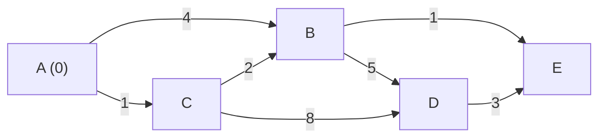

## Learning Objectives

- Implement Dijkstra's algorithm and understand why it fails with negative edges
- Apply Bellman-Ford to graphs with negative weights and detect negative cycles
- Use Floyd-Warshall for all-pairs shortest paths
- Understand A* search and its heuristic-guided optimization
- Choose the right algorithm based on graph properties

## Prerequisites

- Graph representations (adjacency list/matrix)
- BFS and DFS traversals
- Priority queue / min-heap operations
- Greedy algorithm concept

## Algorithm Selection Guide

| Algorithm | Graph Type | Negative Weights | Time | Space |
|-----------|-----------|-----------------|------|-------|
| **BFS** | Unweighted | N/A | O(V + E) | O(V) |
| **Dijkstra's** | Non-negative weights | ❌ Fails | O((V + E) log V) | O(V) |
| **Bellman-Ford** | Any weights | ✅ Yes | O(V × E) | O(V) |
| **Floyd-Warshall** | All-pairs | ✅ Yes | O(V³) | O(V²) |
| **A*** | Non-negative + heuristic | ❌ No | O(E log V)* | O(V) |

*A* performance depends on heuristic quality.

## Dijkstra's Algorithm

Dijkstra's finds the shortest path from a **single source** to all other vertices in a graph with **non-negative edge weights**. It uses a greedy approach: always process the unvisited vertex with the smallest known distance.

### How It Works

1. Initialize distances: source = 0, all others = ∞
2. Use a min-heap to always pick the closest unvisited vertex
3. For each neighbor, check if going through the current vertex gives a shorter path (relaxation)
4. Mark the vertex as visited



Processing order: A(0) → C(1) → B(3) → E(4) → D(7)

### Implementation

```python
import heapq

def dijkstra(graph: dict, start: int) -> dict:
    dist = {start: 0}
    heap = [(0, start)]  # (distance, node)

    while heap:
        d, u = heapq.heappop(heap)
        if d > dist.get(u, float('inf')):
            continue  # stale entry
        for v, weight in graph[u]:
            new_dist = d + weight
            if new_dist < dist.get(v, float('inf')):
                dist[v] = new_dist
                heapq.heappush(heap, (new_dist, v))

    return dist
```

```go
import "container/heap"

type Edge struct {
    To, Weight int
}

type Item struct {
    Node, Dist int
}

type MinHeap []Item

func (h MinHeap) Len() int            { return len(h) }
func (h MinHeap) Less(i, j int) bool  { return h[i].Dist < h[j].Dist }
func (h MinHeap) Swap(i, j int)       { h[i], h[j] = h[j], h[i] }
func (h *MinHeap) Push(x any)         { *h = append(*h, x.(Item)) }
func (h *MinHeap) Pop() any {
    old := *h
    n := len(old)
    x := old[n-1]
    *h = old[:n-1]
    return x
}

func dijkstra(graph map[int][]Edge, start int) map[int]int {
    dist := map[int]int{start: 0}
    h := &MinHeap{{start, 0}}
    heap.Init(h)

    for h.Len() > 0 {
        item := heap.Pop(h).(Item)
        if d, ok := dist[item.Node]; ok && item.Dist > d {
            continue
        }
        for _, e := range graph[item.Node] {
            newDist := item.Dist + e.Weight
            if d, ok := dist[e.To]; !ok || newDist < d {
                dist[e.To] = newDist
                heap.Push(h, Item{e.To, newDist})
            }
        }
    }
    return dist
}
```

### Reconstructing the Path

```python
def dijkstra_with_path(graph: dict, start: int, end: int):
    dist = {start: 0}
    prev = {start: None}
    heap = [(0, start)]

    while heap:
        d, u = heapq.heappop(heap)
        if u == end:
            break
        if d > dist.get(u, float('inf')):
            continue
        for v, weight in graph[u]:
            new_dist = d + weight
            if new_dist < dist.get(v, float('inf')):
                dist[v] = new_dist
                prev[v] = u
                heapq.heappush(heap, (new_dist, v))

    # Reconstruct path
    path = []
    node = end
    while node is not None:
        path.append(node)
        node = prev.get(node)
    return dist.get(end, float('inf')), path[::-1]
```

**Time**: O((V + E) log V) with a binary heap. **Space**: O(V + E).

### Why Dijkstra Fails with Negative Weights

Dijkstra assumes that once a vertex is processed, its shortest distance is finalized. A negative edge could later reduce a finalized distance, violating this assumption.

```
A --1--> B --(-5)--> C
A --3--> C

Dijkstra processes A(0), then B(1), then C(3).
But B→C gives distance 1 + (-5) = -4 < 3. Missed!
```

## Bellman-Ford Algorithm

Bellman-Ford works with **negative weights** and can detect **negative cycles**. It relaxes all edges V-1 times.

### Key Insight

The shortest path from source to any vertex uses at most V-1 edges (in a graph without negative cycles). After V-1 rounds of relaxing all edges, all shortest paths are found.

```python
def bellman_ford(n: int, edges: list, start: int):
    dist = [float('inf')] * n
    dist[start] = 0

    # Relax all edges V-1 times
    for _ in range(n - 1):
        for u, v, w in edges:
            if dist[u] != float('inf') and dist[u] + w < dist[v]:
                dist[v] = dist[u] + w

    # Check for negative cycles (Vth relaxation)
    for u, v, w in edges:
        if dist[u] != float('inf') and dist[u] + w < dist[v]:
            raise ValueError("Graph contains a negative cycle")

    return dist
```

```go
func bellmanFord(n int, edges [][]int, start int) ([]int, error) {
    const INF = 1<<31 - 1
    dist := make([]int, n)
    for i := range dist {
        dist[i] = INF
    }
    dist[start] = 0

    for i := 0; i < n-1; i++ {
        for _, e := range edges {
            u, v, w := e[0], e[1], e[2]
            if dist[u] != INF && dist[u]+w < dist[v] {
                dist[v] = dist[u] + w
            }
        }
    }

    for _, e := range edges {
        u, v, w := e[0], e[1], e[2]
        if dist[u] != INF && dist[u]+w < dist[v] {
            return nil, fmt.Errorf("negative cycle detected")
        }
    }
    return dist, nil
}
```

**Time**: O(V × E). **Space**: O(V).

### Optimization: Early Termination

If no distance is updated in a round, we can stop early — all shortest paths are found.

```python
def bellman_ford_optimized(n, edges, start):
    dist = [float('inf')] * n
    dist[start] = 0

    for i in range(n - 1):
        updated = False
        for u, v, w in edges:
            if dist[u] != float('inf') and dist[u] + w < dist[v]:
                dist[v] = dist[u] + w
                updated = True
        if not updated:
            break  # early termination

    return dist
```

## Floyd-Warshall: All-Pairs Shortest Paths

Floyd-Warshall finds shortest paths between **all pairs** of vertices. It works with negative weights (but not negative cycles).

```python
def floyd_warshall(n: int, edges: list) -> list:
    INF = float('inf')
    dist = [[INF] * n for _ in range(n)]

    for i in range(n):
        dist[i][i] = 0

    for u, v, w in edges:
        dist[u][v] = w

    # Core: try every vertex as an intermediate
    for k in range(n):
        for i in range(n):
            for j in range(n):
                if dist[i][k] + dist[k][j] < dist[i][j]:
                    dist[i][j] = dist[i][k] + dist[k][j]

    return dist
```

**Time**: O(V³). **Space**: O(V²). Best for dense graphs where you need all-pairs shortest paths.

### Detecting Negative Cycles

After Floyd-Warshall, check if any `dist[i][i] < 0`. If so, vertex i is on a negative cycle.

## A* Search Algorithm

A* is Dijkstra's with a **heuristic** that estimates the distance from each node to the goal. It prioritizes nodes that seem closer to the goal, often exploring far fewer nodes than Dijkstra.

**Priority**: `f(n) = g(n) + h(n)` where:
- `g(n)` = actual distance from start to n
- `h(n)` = estimated distance from n to goal (heuristic)

The heuristic must be **admissible** (never overestimate) for A* to find optimal paths.

```python
def a_star(graph, start, goal, heuristic):
    open_set = [(heuristic(start, goal), 0, start)]
    g_score = {start: 0}
    came_from = {}

    while open_set:
        f, g, current = heapq.heappop(open_set)
        if current == goal:
            path = []
            while current in came_from:
                path.append(current)
                current = came_from[current]
            path.append(start)
            return g, path[::-1]

        if g > g_score.get(current, float('inf')):
            continue

        for neighbor, weight in graph[current]:
            tentative_g = g + weight
            if tentative_g < g_score.get(neighbor, float('inf')):
                g_score[neighbor] = tentative_g
                came_from[neighbor] = current
                f_score = tentative_g + heuristic(neighbor, goal)
                heapq.heappush(open_set, (f_score, tentative_g, neighbor))

    return float('inf'), []

def manhattan_distance(a, b):
    return abs(a[0] - b[0]) + abs(a[1] - b[1])
```

### Real-World Applications

- **GPS navigation**: A* with geographic distance heuristic
- **Video games**: Pathfinding in grids and navmeshes
- **Robotics**: Motion planning with obstacle avoidance

## Hands-On Exercises

### Exercise 1: Network Delay Time (LeetCode 743)

```python
def network_delay_time(times, n, k):
    graph = defaultdict(list)
    for u, v, w in times:
        graph[u].append((v, w))

    dist = dijkstra(graph, k)

    if len(dist) < n:
        return -1
    return max(dist.values())
```

### Exercise 2: Cheapest Flights Within K Stops (LeetCode 787)

Modified Bellman-Ford limited to K+1 relaxation rounds.

```python
def find_cheapest_price(n, flights, src, dst, k):
    dist = [float('inf')] * n
    dist[src] = 0

    for _ in range(k + 1):
        prev = dist[:]
        for u, v, w in flights:
            if prev[u] != float('inf') and prev[u] + w < dist[v]:
                dist[v] = prev[u] + w

    return dist[dst] if dist[dst] != float('inf') else -1
```

### Exercise 3: Shortest Path in a Grid with Obstacles (LeetCode 1293)

BFS with state `(row, col, obstacles_remaining)`.

```python
def shortest_path(grid, k):
    rows, cols = len(grid), len(grid[0])
    if rows == 1 and cols == 1:
        return 0

    queue = deque([(0, 0, k, 0)])
    visited = {(0, 0, k)}

    while queue:
        r, c, remaining, steps = queue.popleft()
        for dr, dc in [(0,1),(0,-1),(1,0),(-1,0)]:
            nr, nc = r + dr, c + dc
            if 0 <= nr < rows and 0 <= nc < cols:
                new_k = remaining - grid[nr][nc]
                if new_k >= 0 and (nr, nc, new_k) not in visited:
                    if nr == rows - 1 and nc == cols - 1:
                        return steps + 1
                    visited.add((nr, nc, new_k))
                    queue.append((nr, nc, new_k, steps + 1))
    return -1
```

## Key Takeaways

- **BFS** is for unweighted shortest paths — simplest and fastest
- **Dijkstra's** is the go-to for non-negative weighted graphs — O((V+E) log V)
- **Bellman-Ford** handles negative weights and detects negative cycles at O(VE) cost
- **Floyd-Warshall** solves all-pairs in O(V³) — use for small dense graphs
- **A*** is Dijkstra with a heuristic — dramatically faster when a good heuristic exists
- Always check: Can edges be negative? Do I need all-pairs or single-source? Is the graph weighted?

## External Resources

- [Visualgo: Shortest Path](https://visualgo.net/en/sssp)
- [CP Algorithms: Dijkstra's](https://cp-algorithms.com/graph/dijkstra.html)
- [CP Algorithms: Bellman-Ford](https://cp-algorithms.com/graph/bellman_ford.html)
- [Red Blob Games: A* Pathfinding](https://www.redblobgames.com/pathfinding/a-star/introduction.html)
