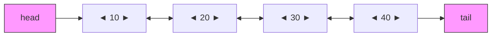
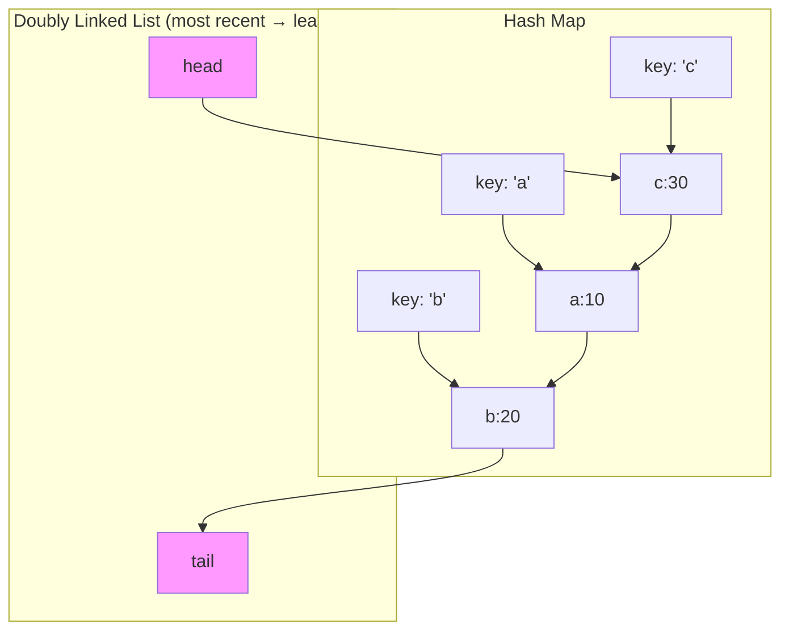

## Learning Objectives

- Understand the bidirectional pointer structure and its advantages over singly linked lists
- Implement a doubly linked list with O(1) insertion and deletion at both ends
- Build a fully functional LRU Cache using a doubly linked list + hash map
- Analyze when doubly linked lists are the right data structure choice
- Implement iterator patterns for bidirectional traversal

## Prerequisites

- Singly linked list operations (traversal, insertion, deletion, reversal)
- Hash maps / dictionaries
- Big-O complexity analysis

## Doubly Linked List Structure

Each node stores pointers to **both** the next and previous nodes, enabling bidirectional traversal at the cost of one extra pointer per node.



```python
class DLLNode:
    __slots__ = ('val', 'prev', 'next')

    def __init__(self, val=0, prev=None, next=None):
        self.val = val
        self.prev = prev
        self.next = next
```

```go
type DLLNode struct {
    Val  int
    Prev *DLLNode
    Next *DLLNode
}
```

### Singly vs Doubly Linked List

| Feature | Singly | Doubly |
|---------|--------|--------|
| Memory per node | value + 1 pointer | value + 2 pointers |
| Traverse forward | ✅ | ✅ |
| Traverse backward | ❌ | ✅ |
| Delete node (given reference) | O(n) — need prev | **O(1)** |
| Insert before node | O(n) — need prev | **O(1)** |
| Implementation complexity | Simpler | More pointer management |

The killer advantage: **if you have a reference to a node, you can delete it in O(1)** because you can access both neighbors directly.

## Full Implementation

```python
class DoublyLinkedList:
    def __init__(self):
        self.head = DLLNode(0)  # sentinel head
        self.tail = DLLNode(0)  # sentinel tail
        self.head.next = self.tail
        self.tail.prev = self.head
        self._size = 0

    def __len__(self):
        return self._size

    def _insert_between(self, val, predecessor, successor):
        """Insert a new node between two existing nodes. O(1)."""
        new_node = DLLNode(val, predecessor, successor)
        predecessor.next = new_node
        successor.prev = new_node
        self._size += 1
        return new_node

    def _remove_node(self, node):
        """Remove a node from the list. O(1). Returns the value."""
        predecessor = node.prev
        successor = node.next
        predecessor.next = successor
        successor.prev = predecessor
        self._size -= 1
        return node.val

    def push_front(self, val):
        """Insert at the front. O(1)."""
        return self._insert_between(val, self.head, self.head.next)

    def push_back(self, val):
        """Insert at the back. O(1)."""
        return self._insert_between(val, self.tail.prev, self.tail)

    def pop_front(self):
        """Remove and return front element. O(1)."""
        if self._size == 0:
            raise IndexError("pop from empty list")
        return self._remove_node(self.head.next)

    def pop_back(self):
        """Remove and return back element. O(1)."""
        if self._size == 0:
            raise IndexError("pop from empty list")
        return self._remove_node(self.tail.prev)

    def __iter__(self):
        """Forward iteration."""
        curr = self.head.next
        while curr != self.tail:
            yield curr.val
            curr = curr.next

    def __reversed__(self):
        """Backward iteration."""
        curr = self.tail.prev
        while curr != self.head:
            yield curr.val
            curr = curr.prev

    def __repr__(self):
        return " <-> ".join(str(v) for v in self)
```

```go
type DoublyLinkedList struct {
    head *DLLNode
    tail *DLLNode
    size int
}

func NewDoublyLinkedList() *DoublyLinkedList {
    head := &DLLNode{}
    tail := &DLLNode{}
    head.Next = tail
    tail.Prev = head
    return &DoublyLinkedList{head: head, tail: tail}
}

func (dll *DoublyLinkedList) PushFront(val int) *DLLNode {
    return dll.insertBetween(val, dll.head, dll.head.Next)
}

func (dll *DoublyLinkedList) PushBack(val int) *DLLNode {
    return dll.insertBetween(val, dll.tail.Prev, dll.tail)
}

func (dll *DoublyLinkedList) insertBetween(val int, pred, succ *DLLNode) *DLLNode {
    node := &DLLNode{Val: val, Prev: pred, Next: succ}
    pred.Next = node
    succ.Prev = node
    dll.size++
    return node
}

func (dll *DoublyLinkedList) Remove(node *DLLNode) int {
    node.Prev.Next = node.Next
    node.Next.Prev = node.Prev
    dll.size--
    return node.Val
}
```

> **Sentinel Pattern**: Using dummy head/tail nodes eliminates null checks at boundaries. Every real node always has valid `prev` and `next` pointers. This makes `_insert_between` and `_remove_node` clean and edge-case free.

## LRU Cache — The Classic Application

An **LRU (Least Recently Used) Cache** evicts the least recently accessed item when capacity is full. It requires:
- **O(1) get**: Hash map for key lookup
- **O(1) put**: Hash map insertion + move to front
- **O(1) eviction**: Remove from the tail of a doubly linked list



### Implementation

```python
class LRUNode:
    __slots__ = ('key', 'val', 'prev', 'next')

    def __init__(self, key=0, val=0):
        self.key = key
        self.val = val
        self.prev = None
        self.next = None


class LRUCache:
    def __init__(self, capacity: int):
        self.capacity = capacity
        self.cache = {}  # key -> LRUNode
        self.head = LRUNode()  # sentinel
        self.tail = LRUNode()  # sentinel
        self.head.next = self.tail
        self.tail.prev = self.head

    def _remove(self, node):
        """Detach node from its current position."""
        node.prev.next = node.next
        node.next.prev = node.prev

    def _add_to_front(self, node):
        """Insert node right after head sentinel (most recent position)."""
        node.prev = self.head
        node.next = self.head.next
        self.head.next.prev = node
        self.head.next = node

    def _move_to_front(self, node):
        """Mark node as most recently used."""
        self._remove(node)
        self._add_to_front(node)

    def get(self, key: int) -> int:
        if key not in self.cache:
            return -1
        node = self.cache[key]
        self._move_to_front(node)
        return node.val

    def put(self, key: int, value: int) -> None:
        if key in self.cache:
            node = self.cache[key]
            node.val = value
            self._move_to_front(node)
            return

        if len(self.cache) >= self.capacity:
            # Evict least recently used (node before tail sentinel)
            lru = self.tail.prev
            self._remove(lru)
            del self.cache[lru.key]

        new_node = LRUNode(key, value)
        self.cache[key] = new_node
        self._add_to_front(new_node)
```

### LRU Cache in Go

```go
type LRUCache struct {
    capacity int
    cache    map[int]*LRUNode
    head     *LRUNode
    tail     *LRUNode
}

type LRUNode struct {
    key, val   int
    prev, next *LRUNode
}

func NewLRUCache(capacity int) *LRUCache {
    head := &LRUNode{}
    tail := &LRUNode{}
    head.Next = tail
    tail.Prev = head
    return &LRUCache{
        capacity: capacity,
        cache:    make(map[int]*LRUNode),
        head:     head,
        tail:     tail,
    }
}

func (c *LRUCache) Get(key int) int {
    node, ok := c.cache[key]
    if !ok {
        return -1
    }
    c.moveToFront(node)
    return node.val
}

func (c *LRUCache) Put(key, value int) {
    if node, ok := c.cache[key]; ok {
        node.val = value
        c.moveToFront(node)
        return
    }
    if len(c.cache) >= c.capacity {
        lru := c.tail.Prev
        c.remove(lru)
        delete(c.cache, lru.key)
    }
    node := &LRUNode{key: key, val: value}
    c.cache[key] = node
    c.addToFront(node)
}

func (c *LRUCache) remove(node *LRUNode) {
    node.Prev.Next = node.Next
    node.Next.Prev = node.Prev
}

func (c *LRUCache) addToFront(node *LRUNode) {
    node.Prev = c.head
    node.Next = c.head.Next
    c.head.Next.Prev = node
    c.head.Next = node
}

func (c *LRUCache) moveToFront(node *LRUNode) {
    c.remove(node)
    c.addToFront(node)
}
```

### Complexity Analysis

| Operation | Time | Space |
|-----------|------|-------|
| `get(key)` | O(1) | — |
| `put(key, value)` | O(1) | — |
| Overall space | — | O(capacity) |

### Testing the LRU Cache

```python
cache = LRUCache(3)
cache.put(1, 10)
cache.put(2, 20)
cache.put(3, 30)
assert cache.get(1) == 10   # moves key 1 to front
cache.put(4, 40)             # evicts key 2 (least recently used)
assert cache.get(2) == -1    # key 2 was evicted
assert cache.get(3) == 30
assert cache.get(4) == 40
```

## Real-World Applications

1. **Browser history**: Back/forward navigation uses a doubly linked list of pages
2. **Text editors**: Undo/redo stacks with bidirectional traversal
3. **Music playlists**: Previous/next track navigation
4. **OS memory management**: Free block lists for memory allocation
5. **Python's `collections.OrderedDict`**: Built on a doubly linked list internally

## Hands-On Exercises

### Exercise 1: Flatten a Multilevel Doubly Linked List (LeetCode 430)

A doubly linked list where nodes can have a `child` pointer leading to another doubly linked list. Flatten all children into a single level.

```python
def flatten(head):
    if not head:
        return head
    curr = head
    while curr:
        if curr.child:
            child_head = curr.child
            # Find tail of child list
            child_tail = child_head
            while child_tail.next:
                child_tail = child_tail.next
            # Splice child list into main list
            child_tail.next = curr.next
            if curr.next:
                curr.next.prev = child_tail
            curr.next = child_head
            child_head.prev = curr
            curr.child = None
        curr = curr.next
    return head
```

**Time**: O(n) — each node visited at most twice. **Space**: O(1).

### Exercise 2: Design a Deque (Double-Ended Queue)

Implement a deque supporting `push_front`, `push_back`, `pop_front`, `pop_back` all in O(1).

```python
class Deque:
    def __init__(self):
        self._dll = DoublyLinkedList()

    def push_front(self, val):
        self._dll.push_front(val)

    def push_back(self, val):
        self._dll.push_back(val)

    def pop_front(self):
        return self._dll.pop_front()

    def pop_back(self):
        return self._dll.pop_back()

    def peek_front(self):
        if len(self._dll) == 0:
            raise IndexError("empty deque")
        return self._dll.head.next.val

    def peek_back(self):
        if len(self._dll) == 0:
            raise IndexError("empty deque")
        return self._dll.tail.prev.val

    def is_empty(self):
        return len(self._dll) == 0
```

### Exercise 3: Design a Browser History (LeetCode 1472)

```python
class BrowserHistory:
    def __init__(self, homepage: str):
        self.curr = DLLNode(homepage)

    def visit(self, url: str):
        new_page = DLLNode(url)
        self.curr.next = new_page
        new_page.prev = self.curr
        self.curr = new_page

    def back(self, steps: int) -> str:
        while steps > 0 and self.curr.prev:
            self.curr = self.curr.prev
            steps -= 1
        return self.curr.val

    def forward(self, steps: int) -> str:
        while steps > 0 and self.curr.next:
            self.curr = self.curr.next
            steps -= 1
        return self.curr.val
```

## Key Takeaways

- Doubly linked lists trade **one extra pointer per node** for **O(1) deletion given a node reference**
- The **sentinel head/tail pattern** eliminates all boundary null checks
- The **LRU Cache** (hash map + doubly linked list) is the canonical application — know it cold for interviews
- Python's `collections.OrderedDict` and Go's `container/list` are production DLL implementations
- Use doubly linked lists when you need **bidirectional traversal** or **O(1) arbitrary deletion**

## External Resources

- [LeetCode 146: LRU Cache](https://leetcode.com/problems/lru-cache/)
- [Go `container/list` Documentation](https://pkg.go.dev/container/list)
- [Python `collections.OrderedDict` Source](https://github.com/python/cpython/blob/main/Lib/collections/__init__.py)
- [Redis LRU Eviction Policy](https://redis.io/docs/manual/eviction/)
