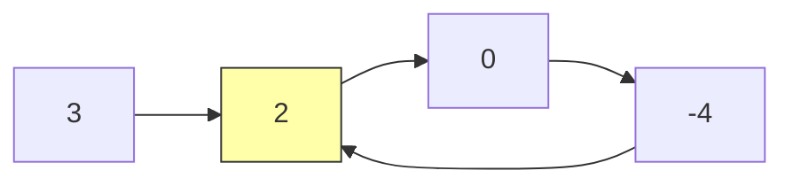
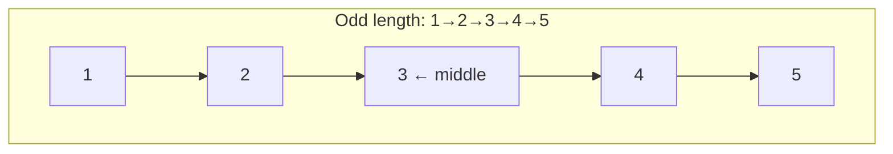

## Learning Objectives

- Master Floyd's cycle detection algorithm and prove its correctness
- Merge two sorted linked lists using the two-pointer merge technique
- Find the middle of a linked list in a single pass
- Reverse nodes in k-groups, a complex pointer manipulation problem
- Develop intuition for choosing the right linked list technique per problem

## Prerequisites

- Singly and doubly linked list implementations
- Two-pointer / runner technique basics
- Recursion fundamentals

## Pattern 1: Cycle Detection — Floyd's Tortoise and Hare

### The Problem

Given a linked list, determine if it contains a cycle. If it does, find the node where the cycle begins.



### Floyd's Algorithm

Use two pointers: **slow** moves one step at a time, **fast** moves two steps. If a cycle exists, they will meet inside the cycle. If fast reaches null, there is no cycle.

```python
def has_cycle(head):
    slow = fast = head
    while fast and fast.next:
        slow = slow.next
        fast = fast.next.next
        if slow is fast:
            return True
    return False
```

```go
func hasCycle(head *ListNode) bool {
    slow, fast := head, head
    for fast != nil && fast.Next != nil {
        slow = slow.Next
        fast = fast.Next.Next
        if slow == fast {
            return true
        }
    }
    return false
}
```

**Time**: O(n). **Space**: O(1).

### Why Does It Work?

Once both pointers are inside the cycle of length C, the fast pointer gains one step per iteration on the slow pointer. The gap closes by 1 each step, so they must meet within C iterations.

### Finding the Cycle Start

After slow and fast meet, reset one pointer to head. Move both one step at a time — they meet at the cycle start.

**Proof sketch**: Let L = distance from head to cycle start, and K = distance from cycle start to meeting point. When they meet, slow has traveled L + K steps, fast has traveled L + K + nC steps (for some integer n). Since fast travels 2× slow's distance: 2(L + K) = L + K + nC, so L = nC - K. This means walking L steps from the meeting point lands at the cycle start.

```python
def detect_cycle_start(head):
    slow = fast = head
    while fast and fast.next:
        slow = slow.next
        fast = fast.next.next
        if slow is fast:
            # Phase 2: find cycle start
            finder = head
            while finder is not slow:
                finder = finder.next
                slow = slow.next
            return slow  # cycle start node
    return None  # no cycle
```

## Pattern 2: Merge Two Sorted Lists

### The Problem (LeetCode 21)

Merge two sorted linked lists into one sorted linked list.

```
Input:  1 → 2 → 4  and  1 → 3 → 4
Output: 1 → 1 → 2 → 3 → 4 → 4
```

### Iterative Solution

```python
def merge_two_lists(l1, l2):
    dummy = ListNode(0)
    curr = dummy
    while l1 and l2:
        if l1.val <= l2.val:
            curr.next = l1
            l1 = l1.next
        else:
            curr.next = l2
            l2 = l2.next
        curr = curr.next
    curr.next = l1 or l2  # attach remaining nodes
    return dummy.next
```

```go
func mergeTwoLists(l1, l2 *ListNode) *ListNode {
    dummy := &ListNode{}
    curr := dummy
    for l1 != nil && l2 != nil {
        if l1.Val <= l2.Val {
            curr.Next = l1
            l1 = l1.Next
        } else {
            curr.Next = l2
            l2 = l2.Next
        }
        curr = curr.Next
    }
    if l1 != nil {
        curr.Next = l1
    } else {
        curr.Next = l2
    }
    return dummy.Next
}
```

**Time**: O(n + m). **Space**: O(1) — we reuse existing nodes.

### Recursive Solution

```python
def merge_two_lists_recursive(l1, l2):
    if not l1:
        return l2
    if not l2:
        return l1
    if l1.val <= l2.val:
        l1.next = merge_two_lists_recursive(l1.next, l2)
        return l1
    else:
        l2.next = merge_two_lists_recursive(l1, l2.next)
        return l2
```

**Time**: O(n + m). **Space**: O(n + m) call stack.

## Pattern 3: Find the Middle Node

### The Problem (LeetCode 876)

Return the middle node. For even-length lists, return the second middle.

### Slow/Fast Pointer Solution

```python
def find_middle(head):
    slow = fast = head
    while fast and fast.next:
        slow = slow.next
        fast = fast.next.next
    return slow
```

When fast reaches the end (or null), slow is at the middle. For a list of length n, slow makes n/2 steps.



**Time**: O(n). **Space**: O(1).

> **Why not count then traverse?** That requires two passes. The slow/fast technique does it in one pass — essential for streaming data or when you can't rewind.

## Pattern 4: Reverse Nodes in k-Group

### The Problem (LeetCode 25) — Hard

Given a linked list, reverse nodes in groups of k. If the remaining nodes are fewer than k, leave them as-is.

```
Input:  1 → 2 → 3 → 4 → 5, k = 3
Output: 3 → 2 → 1 → 4 → 5
```

### Approach

1. Check if at least k nodes remain
2. Reverse the next k nodes
3. Recursively process the rest
4. Connect the reversed group to the result of the recursive call

```python
def reverse_k_group(head, k):
    # Check if we have k nodes
    count = 0
    node = head
    while node and count < k:
        node = node.next
        count += 1
    if count < k:
        return head  # fewer than k nodes, don't reverse

    # Reverse k nodes
    prev = None
    curr = head
    for _ in range(k):
        next_node = curr.next
        curr.next = prev
        prev = curr
        curr = next_node

    # head is now the tail of the reversed group
    # curr is the head of the remaining list
    head.next = reverse_k_group(curr, k)
    return prev  # prev is the new head of this group
```

```go
func reverseKGroup(head *ListNode, k int) *ListNode {
    node := head
    count := 0
    for node != nil && count < k {
        node = node.Next
        count++
    }
    if count < k {
        return head
    }

    var prev *ListNode
    curr := head
    for i := 0; i < k; i++ {
        next := curr.Next
        curr.Next = prev
        prev = curr
        curr = next
    }
    head.Next = reverseKGroup(curr, k)
    return prev
}
```

### Iterative Version (Interview Gold)

```python
def reverse_k_group_iterative(head, k):
    dummy = ListNode(0, head)
    group_prev = dummy

    while True:
        # Check if k nodes exist
        kth = group_prev
        for _ in range(k):
            kth = kth.next
            if not kth:
                return dummy.next

        group_next = kth.next

        # Reverse the group
        prev, curr = kth.next, group_prev.next
        for _ in range(k):
            tmp = curr.next
            curr.next = prev
            prev = curr
            curr = tmp

        # Connect with surrounding groups
        tmp = group_prev.next  # this was the old head, now tail
        group_prev.next = kth  # kth is now the head of reversed group
        group_prev = tmp
```

**Time**: O(n). **Space**: O(1) for iterative, O(n/k) for recursive.

## Pattern 5: Intersection of Two Lists

### The Problem (LeetCode 160)

Find the node where two singly linked lists intersect, or return null.

```python
def get_intersection_node(headA, headB):
    if not headA or not headB:
        return None
    a, b = headA, headB
    while a is not b:
        a = a.next if a else headB
        b = b.next if b else headA
    return a  # either intersection node or None
```

**Why it works**: Pointer `a` traverses list A then list B. Pointer `b` traverses list B then list A. Both travel the same total distance (lenA + lenB), so they align at the intersection. If no intersection exists, both reach None simultaneously.

**Time**: O(n + m). **Space**: O(1).

## Pattern 6: Add Two Numbers (LeetCode 2)

Numbers stored as reversed linked lists. Add them digit by digit with carry.

```python
def add_two_numbers(l1, l2):
    dummy = ListNode(0)
    curr = dummy
    carry = 0
    while l1 or l2 or carry:
        val = carry
        if l1:
            val += l1.val
            l1 = l1.next
        if l2:
            val += l2.val
            l2 = l2.next
        carry, digit = divmod(val, 10)
        curr.next = ListNode(digit)
        curr = curr.next
    return dummy.next
```

**Time**: O(max(n, m)). **Space**: O(max(n, m)) for the result.

## Pattern Recognition Guide

| Problem Characteristic | Technique |
|----------------------|-----------|
| Detect cycle | Floyd's slow/fast |
| Find middle | Slow/fast pointers |
| Merge sorted lists | Two-pointer merge |
| Reverse in segments | Iterative reversal + group tracking |
| Find intersection | Two-pointer length equalization |
| Nth from end | Two pointers with n-gap |
| Palindrome check | Find middle + reverse half |

## Hands-On Exercises

### Exercise 1: Sort a Linked List (LeetCode 148)

Sort a linked list in O(n log n) time and O(1) space. Use merge sort with the slow/fast split.

```python
def sort_list(head):
    if not head or not head.next:
        return head

    # Split into halves
    slow, fast = head, head.next
    while fast and fast.next:
        slow = slow.next
        fast = fast.next.next
    mid = slow.next
    slow.next = None

    left = sort_list(head)
    right = sort_list(mid)
    return merge_two_lists(left, right)
```

**Time**: O(n log n). **Space**: O(log n) for recursion stack.

### Exercise 2: Copy List with Random Pointer (LeetCode 138)

Each node has a `next` pointer and a `random` pointer to any node. Deep copy the list.

```python
def copy_random_list(head):
    if not head:
        return None

    old_to_new = {}
    curr = head
    while curr:
        old_to_new[curr] = ListNode(curr.val)
        curr = curr.next

    curr = head
    while curr:
        clone = old_to_new[curr]
        clone.next = old_to_new.get(curr.next)
        clone.random = old_to_new.get(curr.random)
        curr = curr.next

    return old_to_new[head]
```

**Time**: O(n). **Space**: O(n) for the hash map.

## Key Takeaways

- **Floyd's algorithm** is the O(1)-space cycle detection technique — understand the math behind why the pointers meet
- The **slow/fast pointer** pattern powers cycle detection, middle finding, and list splitting
- **Merge two sorted lists** is a building block for merge sort on linked lists
- **Reverse k-group** tests pointer manipulation mastery — practice until the pointer dance is automatic
- Most linked list problems combine 2-3 fundamental patterns; identify which ones apply before coding

## External Resources

- [LeetCode Linked List Tag](https://leetcode.com/tag/linked-list/)
- [Floyd's Cycle Detection — Proof](https://en.wikipedia.org/wiki/Cycle_detection#Floyd's_tortoise_and_hare)
- [NeetCode Linked List Playlist](https://www.youtube.com/playlist?list=PLot-Xpze53leU0Ec0VkBhnf4npMRFiNcB)
- [Blind 75 Linked List Problems](https://neetcode.io/practice)
