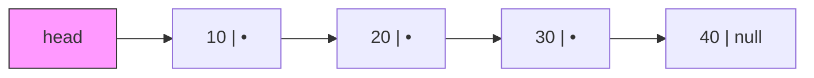
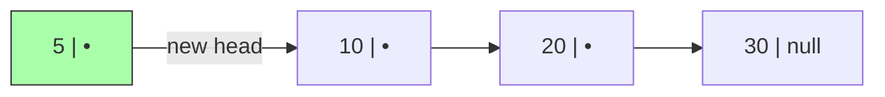
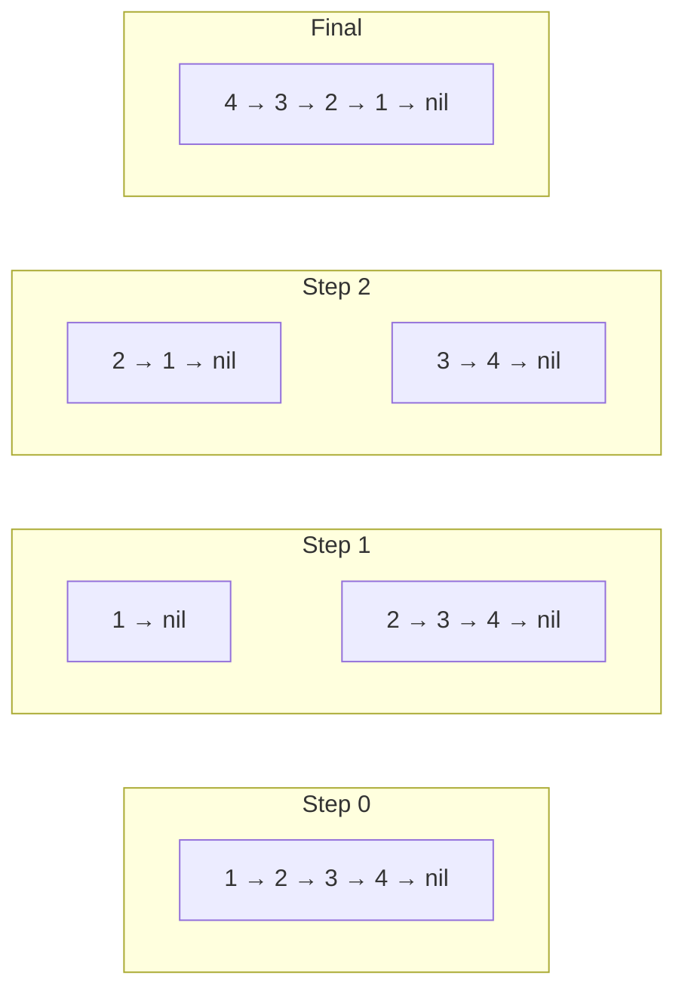

## Learning Objectives

- Understand the node-based memory model of linked lists vs contiguous arrays
- Implement a singly linked list with insertion, deletion, search, and reversal
- Analyze time and space complexity of each linked list operation
- Apply the runner (two-pointer) technique to linked list problems
- Recognize when linked lists outperform arrays and vice versa

## Prerequisites

- Basic programming in Python and Go (pointers/references, structs/classes)
- Understanding of Big-O notation
- Familiarity with arrays and their limitations

## Why Linked Lists?

Arrays store elements in **contiguous memory**, making index access O(1) but insertions/deletions at arbitrary positions O(n) due to shifting. Linked lists use **nodes scattered in memory**, each pointing to the next. This trades random access for O(1) insertions/deletions when you already have a reference to the position.

| Operation | Array | Singly Linked List |
|-----------|-------|--------------------|
| Access by index | O(1) | O(n) |
| Insert at head | O(n) | **O(1)** |
| Insert at tail | O(1) amortized | O(n) or **O(1)** with tail pointer |
| Delete at head | O(n) | **O(1)** |
| Delete by value | O(n) | O(n) |
| Search | O(n) | O(n) |
| Memory overhead | Low (contiguous) | Higher (pointer per node) |

## Node Structure

A linked list node holds a **value** and a **pointer** to the next node. The last node points to `null`/`None`.



```python
class ListNode:
    __slots__ = ('val', 'next')

    def __init__(self, val=0, next=None):
        self.val = val
        self.next = next
```

```go
type ListNode struct {
    Val  int
    Next *ListNode
}
```

Using `__slots__` in Python reduces memory overhead by preventing the creation of `__dict__` for each node — important when you have millions of nodes.

## Core Operations

### Building a List

```python
def build_list(values):
    """Build a linked list from a Python list. Returns head node."""
    dummy = ListNode(0)
    curr = dummy
    for v in values:
        curr.next = ListNode(v)
        curr = curr.next
    return dummy.next

head = build_list([10, 20, 30, 40])
```

```go
func buildList(values []int) *ListNode {
    dummy := &ListNode{}
    curr := dummy
    for _, v := range values {
        curr.Next = &ListNode{Val: v}
        curr = curr.Next
    }
    return dummy.Next
}
```

> **Sentinel/Dummy Node Pattern**: Creating a dummy head simplifies edge cases — you never need to special-case an empty list or insertion at the head. This pattern appears repeatedly in linked list problems.

### Traversal

```python
def print_list(head):
    curr = head
    while curr:
        print(curr.val, end=" -> ")
        curr = curr.next
    print("None")

def length(head):
    count = 0
    curr = head
    while curr:
        count += 1
        curr = curr.next
    return count
```

**Time**: O(n) — must visit every node. **Space**: O(1).

### Insertion

#### At the Head — O(1)

```python
def insert_at_head(head, val):
    new_node = ListNode(val)
    new_node.next = head
    return new_node  # new_node is the new head
```



#### At a Given Position — O(n)

```python
def insert_at_position(head, val, pos):
    """Insert val at 0-indexed position. Returns new head."""
    dummy = ListNode(0, head)
    prev = dummy
    for _ in range(pos):
        if prev.next is None:
            break
        prev = prev.next
    new_node = ListNode(val, prev.next)
    prev.next = new_node
    return dummy.next
```

### Deletion

#### Delete by Value — O(n)

```python
def delete_value(head, target):
    dummy = ListNode(0, head)
    prev = dummy
    curr = head
    while curr:
        if curr.val == target:
            prev.next = curr.next
            return dummy.next
        prev = curr
        curr = curr.next
    return dummy.next  # target not found
```

```go
func deleteValue(head *ListNode, target int) *ListNode {
    dummy := &ListNode{Next: head}
    prev := dummy
    curr := head
    for curr != nil {
        if curr.Val == target {
            prev.Next = curr.Next
            return dummy.Next
        }
        prev = curr
        curr = curr.Next
    }
    return dummy.Next
}
```

## Reversing a Linked List

This is one of the most frequently asked interview questions. You must be able to reverse a list both iteratively and recursively without hesitation.

### Iterative Reversal — O(n) time, O(1) space

The idea: maintain three pointers — `prev`, `curr`, `next_node`. At each step, redirect `curr.next` to point backward.

```python
def reverse_list(head):
    prev = None
    curr = head
    while curr:
        next_node = curr.next  # save next
        curr.next = prev       # reverse pointer
        prev = curr            # advance prev
        curr = next_node       # advance curr
    return prev  # prev is the new head
```

```go
func reverseList(head *ListNode) *ListNode {
    var prev *ListNode
    curr := head
    for curr != nil {
        next := curr.Next
        curr.Next = prev
        prev = curr
        curr = next
    }
    return prev
}
```

**Step-by-step visualization:**



### Recursive Reversal — O(n) time, O(n) space (call stack)

```python
def reverse_list_recursive(head):
    if not head or not head.next:
        return head
    new_head = reverse_list_recursive(head.next)
    head.next.next = head  # the node after head now points back to head
    head.next = None       # head becomes the tail
    return new_head
```

> **Interview Tip**: Always mention the O(n) stack space for the recursive approach. Interviewers want to see you understand the trade-off.

## Complexity Summary

| Operation | Time | Space |
|-----------|------|-------|
| Access by index | O(n) | O(1) |
| Insert at head | O(1) | O(1) |
| Insert at position k | O(k) | O(1) |
| Delete head | O(1) | O(1) |
| Delete by value | O(n) | O(1) |
| Reverse (iterative) | O(n) | O(1) |
| Reverse (recursive) | O(n) | O(n) |
| Search | O(n) | O(1) |

## Hands-On Exercises

### Exercise 1: Remove Nth Node from End (LeetCode 19)

Given a linked list, remove the nth node from the end and return the head.

**Approach**: Use two pointers separated by n nodes. When the fast pointer reaches the end, the slow pointer is at the node before the target.

```python
def remove_nth_from_end(head, n):
    dummy = ListNode(0, head)
    fast = slow = dummy
    # Advance fast by n+1 steps
    for _ in range(n + 1):
        fast = fast.next
    # Move both until fast reaches end
    while fast:
        fast = fast.next
        slow = slow.next
    # Skip the target node
    slow.next = slow.next.next
    return dummy.next
```

**Time**: O(L) where L is the length. **Space**: O(1).

### Exercise 2: Palindrome Linked List (LeetCode 234)

Determine if a singly linked list is a palindrome.

**Strategy**: Find the middle using slow/fast pointers, reverse the second half, compare both halves.

```python
def is_palindrome(head):
    # Find middle
    slow = fast = head
    while fast and fast.next:
        slow = slow.next
        fast = fast.next.next

    # Reverse second half
    prev = None
    while slow:
        tmp = slow.next
        slow.next = prev
        prev = slow
        slow = tmp

    # Compare halves
    left, right = head, prev
    while right:
        if left.val != right.val:
            return False
        left = left.next
        right = right.next
    return True
```

**Time**: O(n). **Space**: O(1) — we modified the list in-place.

### Exercise 3: Implement a Stack Using a Linked List

```python
class LinkedStack:
    def __init__(self):
        self._head = None
        self._size = 0

    def push(self, val):
        self._head = ListNode(val, self._head)
        self._size += 1

    def pop(self):
        if not self._head:
            raise IndexError("pop from empty stack")
        val = self._head.val
        self._head = self._head.next
        self._size -= 1
        return val

    def peek(self):
        if not self._head:
            raise IndexError("peek at empty stack")
        return self._head.val

    def __len__(self):
        return self._size
```

All operations are O(1) — this is why linked lists are natural for stack implementations.

## Common Pitfalls

1. **Losing the head reference**: Always save the head before traversing, or use a dummy node.
2. **Forgetting null checks**: Before accessing `node.next`, verify `node is not None`.
3. **Off-by-one in two-pointer**: When separating by n nodes, carefully count whether you need n or n+1 advances.
4. **Not handling single-node lists**: Many operations break on lists with 0 or 1 nodes — test these edge cases.

## Key Takeaways

- Linked lists excel at **frequent insertions/deletions** at known positions but sacrifice random access
- The **dummy node** pattern eliminates most head-pointer edge cases
- **Iterative reversal** is the gold standard — O(n) time, O(1) space
- The **two-pointer technique** (slow/fast) solves middle-finding, cycle detection, and nth-from-end problems
- In interviews, always discuss the **trade-offs vs arrays** — memory overhead, cache locality, and operation costs

## External Resources

- [Visualgo: Linked List Visualization](https://visualgo.net/en/list)
- [LeetCode Linked List Study Plan](https://leetcode.com/study-plan/linked-list/)
- [Stanford CS Library: Linked List Basics](http://cslibrary.stanford.edu/103/)
