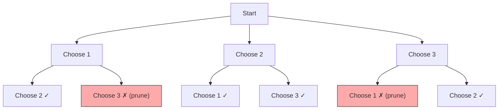

## Learning Objectives

- Understand backtracking as a systematic search with pruning
- Implement the N-Queens problem and analyze its constraint satisfaction structure
- Generate permutations, combinations, and subsets using backtracking templates
- Solve constraint satisfaction problems (Sudoku, word search)
- Apply pruning strategies to dramatically reduce the search space

## Prerequisites

- Recursion mastery (base cases, recursive cases, call stack)
- Array and matrix traversal
- Set and hash map operations

## What Is Backtracking?

**Backtracking** is a refined brute-force technique that builds candidates incrementally, abandoning a candidate ("backtracking") as soon as it determines the candidate cannot lead to a valid solution.



### The Backtracking Template

```python
def backtrack(state, choices):
    if is_solution(state):
        record_solution(state)
        return

    for choice in choices:
        if is_valid(state, choice):
            make_choice(state, choice)       # choose
            backtrack(state, next_choices)    # explore
            undo_choice(state, choice)        # un-choose (backtrack)
```

The **choose → explore → un-choose** pattern is the backbone of every backtracking solution.

## Pattern 1: Subsets (LeetCode 78)

Generate all subsets (power set) of a given array.

```
Input:  [1, 2, 3]
Output: [[], [1], [2], [3], [1,2], [1,3], [2,3], [1,2,3]]
```

### Decision Tree: Include or Exclude Each Element

```python
def subsets(nums):
    result = []

    def backtrack(start, current):
        result.append(current[:])  # record every state as a valid subset

        for i in range(start, len(nums)):
            current.append(nums[i])       # choose
            backtrack(i + 1, current)     # explore
            current.pop()                 # un-choose

    backtrack(0, [])
    return result
```

```go
func subsets(nums []int) [][]int {
    result := [][]int{}
    current := []int{}

    var backtrack func(int)
    backtrack = func(start int) {
        temp := make([]int, len(current))
        copy(temp, current)
        result = append(result, temp)

        for i := start; i < len(nums); i++ {
            current = append(current, nums[i])
            backtrack(i + 1)
            current = current[:len(current)-1]
        }
    }

    backtrack(0)
    return result
}
```

**Time**: O(n × 2ⁿ). There are 2ⁿ subsets, each taking O(n) to copy.

### Subsets II with Duplicates (LeetCode 90)

Sort first, then skip consecutive duplicates at the same recursion level.

```python
def subsets_with_dup(nums):
    nums.sort()
    result = []

    def backtrack(start, current):
        result.append(current[:])
        for i in range(start, len(nums)):
            if i > start and nums[i] == nums[i - 1]:
                continue  # skip duplicates at same level
            current.append(nums[i])
            backtrack(i + 1, current)
            current.pop()

    backtrack(0, [])
    return result
```

## Pattern 2: Permutations (LeetCode 46)

Generate all arrangements of n elements.

```python
def permutations(nums):
    result = []

    def backtrack(current, remaining):
        if not remaining:
            result.append(current[:])
            return
        for i in range(len(remaining)):
            current.append(remaining[i])
            backtrack(current, remaining[:i] + remaining[i+1:])
            current.pop()

    backtrack([], nums)
    return result
```

### Swap-Based Approach (In-Place)

```python
def permutations_swap(nums):
    result = []

    def backtrack(start):
        if start == len(nums):
            result.append(nums[:])
            return
        for i in range(start, len(nums)):
            nums[start], nums[i] = nums[i], nums[start]
            backtrack(start + 1)
            nums[start], nums[i] = nums[i], nums[start]

    backtrack(0)
    return result
```

**Time**: O(n × n!). There are n! permutations, each taking O(n) to copy.

### Permutations II with Duplicates (LeetCode 47)

```python
def permutations_unique(nums):
    nums.sort()
    result = []
    used = [False] * len(nums)

    def backtrack(current):
        if len(current) == len(nums):
            result.append(current[:])
            return
        for i in range(len(nums)):
            if used[i]:
                continue
            if i > 0 and nums[i] == nums[i - 1] and not used[i - 1]:
                continue  # skip duplicates
            used[i] = True
            current.append(nums[i])
            backtrack(current)
            current.pop()
            used[i] = False

    backtrack([])
    return result
```

## Pattern 3: Combinations (LeetCode 77)

Choose k elements from [1, n].

```python
def combinations(n, k):
    result = []

    def backtrack(start, current):
        if len(current) == k:
            result.append(current[:])
            return
        # Pruning: need k - len(current) more elements
        remaining_needed = k - len(current)
        for i in range(start, n - remaining_needed + 2):
            current.append(i)
            backtrack(i + 1, current)
            current.pop()

    backtrack(1, [])
    return result
```

The pruning condition `n - remaining_needed + 2` skips starting points that can't possibly yield enough elements — this significantly reduces the search space.

## Pattern 4: N-Queens (LeetCode 51)

Place n queens on an n×n chessboard such that no two queens attack each other.

```python
def solve_n_queens(n):
    result = []
    cols = set()
    pos_diag = set()   # row + col
    neg_diag = set()   # row - col

    def backtrack(row, queens):
        if row == n:
            board = []
            for r, c in queens:
                board.append("." * c + "Q" + "." * (n - c - 1))
            result.append(board)
            return

        for col in range(n):
            if col in cols or (row + col) in pos_diag or (row - col) in neg_diag:
                continue

            cols.add(col)
            pos_diag.add(row + col)
            neg_diag.add(row - col)
            queens.append((row, col))

            backtrack(row + 1, queens)

            queens.pop()
            cols.remove(col)
            pos_diag.remove(row + col)
            neg_diag.remove(row - col)

    backtrack(0, [])
    return result
```

```go
func solveNQueens(n int) [][]string {
    result := [][]string{}
    cols := map[int]bool{}
    posDiag := map[int]bool{}
    negDiag := map[int]bool{}
    queens := []int{}

    var backtrack func(int)
    backtrack = func(row int) {
        if row == n {
            board := make([]string, n)
            for r, c := range queens {
                row := make([]byte, n)
                for i := range row { row[i] = '.' }
                row[c] = 'Q'
                board[r] = string(row)
            }
            result = append(result, board)
            return
        }
        for col := 0; col < n; col++ {
            if cols[col] || posDiag[row+col] || negDiag[row-col] {
                continue
            }
            cols[col] = true
            posDiag[row+col] = true
            negDiag[row-col] = true
            queens = append(queens, col)
            backtrack(row + 1)
            queens = queens[:len(queens)-1]
            delete(cols, col)
            delete(posDiag, row+col)
            delete(negDiag, row-col)
        }
    }

    backtrack(0)
    return result
}
```

**Key insight**: Two queens share a diagonal if `|row1 - row2| == |col1 - col2|`. Using `row + col` and `row - col` as diagonal identifiers makes the check O(1).

## Pattern 5: Sudoku Solver (LeetCode 37)

```python
def solve_sudoku(board):
    def is_valid(row, col, num):
        for i in range(9):
            if board[row][i] == num:
                return False
            if board[i][col] == num:
                return False
        box_row, box_col = 3 * (row // 3), 3 * (col // 3)
        for i in range(box_row, box_row + 3):
            for j in range(box_col, box_col + 3):
                if board[i][j] == num:
                    return False
        return True

    def solve():
        for i in range(9):
            for j in range(9):
                if board[i][j] == '.':
                    for num in '123456789':
                        if is_valid(i, j, num):
                            board[i][j] = num
                            if solve():
                                return True
                            board[i][j] = '.'
                    return False  # no valid number → backtrack
        return True  # all cells filled

    solve()
```

**Optimization**: Use sets to track used numbers per row/col/box for O(1) validity checks instead of scanning.

## Pattern 6: Word Search (LeetCode 79)

Find if a word exists in a grid, moving up/down/left/right without revisiting cells.

```python
def exist(board, word):
    rows, cols = len(board), len(board[0])

    def backtrack(r, c, idx):
        if idx == len(word):
            return True
        if (r < 0 or r >= rows or c < 0 or c >= cols or
                board[r][c] != word[idx]):
            return False

        board[r][c] = '#'  # mark visited
        found = (backtrack(r + 1, c, idx + 1) or
                 backtrack(r - 1, c, idx + 1) or
                 backtrack(r, c + 1, idx + 1) or
                 backtrack(r, c - 1, idx + 1))
        board[r][c] = word[idx]  # un-mark

        return found

    for r in range(rows):
        for c in range(cols):
            if backtrack(r, c, 0):
                return True
    return False
```

## Pruning Strategies

| Strategy | Description | Example |
|----------|-------------|---------|
| Constraint propagation | Reduce choices based on constraints | Sudoku: track used digits per row/col/box |
| Sorting | Process in order to enable early pruning | Combination sum: sort to skip all larger values |
| Bound checking | Skip if remaining can't beat current best | Branch and bound, A* |
| Symmetry breaking | Avoid equivalent configurations | N-Queens: only try first half of first row |
| Early termination | Stop when first solution found | Sudoku, word search |

## Hands-On Exercises

### Exercise 1: Combination Sum (LeetCode 39)

```python
def combination_sum(candidates, target):
    candidates.sort()
    result = []

    def backtrack(start, current, remaining):
        if remaining == 0:
            result.append(current[:])
            return
        for i in range(start, len(candidates)):
            if candidates[i] > remaining:
                break  # pruning — sorted array
            current.append(candidates[i])
            backtrack(i, current, remaining - candidates[i])
            current.pop()

    backtrack(0, [], target)
    return result
```

### Exercise 2: Letter Combinations of Phone Number (LeetCode 17)

```python
def letter_combinations(digits):
    if not digits:
        return []
    phone = {'2': 'abc', '3': 'def', '4': 'ghi', '5': 'jkl',
             '6': 'mno', '7': 'pqrs', '8': 'tuv', '9': 'wxyz'}
    result = []

    def backtrack(idx, current):
        if idx == len(digits):
            result.append("".join(current))
            return
        for ch in phone[digits[idx]]:
            current.append(ch)
            backtrack(idx + 1, current)
            current.pop()

    backtrack(0, [])
    return result
```

### Exercise 3: Palindrome Partitioning (LeetCode 131)

```python
def partition(s):
    result = []

    def backtrack(start, current):
        if start == len(s):
            result.append(current[:])
            return
        for end in range(start + 1, len(s) + 1):
            substring = s[start:end]
            if substring == substring[::-1]:
                current.append(substring)
                backtrack(end, current)
                current.pop()

    backtrack(0, [])
    return result
```

## Key Takeaways

- Backtracking = **recursion + pruning** — systematically explore all candidates while cutting dead ends early
- The **choose → explore → un-choose** template applies to every backtracking problem
- **Subsets, permutations, combinations** are the three fundamental backtracking patterns — master them and adapt
- **Pruning** is what separates efficient backtracking from blind brute force — always look for constraints to exploit
- Handle **duplicates** by sorting the input and skipping consecutive equal elements at the same recursion level

## External Resources

- [LeetCode Backtracking Study Plan](https://leetcode.com/tag/backtracking/)
- [NeetCode: Backtracking Playlist](https://www.youtube.com/playlist?list=PLot-Xpze53lf5C3HSjCnyFghlW0G1HHXo)
- [Backtracking — Wikipedia](https://en.wikipedia.org/wiki/Backtracking)
- [Stanford CS106B: Recursive Backtracking](https://web.stanford.edu/class/archive/cs/cs106b/cs106b.1176/)
