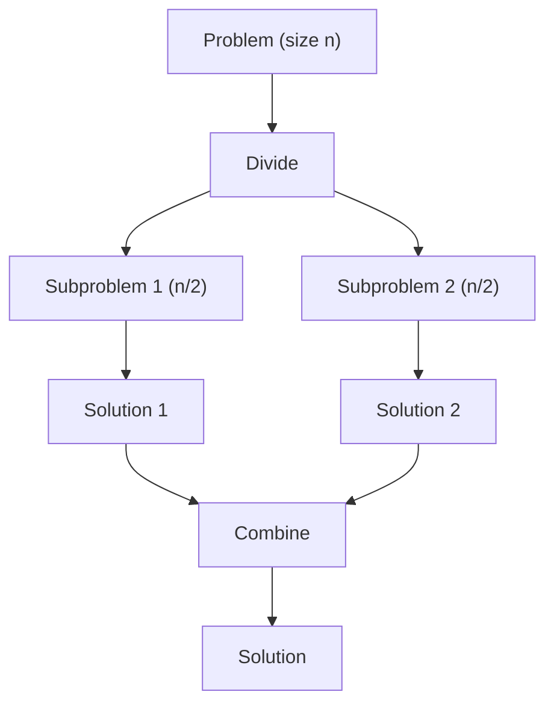

## Learning Objectives

- Understand the divide-and-conquer paradigm: divide, conquer, combine
- Analyze recurrences using the Master Theorem
- Apply divide and conquer to geometric problems (closest pair of points)
- Solve the maximum subarray problem using D&C and compare with Kadane's
- Understand Karatsuba multiplication and its asymptotic improvement

## Prerequisites

- Recursion mastery (call stack, base cases, recursive decomposition)
- Merge sort (the canonical D&C algorithm)
- Big-O notation and recurrence relations
- Basic math: multiplication, geometric distance

## The Divide-and-Conquer Paradigm

Divide and conquer solves problems in three steps:

1. **Divide**: Break the problem into smaller subproblems of the same type
2. **Conquer**: Solve each subproblem recursively (or directly if small enough)
3. **Combine**: Merge subproblem solutions into the overall solution



### Classic D&C Algorithms

| Algorithm | Divide | Conquer | Combine | Time |
|-----------|--------|---------|---------|------|
| Merge Sort | Split array in half | Sort each half | Merge sorted halves | O(n log n) |
| Quick Sort | Partition around pivot | Sort each partition | Concatenate | O(n log n) avg |
| Binary Search | Check middle | Search one half | Return result | O(log n) |
| Strassen's | Split matrices | 7 subproblems | Add sub-results | O(n^2.81) |
| Karatsuba | Split digits | 3 multiplications | Add with shifts | O(n^1.585) |

## The Master Theorem

For recurrences of the form **T(n) = aT(n/b) + O(nᵈ)**:

- **a** = number of subproblems
- **b** = factor by which input shrinks
- **d** = exponent of work done outside recursion

| Condition | Result | Example |
|-----------|--------|---------|
| d > log_b(a) | T(n) = O(nᵈ) | Binary search: T(n) = T(n/2) + O(1) → O(log n) |
| d = log_b(a) | T(n) = O(nᵈ log n) | Merge sort: T(n) = 2T(n/2) + O(n) → O(n log n) |
| d < log_b(a) | T(n) = O(n^(log_b a)) | Karatsuba: T(n) = 3T(n/2) + O(n) → O(n^1.585) |

### Merge Sort Recurrence Analysis

```
T(n) = 2T(n/2) + O(n)
a = 2, b = 2, d = 1
log_b(a) = log_2(2) = 1 = d
→ T(n) = O(n log n)     ← Case 2
```

## Merge Sort: D&C in Action

```python
def merge_sort(arr):
    if len(arr) <= 1:
        return arr

    # DIVIDE
    mid = len(arr) // 2
    left = arr[:mid]
    right = arr[mid:]

    # CONQUER
    left = merge_sort(left)
    right = merge_sort(right)

    # COMBINE
    return merge(left, right)

def merge(left, right):
    result = []
    i = j = 0
    while i < len(left) and j < len(right):
        if left[i] <= right[j]:
            result.append(left[i])
            i += 1
        else:
            result.append(right[j])
            j += 1
    result.extend(left[i:])
    result.extend(right[j:])
    return result
```

### Counting Inversions (Merge Sort Variant)

An **inversion** is a pair (i, j) where i < j but arr[i] > arr[j]. Count inversions in O(n log n) by counting cross-inversions during the merge step.

```python
def count_inversions(arr):
    if len(arr) <= 1:
        return arr, 0

    mid = len(arr) // 2
    left, left_inv = count_inversions(arr[:mid])
    right, right_inv = count_inversions(arr[mid:])

    merged = []
    inversions = left_inv + right_inv
    i = j = 0

    while i < len(left) and j < len(right):
        if left[i] <= right[j]:
            merged.append(left[i])
            i += 1
        else:
            merged.append(right[j])
            inversions += len(left) - i  # all remaining left elements form inversions
            j += 1

    merged.extend(left[i:])
    merged.extend(right[j:])
    return merged, inversions
```

**Time**: O(n log n). This is optimal for comparison-based inversion counting.

## Maximum Subarray: D&C Approach (LeetCode 53)

Find the contiguous subarray with the maximum sum.

### D&C Solution

The maximum subarray either lies entirely in the left half, entirely in the right half, or crosses the midpoint.

```python
def max_subarray_dc(nums):
    def helper(left, right):
        if left == right:
            return nums[left]

        mid = (left + right) // 2

        # Max subarray crossing the midpoint
        left_sum = float('-inf')
        curr = 0
        for i in range(mid, left - 1, -1):
            curr += nums[i]
            left_sum = max(left_sum, curr)

        right_sum = float('-inf')
        curr = 0
        for i in range(mid + 1, right + 1):
            curr += nums[i]
            right_sum = max(right_sum, curr)

        cross_sum = left_sum + right_sum

        return max(helper(left, mid),
                   helper(mid + 1, right),
                   cross_sum)

    return helper(0, len(nums) - 1)
```

**Time**: T(n) = 2T(n/2) + O(n) = O(n log n).

Compare with **Kadane's algorithm** at O(n) — D&C is slower here but demonstrates the paradigm. Kadane's uses DP thinking: `dp[i] = max(nums[i], dp[i-1] + nums[i])`.

```python
def max_subarray_kadane(nums):
    max_sum = curr_sum = nums[0]
    for num in nums[1:]:
        curr_sum = max(num, curr_sum + num)
        max_sum = max(max_sum, curr_sum)
    return max_sum
```

## Closest Pair of Points

Given n points in 2D, find the pair with minimum Euclidean distance.

**Brute force**: O(n²). **D&C**: O(n log n).

```python
import math

def closest_pair(points):
    points.sort()  # sort by x-coordinate

    def distance(p1, p2):
        return math.sqrt((p1[0] - p2[0])**2 + (p1[1] - p2[1])**2)

    def closest(pts):
        n = len(pts)
        if n <= 3:
            # Brute force for small inputs
            min_dist = float('inf')
            for i in range(n):
                for j in range(i + 1, n):
                    min_dist = min(min_dist, distance(pts[i], pts[j]))
            return min_dist

        mid = n // 2
        mid_x = pts[mid][0]

        # DIVIDE & CONQUER
        dl = closest(pts[:mid])
        dr = closest(pts[mid:])
        d = min(dl, dr)

        # COMBINE: check strip around the dividing line
        strip = [p for p in pts if abs(p[0] - mid_x) < d]
        strip.sort(key=lambda p: p[1])  # sort strip by y

        # Check at most 7 subsequent points (proven geometric bound)
        for i in range(len(strip)):
            j = i + 1
            while j < len(strip) and strip[j][1] - strip[i][1] < d:
                d = min(d, distance(strip[i], strip[j]))
                j += 1

        return d

    return closest(points)
```

**Time**: T(n) = 2T(n/2) + O(n log n) = O(n log² n). With pre-sorting optimization: O(n log n).

### Why Only 7 Points in the Strip?

The strip has width 2d. Any square of side d within the strip contains at most one point (otherwise a pair closer than d would exist). The 2d × d rectangle around each point can fit at most 8 squares, so at most 7 other points need checking.

## Karatsuba Multiplication

Standard multiplication of two n-digit numbers is O(n²). Karatsuba reduces this to **O(n^1.585)** using a clever algebraic trick.

For x = x₁ · 10^(n/2) + x₀ and y = y₁ · 10^(n/2) + y₀:

Standard: `xy = x₁y₁ · 10ⁿ + (x₁y₀ + x₀y₁) · 10^(n/2) + x₀y₀` (4 multiplications)

Karatsuba trick: Compute `z₂ = x₁y₁`, `z₀ = x₀y₀`, `z₁ = (x₁+x₀)(y₁+y₀) - z₂ - z₀` (**3 multiplications**)

```python
def karatsuba(x, y):
    if x < 10 or y < 10:
        return x * y

    n = max(len(str(x)), len(str(y)))
    half = n // 2
    power = 10 ** half

    x1, x0 = divmod(x, power)
    y1, y0 = divmod(y, power)

    z2 = karatsuba(x1, y1)
    z0 = karatsuba(x0, y0)
    z1 = karatsuba(x1 + x0, y1 + y0) - z2 - z0

    return z2 * (power ** 2) + z1 * power + z0
```

```go
func karatsuba(x, y int64) int64 {
    if x < 10 || y < 10 {
        return x * y
    }

    n := len(fmt.Sprintf("%d", max64(x, y)))
    half := int64(n / 2)
    power := int64(math.Pow(10, float64(half)))

    x1, x0 := x/power, x%power
    y1, y0 := y/power, y%power

    z2 := karatsuba(x1, y1)
    z0 := karatsuba(x0, y0)
    z1 := karatsuba(x1+x0, y1+y0) - z2 - z0

    return z2*power*power + z1*power + z0
}
```

**Recurrence**: T(n) = 3T(n/2) + O(n). By Master Theorem: a=3, b=2, d=1, log₂(3) ≈ 1.585 > 1, so T(n) = O(n^1.585).

This is the basis for all sub-quadratic multiplication algorithms. Modern variants (Toom-Cook, FFT-based) achieve even better asymptotic complexity.

## Quick Select: Finding the Kth Element

A D&C approach that finds the kth smallest element in O(n) average time without fully sorting.

```python
import random

def quickselect(arr, k):
    """Find k-th smallest element (0-indexed)."""
    if len(arr) == 1:
        return arr[0]

    pivot = random.choice(arr)
    lows = [x for x in arr if x < pivot]
    highs = [x for x in arr if x > pivot]
    pivots = [x for x in arr if x == pivot]

    if k < len(lows):
        return quickselect(lows, k)
    elif k < len(lows) + len(pivots):
        return pivot
    else:
        return quickselect(highs, k - len(lows) - len(pivots))
```

**Average**: O(n). **Worst**: O(n²). Randomized pivot makes worst case extremely unlikely.

## D&C vs DP vs Greedy

| Aspect | Divide & Conquer | Dynamic Programming | Greedy |
|--------|-----------------|--------------------|---------| 
| Subproblem overlap | No | Yes | No |
| Optimal substructure | Yes | Yes | Yes |
| Approach | Recursive split | Table-filling | Local best choice |
| Examples | Merge sort, closest pair | Knapsack, LCS | Dijkstra, Huffman |

D&C and DP both decompose problems into subproblems. The key difference: DP caches shared subproblems, D&C subproblems are independent.

## Hands-On Exercises

### Exercise 1: Sort an Array (LeetCode 912)

Implement merge sort in-place using D&C.

### Exercise 2: Count of Smaller Numbers After Self (LeetCode 315)

Use a modified merge sort to count, during the merge step, how many elements from the right half have been placed before each element from the left half.

```python
def count_smaller(nums):
    counts = [0] * len(nums)
    indexed = list(enumerate(nums))  # (original_index, value)

    def merge_sort(arr):
        if len(arr) <= 1:
            return arr
        mid = len(arr) // 2
        left = merge_sort(arr[:mid])
        right = merge_sort(arr[mid:])
        return merge_count(left, right)

    def merge_count(left, right):
        result = []
        i = j = 0
        while i < len(left) and j < len(right):
            if left[i][1] <= right[j][1]:
                counts[left[i][0]] += j  # j elements from right are smaller
                result.append(left[i])
                i += 1
            else:
                result.append(right[j])
                j += 1
        while i < len(left):
            counts[left[i][0]] += j
            result.append(left[i])
            i += 1
        result.extend(right[j:])
        return result

    merge_sort(indexed)
    return counts
```

### Exercise 3: Different Ways to Add Parentheses (LeetCode 241)

```python
def diff_ways_to_compute(expression):
    if expression.isdigit():
        return [int(expression)]

    results = []
    for i, ch in enumerate(expression):
        if ch in '+-*':
            left = diff_ways_to_compute(expression[:i])
            right = diff_ways_to_compute(expression[i + 1:])
            for l in left:
                for r in right:
                    if ch == '+':
                        results.append(l + r)
                    elif ch == '-':
                        results.append(l - r)
                    else:
                        results.append(l * r)
    return results
```

## Key Takeaways

- D&C works by **dividing** into independent subproblems, **conquering** each recursively, and **combining** results
- The **Master Theorem** gives the time complexity from the recurrence relation — memorize the three cases
- **Merge sort** is the canonical D&C; **counting inversions** shows how to add computation to the merge step
- **Closest pair of points** demonstrates D&C on geometric problems — the strip analysis is the clever part
- **Karatsuba** reduces multiplication from O(n²) to O(n^1.585) by trading one multiplication for additions — a fundamental idea in algorithm design
- D&C is distinct from DP: **D&C subproblems don't overlap**; DP caches overlapping subproblems

## External Resources

- [MIT OCW: Divide and Conquer](https://ocw.mit.edu/courses/6-006-introduction-to-algorithms-spring-2020/)
- [Karatsuba Algorithm — Wikipedia](https://en.wikipedia.org/wiki/Karatsuba_algorithm)
- [Master Theorem — Wikipedia](https://en.wikipedia.org/wiki/Master_theorem_(analysis_of_algorithms))
- [Jeff Erickson: Algorithms (Free Textbook)](https://jeffe.cs.illinois.edu/teaching/algorithms/)
