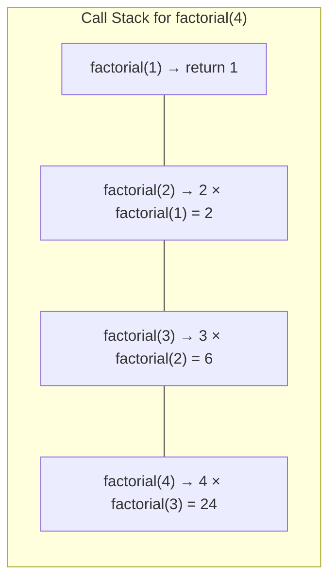

## Learning Objectives

- Visualize the call stack and understand how recursive calls execute and return
- Design correct base cases and recursive cases for any problem
- Convert between recursive and iterative solutions
- Understand tail recursion and its optimization
- Apply recursive thinking to trees, linked lists, and mathematical problems

## Prerequisites

- Stack fundamentals (LIFO, call stack concept)
- Basic Python and Go syntax
- Understanding of function calls and return values

## What Is Recursion?

**Recursion** is a technique where a function calls itself to solve a problem by breaking it into smaller instances of the same problem. Every recursive function has two parts:

1. **Base case**: A condition that stops recursion and returns a known value
2. **Recursive case**: The function calls itself with a smaller/simpler input

```python
def countdown(n):
    if n <= 0:        # base case
        print("Go!")
        return
    print(n)
    countdown(n - 1)  # recursive case

countdown(3)  # prints: 3, 2, 1, Go!
```

## Visualizing the Call Stack

Every function call creates a **stack frame** containing local variables, parameters, and the return address. Recursive calls stack on top of each other.



```python
def factorial(n):
    print(f"  {'  ' * (4-n)}Calling factorial({n})")
    if n <= 1:
        print(f"  {'  ' * (4-n)}Returning 1")
        return 1
    result = n * factorial(n - 1)
    print(f"  {'  ' * (4-n)}Returning {result}")
    return result

# Output for factorial(4):
# Calling factorial(4)
#   Calling factorial(3)
#     Calling factorial(2)
#       Calling factorial(1)
#       Returning 1
#     Returning 2
#   Returning 6
# Returning 24
```

### Stack Overflow

When recursion goes too deep, the call stack overflows. In Python, the default limit is ~1000 frames.

```python
def infinite_recursion(n):
    return infinite_recursion(n + 1)
# RecursionError: maximum recursion depth exceeded

import sys
sys.getrecursionlimit()    # 1000
sys.setrecursionlimit(5000)  # increase if needed (but fix the algorithm instead)
```

In Go, the stack grows dynamically (goroutines start with ~8KB and grow as needed), so stack overflow is much less common but still possible with extremely deep recursion.

## The Three Laws of Recursion

1. **A recursive function must have a base case**
2. **A recursive function must change state and move toward the base case**
3. **A recursive function must call itself recursively**

Violating any law leads to infinite recursion, incorrect results, or both.

## Recursive Thinking: The Leap of Faith

When designing a recursive solution:

1. **Define what the function does**, not how
2. **Assume the recursive call works correctly** for smaller inputs (the "leap of faith")
3. **Use the result of the recursive call** to solve the current level
4. **Define the base case** — the simplest input where the answer is obvious

### Example: Sum of a List

```python
def sum_list(nums):
    # Base case: empty list sums to 0
    if not nums:
        return 0
    # Recursive case: first element + sum of the rest
    return nums[0] + sum_list(nums[1:])
```

### Example: Power Function

```python
def power(base, exp):
    if exp == 0:
        return 1
    if exp % 2 == 0:
        half = power(base, exp // 2)
        return half * half
    return base * power(base, exp - 1)
```

**Time**: O(log n) — we halve the exponent each time. This is **fast exponentiation**.

```go
func power(base, exp int) int {
    if exp == 0 {
        return 1
    }
    if exp%2 == 0 {
        half := power(base, exp/2)
        return half * half
    }
    return base * power(base, exp-1)
}
```

## Tail Recursion

A recursive call is **tail recursive** if it's the very last operation in the function — nothing is done after the call returns. Tail-recursive functions can be optimized by the compiler into loops (tail call optimization), eliminating the O(n) stack space.

### Not Tail Recursive

```python
def factorial(n):
    if n <= 1:
        return 1
    return n * factorial(n - 1)  # multiplication happens AFTER the call
```

### Tail Recursive Version

```python
def factorial_tail(n, accumulator=1):
    if n <= 1:
        return accumulator
    return factorial_tail(n - 1, n * accumulator)  # nothing after the call
```

> **Note**: Python does NOT optimize tail calls (by design — Guido van Rossum chose stack traces over TCO). Go also doesn't guarantee TCO. However, understanding tail recursion helps you convert to iterative solutions.

### Converting Tail Recursion to Iteration

```python
def factorial_iterative(n):
    acc = 1
    while n > 1:
        acc *= n
        n -= 1
    return acc
```

## Common Recursive Patterns

### Pattern 1: Linear Recursion

Process one element at a time, recurse on the rest.

```python
def reverse_string(s):
    if len(s) <= 1:
        return s
    return reverse_string(s[1:]) + s[0]
```

### Pattern 2: Binary Recursion (Two Branches)

Make two recursive calls — common in tree problems and divide-and-conquer.

```python
def fibonacci(n):
    if n <= 1:
        return n
    return fibonacci(n - 1) + fibonacci(n - 2)  # two branches → O(2^n)
```

### Pattern 3: Accumulator Pattern

Pass the partial result as a parameter to avoid building up stack frames.

```python
def sum_digits(n, acc=0):
    if n == 0:
        return acc
    return sum_digits(n // 10, acc + n % 10)
```

### Pattern 4: Generate All Possibilities

Recursion with choices at each step — leads to backtracking.

```python
def generate_binary_strings(n, current=""):
    if len(current) == n:
        print(current)
        return
    generate_binary_strings(n, current + "0")
    generate_binary_strings(n, current + "1")

generate_binary_strings(3)
# 000, 001, 010, 011, 100, 101, 110, 111
```

## Recursion with Data Structures

### Linked List Recursion

```python
def reverse_list(head):
    if not head or not head.next:
        return head
    new_head = reverse_list(head.next)
    head.next.next = head
    head.next = None
    return new_head
```

### Tree Recursion

```python
def is_same_tree(p, q):
    if not p and not q:
        return True
    if not p or not q:
        return False
    return (p.val == q.val and
            is_same_tree(p.left, q.left) and
            is_same_tree(p.right, q.right))
```

### Recursive Directory Traversal

```python
import os

def find_files(directory, extension):
    results = []
    for item in os.listdir(directory):
        path = os.path.join(directory, item)
        if os.path.isfile(path) and path.endswith(extension):
            results.append(path)
        elif os.path.isdir(path):
            results.extend(find_files(path, extension))
    return results
```

## Recursion vs Iteration

| Aspect | Recursion | Iteration |
|--------|-----------|-----------|
| Readability | Often clearer for tree/graph problems | Clearer for linear problems |
| Space | O(depth) stack frames | O(1) typically |
| Performance | Function call overhead | Lower overhead |
| Stack overflow | Risk with deep recursion | No risk |
| State management | Implicit (call stack) | Explicit (variables/stack) |

**Rule of thumb**: Use recursion when the problem has a natural recursive structure (trees, graphs, divide-and-conquer). Convert to iteration when performance or stack depth is a concern.

## Hands-On Exercises

### Exercise 1: Tower of Hanoi

```python
def hanoi(n, source, target, auxiliary):
    if n == 1:
        print(f"Move disk 1 from {source} to {target}")
        return
    hanoi(n - 1, source, auxiliary, target)
    print(f"Move disk {n} from {source} to {target}")
    hanoi(n - 1, auxiliary, target, source)

hanoi(3, 'A', 'C', 'B')
```

**Total moves**: 2ⁿ - 1. This is provably optimal.

### Exercise 2: Flatten Nested List

```python
def flatten(nested):
    result = []
    for item in nested:
        if isinstance(item, list):
            result.extend(flatten(item))
        else:
            result.append(item)
    return result

flatten([1, [2, [3, 4], 5], 6])  # [1, 2, 3, 4, 5, 6]
```

### Exercise 3: Generate All Parentheses (LeetCode 22)

```python
def generate_parenthesis(n):
    result = []

    def backtrack(current, open_count, close_count):
        if len(current) == 2 * n:
            result.append(current)
            return
        if open_count < n:
            backtrack(current + "(", open_count + 1, close_count)
        if close_count < open_count:
            backtrack(current + ")", open_count, close_count + 1)

    backtrack("", 0, 0)
    return result
```

## Key Takeaways

- Every recursive function needs a **base case** that stops recursion and a **recursive case** that makes progress toward it
- The **call stack** stores each function's state — understanding it is essential for debugging and optimization
- **Tail recursion** eliminates stack growth in theory, but Python and Go don't optimize it — convert to iteration manually
- Use the **leap of faith**: assume the recursive call works for smaller inputs, then solve the current level using that result
- Recursion is most natural for **trees, graphs, and divide-and-conquer** — use iteration for simple linear problems

## External Resources

- [Visualize Recursion — Python Tutor](https://pythontutor.com/)
- [MIT OCW: Recursion](https://ocw.mit.edu/courses/6-001-structure-and-interpretation-of-computer-programs-spring-2005/)
- [Thinking Recursively in Python — Real Python](https://realpython.com/python-thinking-recursively/)
- [The Little Schemer (Book)](https://mitpress.mit.edu/9780262560993/)
