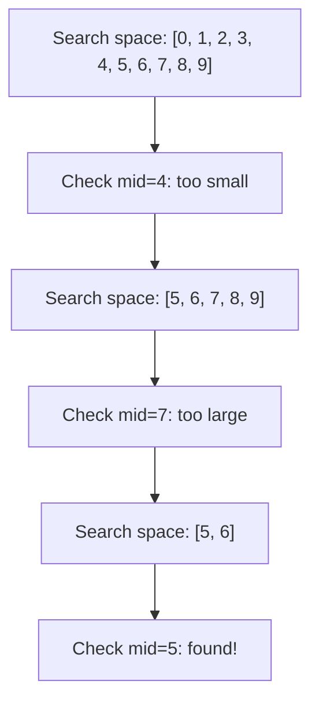

## Learning Objectives

- Implement binary search correctly with no off-by-one errors
- Apply binary search to rotated arrays, duplicates, and non-obvious search spaces
- Use `bisect` (Python) and `sort.Search` (Go) for production binary search
- Recognize "binary search on answer" problems and formulate the predicate
- Master the template: when to use `left < right` vs `left <= right`

## Prerequisites

- Sorted array concepts
- Understanding of O(log n) vs O(n)
- Function monotonicity (if f(x) is true, f(x+1) is true)

## The Core Idea

Binary search eliminates half the search space at each step, achieving **O(log n)** from O(n). It requires a **monotonic predicate**: once the condition becomes true (or false), it stays that way.



## Template 1: Classic Binary Search

Find the index of `target` in a sorted array, or return -1.

```python
def binary_search(nums: list[int], target: int) -> int:
    left, right = 0, len(nums) - 1

    while left <= right:
        mid = left + (right - left) // 2  # prevents overflow
        if nums[mid] == target:
            return mid
        elif nums[mid] < target:
            left = mid + 1
        else:
            right = mid - 1

    return -1
```

```go
func binarySearch(nums []int, target int) int {
    left, right := 0, len(nums)-1
    for left <= right {
        mid := left + (right-left)/2
        if nums[mid] == target {
            return mid
        } else if nums[mid] < target {
            left = mid + 1
        } else {
            right = mid - 1
        }
    }
    return -1
}
```

> **Overflow prevention**: Use `left + (right - left) // 2` instead of `(left + right) // 2`. In languages with fixed-size integers, `left + right` can overflow.

## Template 2: Find Leftmost (Lower Bound)

Find the first position where `nums[i] >= target`. This is `bisect_left` in Python.

```python
def lower_bound(nums: list[int], target: int) -> int:
    left, right = 0, len(nums)

    while left < right:
        mid = left + (right - left) // 2
        if nums[mid] < target:
            left = mid + 1
        else:
            right = mid

    return left
```

## Template 3: Find Rightmost (Upper Bound)

Find the first position where `nums[i] > target`. This is `bisect_right` in Python.

```python
def upper_bound(nums: list[int], target: int) -> int:
    left, right = 0, len(nums)

    while left < right:
        mid = left + (right - left) // 2
        if nums[mid] <= target:
            left = mid + 1
        else:
            right = mid

    return left
```

### Using Python's `bisect` Module

```python
import bisect

nums = [1, 3, 3, 3, 5, 7]
bisect.bisect_left(nums, 3)   # 1 — first index of 3
bisect.bisect_right(nums, 3)  # 4 — first index after all 3s
bisect.bisect_left(nums, 4)   # 4 — insertion point for 4

# Count occurrences of target
def count_occurrences(nums, target):
    return bisect.bisect_right(nums, target) - bisect.bisect_left(nums, target)
```

### Using Go's `sort.Search`

```go
import "sort"

// sort.Search returns the smallest index i where f(i) is true
idx := sort.SearchInts(nums, target) // equivalent to bisect_left
// or with custom predicate:
idx := sort.Search(len(nums), func(i int) bool {
    return nums[i] >= target
})
```

## Template Comparison

| Template | Loop Condition | When `right` Updates | Returns |
|----------|---------------|---------------------|---------|
| Exact match | `left <= right` | `right = mid - 1` | Exact index or -1 |
| Lower bound | `left < right` | `right = mid` | First `>= target` |
| Upper bound | `left < right` | `right = mid` | First `> target` |

## Pattern: Search in Rotated Sorted Array (LeetCode 33)

A sorted array rotated at some pivot: `[4, 5, 6, 7, 0, 1, 2]`. Find a target in O(log n).

**Key insight**: At least one half of the array around `mid` is sorted. Determine which half and check if the target is in that range.

```python
def search_rotated(nums: list[int], target: int) -> int:
    left, right = 0, len(nums) - 1

    while left <= right:
        mid = left + (right - left) // 2
        if nums[mid] == target:
            return mid

        # Left half is sorted
        if nums[left] <= nums[mid]:
            if nums[left] <= target < nums[mid]:
                right = mid - 1
            else:
                left = mid + 1
        # Right half is sorted
        else:
            if nums[mid] < target <= nums[right]:
                left = mid + 1
            else:
                right = mid - 1

    return -1
```

### With Duplicates (LeetCode 81)

When duplicates exist, we can't determine which half is sorted when `nums[left] == nums[mid]`. Solution: shrink from the left.

```python
def search_rotated_dups(nums, target):
    left, right = 0, len(nums) - 1
    while left <= right:
        mid = left + (right - left) // 2
        if nums[mid] == target:
            return True
        if nums[left] == nums[mid]:
            left += 1  # can't determine sorted half
        elif nums[left] <= nums[mid]:
            if nums[left] <= target < nums[mid]:
                right = mid - 1
            else:
                left = mid + 1
        else:
            if nums[mid] < target <= nums[right]:
                left = mid + 1
            else:
                right = mid - 1
    return False
```

Worst case degrades to O(n) with many duplicates.

## Pattern: Binary Search on Answer

Instead of searching in an array, binary search over the **answer space**. If the answer satisfies a monotonic condition, we can binary search for the optimal one.

**Template**:
1. Define the search range for the answer [lo, hi]
2. Define a predicate `can_achieve(x)` that checks if answer `x` is feasible
3. Binary search for the boundary

### Example: Koko Eating Bananas (LeetCode 875)

Koko has `piles` of bananas. She eats at speed `k` bananas/hour. Find the minimum `k` to eat all bananas in `h` hours.

```python
import math

def min_eating_speed(piles: list[int], h: int) -> int:
    def can_finish(k):
        return sum(math.ceil(p / k) for p in piles) <= h

    left, right = 1, max(piles)
    while left < right:
        mid = left + (right - left) // 2
        if can_finish(mid):
            right = mid
        else:
            left = mid + 1
    return left
```

**Time**: O(n log M) where n = len(piles), M = max(piles).

### Example: Split Array Largest Sum (LeetCode 410)

Split an array into `m` subarrays minimizing the largest sum.

```python
def split_array(nums: list[int], m: int) -> int:
    def can_split(max_sum):
        count = 1
        curr_sum = 0
        for num in nums:
            if curr_sum + num > max_sum:
                count += 1
                curr_sum = num
            else:
                curr_sum += num
        return count <= m

    left, right = max(nums), sum(nums)
    while left < right:
        mid = left + (right - left) // 2
        if can_split(mid):
            right = mid
        else:
            left = mid + 1
    return left
```

## Pattern: Find Peak Element (LeetCode 162)

A peak is an element greater than its neighbors. Find any peak in O(log n).

```python
def find_peak_element(nums: list[int]) -> int:
    left, right = 0, len(nums) - 1
    while left < right:
        mid = left + (right - left) // 2
        if nums[mid] > nums[mid + 1]:
            right = mid  # peak is on the left side (or at mid)
        else:
            left = mid + 1  # peak is on the right side
    return left
```

## Hands-On Exercises

### Exercise 1: First and Last Position (LeetCode 34)

```python
def search_range(nums, target):
    left = bisect.bisect_left(nums, target)
    right = bisect.bisect_right(nums, target) - 1
    if left <= right and left < len(nums) and nums[left] == target:
        return [left, right]
    return [-1, -1]
```

### Exercise 2: Median of Two Sorted Arrays (LeetCode 4)

```python
def find_median_sorted_arrays(nums1, nums2):
    if len(nums1) > len(nums2):
        nums1, nums2 = nums2, nums1
    m, n = len(nums1), len(nums2)
    half = (m + n + 1) // 2

    left, right = 0, m
    while left <= right:
        i = (left + right) // 2
        j = half - i

        left1 = nums1[i - 1] if i > 0 else float('-inf')
        right1 = nums1[i] if i < m else float('inf')
        left2 = nums2[j - 1] if j > 0 else float('-inf')
        right2 = nums2[j] if j < n else float('inf')

        if left1 <= right2 and left2 <= right1:
            if (m + n) % 2 == 1:
                return max(left1, left2)
            return (max(left1, left2) + min(right1, right2)) / 2
        elif left1 > right2:
            right = i - 1
        else:
            left = i + 1
```

**Time**: O(log(min(m, n))). This is one of the most elegant binary search applications.

### Exercise 3: Search a 2D Matrix (LeetCode 74)

Treat the 2D matrix as a flat sorted array.

```python
def search_matrix(matrix, target):
    rows, cols = len(matrix), len(matrix[0])
    left, right = 0, rows * cols - 1

    while left <= right:
        mid = (left + right) // 2
        val = matrix[mid // cols][mid % cols]
        if val == target:
            return True
        elif val < target:
            left = mid + 1
        else:
            right = mid - 1
    return False
```

## Key Takeaways

- Binary search requires a **monotonic predicate** — not just sorted arrays
- Use `left + (right - left) // 2` to prevent integer overflow
- **Lower bound** (`bisect_left`) finds the first `>= target`; **upper bound** (`bisect_right`) finds the first `> target`
- **Binary search on answer** is incredibly powerful: frame the problem as "can I achieve X?" and binary search over X
- For rotated arrays, determine which half is sorted and check if target falls in that range
- Off-by-one errors are the #1 bug — practice until the templates are automatic

## External Resources

- [LeetCode Binary Search Study Plan](https://leetcode.com/study-plan/binary-search/)
- [Python `bisect` Documentation](https://docs.python.org/3/library/bisect.html)
- [Go `sort.Search` Documentation](https://pkg.go.dev/sort#Search)
- [Topcoder: Binary Search Tutorial](https://www.topcoder.com/thrive/articles/Binary%20Search)
