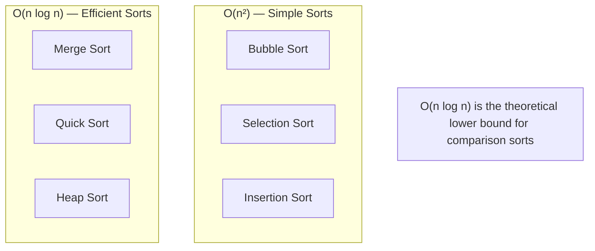
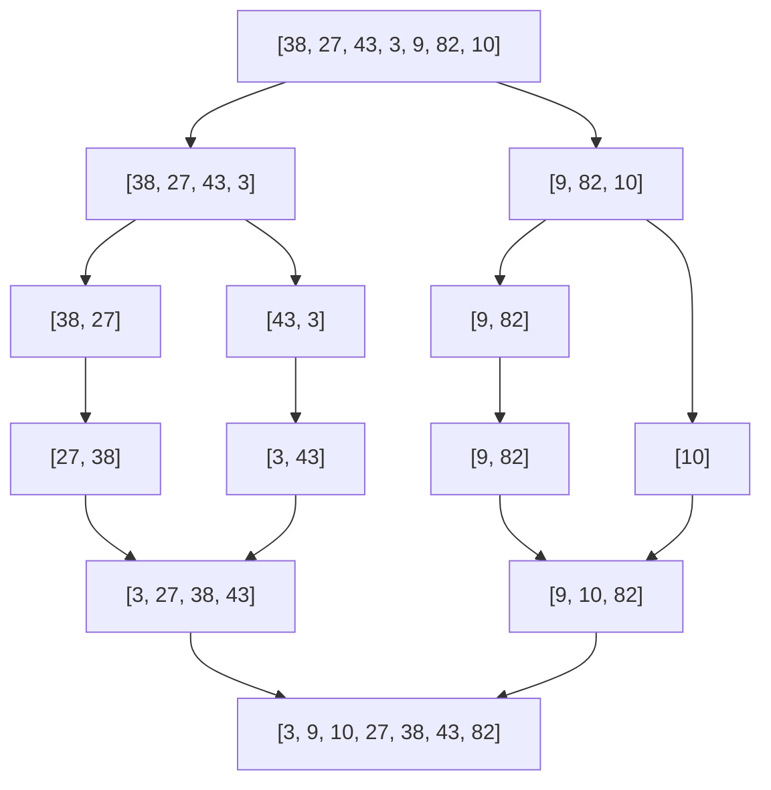

## Learning Objectives

- Implement bubble, selection, insertion, merge, and quick sort from scratch
- Analyze best/average/worst time and space complexity for each algorithm
- Understand the O(n log n) lower bound for comparison-based sorting
- Choose the right sorting algorithm based on data characteristics
- Visualize the divide-and-conquer strategy in merge sort and quicksort

## Prerequisites

- Array operations and indexing
- Recursion and divide-and-conquer concept
- Big-O notation for nested loops

## The Comparison-Based Sorting Landscape



| Algorithm | Best | Average | Worst | Space | Stable? |
|-----------|------|---------|-------|-------|---------|
| Bubble Sort | O(n) | O(n²) | O(n²) | O(1) | ✅ |
| Selection Sort | O(n²) | O(n²) | O(n²) | O(1) | ❌ |
| Insertion Sort | **O(n)** | O(n²) | O(n²) | O(1) | ✅ |
| Merge Sort | O(n log n) | O(n log n) | O(n log n) | O(n) | ✅ |
| Quick Sort | O(n log n) | O(n log n) | O(n²) | O(log n) | ❌ |
| Heap Sort | O(n log n) | O(n log n) | O(n log n) | O(1) | ❌ |

**Stable** = equal elements maintain their original relative order.

## Bubble Sort

Repeatedly swap adjacent elements that are out of order. After each pass, the largest unsorted element "bubbles" to its correct position.

```python
def bubble_sort(arr):
    n = len(arr)
    for i in range(n):
        swapped = False
        for j in range(n - 1 - i):
            if arr[j] > arr[j + 1]:
                arr[j], arr[j + 1] = arr[j + 1], arr[j]
                swapped = True
        if not swapped:
            break  # already sorted
    return arr
```

The `swapped` flag enables **O(n) best case** on already-sorted input. Without it, every pass runs fully.

**When to use**: Almost never in practice. Educational value only.

## Selection Sort

Find the minimum element in the unsorted portion and swap it to the front.

```python
def selection_sort(arr):
    n = len(arr)
    for i in range(n):
        min_idx = i
        for j in range(i + 1, n):
            if arr[j] < arr[min_idx]:
                min_idx = j
        arr[i], arr[min_idx] = arr[min_idx], arr[i]
    return arr
```

Always O(n²) regardless of input — no early termination possible. Makes the fewest swaps (O(n)), which matters if writes are expensive.

## Insertion Sort

Build the sorted portion one element at a time. Take the next unsorted element and insert it into its correct position in the sorted portion by shifting larger elements right.

```python
def insertion_sort(arr):
    for i in range(1, len(arr)):
        key = arr[i]
        j = i - 1
        while j >= 0 and arr[j] > key:
            arr[j + 1] = arr[j]
            j -= 1
        arr[j + 1] = key
    return arr
```

```go
func insertionSort(arr []int) []int {
    for i := 1; i < len(arr); i++ {
        key := arr[i]
        j := i - 1
        for j >= 0 && arr[j] > key {
            arr[j+1] = arr[j]
            j--
        }
        arr[j+1] = key
    }
    return arr
}
```

**Best case O(n)** on nearly sorted data. In practice, insertion sort is fast for small arrays (n < 20-50) due to low overhead — this is why production sort algorithms (Timsort, introsort) use it as a subroutine.

## Merge Sort

Divide the array in half, recursively sort each half, then merge the two sorted halves.



```python
def merge_sort(arr):
    if len(arr) <= 1:
        return arr
    mid = len(arr) // 2
    left = merge_sort(arr[:mid])
    right = merge_sort(arr[mid:])
    return merge(left, right)

def merge(left, right):
    result = []
    i = j = 0
    while i < len(left) and j < len(right):
        if left[i] <= right[j]:
            result.append(left[i])
            i += 1
        else:
            result.append(right[j])
            j += 1
    result.extend(left[i:])
    result.extend(right[j:])
    return result
```

```go
func mergeSort(arr []int) []int {
    if len(arr) <= 1 {
        return arr
    }
    mid := len(arr) / 2
    left := mergeSort(append([]int{}, arr[:mid]...))
    right := mergeSort(append([]int{}, arr[mid:]...))
    return mergeArrays(left, right)
}

func mergeArrays(left, right []int) []int {
    result := make([]int, 0, len(left)+len(right))
    i, j := 0, 0
    for i < len(left) && j < len(right) {
        if left[i] <= right[j] {
            result = append(result, left[i])
            i++
        } else {
            result = append(result, right[j])
            j++
        }
    }
    result = append(result, left[i:]...)
    result = append(result, right[j:]...)
    return result
}
```

**Time**: Always O(n log n) — n work per level × log n levels. **Space**: O(n) for the merged arrays.

### Why Merge Sort Is Guaranteed O(n log n)

Each level of recursion processes all n elements exactly once (the merge step). The recursion tree has log₂ n levels. Total: n × log n.

## Quick Sort

Choose a **pivot**, partition the array so elements < pivot are on the left and elements > pivot are on the right, then recursively sort both sides.

```python
def quicksort(arr, low=0, high=None):
    if high is None:
        high = len(arr) - 1
    if low < high:
        pivot_idx = partition(arr, low, high)
        quicksort(arr, low, pivot_idx - 1)
        quicksort(arr, pivot_idx + 1, high)
    return arr

def partition(arr, low, high):
    pivot = arr[high]
    i = low - 1
    for j in range(low, high):
        if arr[j] <= pivot:
            i += 1
            arr[i], arr[j] = arr[j], arr[i]
    arr[i + 1], arr[high] = arr[high], arr[i + 1]
    return i + 1
```

### Randomized Pivot

The worst case O(n²) occurs when the pivot is always the smallest or largest element (e.g., sorted input with last-element pivot). Randomizing prevents this.

```python
import random

def partition_random(arr, low, high):
    rand_idx = random.randint(low, high)
    arr[rand_idx], arr[high] = arr[high], arr[rand_idx]
    return partition(arr, low, high)
```

### Quicksort vs Merge Sort

| Aspect | Quicksort | Merge Sort |
|--------|-----------|------------|
| Average time | O(n log n) | O(n log n) |
| Worst time | O(n²) | O(n log n) |
| Space | O(log n) stack | O(n) |
| In-place? | Yes | No |
| Cache friendly | Yes (sequential access) | Less so |
| Stable? | No | Yes |

In practice, quicksort is often faster than merge sort due to better cache locality and lower constant factors.

## Sorting Stability

**Stability** preserves the relative order of equal elements. This matters when sorting by multiple keys.

```
Students sorted by name, then stable-sorted by grade:
  ("Alice", B), ("Bob", A), ("Charlie", B), ("Dave", A)
  
Stable sort by grade: ("Bob", A), ("Dave", A), ("Alice", B), ("Charlie", B)
  → A's and B's maintain alphabetical order within their groups

Unstable sort by grade: ("Dave", A), ("Bob", A), ("Charlie", B), ("Alice", B)
  → Order within groups is unpredictable
```

## The O(n log n) Lower Bound

Any comparison-based sorting algorithm must make Ω(n log n) comparisons in the worst case. This is because there are n! possible permutations, and each comparison splits the possibilities in half. The minimum tree height is log₂(n!) = Θ(n log n).

To beat O(n log n), you need **non-comparison** sorts (counting, radix) that exploit properties of the data.

## Practical Sorting in Python and Go

```python
# Python uses Timsort: merge sort + insertion sort hybrid
sorted_list = sorted([3, 1, 4, 1, 5], key=lambda x: -x)  # descending
items.sort(key=lambda x: x.priority)  # in-place, stable
```

```go
// Go uses a hybrid of quicksort, heapsort, and insertion sort
sort.Ints(nums)
sort.Slice(items, func(i, j int) bool {
    return items[i].Priority < items[j].Priority
})
```

## Hands-On Exercises

### Exercise 1: Sort Colors (LeetCode 75) — Dutch National Flag

Sort array of 0s, 1s, 2s in-place without counting.

```python
def sort_colors(nums):
    low, mid, high = 0, 0, len(nums) - 1
    while mid <= high:
        if nums[mid] == 0:
            nums[low], nums[mid] = nums[mid], nums[low]
            low += 1
            mid += 1
        elif nums[mid] == 1:
            mid += 1
        else:
            nums[mid], nums[high] = nums[high], nums[mid]
            high -= 1
```

**Time**: O(n). **Space**: O(1).

### Exercise 2: Merge Intervals (LeetCode 56)

```python
def merge_intervals(intervals):
    intervals.sort(key=lambda x: x[0])
    merged = [intervals[0]]
    for start, end in intervals[1:]:
        if start <= merged[-1][1]:
            merged[-1][1] = max(merged[-1][1], end)
        else:
            merged.append([start, end])
    return merged
```

### Exercise 3: Kth Largest Element — Quickselect (LeetCode 215)

Quickselect is a partial quicksort that finds the kth element in **O(n) average**.

```python
def find_kth_largest(nums, k):
    target = len(nums) - k

    def quickselect(low, high):
        pivot_idx = partition(nums, low, high)
        if pivot_idx == target:
            return nums[pivot_idx]
        elif pivot_idx < target:
            return quickselect(pivot_idx + 1, high)
        else:
            return quickselect(low, pivot_idx - 1)

    return quickselect(0, len(nums) - 1)
```

**Average**: O(n). **Worst**: O(n²), but randomized pivot makes this extremely unlikely.

## Key Takeaways

- **Insertion sort** is optimal for small or nearly-sorted arrays — used as a subroutine in production sorts
- **Merge sort** guarantees O(n log n) but needs O(n) extra space — preferred when stability is required
- **Quicksort** is the practical king: in-place, cache-friendly, O(n log n) average — but needs randomization to avoid O(n²)
- **O(n log n)** is the provable lower bound for comparison-based sorting
- Real-world sorting (Python's Timsort, Go's sort) uses **hybrid algorithms** combining multiple approaches

## External Resources

- [Visualgo: Sorting Visualization](https://visualgo.net/en/sorting)
- [Sorting Algorithms Animations](https://www.toptal.com/developers/sorting-algorithms)
- [MIT OCW: Sorting Algorithms](https://ocw.mit.edu/courses/6-006-introduction-to-algorithms-spring-2020/)
- [Timsort — The Fastest Sorting Algorithm](https://hackernoon.com/timsort-the-fastest-sorting-algorithm-youve-never-heard-of-36b28417f399)
