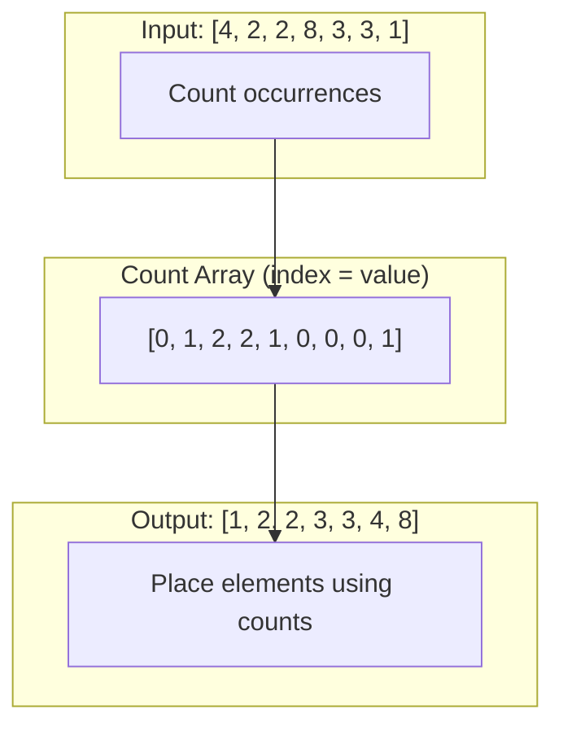
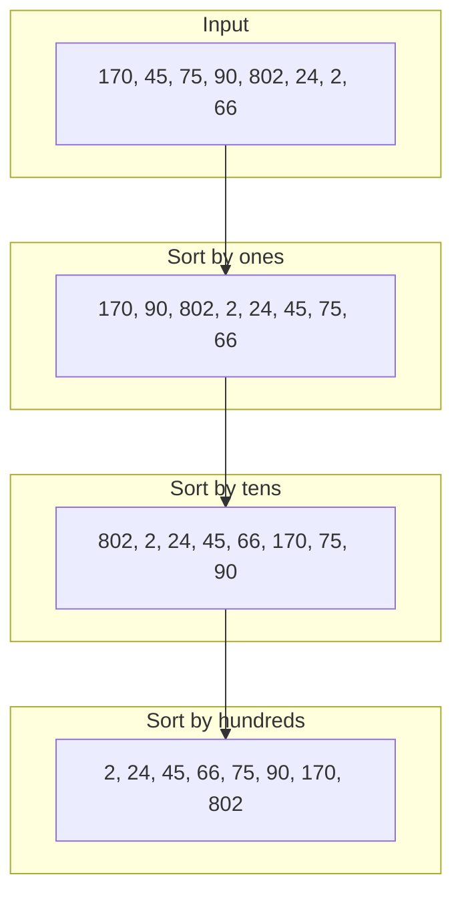

## Learning Objectives

- Understand how non-comparison sorts break the O(n log n) barrier
- Implement counting sort, radix sort, and bucket sort
- Analyze time and space complexity in terms of input range and distribution
- Determine when each non-comparison sort is appropriate
- Apply these algorithms to real-world scenarios like sorting strings, dates, and IPs

## Prerequisites

- Comparison-based sorting algorithms (merge sort, quicksort)
- Understanding of the O(n log n) lower bound for comparison sorts
- Array indexing and basic math operations

## Breaking the O(n log n) Barrier

Comparison-based sorts can't do better than O(n log n) because they only learn about element ordering through pairwise comparisons. **Non-comparison sorts** exploit additional information about the data — its range, digits, or distribution — to achieve O(n) or O(nk) time.

| Algorithm | Time | Space | Constraint |
|-----------|------|-------|-----------|
| Counting Sort | O(n + k) | O(n + k) | Integer keys in range [0, k) |
| Radix Sort | O(d × (n + b)) | O(n + b) | d-digit numbers in base b |
| Bucket Sort | O(n + k) avg | O(n + k) | Uniform distribution |

Where k = range of values, d = number of digits, b = base, n = number of elements.

## Counting Sort

Counting sort works by counting occurrences of each value, then computing prefix sums to determine positions.

**Constraint**: Elements must be non-negative integers in a known range [0, k).



### Implementation (Stable)

```python
def counting_sort(arr, max_val=None):
    if not arr:
        return arr

    if max_val is None:
        max_val = max(arr)

    count = [0] * (max_val + 1)
    for num in arr:
        count[num] += 1

    # Prefix sum — count[i] = number of elements ≤ i
    for i in range(1, len(count)):
        count[i] += count[i - 1]

    output = [0] * len(arr)
    # Traverse right to left for stability
    for i in range(len(arr) - 1, -1, -1):
        output[count[arr[i]] - 1] = arr[i]
        count[arr[i]] -= 1

    return output
```

```go
func countingSort(arr []int, maxVal int) []int {
    count := make([]int, maxVal+1)
    for _, num := range arr {
        count[num]++
    }

    for i := 1; i <= maxVal; i++ {
        count[i] += count[i-1]
    }

    output := make([]int, len(arr))
    for i := len(arr) - 1; i >= 0; i-- {
        output[count[arr[i]]-1] = arr[i]
        count[arr[i]]--
    }
    return output
}
```

**Time**: O(n + k). **Space**: O(n + k). If k is much larger than n, this becomes impractical.

### Simplified Version (When Stability Isn't Needed)

```python
def counting_sort_simple(arr):
    if not arr:
        return arr
    min_val, max_val = min(arr), max(arr)
    count = [0] * (max_val - min_val + 1)
    for num in arr:
        count[num - min_val] += 1

    result = []
    for i, c in enumerate(count):
        result.extend([i + min_val] * c)
    return result
```

## Radix Sort

Radix sort processes each digit position from least significant to most significant, using a stable sort (usually counting sort) at each level.



### Implementation

```python
def radix_sort(arr):
    if not arr:
        return arr

    max_val = max(arr)
    exp = 1

    while max_val // exp > 0:
        arr = counting_sort_by_digit(arr, exp)
        exp *= 10

    return arr

def counting_sort_by_digit(arr, exp):
    n = len(arr)
    output = [0] * n
    count = [0] * 10  # digits 0-9

    for num in arr:
        digit = (num // exp) % 10
        count[digit] += 1

    for i in range(1, 10):
        count[i] += count[i - 1]

    for i in range(n - 1, -1, -1):
        digit = (arr[i] // exp) % 10
        output[count[digit] - 1] = arr[i]
        count[digit] -= 1

    return output
```

```go
func radixSort(arr []int) []int {
    if len(arr) == 0 {
        return arr
    }
    maxVal := arr[0]
    for _, v := range arr {
        if v > maxVal {
            maxVal = v
        }
    }

    for exp := 1; maxVal/exp > 0; exp *= 10 {
        arr = countingSortByDigit(arr, exp)
    }
    return arr
}

func countingSortByDigit(arr []int, exp int) []int {
    n := len(arr)
    output := make([]int, n)
    count := make([]int, 10)

    for _, num := range arr {
        digit := (num / exp) % 10
        count[digit]++
    }
    for i := 1; i < 10; i++ {
        count[i] += count[i-1]
    }
    for i := n - 1; i >= 0; i-- {
        digit := (arr[i] / exp) % 10
        output[count[digit]-1] = arr[i]
        count[digit]--
    }
    return output
}
```

**Time**: O(d × (n + b)) where d = digits, b = base (10 for decimal). For 32-bit integers with base 256: O(4 × (n + 256)) = O(n).

### Radix Sort for Strings

Sort strings of equal length character by character from right to left.

```python
def radix_sort_strings(strings, max_len):
    for pos in range(max_len - 1, -1, -1):
        buckets = [[] for _ in range(128)]  # ASCII
        for s in strings:
            ch = ord(s[pos]) if pos < len(s) else 0
            buckets[ch].append(s)
        strings = [s for bucket in buckets for s in bucket]
    return strings
```

## Bucket Sort

Distribute elements into buckets based on value ranges, sort each bucket individually, then concatenate.

**Optimal when**: Input is uniformly distributed over a known range.

```python
def bucket_sort(arr, num_buckets=10):
    if not arr:
        return arr

    min_val, max_val = min(arr), max(arr)
    if min_val == max_val:
        return arr

    bucket_range = (max_val - min_val) / num_buckets + 1
    buckets = [[] for _ in range(num_buckets)]

    for num in arr:
        idx = int((num - min_val) / bucket_range)
        idx = min(idx, num_buckets - 1)
        buckets[idx].append(num)

    result = []
    for bucket in buckets:
        bucket.sort()  # use insertion sort for small buckets
        result.extend(bucket)
    return result
```

**Average Time**: O(n + k) when elements are uniformly distributed and each bucket has ~n/k elements. **Worst case**: O(n²) when all elements go into one bucket.

### Bucket Sort for Floating Point Numbers

```python
def bucket_sort_floats(arr):
    """Sort floats in [0, 1) range."""
    n = len(arr)
    buckets = [[] for _ in range(n)]

    for num in arr:
        idx = int(n * num)
        idx = min(idx, n - 1)
        buckets[idx].append(num)

    result = []
    for bucket in buckets:
        bucket.sort()
        result.extend(bucket)
    return result
```

## When to Use Which

| Scenario | Best Algorithm | Why |
|----------|---------------|-----|
| Small integers (0 to 100) | Counting Sort | O(n + k) with small k |
| Large integers (32/64-bit) | Radix Sort | O(d × n), d is constant |
| Uniformly distributed floats | Bucket Sort | O(n) average |
| Strings of equal length | Radix Sort (MSD or LSD) | Character-by-character |
| General purpose | Comparison sort | No constraints needed |
| Stability required | Counting or Radix | Both are stable |

### Real-World Applications

- **Counting sort**: Sorting exam grades (0-100), age demographics
- **Radix sort**: Sorting IP addresses, phone numbers, dates, card numbers
- **Bucket sort**: Sorting sensor readings, uniformly distributed data

## Hands-On Exercises

### Exercise 1: Maximum Gap (LeetCode 164)

Given an unsorted array, find the maximum gap between successive elements in sorted order. Must run in O(n) time.

**Approach**: Use bucket sort / pigeonhole principle.

```python
def maximum_gap(nums):
    if len(nums) < 2:
        return 0

    min_val, max_val = min(nums), max(nums)
    if min_val == max_val:
        return 0

    n = len(nums)
    bucket_size = max(1, (max_val - min_val) // (n - 1))
    num_buckets = (max_val - min_val) // bucket_size + 1

    bucket_min = [float('inf')] * num_buckets
    bucket_max = [float('-inf')] * num_buckets

    for num in nums:
        idx = (num - min_val) // bucket_size
        bucket_min[idx] = min(bucket_min[idx], num)
        bucket_max[idx] = max(bucket_max[idx], num)

    max_gap = 0
    prev_max = min_val
    for i in range(num_buckets):
        if bucket_min[i] == float('inf'):
            continue
        max_gap = max(max_gap, bucket_min[i] - prev_max)
        prev_max = bucket_max[i]

    return max_gap
```

### Exercise 2: Sort Characters by Frequency (LeetCode 451)

```python
def frequency_sort(s):
    from collections import Counter
    counts = Counter(s)
    buckets = [[] for _ in range(len(s) + 1)]
    for ch, freq in counts.items():
        buckets[freq].append(ch)

    result = []
    for freq in range(len(buckets) - 1, 0, -1):
        for ch in buckets[freq]:
            result.append(ch * freq)
    return "".join(result)
```

### Exercise 3: Sort Array by Parity (LeetCode 905)

```python
def sort_array_by_parity(nums):
    return [x for x in nums if x % 2 == 0] + [x for x in nums if x % 2 != 0]
```

## Key Takeaways

- **Counting sort** is O(n + k) — optimal when k (range) is proportional to n
- **Radix sort** sorts d-digit numbers in O(d(n + b)) by sorting each digit position with a stable sort
- **Bucket sort** distributes elements into buckets — O(n) average with uniform distribution
- Non-comparison sorts break O(n log n) by **exploiting data structure** (integer values, digit positions, distribution)
- In practice, these are used as **building blocks** inside hybrid algorithms, not standalone

## External Resources

- [Visualgo: Sorting Visualization](https://visualgo.net/en/sorting)
- [Counting Sort — GeeksForGeeks](https://www.geeksforgeeks.org/counting-sort/)
- [MIT OCW: Linear Sorting](https://ocw.mit.edu/courses/6-006-introduction-to-algorithms-spring-2020/)
- [Radix Sort — Brilliant](https://brilliant.org/wiki/radix-sort/)
