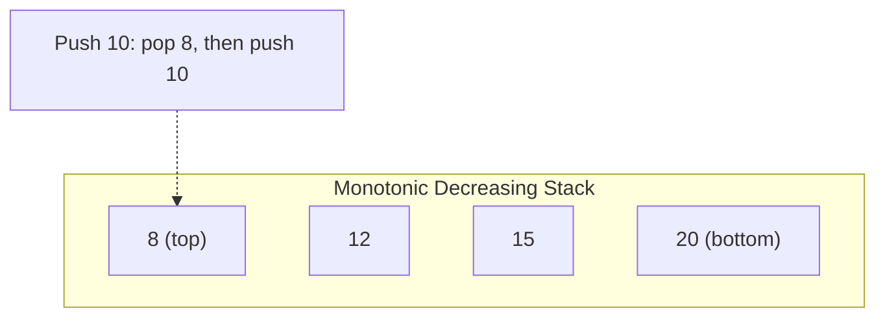

## Learning Objectives

- Understand the monotonic invariant and why it enables O(n) solutions to range-query problems
- Implement monotonic stacks for "next greater/smaller element" patterns
- Apply monotonic deques to sliding window maximum/minimum problems
- Solve stock span, largest rectangle, and trapping rain water using these techniques
- Recognize when a brute-force O(n²) problem can be reduced to O(n) with a monotonic structure

## Prerequisites

- Stack and queue operations (push, pop, peek)
- Deque operations (append, popleft)
- Array traversal and index manipulation

## What Is a Monotonic Stack?

A **monotonic stack** maintains elements in either strictly increasing or strictly decreasing order from bottom to top. When a new element violates the monotonic property, we pop elements until the invariant is restored.



The power of a monotonic stack: for each element, we can determine the **next greater** or **next smaller** element in O(1) amortized time per element, giving O(n) total.

## Pattern 1: Next Greater Element

### Problem (LeetCode 496/503)

For each element in an array, find the first element to its right that is greater. If none exists, return -1.

```
Input:  [2, 1, 2, 4, 3]
Output: [4, 2, 4, -1, -1]
```

### Solution: Monotonic Decreasing Stack

We iterate right to left, maintaining a stack of candidates for "next greater element." The stack stays in decreasing order.

```python
def next_greater_element(nums: list[int]) -> list[int]:
    n = len(nums)
    result = [-1] * n
    stack = []  # stores indices

    for i in range(n - 1, -1, -1):
        # Pop elements that are not greater than nums[i]
        while stack and nums[stack[-1]] <= nums[i]:
            stack.pop()
        if stack:
            result[i] = nums[stack[-1]]
        stack.append(i)
    return result
```

**Alternative**: iterate left to right. When pushing `nums[i]`, pop all stack elements smaller than `nums[i]` — their next greater element is `nums[i]`.

```python
def next_greater_element_v2(nums: list[int]) -> list[int]:
    n = len(nums)
    result = [-1] * n
    stack = []  # indices of elements waiting for their next greater

    for i in range(n):
        while stack and nums[i] > nums[stack[-1]]:
            idx = stack.pop()
            result[idx] = nums[i]
        stack.append(i)
    return result
```

```go
func nextGreaterElement(nums []int) []int {
    n := len(nums)
    result := make([]int, n)
    for i := range result {
        result[i] = -1
    }
    stack := []int{}

    for i := 0; i < n; i++ {
        for len(stack) > 0 && nums[i] > nums[stack[len(stack)-1]] {
            idx := stack[len(stack)-1]
            stack = stack[:len(stack)-1]
            result[idx] = nums[i]
        }
        stack = append(stack, i)
    }
    return result
}
```

**Time**: O(n) — each element is pushed and popped at most once. **Space**: O(n).

### Circular Array Variant (LeetCode 503)

For a circular array, iterate through `2n` elements using modular indexing.

```python
def next_greater_circular(nums: list[int]) -> list[int]:
    n = len(nums)
    result = [-1] * n
    stack = []

    for i in range(2 * n - 1, -1, -1):
        idx = i % n
        while stack and nums[stack[-1]] <= nums[idx]:
            stack.pop()
        if stack and i < n:
            result[idx] = nums[stack[-1]]
        stack.append(idx)
    return result
```

## Pattern 2: Stock Span Problem (LeetCode 901)

The **span** of a stock's price today is the number of consecutive days (including today) the price was ≤ today's price, looking backward.

```
Prices: [100, 80, 60, 70, 60, 75, 85]
Spans:  [1,   1,  1,  2,  1,  4,  6]
```

```python
class StockSpanner:
    def __init__(self):
        self.stack = []  # (price, span) pairs

    def next(self, price: int) -> int:
        span = 1
        while self.stack and self.stack[-1][0] <= price:
            span += self.stack[-1][1]
            self.stack.pop()
        self.stack.append((price, span))
        return span
```

Each element is pushed once and popped at most once → **amortized O(1)** per call.

## Pattern 3: Sliding Window Maximum (LeetCode 239)

### Problem

Given an array and window size k, find the maximum in each window as it slides from left to right.

```
Input:  nums = [1,3,-1,-3,5,3,6,7], k = 3
Output: [3,3,5,5,6,7]
```

**Brute force**: O(nk) — check all k elements for each window.

### Solution: Monotonic Deque

Maintain a deque of indices in **decreasing order** of their values. The front of the deque is always the index of the maximum in the current window.

```python
from collections import deque

def max_sliding_window(nums: list[int], k: int) -> list[int]:
    dq = deque()  # stores indices
    result = []

    for i in range(len(nums)):
        # Remove indices outside the window
        while dq and dq[0] <= i - k:
            dq.popleft()

        # Maintain decreasing order: remove smaller elements from back
        while dq and nums[dq[-1]] <= nums[i]:
            dq.pop()

        dq.append(i)

        # Window is fully formed starting at index k-1
        if i >= k - 1:
            result.append(nums[dq[0]])

    return result
```

```go
func maxSlidingWindow(nums []int, k int) []int {
    dq := []int{}
    result := []int{}

    for i := 0; i < len(nums); i++ {
        for len(dq) > 0 && dq[0] <= i-k {
            dq = dq[1:]
        }
        for len(dq) > 0 && nums[dq[len(dq)-1]] <= nums[i] {
            dq = dq[:len(dq)-1]
        }
        dq = append(dq, i)
        if i >= k-1 {
            result = append(result, nums[dq[0]])
        }
    }
    return result
}
```

**Time**: O(n) — each element enters and leaves the deque at most once. **Space**: O(k).

### Why This Works

The deque maintains a "useful" set of candidates:
1. **Smaller elements behind a larger one are useless** — they can never be the maximum while the larger element is in the window
2. **Out-of-window elements are removed from the front** — they're no longer relevant
3. The front of the deque is always the current window's maximum

## Pattern 4: Largest Rectangle in Histogram (LeetCode 84)

### Problem

Given bar heights, find the area of the largest rectangle that can be formed.

```
Heights: [2, 1, 5, 6, 2, 3]
Largest rectangle area: 10 (bars at indices 2-3, height 5, width 2)
```

### Solution: Monotonic Increasing Stack

For each bar, find how far left and right it can extend as the shortest bar. A monotonic increasing stack tracks bars in ascending height order.

```python
def largest_rectangle_area(heights: list[int]) -> int:
    stack = []  # indices of bars in increasing height
    max_area = 0
    heights.append(0)  # sentinel to flush remaining bars

    for i, h in enumerate(heights):
        while stack and heights[stack[-1]] > h:
            height = heights[stack.pop()]
            width = i if not stack else i - stack[-1] - 1
            max_area = max(max_area, height * width)
        stack.append(i)

    heights.pop()  # restore original array
    return max_area
```

**Time**: O(n). **Space**: O(n).

**How width is calculated**: When we pop index `j` because `heights[i] < heights[j]`, the rectangle with height `heights[j]` extends from `stack[-1] + 1` to `i - 1`. Width = `i - stack[-1] - 1`. If the stack is empty, the bar extends from index 0 to `i - 1`, so width = `i`.

## Pattern 5: Trapping Rain Water (LeetCode 42)

```python
def trap(height: list[int]) -> int:
    stack = []
    water = 0

    for i, h in enumerate(height):
        while stack and h > height[stack[-1]]:
            bottom = height[stack.pop()]
            if not stack:
                break
            width = i - stack[-1] - 1
            bounded_height = min(h, height[stack[-1]]) - bottom
            water += width * bounded_height
        stack.append(i)

    return water
```

**Time**: O(n). **Space**: O(n).

> **Alternative approaches**: Two-pointer (O(1) space) and prefix max arrays (O(n) space) also solve this. The stack approach is elegant but harder to derive from scratch.

## Monotonic Stack Decision Guide

| Problem Type | Stack Order | Iteration Direction |
|-------------|-------------|-------------------|
| Next greater element | Decreasing | Right to left (or L→R with pop) |
| Next smaller element | Increasing | Right to left (or L→R with pop) |
| Previous greater element | Decreasing | Left to right |
| Previous smaller element | Increasing | Left to right |
| Sliding window max | Decreasing deque | Left to right |
| Sliding window min | Increasing deque | Left to right |

## Hands-On Exercises

### Exercise 1: Sum of Subarray Minimums (LeetCode 907)

Find the sum of minimums of all subarrays.

```python
def sum_subarray_mins(arr: list[int]) -> int:
    MOD = 10**9 + 7
    n = len(arr)
    stack = []
    result = 0

    for i in range(n + 1):
        while stack and (i == n or arr[stack[-1]] >= arr[i]):
            mid = stack.pop()
            left = stack[-1] if stack else -1
            right = i
            count = (mid - left) * (right - mid)
            result = (result + arr[mid] * count) % MOD
        stack.append(i)

    return result
```

### Exercise 2: Maximum Width Ramp (LeetCode 962)

Find the maximum `j - i` such that `nums[i] <= nums[j]`.

```python
def max_width_ramp(nums: list[int]) -> int:
    stack = []
    # Build a decreasing stack of candidates for left index
    for i, num in enumerate(nums):
        if not stack or nums[stack[-1]] > num:
            stack.append(i)

    max_width = 0
    for j in range(len(nums) - 1, -1, -1):
        while stack and nums[stack[-1]] <= nums[j]:
            max_width = max(max_width, j - stack.pop())
    return max_width
```

## Key Takeaways

- A **monotonic stack** maintains increasing or decreasing order and solves "next greater/smaller" in O(n)
- Each element is pushed and popped **at most once** — that's why the total is O(n) despite the inner while loop
- A **monotonic deque** extends this to sliding window problems, maintaining the window maximum/minimum
- **Largest rectangle in histogram** is the canonical hard monotonic stack problem — master it, and many variations become straightforward
- When you see a brute-force O(n²) that compares each element to all elements on one side, consider a monotonic stack

## External Resources

- [LeetCode Monotonic Stack Problems](https://leetcode.com/tag/monotonic-stack/)
- [Aditya Verma: Monotonic Stack Playlist](https://www.youtube.com/playlist?list=PL_z_8CaSLPWdeOezg68SKkeLN4-T_jNHd)
- [CP Algorithms: Stack Applications](https://cp-algorithms.com/data_structures/stack_order_statistics.html)
- [NeetCode: Sliding Window Maximum Explained](https://www.youtube.com/watch?v=DfljaUwZsOk)
