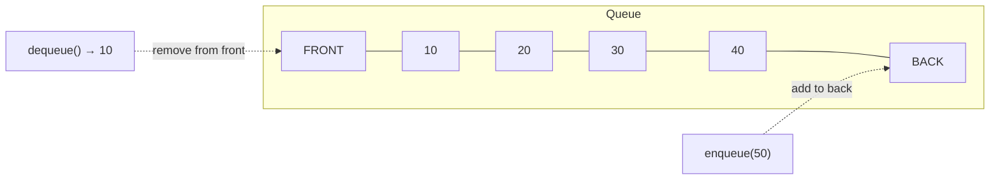
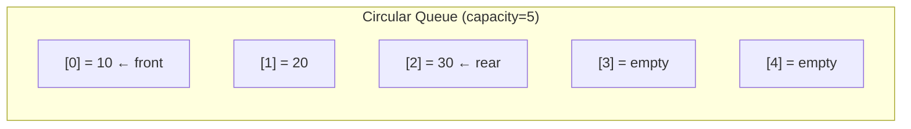
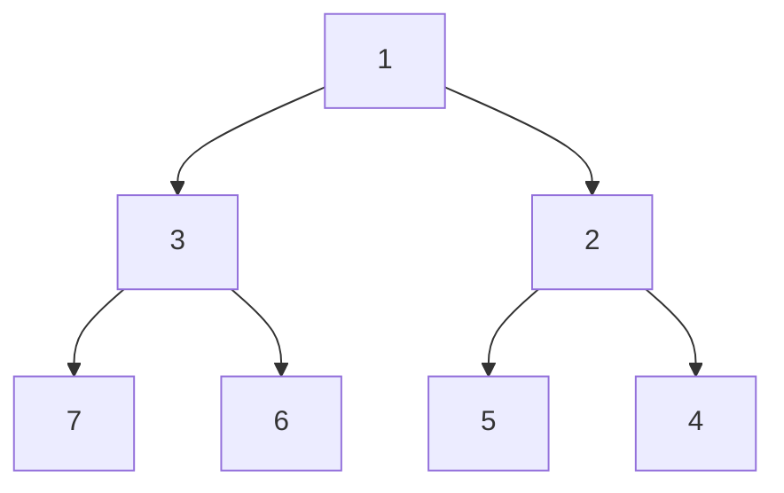

## Learning Objectives

- Understand the FIFO principle and when queues are the right choice
- Implement a circular queue that avoids wasted space in array-based queues
- Use deques for efficient double-ended operations
- Understand priority queues and their heap-based implementation
- Apply queues to BFS, task scheduling, and producer-consumer patterns

## Prerequisites

- Stack operations and LIFO concept
- Array indexing and modular arithmetic
- Basic understanding of trees (for heap section)

## Queue: First In, First Out

A **queue** follows **FIFO** — elements enter at the back (enqueue) and leave from the front (dequeue). Like a line at a ticket counter.



### Core Operations

| Operation | Description | Time |
|-----------|-------------|------|
| `enqueue(item)` | Add to back | O(1) |
| `dequeue()` | Remove from front | O(1)* |
| `peek()` / `front()` | View front item | O(1) |
| `is_empty()` | Check if empty | O(1) |

*O(1) for linked-list or circular array. Naive array dequeue is O(n) due to shifting.

### Naive Array Queue Problem

Using a plain list, `dequeue()` requires shifting all elements left — O(n). This is why we need either a linked-list queue or a **circular queue**.

```python
# BAD: O(n) dequeue
class NaiveQueue:
    def __init__(self):
        self.data = []
    def enqueue(self, val):
        self.data.append(val)
    def dequeue(self):
        return self.data.pop(0)  # O(n) — shifts everything!
```

## Circular Queue (Ring Buffer)

A circular queue uses a fixed-size array with `front` and `rear` pointers that wrap around using modular arithmetic. No shifting needed.



```python
class CircularQueue:
    def __init__(self, capacity: int):
        self._data = [None] * capacity
        self._front = 0
        self._size = 0
        self._capacity = capacity

    def enqueue(self, val):
        if self._size == self._capacity:
            raise OverflowError("Queue is full")
        rear = (self._front + self._size) % self._capacity
        self._data[rear] = val
        self._size += 1

    def dequeue(self):
        if self._size == 0:
            raise IndexError("dequeue from empty queue")
        val = self._data[self._front]
        self._data[self._front] = None
        self._front = (self._front + 1) % self._capacity
        self._size -= 1
        return val

    def peek(self):
        if self._size == 0:
            raise IndexError("peek at empty queue")
        return self._data[self._front]

    def is_empty(self):
        return self._size == 0

    def is_full(self):
        return self._size == self._capacity

    def __len__(self):
        return self._size
```

```go
type CircularQueue struct {
    data     []int
    front    int
    size     int
    capacity int
}

func NewCircularQueue(capacity int) *CircularQueue {
    return &CircularQueue{
        data:     make([]int, capacity),
        capacity: capacity,
    }
}

func (q *CircularQueue) Enqueue(val int) error {
    if q.size == q.capacity {
        return fmt.Errorf("queue is full")
    }
    rear := (q.front + q.size) % q.capacity
    q.data[rear] = val
    q.size++
    return nil
}

func (q *CircularQueue) Dequeue() (int, error) {
    if q.size == 0 {
        return 0, fmt.Errorf("queue is empty")
    }
    val := q.data[q.front]
    q.front = (q.front + 1) % q.capacity
    q.size--
    return val, nil
}
```

All operations are **O(1)** with no amortization. The trade-off is a fixed capacity.

## Deque (Double-Ended Queue)

A **deque** supports insertion and removal at **both** ends in O(1). Python's `collections.deque` is the standard implementation, backed by a doubly linked list of fixed-size blocks.

```python
from collections import deque

dq = deque()
dq.append(1)       # add to right: [1]
dq.appendleft(0)   # add to left:  [0, 1]
dq.append(2)       # add to right: [0, 1, 2]
dq.popleft()        # remove from left: returns 0, deque is [1, 2]
dq.pop()            # remove from right: returns 2, deque is [1]
```

### Deque as Both Stack and Queue

```python
from collections import deque

# As a stack (LIFO): use append + pop
stack = deque()
stack.append(1)
stack.append(2)
stack.pop()  # 2

# As a queue (FIFO): use append + popleft
queue = deque()
queue.append(1)
queue.append(2)
queue.popleft()  # 1
```

> **Why `deque` over `list`?** `list.pop(0)` is O(n). `deque.popleft()` is O(1). Always use `deque` when you need a queue in Python.

### Bounded Deque

```python
# Fixed-size deque — oldest elements auto-evicted
recent_logs = deque(maxlen=100)
for i in range(200):
    recent_logs.append(f"log {i}")
len(recent_logs)  # 100 — oldest 100 were discarded
```

## Priority Queue / Heap

A **priority queue** dequeues the element with the **highest priority** (typically the smallest value in a min-heap). It does not follow strict FIFO.

| Operation | Array | Sorted Array | Binary Heap |
|-----------|-------|--------------|-------------|
| Insert | O(1) | O(n) | **O(log n)** |
| Extract min | O(n) | O(1) | **O(log n)** |
| Peek min | O(n) | O(1) | **O(1)** |

### Heap Basics

A **binary heap** is a complete binary tree stored in an array where each parent is ≤ its children (min-heap) or ≥ its children (max-heap).



Array representation: `[1, 3, 2, 7, 6, 5, 4]`

For index `i` (0-based):
- Parent: `(i - 1) // 2`
- Left child: `2 * i + 1`
- Right child: `2 * i + 2`

### Python `heapq` Module

```python
import heapq

# Min-heap operations
heap = []
heapq.heappush(heap, 5)
heapq.heappush(heap, 1)
heapq.heappush(heap, 3)

heapq.heappop(heap)   # 1 (smallest)
heapq.heappop(heap)   # 3
heap[0]                # 5 — peek without removing

# Build heap from list — O(n)
nums = [5, 3, 8, 1, 2]
heapq.heapify(nums)   # nums is now a valid min-heap

# Max-heap trick: negate values
max_heap = []
heapq.heappush(max_heap, -10)
heapq.heappush(max_heap, -20)
-heapq.heappop(max_heap)  # 20 (largest)
```

```go
import "container/heap"

type IntHeap []int

func (h IntHeap) Len() int           { return len(h) }
func (h IntHeap) Less(i, j int) bool { return h[i] < h[j] }
func (h IntHeap) Swap(i, j int)      { h[i], h[j] = h[j], h[i] }

func (h *IntHeap) Push(x any) {
    *h = append(*h, x.(int))
}

func (h *IntHeap) Pop() any {
    old := *h
    n := len(old)
    x := old[n-1]
    *h = old[:n-1]
    return x
}
```

### Top K Elements Pattern

```python
import heapq

def top_k_frequent(nums: list[int], k: int) -> list[int]:
    from collections import Counter
    counts = Counter(nums)
    return heapq.nlargest(k, counts.keys(), key=counts.get)

# Alternative: maintain a min-heap of size k
def top_k_with_heap(nums: list[int], k: int) -> list[int]:
    from collections import Counter
    counts = Counter(nums)
    heap = []
    for num, freq in counts.items():
        heapq.heappush(heap, (freq, num))
        if len(heap) > k:
            heapq.heappop(heap)  # remove smallest frequency
    return [num for freq, num in heap]
```

**Time**: O(n log k) — much better than sorting O(n log n) when k << n.

## BFS with Queues

Queues are the backbone of **Breadth-First Search**. BFS explores nodes level by level.

```python
from collections import deque

def bfs(graph, start):
    visited = {start}
    queue = deque([start])
    order = []

    while queue:
        node = queue.popleft()
        order.append(node)
        for neighbor in graph[node]:
            if neighbor not in visited:
                visited.add(neighbor)
                queue.append(neighbor)
    return order
```

## Hands-On Exercises

### Exercise 1: Implement a Recent Counter (LeetCode 933)

Count the number of requests in the last 3000 milliseconds.

```python
class RecentCounter:
    def __init__(self):
        self.requests = deque()

    def ping(self, t: int) -> int:
        self.requests.append(t)
        while self.requests[0] < t - 3000:
            self.requests.popleft()
        return len(self.requests)
```

### Exercise 2: Task Scheduler (LeetCode 621)

Given tasks with cooldown periods, find minimum intervals to execute all tasks.

```python
def least_interval(tasks: list[str], n: int) -> int:
    from collections import Counter
    counts = Counter(tasks)
    max_freq = max(counts.values())
    max_count = sum(1 for v in counts.values() if v == max_freq)

    # (max_freq - 1) full groups of (n + 1) slots + last group of max_count tasks
    return max(len(tasks), (max_freq - 1) * (n + 1) + max_count)
```

### Exercise 3: Kth Largest Element in a Stream (LeetCode 703)

```python
class KthLargest:
    def __init__(self, k: int, nums: list[int]):
        self.k = k
        self.heap = nums
        heapq.heapify(self.heap)
        while len(self.heap) > k:
            heapq.heappop(self.heap)

    def add(self, val: int) -> int:
        heapq.heappush(self.heap, val)
        if len(self.heap) > self.k:
            heapq.heappop(self.heap)
        return self.heap[0]
```

Maintains a min-heap of size k. The root is always the kth largest. **Time**: O(log k) per add.

## Key Takeaways

- **Queues** (FIFO) are essential for BFS, task scheduling, and buffering
- **Circular queues** solve the O(n) dequeue problem with modular arithmetic
- **Deques** provide O(1) operations at both ends — use Python's `collections.deque`
- **Priority queues** (heaps) give O(log n) insert/extract — indispensable for "top k" and shortest path problems
- Python's `heapq` is a **min-heap**; negate values for a max-heap
- `heapq.heapify()` builds a heap in **O(n)**, not O(n log n)

## External Resources

- [Visualgo: Queue Visualization](https://visualgo.net/en/list)
- [Python `heapq` Documentation](https://docs.python.org/3/library/heapq.html)
- [Go `container/heap` Documentation](https://pkg.go.dev/container/heap)
- [Priority Queue Applications — CP Algorithms](https://cp-algorithms.com/data_structures/priority_queue.html)
