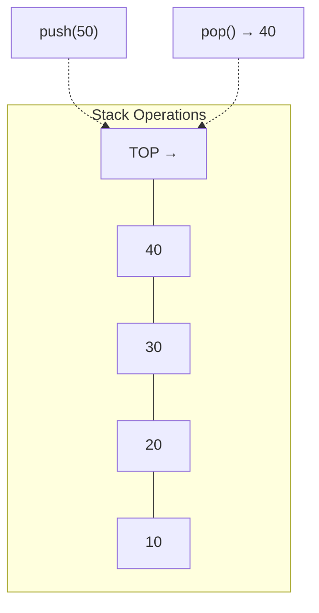
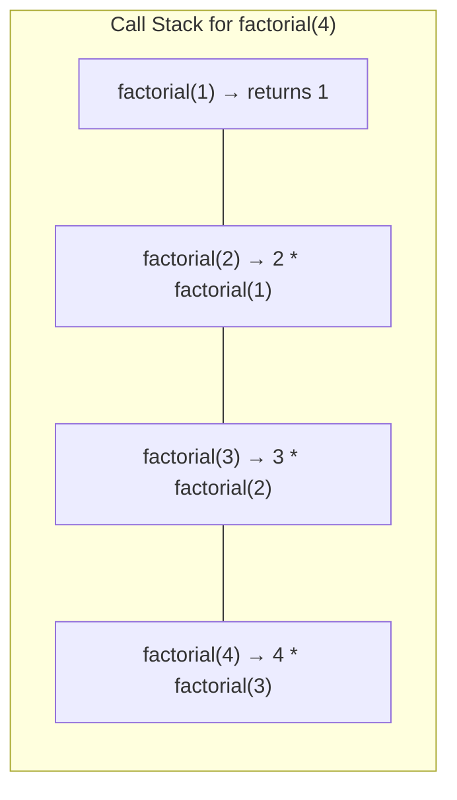

## Learning Objectives

- Understand the LIFO principle and how it maps to real-world scenarios
- Implement a stack using both arrays and linked lists with full complexity analysis
- Visualize the program call stack and understand stack overflow
- Solve the balanced parentheses problem and its variants
- Apply stacks to expression evaluation and conversion problems

## Prerequisites

- Array operations and dynamic resizing
- Linked list node structure and insertion/deletion
- Basic recursion concepts

## The LIFO Principle

A **stack** is a linear data structure following **Last In, First Out** (LIFO) — the most recently added element is the first to be removed. Think of a stack of plates: you add and remove from the top only.



### Core Operations

| Operation | Description | Time |
|-----------|-------------|------|
| `push(item)` | Add item to top | O(1) |
| `pop()` | Remove and return top item | O(1) |
| `peek()` / `top()` | View top item without removing | O(1) |
| `is_empty()` | Check if stack is empty | O(1) |
| `size()` | Number of elements | O(1) |

## Implementation: Array-Based Stack

```python
class ArrayStack:
    def __init__(self):
        self._data = []

    def push(self, val):
        self._data.append(val)  # O(1) amortized

    def pop(self):
        if self.is_empty():
            raise IndexError("pop from empty stack")
        return self._data.pop()  # O(1) amortized

    def peek(self):
        if self.is_empty():
            raise IndexError("peek at empty stack")
        return self._data[-1]

    def is_empty(self):
        return len(self._data) == 0

    def __len__(self):
        return len(self._data)

    def __repr__(self):
        return f"Stack(top -> {self._data[::-1]})"
```

```go
type ArrayStack struct {
    data []int
}

func (s *ArrayStack) Push(val int) {
    s.data = append(s.data, val)
}

func (s *ArrayStack) Pop() (int, error) {
    if s.IsEmpty() {
        return 0, fmt.Errorf("pop from empty stack")
    }
    top := s.data[len(s.data)-1]
    s.data = s.data[:len(s.data)-1]
    return top, nil
}

func (s *ArrayStack) Peek() (int, error) {
    if s.IsEmpty() {
        return 0, fmt.Errorf("peek at empty stack")
    }
    return s.data[len(s.data)-1], nil
}

func (s *ArrayStack) IsEmpty() bool {
    return len(s.data) == 0
}

func (s *ArrayStack) Size() int {
    return len(s.data)
}
```

### Array vs Linked List Implementation

| Aspect | Array-based | Linked-list-based |
|--------|------------|-------------------|
| Push | O(1) amortized | O(1) worst case |
| Pop | O(1) amortized | O(1) worst case |
| Memory | Contiguous, cache-friendly | Scattered, pointer overhead |
| Max size | Dynamic (resizing) | Limited by memory |
| Simplicity | Very simple | Slightly more complex |

In practice, array-based stacks are preferred for their cache locality and simplicity. Use linked-list-based stacks when you need guaranteed O(1) worst-case (no amortized resizing).

## The Program Call Stack

Every function call creates a **stack frame** on the call stack containing local variables, parameters, and the return address. Understanding this is crucial for recursion and debugging.

```python
def factorial(n):
    if n <= 1:
        return 1
    return n * factorial(n - 1)

factorial(4)
```



**Stack overflow** occurs when recursion depth exceeds the stack size limit (typically ~1000 in Python, ~1MB in Go). This is why tail recursion optimization or iterative solutions matter.

```python
import sys
sys.getrecursionlimit()  # Default: 1000
```

## Classic Problem: Balanced Parentheses

### The Problem (LeetCode 20)

Given a string containing `()[]{}`, determine if the brackets are balanced.

**Rules**: Every opening bracket must have a corresponding closing bracket of the same type, and brackets must close in the correct order.

```
"({[]})" → True
"([)]"   → False
"((("    → False
```

### Solution

```python
def is_valid(s: str) -> bool:
    stack = []
    matching = {')': '(', ']': '[', '}': '{'}

    for char in s:
        if char in matching:
            if not stack or stack[-1] != matching[char]:
                return False
            stack.pop()
        else:
            stack.append(char)

    return len(stack) == 0
```

```go
func isValid(s string) bool {
    stack := []rune{}
    matching := map[rune]rune{')': '(', ']': '[', '}': '{'}

    for _, ch := range s {
        if open, ok := matching[ch]; ok {
            if len(stack) == 0 || stack[len(stack)-1] != open {
                return false
            }
            stack = stack[:len(stack)-1]
        } else {
            stack = append(stack, ch)
        }
    }
    return len(stack) == 0
}
```

**Time**: O(n). **Space**: O(n) in the worst case (all opening brackets).

### Variant: Minimum Add to Make Parentheses Valid (LeetCode 921)

```python
def min_add_to_make_valid(s: str) -> int:
    open_count = 0
    unmatched_close = 0
    for ch in s:
        if ch == '(':
            open_count += 1
        elif ch == ')':
            if open_count > 0:
                open_count -= 1
            else:
                unmatched_close += 1
    return open_count + unmatched_close
```

## Expression Evaluation

Stacks power expression parsing in compilers, calculators, and interpreters.

### Postfix (Reverse Polish Notation) Evaluation (LeetCode 150)

In postfix notation, operators come after operands: `3 4 + 5 *` = `(3 + 4) * 5 = 35`.

```python
def eval_rpn(tokens: list[str]) -> int:
    stack = []
    ops = {
        '+': lambda a, b: a + b,
        '-': lambda a, b: a - b,
        '*': lambda a, b: a * b,
        '/': lambda a, b: int(a / b),  # truncate toward zero
    }
    for token in tokens:
        if token in ops:
            b, a = stack.pop(), stack.pop()
            stack.append(ops[token](a, b))
        else:
            stack.append(int(token))
    return stack[0]
```

### Infix to Postfix Conversion (Shunting-Yard Algorithm)

```python
def infix_to_postfix(expression: str) -> list[str]:
    precedence = {'+': 1, '-': 1, '*': 2, '/': 2}
    output = []
    operator_stack = []

    tokens = expression.split()
    for token in tokens:
        if token.isdigit():
            output.append(token)
        elif token == '(':
            operator_stack.append(token)
        elif token == ')':
            while operator_stack and operator_stack[-1] != '(':
                output.append(operator_stack.pop())
            operator_stack.pop()  # remove '('
        else:
            while (operator_stack and
                   operator_stack[-1] != '(' and
                   precedence.get(operator_stack[-1], 0) >= precedence.get(token, 0)):
                output.append(operator_stack.pop())
            operator_stack.append(token)

    while operator_stack:
        output.append(operator_stack.pop())
    return output

# "3 + 4 * 5" → ['3', '4', '5', '*', '+']
```

## Min Stack (LeetCode 155)

Design a stack that supports push, pop, peek, and **getMin** all in O(1).

```python
class MinStack:
    def __init__(self):
        self.stack = []
        self.min_stack = []  # tracks minimum at each level

    def push(self, val: int):
        self.stack.append(val)
        min_val = min(val, self.min_stack[-1] if self.min_stack else val)
        self.min_stack.append(min_val)

    def pop(self):
        self.stack.pop()
        self.min_stack.pop()

    def top(self) -> int:
        return self.stack[-1]

    def getMin(self) -> int:
        return self.min_stack[-1]
```

The trick: maintain a parallel stack that records the running minimum. When you push, the new minimum is `min(val, current_min)`. When you pop, both stacks shrink together.

**Space optimization**: Only push to `min_stack` when the new value is ≤ current min, and pop from it only when the main stack's popped value equals `min_stack[-1]`.

## Hands-On Exercises

### Exercise 1: Daily Temperatures (LeetCode 739)

Given temperatures, for each day find how many days until a warmer temperature.

```python
def daily_temperatures(temperatures: list[int]) -> list[int]:
    n = len(temperatures)
    result = [0] * n
    stack = []  # indices of days with no warmer day found yet

    for i in range(n):
        while stack and temperatures[i] > temperatures[stack[-1]]:
            prev_day = stack.pop()
            result[prev_day] = i - prev_day
        stack.append(i)
    return result
```

**Time**: O(n) — each index is pushed and popped at most once. **Space**: O(n).

### Exercise 2: Implement a Queue Using Two Stacks (LeetCode 232)

```python
class MyQueue:
    def __init__(self):
        self.in_stack = []
        self.out_stack = []

    def push(self, x: int):
        self.in_stack.append(x)

    def pop(self) -> int:
        self._transfer()
        return self.out_stack.pop()

    def peek(self) -> int:
        self._transfer()
        return self.out_stack[-1]

    def empty(self) -> bool:
        return not self.in_stack and not self.out_stack

    def _transfer(self):
        if not self.out_stack:
            while self.in_stack:
                self.out_stack.append(self.in_stack.pop())
```

**Amortized O(1)** per operation — each element is moved between stacks at most once.

### Exercise 3: Decode String (LeetCode 394)

```
Input:  "3[a2[c]]"
Output: "accaccacc"
```

```python
def decode_string(s: str) -> str:
    count_stack = []
    string_stack = []
    current = ""
    k = 0

    for ch in s:
        if ch.isdigit():
            k = k * 10 + int(ch)
        elif ch == '[':
            count_stack.append(k)
            string_stack.append(current)
            current = ""
            k = 0
        elif ch == ']':
            decoded = string_stack.pop() + current * count_stack.pop()
            current = decoded
        else:
            current += ch
    return current
```

## Key Takeaways

- Stacks follow **LIFO** — the last element pushed is the first popped
- Array-based stacks are the practical default; linked-list stacks guarantee O(1) worst-case
- The **call stack** underpins recursion — stack overflow = too deep
- **Balanced parentheses** is the canonical stack problem; extend the pattern for nested structures
- Stacks power **expression evaluation**, **undo operations**, **DFS traversal**, and **backtracking**
- The **Min Stack** pattern (auxiliary stack tracking state) generalizes to many "track property at each level" problems

## External Resources

- [Visualgo: Stack Visualization](https://visualgo.net/en/list)
- [LeetCode Stack Tag](https://leetcode.com/tag/stack/)
- [Shunting-Yard Algorithm — Wikipedia](https://en.wikipedia.org/wiki/Shunting-yard_algorithm)
- [Python `collections.deque` as Stack](https://docs.python.org/3/library/collections.html#collections.deque)
