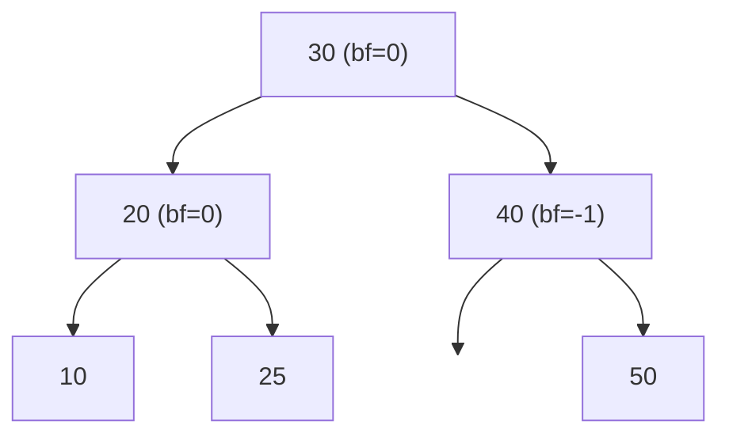
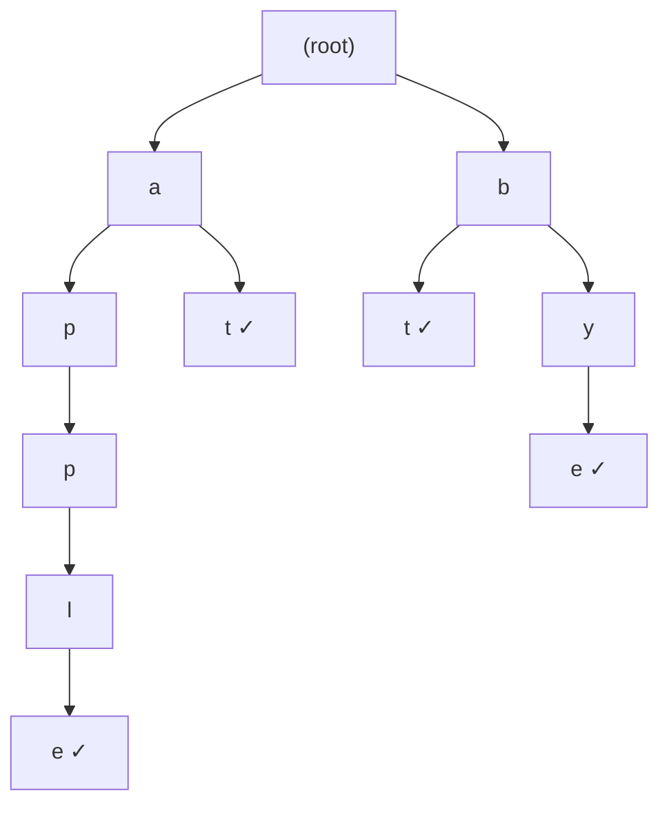
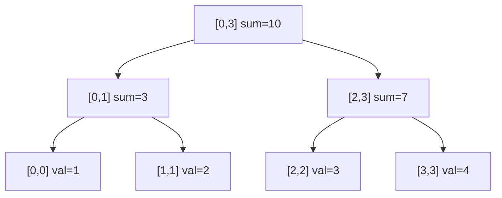

## Learning Objectives

- Understand AVL tree rotations and how they maintain O(log n) height
- Implement a Trie for prefix-based string operations
- Use Segment Trees for efficient range queries and updates
- Apply Fenwick Trees (Binary Indexed Trees) for prefix sum queries
- Choose the right tree structure based on problem requirements

## Prerequisites

- BST operations (search, insert, delete)
- Binary tree traversals
- Prefix sum concepts
- Recursion and divide-and-conquer thinking

## AVL Trees: Self-Balancing BSTs

An **AVL tree** is a BST where for every node, the heights of the left and right subtrees differ by at most 1 (the **balance factor** is in {-1, 0, 1}).



### Balance Factor

```
balance_factor(node) = height(left) - height(right)
```

When an insertion or deletion makes `|balance_factor| > 1`, we perform **rotations** to restore balance.

### The Four Rotation Cases

#### Right Rotation (Left-Left Case)

```
    z              y
   / \            / \
  y   T4   →    x   z
 / \           / \ / \
x   T3       T1 T2 T3 T4
/ \
T1 T2
```

```python
def right_rotate(z):
    y = z.left
    T3 = y.right
    y.right = z
    z.left = T3
    z.height = 1 + max(get_height(z.left), get_height(z.right))
    y.height = 1 + max(get_height(y.left), get_height(y.right))
    return y
```

#### Left Rotation (Right-Right Case)

```python
def left_rotate(z):
    y = z.right
    T2 = y.left
    y.left = z
    z.right = T2
    z.height = 1 + max(get_height(z.left), get_height(z.right))
    y.height = 1 + max(get_height(y.left), get_height(y.right))
    return y
```

#### Left-Right Case

Left-rotate the left child, then right-rotate the node.

#### Right-Left Case

Right-rotate the right child, then left-rotate the node.

### AVL Insertion

```python
class AVLNode:
    def __init__(self, val):
        self.val = val
        self.left = None
        self.right = None
        self.height = 1

def get_height(node):
    return node.height if node else 0

def get_balance(node):
    return get_height(node.left) - get_height(node.right) if node else 0

def avl_insert(root, val):
    if not root:
        return AVLNode(val)
    if val < root.val:
        root.left = avl_insert(root.left, val)
    elif val > root.val:
        root.right = avl_insert(root.right, val)
    else:
        return root  # no duplicates

    root.height = 1 + max(get_height(root.left), get_height(root.right))
    balance = get_balance(root)

    # Left-Left
    if balance > 1 and val < root.left.val:
        return right_rotate(root)
    # Right-Right
    if balance < -1 and val > root.right.val:
        return left_rotate(root)
    # Left-Right
    if balance > 1 and val > root.left.val:
        root.left = left_rotate(root.left)
        return right_rotate(root)
    # Right-Left
    if balance < -1 and val < root.right.val:
        root.right = right_rotate(root.right)
        return left_rotate(root)

    return root
```

**Time**: O(log n) for insertion. At most 2 rotations needed. **Space**: O(log n) for recursion.

### AVL vs Red-Black Trees

| Property | AVL | Red-Black |
|----------|-----|-----------|
| Balance strictness | Strictly balanced (height diff ≤ 1) | Loosely balanced (black-height equal) |
| Search speed | Slightly faster | Slightly slower |
| Insert/Delete | More rotations | Fewer rotations |
| Used in | Databases, lookup-heavy | `std::map`, Java `TreeMap`, Linux kernel |

## Tries (Prefix Trees)

A **Trie** stores strings character by character. Each node represents a prefix, and paths from root to marked nodes represent complete words.



Words stored: "apple", "at", "bt", "bye"

### Implementation

```python
class TrieNode:
    __slots__ = ('children', 'is_end')

    def __init__(self):
        self.children = {}
        self.is_end = False


class Trie:
    def __init__(self):
        self.root = TrieNode()

    def insert(self, word: str) -> None:
        node = self.root
        for ch in word:
            if ch not in node.children:
                node.children[ch] = TrieNode()
            node = node.children[ch]
        node.is_end = True

    def search(self, word: str) -> bool:
        node = self._find_node(word)
        return node is not None and node.is_end

    def starts_with(self, prefix: str) -> bool:
        return self._find_node(prefix) is not None

    def _find_node(self, prefix: str) -> TrieNode:
        node = self.root
        for ch in prefix:
            if ch not in node.children:
                return None
            node = node.children[ch]
        return node
```

```go
type TrieNode struct {
    Children map[rune]*TrieNode
    IsEnd    bool
}

type Trie struct {
    Root *TrieNode
}

func NewTrie() *Trie {
    return &Trie{Root: &TrieNode{Children: make(map[rune]*TrieNode)}}
}

func (t *Trie) Insert(word string) {
    node := t.Root
    for _, ch := range word {
        if _, ok := node.Children[ch]; !ok {
            node.Children[ch] = &TrieNode{Children: make(map[rune]*TrieNode)}
        }
        node = node.Children[ch]
    }
    node.IsEnd = true
}

func (t *Trie) Search(word string) bool {
    node := t.findNode(word)
    return node != nil && node.IsEnd
}

func (t *Trie) findNode(prefix string) *TrieNode {
    node := t.Root
    for _, ch := range prefix {
        if _, ok := node.Children[ch]; !ok {
            return nil
        }
        node = node.Children[ch]
    }
    return node
}
```

### Trie Complexity

| Operation | Time | Space |
|-----------|------|-------|
| Insert | O(L) | O(L) per word |
| Search | O(L) | O(1) |
| Prefix search | O(L) | O(1) |
| Total space | — | O(N × L × Σ) worst case |

Where L = word length, N = number of words, Σ = alphabet size.

### Trie Applications

- **Autocomplete**: Find all words with a given prefix
- **Spell checking**: Check if a word exists, suggest corrections
- **IP routing**: Longest prefix match in routing tables
- **Word games**: Boggle, Scrabble word validation

## Segment Trees

A **Segment Tree** answers range queries (sum, min, max) and supports point/range updates in O(log n) per operation.



Array: `[1, 2, 3, 4]`

### Implementation

```python
class SegmentTree:
    def __init__(self, nums: list[int]):
        self.n = len(nums)
        self.tree = [0] * (4 * self.n)
        self._build(nums, 1, 0, self.n - 1)

    def _build(self, nums, node, start, end):
        if start == end:
            self.tree[node] = nums[start]
            return
        mid = (start + end) // 2
        self._build(nums, 2 * node, start, mid)
        self._build(nums, 2 * node + 1, mid + 1, end)
        self.tree[node] = self.tree[2 * node] + self.tree[2 * node + 1]

    def update(self, idx: int, val: int):
        self._update(1, 0, self.n - 1, idx, val)

    def _update(self, node, start, end, idx, val):
        if start == end:
            self.tree[node] = val
            return
        mid = (start + end) // 2
        if idx <= mid:
            self._update(2 * node, start, mid, idx, val)
        else:
            self._update(2 * node + 1, mid + 1, end, idx, val)
        self.tree[node] = self.tree[2 * node] + self.tree[2 * node + 1]

    def query(self, left: int, right: int) -> int:
        return self._query(1, 0, self.n - 1, left, right)

    def _query(self, node, start, end, left, right):
        if right < start or end < left:
            return 0
        if left <= start and end <= right:
            return self.tree[node]
        mid = (start + end) // 2
        return (self._query(2 * node, start, mid, left, right) +
                self._query(2 * node + 1, mid + 1, end, left, right))
```

| Operation | Prefix Sum Array | Segment Tree |
|-----------|-----------------|--------------|
| Build | O(n) | O(n) |
| Range query | O(1) | O(log n) |
| Point update | O(n) | **O(log n)** |

Use segment trees when you need **both** range queries and updates.

## Fenwick Tree (Binary Indexed Tree)

A **Fenwick Tree** supports prefix sum queries and point updates in O(log n) with simpler code and lower constants than segment trees. The trade-off: it only supports prefix queries (not arbitrary range queries without subtraction).

```python
class FenwickTree:
    def __init__(self, n: int):
        self.n = n
        self.tree = [0] * (n + 1)  # 1-indexed

    def update(self, i: int, delta: int):
        """Add delta to index i (1-indexed)."""
        while i <= self.n:
            self.tree[i] += delta
            i += i & (-i)  # add lowest set bit

    def prefix_sum(self, i: int) -> int:
        """Sum of elements [1..i]."""
        total = 0
        while i > 0:
            total += self.tree[i]
            i -= i & (-i)  # remove lowest set bit
        return total

    def range_sum(self, left: int, right: int) -> int:
        """Sum of elements [left..right]."""
        return self.prefix_sum(right) - self.prefix_sum(left - 1)

    @classmethod
    def from_array(cls, nums: list[int]):
        """Build Fenwick tree from array in O(n)."""
        n = len(nums)
        ft = cls(n)
        ft.tree[1:] = nums[:]
        for i in range(1, n + 1):
            parent = i + (i & (-i))
            if parent <= n:
                ft.tree[parent] += ft.tree[i]
        return ft
```

The magic is in `i & (-i)` — the **lowest set bit** operation that determines which ranges each index is responsible for.

**Time**: O(log n) per update/query. **Space**: O(n).

### When to Use Which

| Structure | Range Query | Point Update | Range Update | Code Complexity |
|-----------|------------|--------------|--------------|-----------------|
| Prefix Sum | O(1) | O(n) | O(n) | Very simple |
| Fenwick Tree | O(log n) | O(log n) | O(log n)* | Simple |
| Segment Tree | O(log n) | O(log n) | O(log n) | Moderate |
| Segment + Lazy | O(log n) | O(log n) | O(log n) | Complex |

*With range update trick.

## Hands-On Exercises

### Exercise 1: Implement Autocomplete with Trie

```python
class AutocompleteTrie(Trie):
    def autocomplete(self, prefix: str, limit: int = 5) -> list[str]:
        node = self._find_node(prefix)
        if not node:
            return []
        results = []
        self._collect_words(node, list(prefix), results, limit)
        return results

    def _collect_words(self, node, path, results, limit):
        if len(results) >= limit:
            return
        if node.is_end:
            results.append("".join(path))
        for ch in sorted(node.children):
            path.append(ch)
            self._collect_words(node.children[ch], path, results, limit)
            path.pop()
```

### Exercise 2: Count of Range Sum (LeetCode 327)

Use a Fenwick tree or merge sort to count pairs where the range sum falls within [lower, upper].

### Exercise 3: Range Sum Query Mutable (LeetCode 307)

```python
class NumArray:
    def __init__(self, nums: list[int]):
        self.nums = nums
        self.tree = SegmentTree(nums)

    def update(self, index: int, val: int) -> None:
        self.tree.update(index, val)
        self.nums[index] = val

    def sumRange(self, left: int, right: int) -> int:
        return self.tree.query(left, right)
```

## Key Takeaways

- **AVL trees** guarantee O(log n) height through rotations — 4 cases to remember
- **Tries** enable O(L) prefix operations — essential for autocomplete, spell check, and IP routing
- **Segment trees** handle range queries + updates in O(log n) — use when prefix sums aren't enough
- **Fenwick trees** are simpler and faster than segment trees for prefix-sum patterns
- Choose the simplest structure that meets your requirements: prefix sums → Fenwick → segment tree → segment tree with lazy propagation

## External Resources

- [Visualgo: AVL Tree Visualization](https://visualgo.net/en/bst)
- [CP Algorithms: Segment Tree](https://cp-algorithms.com/data_structures/segment_tree.html)
- [CP Algorithms: Fenwick Tree](https://cp-algorithms.com/data_structures/fenwick.html)
- [LeetCode Trie Problems](https://leetcode.com/tag/trie/)
- [MIT OCW: Augmented Data Structures](https://ocw.mit.edu/courses/6-046j-design-and-analysis-of-algorithms-spring-2015/)
