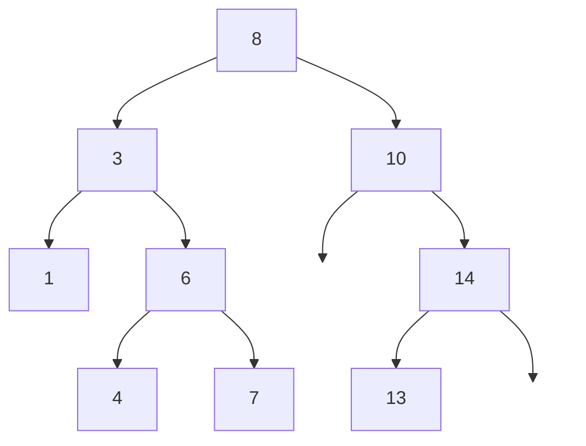

## Learning Objectives

- Understand the BST property and why it enables O(log n) search on average
- Implement search, insertion, and deletion in a BST
- Validate whether a binary tree satisfies the BST property
- Analyze the difference between balanced and degenerate BSTs
- Convert between sorted arrays/lists and BSTs

## Prerequisites

- Binary tree traversals (in-order, pre-order, post-order)
- Recursive tree problem-solving
- Big-O analysis for logarithmic vs linear

## The BST Property

A **Binary Search Tree** is a binary tree where for every node:
- All values in the **left subtree** are **less than** the node's value
- All values in the **right subtree** are **greater than** the node's value



**In-order traversal** of a valid BST always produces a **sorted sequence**: 1, 3, 4, 6, 7, 8, 10, 13, 14.

### BST vs Hash Table

| Operation | BST (balanced) | Hash Table |
|-----------|---------------|------------|
| Search | O(log n) | O(1) avg |
| Insert | O(log n) | O(1) avg |
| Delete | O(log n) | O(1) avg |
| Min/Max | O(log n) | O(n) |
| Range query | O(log n + k) | O(n) |
| Ordered iteration | O(n) | O(n log n) |

BSTs excel when you need **ordered operations**: find min/max, range queries, predecessor/successor, or in-order traversal.

## Search

```python
def search_bst(root: TreeNode, target: int) -> TreeNode:
    if not root or root.val == target:
        return root
    if target < root.val:
        return search_bst(root.left, target)
    return search_bst(root.right, target)
```

```go
func searchBST(root *TreeNode, target int) *TreeNode {
    for root != nil && root.Val != target {
        if target < root.Val {
            root = root.Left
        } else {
            root = root.Right
        }
    }
    return root
}
```

**Time**: O(h) where h is the tree height. For a balanced tree, h = O(log n). For a skewed tree, h = O(n).

## Insertion

New values are always inserted at a leaf position. Navigate down the tree following BST rules until you find a null spot.

```python
def insert_bst(root: TreeNode, val: int) -> TreeNode:
    if not root:
        return TreeNode(val)
    if val < root.val:
        root.left = insert_bst(root.left, val)
    elif val > root.val:
        root.right = insert_bst(root.right, val)
    return root
```

```go
func insertBST(root *TreeNode, val int) *TreeNode {
    if root == nil {
        return &TreeNode{Val: val}
    }
    if val < root.Val {
        root.Left = insertBST(root.Left, val)
    } else if val > root.Val {
        root.Right = insertBST(root.Right, val)
    }
    return root
}
```

**Time**: O(h). **Space**: O(h) for recursive, O(1) for iterative.

### The Degeneration Problem

Inserting sorted data into a BST creates a **skewed tree** — essentially a linked list with O(n) operations.

```
Insert: 1, 2, 3, 4, 5

    1
     \
      2
       \
        3
         \
          4
           \
            5
```

This is why **self-balancing BSTs** (AVL, Red-Black) exist — they guarantee O(log n) height.

## Deletion

Deletion has three cases:

1. **Leaf node**: Simply remove it
2. **One child**: Replace node with its child
3. **Two children**: Replace with the **in-order successor** (smallest in right subtree) or **in-order predecessor** (largest in left subtree)

```python
def delete_bst(root: TreeNode, key: int) -> TreeNode:
    if not root:
        return None

    if key < root.val:
        root.left = delete_bst(root.left, key)
    elif key > root.val:
        root.right = delete_bst(root.right, key)
    else:
        # Found the node to delete
        if not root.left:
            return root.right
        if not root.right:
            return root.left
        # Two children: find in-order successor
        successor = root.right
        while successor.left:
            successor = successor.left
        root.val = successor.val
        root.right = delete_bst(root.right, successor.val)

    return root
```

```go
func deleteBST(root *TreeNode, key int) *TreeNode {
    if root == nil {
        return nil
    }
    if key < root.Val {
        root.Left = deleteBST(root.Left, key)
    } else if key > root.Val {
        root.Right = deleteBST(root.Right, key)
    } else {
        if root.Left == nil {
            return root.Right
        }
        if root.Right == nil {
            return root.Left
        }
        successor := root.Right
        for successor.Left != nil {
            successor = successor.Left
        }
        root.Val = successor.Val
        root.Right = deleteBST(root.Right, successor.Val)
    }
    return root
}
```

**Time**: O(h). The successor search is at most O(h) additional steps.

## BST Validation (LeetCode 98)

A common mistake is checking only `node.left.val < node.val < node.right.val`. This misses cases where a deeper node violates the BST property relative to an ancestor.

### Correct Approach: Range Checking

Each node must fall within a valid range `(min, max)` inherited from ancestors.

```python
def is_valid_bst(root: TreeNode) -> bool:
    def validate(node, low=float('-inf'), high=float('inf')):
        if not node:
            return True
        if node.val <= low or node.val >= high:
            return False
        return (validate(node.left, low, node.val) and
                validate(node.right, node.val, high))
    return validate(root)
```

### Alternative: In-Order Traversal Check

Since in-order traversal of a valid BST is strictly increasing, we can check that each value exceeds the previous.

```python
def is_valid_bst_inorder(root: TreeNode) -> bool:
    prev = float('-inf')

    def inorder(node):
        nonlocal prev
        if not node:
            return True
        if not inorder(node.left):
            return False
        if node.val <= prev:
            return False
        prev = node.val
        return inorder(node.right)

    return inorder(root)
```

## BST Operations: Min, Max, Predecessor, Successor

```python
def find_min(root: TreeNode) -> int:
    """Leftmost node is the minimum."""
    while root.left:
        root = root.left
    return root.val

def find_max(root: TreeNode) -> int:
    """Rightmost node is the maximum."""
    while root.right:
        root = root.right
    return root.val

def inorder_successor(root: TreeNode, target: int) -> TreeNode:
    """Find the smallest value greater than target."""
    successor = None
    while root:
        if target < root.val:
            successor = root
            root = root.left
        else:
            root = root.right
    return successor
```

## Convert Sorted Array to Balanced BST (LeetCode 108)

```python
def sorted_array_to_bst(nums: list[int]) -> TreeNode:
    def build(left, right):
        if left > right:
            return None
        mid = (left + right) // 2
        node = TreeNode(nums[mid])
        node.left = build(left, mid - 1)
        node.right = build(mid + 1, right)
        return node
    return build(0, len(nums) - 1)
```

**Time**: O(n). **Space**: O(log n) call stack. The resulting tree has height ⌊log₂ n⌋.

## Kth Smallest Element (LeetCode 230)

```python
def kth_smallest(root: TreeNode, k: int) -> int:
    count = 0

    def inorder(node):
        nonlocal count
        if not node:
            return None
        result = inorder(node.left)
        if result is not None:
            return result
        count += 1
        if count == k:
            return node.val
        return inorder(node.right)

    return inorder(root)
```

**Time**: O(h + k) — traverse at most h levels down then k nodes in-order.

## Complexity Summary

| Operation | Average Case | Worst Case (skewed) |
|-----------|-------------|-------------------|
| Search | O(log n) | O(n) |
| Insert | O(log n) | O(n) |
| Delete | O(log n) | O(n) |
| Min/Max | O(log n) | O(n) |
| In-order traversal | O(n) | O(n) |

## Hands-On Exercises

### Exercise 1: Recover BST (LeetCode 99)

Two nodes in a BST are swapped. Fix it without changing tree structure.

```python
def recover_tree(root: TreeNode) -> None:
    first = second = prev = None

    def inorder(node):
        nonlocal first, second, prev
        if not node:
            return
        inorder(node.left)
        if prev and prev.val > node.val:
            if not first:
                first = prev
            second = node
        prev = node
        inorder(node.right)

    inorder(root)
    first.val, second.val = second.val, first.val
```

### Exercise 2: BST Iterator (LeetCode 173)

Implement an iterator with O(h) space that returns elements in sorted order.

```python
class BSTIterator:
    def __init__(self, root: TreeNode):
        self.stack = []
        self._push_left(root)

    def _push_left(self, node):
        while node:
            self.stack.append(node)
            node = node.left

    def next(self) -> int:
        node = self.stack.pop()
        self._push_left(node.right)
        return node.val

    def hasNext(self) -> bool:
        return len(self.stack) > 0
```

**Space**: O(h). Each `next()` is amortized O(1).

## Key Takeaways

- The BST property enables O(log n) search by halving the search space at each step — like binary search on a dynamic structure
- **In-order traversal** of a BST is sorted — this fact powers validation, kth element, and range queries
- **Deletion** with two children requires finding the in-order successor or predecessor
- **Degenerate BSTs** (from sorted input) have O(n) operations — self-balancing trees fix this
- BSTs outperform hash tables for **ordered operations**: range queries, min/max, predecessor/successor

## External Resources

- [Visualgo: BST Visualization](https://visualgo.net/en/bst)
- [LeetCode BST Study Plan](https://leetcode.com/study-plan/binary-search-tree/)
- [MIT OCW: BST Lecture](https://ocw.mit.edu/courses/6-006-introduction-to-algorithms-spring-2020/)
- [Red-Black Tree vs AVL Tree Comparison](https://www.baeldung.com/cs/red-black-tree-vs-avl-tree)
