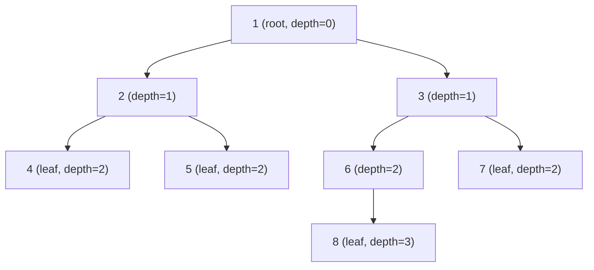
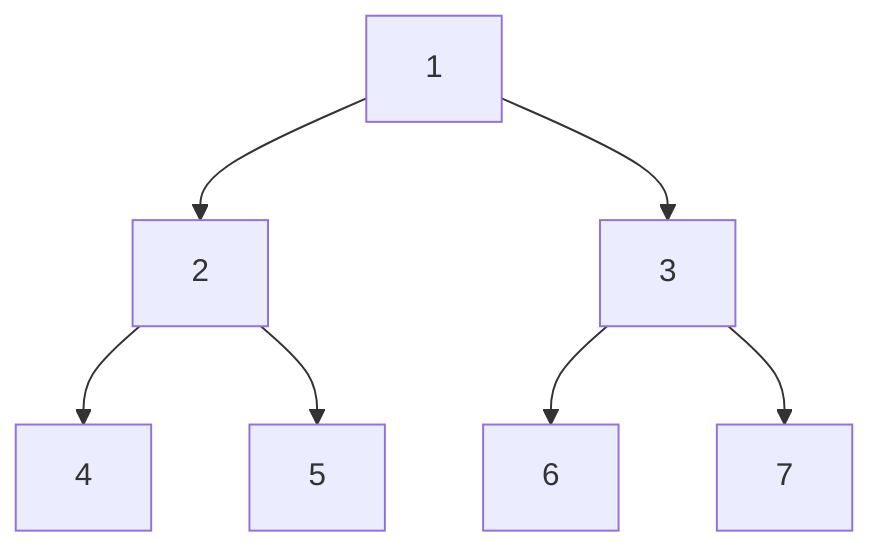

## Learning Objectives

- Define tree terminology: root, leaf, height, depth, subtree, complete, balanced
- Implement DFS traversals (in-order, pre-order, post-order) both recursively and iteratively
- Implement BFS (level-order) traversal using a queue
- Analyze time and space complexity of tree traversals
- Solve common tree problems using recursive decomposition

## Prerequisites

- Stacks and queues (used for iterative traversals)
- Recursion fundamentals (base case, recursive case)
- Linked list node structure concept

## Tree Terminology

A **tree** is a hierarchical data structure with a single **root** node. Each node has zero or more children, and there are no cycles.



| Term | Definition |
|------|-----------|
| **Root** | The topmost node (no parent) |
| **Leaf** | A node with no children |
| **Depth** | Distance from root to this node (root has depth 0) |
| **Height** | Distance from this node to its deepest leaf (leaves have height 0) |
| **Subtree** | A node and all its descendants |
| **Binary tree** | Each node has at most 2 children (left and right) |
| **Complete** | Every level is full except possibly the last, which is filled left to right |
| **Full** | Every node has 0 or 2 children |
| **Perfect** | All leaves at the same depth; all internal nodes have 2 children |
| **Balanced** | Height difference between left and right subtrees is at most 1 for every node |

### Node Structure

```python
class TreeNode:
    def __init__(self, val=0, left=None, right=None):
        self.val = val
        self.left = left
        self.right = right
```

```go
type TreeNode struct {
    Val   int
    Left  *TreeNode
    Right *TreeNode
}
```

### Key Properties

- A binary tree with height h has at most **2^(h+1) - 1** nodes
- A complete binary tree with n nodes has height **⌊log₂ n⌋**
- The number of leaf nodes in a full binary tree = internal nodes + 1

## DFS Traversals

**Depth-First Search** explores as deep as possible before backtracking. There are three orderings based on when you "visit" the current node:



| Traversal | Order | Result | Mnemonic |
|-----------|-------|--------|----------|
| **In-order** | Left → Node → Right | 4, 2, 5, 1, 6, 3, 7 | "In" the middle |
| **Pre-order** | Node → Left → Right | 1, 2, 4, 5, 3, 6, 7 | Node comes first ("pre") |
| **Post-order** | Left → Right → Node | 4, 5, 2, 6, 7, 3, 1 | Node comes last ("post") |

### Recursive Implementations

```python
def inorder(root: TreeNode) -> list[int]:
    if not root:
        return []
    return inorder(root.left) + [root.val] + inorder(root.right)

def preorder(root: TreeNode) -> list[int]:
    if not root:
        return []
    return [root.val] + preorder(root.left) + preorder(root.right)

def postorder(root: TreeNode) -> list[int]:
    if not root:
        return []
    return postorder(root.left) + postorder(root.right) + [root.val]
```

> **Performance Note**: The list concatenation above creates new lists at every level. For production code, use a helper with a result list parameter to avoid O(n²) copying.

```python
def inorder_efficient(root: TreeNode) -> list[int]:
    result = []
    def dfs(node):
        if not node:
            return
        dfs(node.left)
        result.append(node.val)
        dfs(node.right)
    dfs(root)
    return result
```

### Iterative In-Order Traversal (Using Stack)

```python
def inorder_iterative(root: TreeNode) -> list[int]:
    result = []
    stack = []
    curr = root

    while curr or stack:
        while curr:
            stack.append(curr)
            curr = curr.left
        curr = stack.pop()
        result.append(curr.val)
        curr = curr.right

    return result
```

```go
func inorderIterative(root *TreeNode) []int {
    var result []int
    var stack []*TreeNode
    curr := root

    for curr != nil || len(stack) > 0 {
        for curr != nil {
            stack = append(stack, curr)
            curr = curr.Left
        }
        curr = stack[len(stack)-1]
        stack = stack[:len(stack)-1]
        result = append(result, curr.Val)
        curr = curr.Right
    }
    return result
}
```

### Iterative Pre-Order Traversal

```python
def preorder_iterative(root: TreeNode) -> list[int]:
    if not root:
        return []
    result = []
    stack = [root]

    while stack:
        node = stack.pop()
        result.append(node.val)
        if node.right:  # push right first so left is processed first
            stack.append(node.right)
        if node.left:
            stack.append(node.left)

    return result
```

### Iterative Post-Order Traversal

```python
def postorder_iterative(root: TreeNode) -> list[int]:
    if not root:
        return []
    result = []
    stack = [root]

    while stack:
        node = stack.pop()
        result.append(node.val)
        if node.left:
            stack.append(node.left)
        if node.right:
            stack.append(node.right)

    return result[::-1]  # reverse gives post-order
```

## BFS / Level-Order Traversal

**Breadth-First Search** visits nodes level by level using a queue.

```python
from collections import deque

def level_order(root: TreeNode) -> list[list[int]]:
    if not root:
        return []
    result = []
    queue = deque([root])

    while queue:
        level_size = len(queue)
        level = []
        for _ in range(level_size):
            node = queue.popleft()
            level.append(node.val)
            if node.left:
                queue.append(node.left)
            if node.right:
                queue.append(node.right)
        result.append(level)

    return result
```

```go
func levelOrder(root *TreeNode) [][]int {
    if root == nil {
        return nil
    }
    var result [][]int
    queue := []*TreeNode{root}

    for len(queue) > 0 {
        levelSize := len(queue)
        level := make([]int, 0, levelSize)
        for i := 0; i < levelSize; i++ {
            node := queue[0]
            queue = queue[1:]
            level = append(level, node.Val)
            if node.Left != nil {
                queue = append(queue, node.Left)
            }
            if node.Right != nil {
                queue = append(queue, node.Right)
            }
        }
        result = append(result, level)
    }
    return result
}
```

**Time**: O(n). **Space**: O(w) where w is the maximum width (up to n/2 for a complete tree).

## Common Tree Problems

### Maximum Depth (LeetCode 104)

```python
def max_depth(root: TreeNode) -> int:
    if not root:
        return 0
    return 1 + max(max_depth(root.left), max_depth(root.right))
```

### Check If Symmetric (LeetCode 101)

```python
def is_symmetric(root: TreeNode) -> bool:
    def is_mirror(t1, t2):
        if not t1 and not t2:
            return True
        if not t1 or not t2:
            return False
        return (t1.val == t2.val and
                is_mirror(t1.left, t2.right) and
                is_mirror(t1.right, t2.left))
    return is_mirror(root, root)
```

### Diameter of Binary Tree (LeetCode 543)

The diameter is the longest path between any two nodes (may not pass through root).

```python
def diameter_of_binary_tree(root: TreeNode) -> int:
    diameter = 0

    def height(node):
        nonlocal diameter
        if not node:
            return 0
        left_h = height(node.left)
        right_h = height(node.right)
        diameter = max(diameter, left_h + right_h)
        return 1 + max(left_h, right_h)

    height(root)
    return diameter
```

### Lowest Common Ancestor (LeetCode 236)

```python
def lowest_common_ancestor(root, p, q):
    if not root or root == p or root == q:
        return root
    left = lowest_common_ancestor(root.left, p, q)
    right = lowest_common_ancestor(root.right, p, q)
    if left and right:
        return root  # p and q are in different subtrees
    return left or right
```

**Time**: O(n). **Space**: O(h) for call stack.

## Traversal Complexity Summary

| Traversal | Time | Space |
|-----------|------|-------|
| DFS (recursive) | O(n) | O(h) — call stack |
| DFS (iterative) | O(n) | O(h) — explicit stack |
| BFS (level-order) | O(n) | O(w) — queue |

Where h = height (log n for balanced, n for skewed) and w = max width.

## Hands-On Exercises

### Exercise 1: Invert a Binary Tree (LeetCode 226)

```python
def invert_tree(root: TreeNode) -> TreeNode:
    if not root:
        return None
    root.left, root.right = invert_tree(root.right), invert_tree(root.left)
    return root
```

### Exercise 2: Path Sum (LeetCode 112)

Determine if a root-to-leaf path sums to a target.

```python
def has_path_sum(root: TreeNode, target: int) -> bool:
    if not root:
        return False
    if not root.left and not root.right:
        return root.val == target
    remaining = target - root.val
    return (has_path_sum(root.left, remaining) or
            has_path_sum(root.right, remaining))
```

### Exercise 3: Serialize and Deserialize (LeetCode 297)

```python
class Codec:
    def serialize(self, root: TreeNode) -> str:
        vals = []
        def dfs(node):
            if not node:
                vals.append("#")
                return
            vals.append(str(node.val))
            dfs(node.left)
            dfs(node.right)
        dfs(root)
        return ",".join(vals)

    def deserialize(self, data: str) -> TreeNode:
        vals = iter(data.split(","))
        def dfs():
            val = next(vals)
            if val == "#":
                return None
            node = TreeNode(int(val))
            node.left = dfs()
            node.right = dfs()
            return node
        return dfs()
```

## Key Takeaways

- **In-order** on a BST gives sorted output; **pre-order** is useful for serialization; **post-order** for deletion and evaluation
- Recursive traversals are elegant but use O(h) stack space; iterative versions use explicit stacks
- **BFS** is level-by-level — essential for level-order problems and shortest path in unweighted graphs
- Most tree problems follow a **recursive decomposition**: solve for left subtree, solve for right subtree, combine
- The **height** of a balanced tree is O(log n) but degenerates to O(n) for skewed trees — this matters for space analysis

## External Resources

- [Visualgo: Binary Tree Visualization](https://visualgo.net/en/bst)
- [LeetCode Binary Tree Study Plan](https://leetcode.com/study-plan/binary-tree/)
- [Tree Traversal — Wikipedia](https://en.wikipedia.org/wiki/Tree_traversal)
- [NeetCode: Trees Playlist](https://www.youtube.com/playlist?list=PLot-Xpze53ldg4pN6PfzoJY7KsKcxF1jg)
