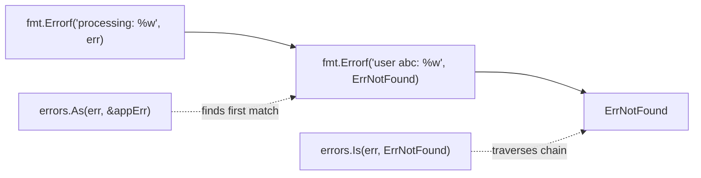

## Learning Objectives

- Implement error wrapping with context using `fmt.Errorf` and `%w`
- Design sentinel errors and custom error types for different use cases
- Use `errors.Is` and `errors.As` for error matching in wrapped chains
- Build custom error types that carry structured metadata
- Implement panic recovery for production resilience
- Choose the right error handling strategy for each layer of your application

## Prerequisites

- Understanding of Go interfaces (errors satisfy the `error` interface)
- Knowledge of function return patterns in Go
- Familiarity with `fmt.Errorf` for error formatting

## Core Concepts

### Error Wrapping

Error wrapping adds context as errors propagate up the call stack. Use `%w` in `fmt.Errorf` to create a chain that preserves the original error.

```go
package repository

import (
    "context"
    "database/sql"
    "fmt"
)

func (r *UserRepo) GetByID(ctx context.Context, id string) (*User, error) {
    var user User
    err := r.db.QueryRowContext(ctx,
        "SELECT id, email, name FROM users WHERE id = $1", id,
    ).Scan(&user.ID, &user.Email, &user.Name)

    if err == sql.ErrNoRows {
        return nil, fmt.Errorf("user %s: %w", id, ErrNotFound)
    }
    if err != nil {
        return nil, fmt.Errorf("querying user %s: %w", id, err)
    }
    return &user, nil
}

// The error chain looks like:
// "querying user abc123: connection refused"
//   └── original error: "connection refused"
```

**When to wrap vs when to return directly:**

```go
// WRAP: adding context about what operation failed
func (s *Service) ProcessOrder(ctx context.Context, id string) error {
    order, err := s.repo.Get(ctx, id)
    if err != nil {
        return fmt.Errorf("processing order %s: %w", id, err)
    }
    // ...
}

// DON'T WRAP: when no additional context to add
func (s *Service) Delete(ctx context.Context, id string) error {
    return s.repo.Delete(ctx, id) // caller already knows the operation
}

// DON'T WRAP with %w: when you want to hide implementation details
func (s *Service) Authenticate(ctx context.Context, token string) error {
    if err := s.validator.Validate(token); err != nil {
        // Use %v (not %w) to break the chain — don't expose internal errors
        return fmt.Errorf("authentication failed: %v", err)
    }
    return nil
}
```

### Sentinel Errors

Sentinel errors are package-level values that callers can compare against. Use them for expected, recoverable conditions.

```go
package domain

import "errors"

var (
    ErrNotFound       = errors.New("not found")
    ErrAlreadyExists  = errors.New("already exists")
    ErrInvalidInput   = errors.New("invalid input")
    ErrUnauthorized   = errors.New("unauthorized")
    ErrForbidden      = errors.New("forbidden")
    ErrConflict       = errors.New("conflict")
    ErrRateLimited    = errors.New("rate limited")
)

// Usage with wrapping — sentinel is preserved in the chain
func (r *Repo) Create(ctx context.Context, user *User) error {
    _, err := r.db.ExecContext(ctx, "INSERT INTO users ...", user.Email)
    if isUniqueViolation(err) {
        return fmt.Errorf("user with email %s: %w", user.Email, ErrAlreadyExists)
    }
    if err != nil {
        return fmt.Errorf("creating user: %w", err)
    }
    return nil
}

// Caller checks with errors.Is (traverses the entire wrapped chain)
func (h *Handler) CreateUser(w http.ResponseWriter, r *http.Request) {
    err := h.service.Create(r.Context(), user)
    if errors.Is(err, ErrAlreadyExists) {
        respondError(w, http.StatusConflict, "user already exists")
        return
    }
    if err != nil {
        respondError(w, http.StatusInternalServerError, "internal error")
        return
    }
}
```

### Custom Error Types

When errors need to carry structured data (HTTP status codes, field-level validation failures, retry hints), define custom error types.

```go
package apperror

import (
    "fmt"
    "net/http"
    "time"
)

type Error struct {
    Code       string            `json:"code"`
    Message    string            `json:"message"`
    HTTPStatus int               `json:"-"`
    Details    map[string]string `json:"details,omitempty"`
    Err        error             `json:"-"`
}

func (e *Error) Error() string {
    if e.Err != nil {
        return fmt.Sprintf("%s: %s: %v", e.Code, e.Message, e.Err)
    }
    return fmt.Sprintf("%s: %s", e.Code, e.Message)
}

func (e *Error) Unwrap() error { return e.Err }

func NotFound(resource, id string) *Error {
    return &Error{
        Code:       "NOT_FOUND",
        Message:    fmt.Sprintf("%s with id '%s' not found", resource, id),
        HTTPStatus: http.StatusNotFound,
        Details:    map[string]string{"resource": resource, "id": id},
    }
}

func Validation(field, reason string) *Error {
    return &Error{
        Code:       "VALIDATION_ERROR",
        Message:    fmt.Sprintf("invalid %s: %s", field, reason),
        HTTPStatus: http.StatusUnprocessableEntity,
        Details:    map[string]string{"field": field, "reason": reason},
    }
}

func Internal(err error) *Error {
    return &Error{
        Code:       "INTERNAL_ERROR",
        Message:    "an unexpected error occurred",
        HTTPStatus: http.StatusInternalServerError,
        Err:        err,
    }
}

// Retryable error with backoff hint
type RetryableError struct {
    Err        error
    RetryAfter time.Duration
}

func (e *RetryableError) Error() string {
    return fmt.Sprintf("retryable: %v (retry after %v)", e.Err, e.RetryAfter)
}

func (e *RetryableError) Unwrap() error { return e.Err }

func IsRetryable(err error) bool {
    var retryErr *RetryableError
    return errors.As(err, &retryErr)
}

func GetRetryAfter(err error) time.Duration {
    var retryErr *RetryableError
    if errors.As(err, &retryErr) {
        return retryErr.RetryAfter
    }
    return 0
}
```

### errors.Is and errors.As

`errors.Is` checks if any error in the chain matches a target value. `errors.As` finds the first error matching a target type.

```go
func handleError(err error) {
    // errors.Is: check for specific sentinel errors
    if errors.Is(err, context.DeadlineExceeded) {
        log.Println("operation timed out")
        return
    }
    if errors.Is(err, sql.ErrNoRows) {
        log.Println("no data found")
        return
    }

    // errors.As: extract typed error for metadata
    var appErr *apperror.Error
    if errors.As(err, &appErr) {
        log.Printf("app error [%s]: %s (HTTP %d)", 
            appErr.Code, appErr.Message, appErr.HTTPStatus)
        return
    }

    var retryErr *RetryableError
    if errors.As(err, &retryErr) {
        log.Printf("will retry after %v: %v", retryErr.RetryAfter, retryErr.Err)
        time.Sleep(retryErr.RetryAfter)
        // retry...
        return
    }

    log.Printf("unexpected error: %v", err)
}
```



### Panic Recovery

Panics should be reserved for truly unrecoverable programmer errors. Use `recover()` at service boundaries to convert panics into errors.

```go
// HTTP middleware that catches panics
func RecoveryMiddleware(logger *slog.Logger) func(http.Handler) http.Handler {
    return func(next http.Handler) http.Handler {
        return http.HandlerFunc(func(w http.ResponseWriter, r *http.Request) {
            defer func() {
                if rec := recover(); rec != nil {
                    // Capture stack trace
                    stack := make([]byte, 4096)
                    n := runtime.Stack(stack, false)

                    logger.Error("panic recovered",
                        "panic", rec,
                        "stack", string(stack[:n]),
                        "method", r.Method,
                        "path", r.URL.Path,
                    )

                    http.Error(w, "Internal Server Error", http.StatusInternalServerError)
                }
            }()
            next.ServeHTTP(w, r)
        })
    }
}

// Safe goroutine launcher
func SafeGo(logger *slog.Logger, fn func()) {
    go func() {
        defer func() {
            if rec := recover(); rec != nil {
                stack := make([]byte, 4096)
                n := runtime.Stack(stack, false)
                logger.Error("goroutine panic",
                    "panic", rec,
                    "stack", string(stack[:n]),
                )
            }
        }()
        fn()
    }()
}

// When to panic:
// 1. Impossible conditions (invariant violations in your own code)
// 2. Initialization failures that make the program unusable
// 3. Indicating programmer error (not user/input error)

func MustParseTemplate(name, tmpl string) *template.Template {
    t, err := template.New(name).Parse(tmpl)
    if err != nil {
        panic(fmt.Sprintf("parsing template %s: %v", name, err))
    }
    return t
}
```

### Error Handling Strategies by Layer

```go
// Repository layer: wrap with context, translate DB-specific errors
func (r *Repo) Get(ctx context.Context, id string) (*Item, error) {
    // ...
    if err == sql.ErrNoRows {
        return nil, fmt.Errorf("item %s: %w", id, domain.ErrNotFound)
    }
    return nil, fmt.Errorf("fetching item %s: %w", id, err)
}

// Service layer: orchestrate, add business context
func (s *Service) Purchase(ctx context.Context, userID, itemID string) error {
    item, err := s.repo.Get(ctx, itemID)
    if err != nil {
        return fmt.Errorf("purchase by user %s: %w", userID, err)
    }
    if item.Stock <= 0 {
        return fmt.Errorf("item %s: %w", itemID, domain.ErrOutOfStock)
    }
    // ...
}

// Handler layer: map errors to HTTP responses
func (h *Handler) Purchase(w http.ResponseWriter, r *http.Request) {
    err := h.service.Purchase(r.Context(), userID, itemID)
    if err == nil {
        respondJSON(w, http.StatusOK, result)
        return
    }

    switch {
    case errors.Is(err, domain.ErrNotFound):
        respondError(w, http.StatusNotFound, err.Error())
    case errors.Is(err, domain.ErrOutOfStock):
        respondError(w, http.StatusConflict, "item out of stock")
    case errors.Is(err, context.DeadlineExceeded):
        respondError(w, http.StatusGatewayTimeout, "request timed out")
    default:
        slog.Error("unhandled error", "error", err)
        respondError(w, http.StatusInternalServerError, "internal error")
    }
}
```

## Best Practices

1. **Wrap errors with `%w` when callers need to inspect them** — use `%v` to hide implementation details
2. **Add context at each layer** — the final error message should read like a stack trace
3. **Use sentinel errors for expected conditions** — `ErrNotFound`, `ErrConflict`, etc.
4. **Use custom error types when metadata is needed** — HTTP codes, retry hints, field names
5. **Handle errors at the right layer** — repositories translate, services orchestrate, handlers map to HTTP
6. **Never ignore errors silently** — at minimum, log them

## Common Pitfalls

```go
// PITFALL: Wrapping with both %w and %v
return fmt.Errorf("failed: %w: %v", err, err) // duplicated!

// PITFALL: Comparing wrapped errors with ==
if err == ErrNotFound { } // WRONG: won't match wrapped errors
if errors.Is(err, ErrNotFound) { } // CORRECT: traverses chain

// PITFALL: Logging and returning (double reporting)
func process() error {
    err := doWork()
    if err != nil {
        log.Printf("error: %v", err) // logged here
        return err                     // AND caller will log too
    }
    return nil
}
// FIX: Either log OR return, not both (return and let caller decide)

// PITFALL: Custom error type that doesn't implement Unwrap
type MyError struct {
    Msg string
    Err error
}
func (e *MyError) Error() string { return e.Msg }
// errors.Is/As can't traverse to e.Err!
// FIX: Add Unwrap() error { return e.Err }
```

## Hands-On Exercises

### Exercise 1: Error Handling Middleware

Build an error-handling middleware that:
1. Accepts handlers returning `(any, error)` instead of writing responses directly
2. Maps domain errors to appropriate HTTP status codes
3. Logs internal errors with request context
4. Returns structured JSON error responses

<details>
<summary>Solution</summary>

```go
package main

import (
    "encoding/json"
    "errors"
    "log/slog"
    "net/http"
)

type AppHandler func(w http.ResponseWriter, r *http.Request) error

type ErrorResponse struct {
    Error ErrorDetail `json:"error"`
}

type ErrorDetail struct {
    Code    string `json:"code"`
    Message string `json:"message"`
}

func HandleErrors(logger *slog.Logger) func(AppHandler) http.HandlerFunc {
    return func(handler AppHandler) http.HandlerFunc {
        return func(w http.ResponseWriter, r *http.Request) {
            err := handler(w, r)
            if err == nil {
                return
            }

            var appErr *Error
            if errors.As(err, &appErr) {
                writeErrorResponse(w, appErr.HTTPStatus, appErr.Code, appErr.Message)
                if appErr.HTTPStatus >= 500 {
                    logger.Error("server error",
                        "code", appErr.Code,
                        "error", err,
                        "path", r.URL.Path,
                    )
                }
                return
            }

            switch {
            case errors.Is(err, ErrNotFound):
                writeErrorResponse(w, 404, "NOT_FOUND", "resource not found")
            case errors.Is(err, ErrUnauthorized):
                writeErrorResponse(w, 401, "UNAUTHORIZED", "authentication required")
            case errors.Is(err, ErrForbidden):
                writeErrorResponse(w, 403, "FORBIDDEN", "insufficient permissions")
            default:
                logger.Error("unhandled error", "error", err, "path", r.URL.Path)
                writeErrorResponse(w, 500, "INTERNAL", "an unexpected error occurred")
            }
        }
    }
}

func writeErrorResponse(w http.ResponseWriter, status int, code, message string) {
    w.Header().Set("Content-Type", "application/json")
    w.WriteHeader(status)
    json.NewEncoder(w).Encode(ErrorResponse{
        Error: ErrorDetail{Code: code, Message: message},
    })
}
```

</details>

## Key Takeaways

- Wrap errors with `%w` to build context; use `%v` to break chains intentionally
- `errors.Is` matches values through wrapped chains; `errors.As` extracts typed errors
- Sentinel errors signal expected conditions; custom types carry structured metadata
- Handle errors at the appropriate layer — don't log AND return
- Recover panics at service boundaries (HTTP handlers, goroutine launchers)
- Error messages should read like a breadcrumb trail: "processing order xyz: fetching user abc: connection refused"

## External Resources

- [Go Blog: Working with Errors in Go 1.13](https://go.dev/blog/go1.13-errors)
- [Go Blog: Errors are Values](https://go.dev/blog/errors-are-values)
- [errors package documentation](https://pkg.go.dev/errors)
- [Dave Cheney: Don't Just Check Errors, Handle Them Gracefully](https://dave.cheney.net/2016/04/27/dont-just-check-errors-handle-them-gracefully)
- [Ben Johnson: Failure is Your Domain](https://middlemost.com/failure-is-your-domain/)
