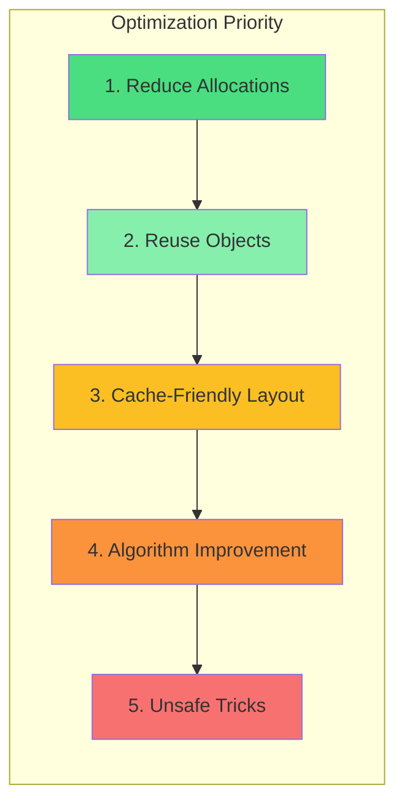

## Learning Objectives

- Understand escape analysis and how it affects allocations
- Optimize memory layout for cache-friendly access patterns
- Implement string interning to reduce memory usage
- Use sync.Pool effectively for high-churn allocations
- Build zero-allocation hot paths
- Apply optimization techniques informed by profiling data

## Prerequisites

- Experience profiling Go programs with pprof
- Understanding of Go's garbage collector behavior
- Knowledge of CPU caches and memory hierarchy basics

## Core Concepts

### Escape Analysis

The Go compiler determines whether a variable can live on the stack (cheap, automatic cleanup) or must escape to the heap (triggers GC pressure). Understanding escape analysis is fundamental to writing allocation-free code.

```go
// STACK: value doesn't escape — zero allocation
func sumLocal(numbers []int) int {
    total := 0 // stays on stack
    for _, n := range numbers {
        total += n
    }
    return total
}

// HEAP: returned pointer forces allocation
func newUser(name string) *User {
    u := User{Name: name} // escapes: address returned
    return &u
}

// HEAP: interface conversion (value must be boxed)
func logValue(v any) { // any = interface{} forces boxing
    fmt.Println(v)
}

// HEAP: captured by closure outliving stack frame
func startWorker() func() int {
    count := 0 // escapes: closure captures it
    return func() int {
        count++
        return count
    }
}
```

```bash
# View escape analysis decisions
go build -gcflags="-m" ./...
# More verbose:
go build -gcflags="-m -m" ./...
```

**Common escape triggers:**

| Trigger | Example | Fix |
|---------|---------|-----|
| Returned pointer | `return &obj` | Return value type if possible |
| Interface conversion | `var w io.Writer = &buf` | Use concrete types in hot paths |
| Closure capture | `go func() { use(x) }()` | Pass as argument instead |
| Slice/map grow | `append(s, item)` beyond cap | Pre-allocate with `make(s, 0, expectedCap)` |
| Large stack object | `var buf [1<<20]byte` | Use sync.Pool |

### Memory Layout and Cache Efficiency

CPU caches work on cache lines (typically 64 bytes). Accessing sequential memory is dramatically faster than random access.

```go
// BAD: Array of Structs (AoS) with poor locality for iteration
type ParticleBad struct {
    X, Y, Z    float64 // position (24 bytes)
    VX, VY, VZ float64 // velocity (24 bytes)
    Mass       float64 // 8 bytes
    Color      [4]byte // 4 bytes — rarely accessed with physics
    Name       string  // 16 bytes — pointer + length, never used in physics loop
}

// Hot loop touches X,Y,Z but loads entire struct per cache line
func updatePositionsBad(particles []ParticleBad, dt float64) {
    for i := range particles {
        particles[i].X += particles[i].VX * dt
        particles[i].Y += particles[i].VY * dt
        particles[i].Z += particles[i].VZ * dt
    }
}

// GOOD: Struct of Arrays (SoA) for cache-friendly iteration
type ParticleSystem struct {
    X, Y, Z    []float64 // position arrays (contiguous in memory)
    VX, VY, VZ []float64 // velocity arrays
    Mass       []float64
    Color      [][4]byte
    Name       []string
    Count      int
}

// Hot loop accesses contiguous float64 slices — excellent cache behavior
func (ps *ParticleSystem) UpdatePositions(dt float64) {
    for i := 0; i < ps.Count; i++ {
        ps.X[i] += ps.VX[i] * dt
        ps.Y[i] += ps.VY[i] * dt
        ps.Z[i] += ps.VZ[i] * dt
    }
}
```

**Struct field ordering matters for padding:**

```go
// BAD: 32 bytes due to padding
type BadLayout struct {
    A bool    // 1 byte + 7 padding
    B int64   // 8 bytes
    C bool    // 1 byte + 7 padding
    D int64   // 8 bytes
}

// GOOD: 24 bytes (no wasted padding)
type GoodLayout struct {
    B int64   // 8 bytes
    D int64   // 8 bytes
    A bool    // 1 byte
    C bool    // 1 byte + 6 padding at end
}
```

```bash
# Check struct sizes and alignment
go install golang.org/x/tools/go/analysis/passes/fieldalignment/cmd/fieldalignment@latest
fieldalignment ./...
```

### String Interning

String interning deduplicates identical strings to save memory when many strings have the same value (e.g., parsing log files, processing CSV data).

```go
package intern

import "sync"

type StringInterner struct {
    mu    sync.RWMutex
    store map[string]string
}

func NewStringInterner() *StringInterner {
    return &StringInterner{store: make(map[string]string)}
}

func (si *StringInterner) Intern(s string) string {
    si.mu.RLock()
    if interned, ok := si.store[s]; ok {
        si.mu.RUnlock()
        return interned
    }
    si.mu.RUnlock()

    si.mu.Lock()
    defer si.mu.Unlock()
    // Double-check after acquiring write lock
    if interned, ok := si.store[s]; ok {
        return interned
    }
    si.store[s] = s
    return s
}

// Usage: parsing millions of log lines where "INFO", "ERROR", "WARN" repeat
func parseLogs(lines []string, interner *StringInterner) []LogEntry {
    entries := make([]LogEntry, 0, len(lines))
    for _, line := range lines {
        level := interner.Intern(extractLevel(line)) // reuses same string allocation
        entries = append(entries, LogEntry{Level: level, Message: line})
    }
    return entries
}
```

### sync.Pool for Object Reuse

sync.Pool reduces GC pressure by reusing objects between requests. Objects may be collected at any GC cycle.

```go
package main

import (
    "bytes"
    "encoding/json"
    "sync"
)

// Pool for JSON encoding buffers
var bufferPool = sync.Pool{
    New: func() any {
        return bytes.NewBuffer(make([]byte, 0, 4096))
    },
}

func MarshalJSON(v any) ([]byte, error) {
    buf := bufferPool.Get().(*bytes.Buffer)
    buf.Reset()
    defer bufferPool.Put(buf)

    enc := json.NewEncoder(buf)
    if err := enc.Encode(v); err != nil {
        return nil, err
    }

    // Return a copy — the buffer goes back to the pool
    result := make([]byte, buf.Len())
    copy(result, buf.Bytes())
    return result, nil
}

// Pool for frequently allocated structs
type Request struct {
    Headers map[string]string
    Body    []byte
    Path    string
    Method  string
}

var requestPool = sync.Pool{
    New: func() any {
        return &Request{
            Headers: make(map[string]string, 8),
            Body:    make([]byte, 0, 1024),
        }
    },
}

func AcquireRequest() *Request {
    return requestPool.Get().(*Request)
}

func ReleaseRequest(r *Request) {
    // Clear sensitive data before returning to pool
    r.Path = ""
    r.Method = ""
    for k := range r.Headers {
        delete(r.Headers, k)
    }
    r.Body = r.Body[:0]
    requestPool.Put(r)
}
```

### Zero-Allocation Patterns

```go
package main

import (
    "strconv"
    "unsafe"
)

// Zero-allocation int-to-string for small numbers
var smallInts = [...]string{
    "0", "1", "2", "3", "4", "5", "6", "7", "8", "9",
    "10", "11", "12", "13", "14", "15", "16", "17", "18", "19",
    "20", "21", "22", "23", "24", "25", "26", "27", "28", "29",
    "30", "31",
}

func itoa(i int) string {
    if i >= 0 && i < len(smallInts) {
        return smallInts[i]
    }
    return strconv.Itoa(i)
}

// Zero-allocation string↔[]byte conversion (UNSAFE, read-only!)
func unsafeStringToBytes(s string) []byte {
    return unsafe.Slice(unsafe.StringData(s), len(s))
}

func unsafeBytesToString(b []byte) string {
    return unsafe.String(unsafe.SliceData(b), len(b))
}

// Pre-allocated scratch buffer pattern
type Encoder struct {
    scratch [64]byte // stack-allocated scratch space
}

func (e *Encoder) EncodeInt(n int64) []byte {
    return strconv.AppendInt(e.scratch[:0], n, 10)
}

func (e *Encoder) EncodeFloat(f float64) []byte {
    return strconv.AppendFloat(e.scratch[:0], f, 'f', -1, 64)
}

// Slice reuse pattern: grow once, reuse capacity
type BatchProcessor struct {
    results []Result // reused across calls
}

func (bp *BatchProcessor) Process(items []Item) []Result {
    bp.results = bp.results[:0] // reset length, keep capacity
    for _, item := range items {
        bp.results = append(bp.results, transform(item))
    }
    return bp.results
}
```

### Benchmark-Driven Optimization

```go
func BenchmarkJSONMarshal(b *testing.B) {
    data := generateTestData() // large struct

    b.Run("stdlib", func(b *testing.B) {
        b.ReportAllocs()
        for i := 0; i < b.N; i++ {
            json.Marshal(data)
        }
    })

    b.Run("pooled-buffer", func(b *testing.B) {
        b.ReportAllocs()
        for i := 0; i < b.N; i++ {
            MarshalJSON(data)
        }
    })

    b.Run("pre-allocated", func(b *testing.B) {
        b.ReportAllocs()
        buf := make([]byte, 0, 4096)
        for i := 0; i < b.N; i++ {
            buf = buf[:0]
            var err error
            buf, err = appendJSON(buf, data)
            _ = err
        }
    })
}

// Output comparison:
// BenchmarkJSONMarshal/stdlib-8         200000   8523 ns/op   4096 B/op   42 allocs/op
// BenchmarkJSONMarshal/pooled-buffer-8  350000   4521 ns/op   2048 B/op   12 allocs/op
// BenchmarkJSONMarshal/pre-allocated-8  500000   2105 ns/op      0 B/op    0 allocs/op
```

### GC Tuning

```go
import "runtime"

func init() {
    // GOGC controls GC frequency (default: 100)
    // Higher = less frequent GC, more memory usage
    // Lower = more frequent GC, less memory
    // runtime.SetGCPercent(200) // or GOGC=200 env var

    // GOMEMLIMIT (Go 1.19+): soft memory limit
    // Prevents OOM by triggering GC more aggressively near limit
    // runtime.SetMemoryLimit(2 << 30) // 2GB limit
    // or: GOMEMLIMIT=2GiB
}
```



## Best Practices

1. **Profile first, optimize second** — never guess where bottlenecks are
2. **Reduce allocations before reusing objects** — the best allocation is no allocation
3. **Pre-allocate slices and maps** — `make([]T, 0, expectedLen)` avoids growth copies
4. **Use value types over pointer types in hot loops** — fewer indirections, better cache behavior
5. **Benchmark with realistic data** — micro-benchmarks can be misleading
6. **Use `unsafe` as a last resort** — correctness is more important than speed

## Common Pitfalls

```go
// PITFALL: Optimizing code that doesn't matter
// If a function runs once at startup, making it zero-alloc is pointless

// PITFALL: sync.Pool with varying object sizes
// Pool caches objects of all sizes — can waste memory if sizes vary wildly

// PITFALL: Premature use of unsafe
// unsafe breaks garbage collector guarantees and portability

// PITFALL: Over-pooling
// sync.Pool objects can be collected at any GC — don't pool database connections
// (use dedicated connection pools for that)

// PITFALL: Growing map in hot loop
m := make(map[string]int) // starts small, grows with rehashing
// FIX: pre-size if count is known
m := make(map[string]int, expectedCount)
```

## Hands-On Exercises

### Exercise 1: Optimize a CSV Parser

Given this naive CSV parser that creates millions of allocations, optimize it to minimize heap allocations:

```go
func ParseCSV(data string) [][]string {
    var result [][]string
    lines := strings.Split(data, "\n")
    for _, line := range lines {
        fields := strings.Split(line, ",")
        result = append(result, fields)
    }
    return result
}
```

<details>
<summary>Solution</summary>

```go
func ParseCSVOptimized(data string) [][]string {
    // Count lines to pre-allocate
    lineCount := strings.Count(data, "\n") + 1
    result := make([][]string, 0, lineCount)

    // Estimate average fields per line
    avgFields := 8

    remaining := data
    for len(remaining) > 0 {
        lineEnd := strings.IndexByte(remaining, '\n')
        var line string
        if lineEnd < 0 {
            line = remaining
            remaining = ""
        } else {
            line = remaining[:lineEnd]
            remaining = remaining[lineEnd+1:]
        }

        if len(line) == 0 {
            continue
        }

        // Count commas to pre-allocate fields slice
        fieldCount := strings.Count(line, ",") + 1
        fields := make([]string, 0, fieldCount)

        for len(line) > 0 {
            commaIdx := strings.IndexByte(line, ',')
            if commaIdx < 0 {
                fields = append(fields, line)
                break
            }
            fields = append(fields, line[:commaIdx])
            line = line[commaIdx+1:]
        }

        result = append(result, fields)
        _ = avgFields
    }

    return result
}

// Even faster: reuse a field buffer for scanning
type CSVScanner struct {
    fields []string
}

func (s *CSVScanner) Parse(data string, callback func(fields []string)) {
    remaining := data
    for len(remaining) > 0 {
        lineEnd := strings.IndexByte(remaining, '\n')
        var line string
        if lineEnd < 0 {
            line = remaining
            remaining = ""
        } else {
            line = remaining[:lineEnd]
            remaining = remaining[lineEnd+1:]
        }

        s.fields = s.fields[:0]
        for len(line) > 0 {
            commaIdx := strings.IndexByte(line, ',')
            if commaIdx < 0 {
                s.fields = append(s.fields, line)
                break
            }
            s.fields = append(s.fields, line[:commaIdx])
            line = line[commaIdx+1:]
        }

        callback(s.fields)
    }
}
```

</details>

## Key Takeaways

- Escape analysis determines stack vs heap placement — understand its triggers
- Pre-allocate slices and maps when sizes are known or estimatable
- Struct field ordering affects memory layout due to alignment padding
- sync.Pool recycles objects between GC cycles — ideal for request-scoped buffers
- Zero-allocation patterns trade readability for performance — use only in hot paths
- Always validate optimizations with benchmarks and pprof profiles

## External Resources

- [Go Blog: Allocation Efficiency](https://go.dev/blog/ismmkeynote)
- [Go GC Guide](https://tip.golang.org/doc/gc-guide)
- [Dave Cheney: High Performance Go Workshop](https://dave.cheney.net/high-performance-go-workshop/dotgo-paris.html)
- [Bryan Boreham: An Introduction to the Go Compiler](https://www.youtube.com/watch?v=KINIAgRpkDA)
- [Go Memory Model](https://go.dev/ref/mem)
