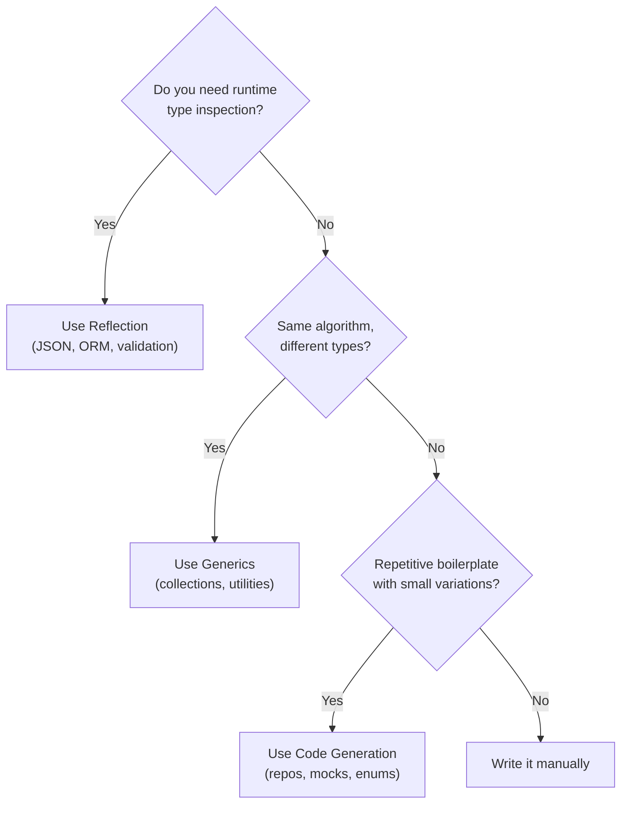

## Learning Objectives

- Use the reflect package to inspect types and values at runtime
- Parse and utilize struct tags for custom behavior
- Generate code with `go generate` and text/template
- Build custom code generators for boilerplate elimination
- Understand when reflection is appropriate vs overkill

## Prerequisites

- Deep understanding of Go interfaces and type system
- Familiarity with the empty interface (`any`)
- Knowledge of struct tags from JSON/DB packages

## Core Concepts

### The reflect Package

Reflection lets you inspect and manipulate types and values at runtime. It's the foundation of `encoding/json`, `database/sql`, and most ORM/serialization libraries.

```go
package main

import (
    "fmt"
    "reflect"
)

type User struct {
    ID       int    `json:"id" db:"id" validate:"required"`
    Name     string `json:"name" db:"name" validate:"required,min=2"`
    Email    string `json:"email" db:"email" validate:"required,email"`
    IsAdmin  bool   `json:"is_admin" db:"is_admin"`
}

func inspectStruct(v any) {
    t := reflect.TypeOf(v)
    val := reflect.ValueOf(v)

    // Handle pointers
    if t.Kind() == reflect.Ptr {
        t = t.Elem()
        val = val.Elem()
    }

    fmt.Printf("Type: %s (Kind: %s)\n", t.Name(), t.Kind())
    fmt.Printf("Fields: %d\n\n", t.NumField())

    for i := 0; i < t.NumField(); i++ {
        field := t.Field(i)
        value := val.Field(i)

        fmt.Printf("  %s (%s) = %v\n", field.Name, field.Type, value.Interface())
        fmt.Printf("    json: %q\n", field.Tag.Get("json"))
        fmt.Printf("    db:   %q\n", field.Tag.Get("db"))
        fmt.Printf("    validate: %q\n\n", field.Tag.Get("validate"))
    }
}

func main() {
    user := User{ID: 1, Name: "Alice", Email: "alice@example.com", IsAdmin: true}
    inspectStruct(user)
}
```

### Struct Tags for Custom Behavior

Struct tags are key-value metadata attached to struct fields. Build custom tag parsers for your own frameworks.

```go
package mapper

import (
    "fmt"
    "reflect"
    "strings"
)

type FieldMapping struct {
    FieldName  string
    ColumnName string
    OmitEmpty  bool
    Required   bool
}

func ParseTag(tag string) FieldMapping {
    var m FieldMapping
    parts := strings.Split(tag, ",")
    if len(parts) > 0 {
        m.ColumnName = parts[0]
    }
    for _, opt := range parts[1:] {
        switch opt {
        case "omitempty":
            m.OmitEmpty = true
        case "required":
            m.Required = true
        }
    }
    return m
}

func GetMappings(v any) []FieldMapping {
    t := reflect.TypeOf(v)
    if t.Kind() == reflect.Ptr {
        t = t.Elem()
    }

    var mappings []FieldMapping
    for i := 0; i < t.NumField(); i++ {
        field := t.Field(i)
        tag := field.Tag.Get("db")
        if tag == "" || tag == "-" {
            continue
        }
        m := ParseTag(tag)
        m.FieldName = field.Name
        mappings = append(mappings, m)
    }
    return mappings
}

// Generic struct-to-map converter using reflection
func StructToMap(v any, tagName string) map[string]any {
    result := make(map[string]any)
    val := reflect.ValueOf(v)
    t := val.Type()

    if t.Kind() == reflect.Ptr {
        val = val.Elem()
        t = t.Elem()
    }

    for i := 0; i < t.NumField(); i++ {
        field := t.Field(i)
        tag := field.Tag.Get(tagName)
        if tag == "" || tag == "-" {
            continue
        }

        name := strings.Split(tag, ",")[0]
        value := val.Field(i)

        if strings.Contains(tag, "omitempty") && value.IsZero() {
            continue
        }

        result[name] = value.Interface()
    }
    return result
}
```

### Dynamic Function Invocation

```go
func CallMethod(obj any, methodName string, args ...any) ([]any, error) {
    val := reflect.ValueOf(obj)
    method := val.MethodByName(methodName)
    if !method.IsValid() {
        return nil, fmt.Errorf("method %s not found on %T", methodName, obj)
    }

    // Convert args to reflect.Values
    in := make([]reflect.Value, len(args))
    for i, arg := range args {
        in[i] = reflect.ValueOf(arg)
    }

    // Call the method
    results := method.Call(in)

    // Convert results back
    out := make([]any, len(results))
    for i, r := range results {
        out[i] = r.Interface()
    }
    return out, nil
}

// Building a simple validator using reflection
type Validator struct {
    rules map[string]func(reflect.Value) error
}

func NewValidator() *Validator {
    v := &Validator{rules: make(map[string]func(reflect.Value) error)}
    v.rules["required"] = func(val reflect.Value) error {
        if val.IsZero() {
            return fmt.Errorf("field is required")
        }
        return nil
    }
    v.rules["min"] = func(val reflect.Value) error {
        // parse min value from tag...
        return nil
    }
    return v
}

func (v *Validator) Validate(obj any) map[string][]string {
    errors := make(map[string][]string)
    val := reflect.ValueOf(obj)
    t := val.Type()

    if t.Kind() == reflect.Ptr {
        val = val.Elem()
        t = t.Elem()
    }

    for i := 0; i < t.NumField(); i++ {
        field := t.Field(i)
        tag := field.Tag.Get("validate")
        if tag == "" {
            continue
        }

        rules := strings.Split(tag, ",")
        for _, rule := range rules {
            ruleName := strings.Split(rule, "=")[0]
            if fn, ok := v.rules[ruleName]; ok {
                if err := fn(val.Field(i)); err != nil {
                    errors[field.Name] = append(errors[field.Name], err.Error())
                }
            }
        }
    }

    if len(errors) == 0 {
        return nil
    }
    return errors
}
```

### Code Generation with go generate

`go generate` runs commands embedded in source files, typically to produce Go code from templates or schemas.

```go
// In your source file, add a generate directive:
//go:generate stringer -type=Status
//go:generate mockgen -source=interfaces.go -destination=mocks/mocks.go

type Status int

const (
    StatusPending Status = iota
    StatusActive
    StatusSuspended
    StatusClosed
)
```

**Custom code generator using text/template:**

```go
// cmd/genrepo/main.go — generates repository boilerplate
package main

import (
    "flag"
    "os"
    "text/template"
)

type ModelDef struct {
    Package   string
    ModelName string
    TableName string
    Fields    []FieldDef
}

type FieldDef struct {
    Name       string
    Type       string
    Column     string
    PrimaryKey bool
}

var repoTemplate = `// Code generated by genrepo; DO NOT EDIT.
package {{.Package}}

import (
    "context"
    "database/sql"
    "fmt"
)

type {{.ModelName}}Repository struct {
    db *sql.DB
}

func New{{.ModelName}}Repository(db *sql.DB) *{{.ModelName}}Repository {
    return &{{.ModelName}}Repository{db: db}
}

func (r *{{.ModelName}}Repository) GetByID(ctx context.Context, id {{pkType .Fields}}) (*{{.ModelName}}, error) {
    var m {{.ModelName}}
    err := r.db.QueryRowContext(ctx,
        "SELECT {{columns .Fields}} FROM {{.TableName}} WHERE {{pkColumn .Fields}} = $1", id,
    ).Scan({{scanFields .Fields}})
    if err == sql.ErrNoRows {
        return nil, nil
    }
    if err != nil {
        return nil, fmt.Errorf("getting {{.ModelName}} by id: %w", err)
    }
    return &m, nil
}

func (r *{{.ModelName}}Repository) Create(ctx context.Context, m *{{.ModelName}}) error {
    _, err := r.db.ExecContext(ctx,
        "INSERT INTO {{.TableName}} ({{insertColumns .Fields}}) VALUES ({{placeholders .Fields}})",
        {{insertValues .Fields}},
    )
    if err != nil {
        return fmt.Errorf("creating {{.ModelName}}: %w", err)
    }
    return nil
}
`

func main() {
    modelName := flag.String("model", "", "Model name")
    tableName := flag.String("table", "", "Table name")
    output := flag.String("output", "", "Output file")
    flag.Parse()

    model := ModelDef{
        Package:   "repository",
        ModelName: *modelName,
        TableName: *tableName,
        Fields: []FieldDef{
            {Name: "ID", Type: "int64", Column: "id", PrimaryKey: true},
            {Name: "Name", Type: "string", Column: "name"},
            {Name: "Email", Type: "string", Column: "email"},
        },
    }

    funcMap := template.FuncMap{
        "columns":       generateColumns,
        "pkColumn":      getPKColumn,
        "pkType":        getPKType,
        "scanFields":    generateScanFields,
        "insertColumns": generateInsertColumns,
        "placeholders":  generatePlaceholders,
        "insertValues":  generateInsertValues,
    }

    tmpl := template.Must(template.New("repo").Funcs(funcMap).Parse(repoTemplate))

    f, _ := os.Create(*output)
    defer f.Close()
    tmpl.Execute(f, model)
}
```

```bash
# Generate repository code
//go:generate go run ./cmd/genrepo -model=User -table=users -output=repository/user_gen.go
//go:generate go run ./cmd/genrepo -model=Order -table=orders -output=repository/order_gen.go

# Run all generators
go generate ./...
```

### When to Use Reflection vs Generics vs Code Generation



| Approach | Performance | Type Safety | Flexibility |
|----------|-------------|-------------|-------------|
| Reflection | Slow (10-100x) | None (runtime panics) | Maximum |
| Generics | Fast (compile-time) | Full | Moderate |
| Code generation | Fast (no overhead) | Full | Maximum |
| Manual code | Fast | Full | Low (repetitive) |

## Best Practices

1. **Avoid reflection in hot paths** — it's 10-100x slower than direct access
2. **Cache reflection results** — `reflect.TypeOf` is cheap; use it once and store field info
3. **Generated code should be clearly marked** — `// Code generated by X; DO NOT EDIT.`
4. **Run `go generate` in CI** — verify generated code is up to date
5. **Prefer generics over reflection when possible** — introduced in Go 1.18, often sufficient

## Common Pitfalls

```go
// PITFALL: Modifying unexported fields via reflection
field := val.Field(i)
field.Set(reflect.ValueOf("new value")) // PANICS if field is unexported!

// FIX: Check CanSet()
if field.CanSet() {
    field.Set(reflect.ValueOf("new value"))
}

// PITFALL: Wrong kind assumption
func process(v any) {
    val := reflect.ValueOf(v)
    val.Len() // PANICS if v is not a slice/array/map/string/channel
}

// FIX: Check kind first
if val.Kind() == reflect.Slice {
    for i := 0; i < val.Len(); i++ { /* ... */ }
}

// PITFALL: reflect.DeepEqual with nil slices
var a []int = nil
b := []int{}
reflect.DeepEqual(a, b) // false! nil != empty slice
```

## Hands-On Exercises

### Exercise 1: Configuration Loader

Build a configuration loader that reads environment variables into a struct using struct tags:

```go
type Config struct {
    Port     int    `env:"PORT" default:"8080"`
    Host     string `env:"HOST" default:"localhost"`
    Debug    bool   `env:"DEBUG" default:"false"`
    DBUrl    string `env:"DATABASE_URL" required:"true"`
}
```

<details>
<summary>Solution</summary>

```go
package config

import (
    "fmt"
    "os"
    "reflect"
    "strconv"
    "strings"
)

func Load(cfg any) error {
    val := reflect.ValueOf(cfg)
    if val.Kind() != reflect.Ptr || val.Elem().Kind() != reflect.Struct {
        return fmt.Errorf("cfg must be a pointer to a struct")
    }

    val = val.Elem()
    t := val.Type()

    for i := 0; i < t.NumField(); i++ {
        field := t.Field(i)
        fieldVal := val.Field(i)

        envKey := field.Tag.Get("env")
        if envKey == "" {
            continue
        }

        envValue := os.Getenv(envKey)
        if envValue == "" {
            envValue = field.Tag.Get("default")
        }

        if envValue == "" {
            if field.Tag.Get("required") == "true" {
                return fmt.Errorf("required environment variable %s not set", envKey)
            }
            continue
        }

        if err := setField(fieldVal, envValue); err != nil {
            return fmt.Errorf("setting %s: %w", field.Name, err)
        }
    }
    return nil
}

func setField(field reflect.Value, value string) error {
    switch field.Kind() {
    case reflect.String:
        field.SetString(value)
    case reflect.Int, reflect.Int64:
        n, err := strconv.ParseInt(value, 10, 64)
        if err != nil {
            return err
        }
        field.SetInt(n)
    case reflect.Bool:
        b, err := strconv.ParseBool(value)
        if err != nil {
            return err
        }
        field.SetBool(b)
    case reflect.Float64:
        f, err := strconv.ParseFloat(value, 64)
        if err != nil {
            return err
        }
        field.SetFloat(f)
    case reflect.Slice:
        if field.Type().Elem().Kind() == reflect.String {
            parts := strings.Split(value, ",")
            field.Set(reflect.ValueOf(parts))
        }
    default:
        return fmt.Errorf("unsupported field type: %s", field.Kind())
    }
    return nil
}
```

</details>

## Key Takeaways

- Reflection enables runtime type inspection but at significant performance cost
- Struct tags provide metadata for serialization, validation, and custom frameworks
- Code generation produces zero-overhead, type-safe code from templates
- `go generate` integrates code generation into the build workflow
- Prefer generics over reflection when the type set is known at compile time
- Cache reflection metadata to amortize its cost in hot paths

## External Resources

- [reflect package documentation](https://pkg.go.dev/reflect)
- [Go Blog: The Laws of Reflection](https://go.dev/blog/laws-of-reflection)
- [Go Blog: Generating Code](https://go.dev/blog/generate)
- [text/template package](https://pkg.go.dev/text/template)
- [Rob Pike: Go Generate](https://docs.google.com/document/d/1V03LUfjSADDooDMhe-_K59EgpTEm3V8uvQRuNMAEnjg)
