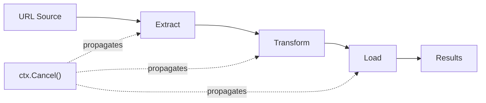

## Learning Objectives

- Implement production-grade worker pool patterns
- Build multi-stage pipelines with proper cancellation
- Use context for timeout and cancellation propagation
- Implement semaphores to bound concurrency
- Leverage errgroup for concurrent error handling
- Combine patterns to solve real-world concurrency challenges

## Prerequisites

- Strong understanding of goroutines, channels, and select
- Familiarity with sync primitives (Mutex, WaitGroup)
- Understanding of context package basics

## Core Concepts

### Worker Pool Pattern

A worker pool bounds concurrency by running a fixed number of goroutines that consume work from a shared channel. This prevents resource exhaustion under high load.

```go
package main

import (
    "context"
    "fmt"
    "log"
    "sync"
    "time"
)

type Job struct {
    ID      int
    Payload string
}

type Result struct {
    JobID    int
    Output   string
    Duration time.Duration
    Err      error
}

func worker(ctx context.Context, id int, jobs <-chan Job, results chan<- Result) {
    for job := range jobs {
        select {
        case <-ctx.Done():
            results <- Result{JobID: job.ID, Err: ctx.Err()}
            return
        default:
        }

        start := time.Now()
        output, err := processJob(job)
        results <- Result{
            JobID:    job.ID,
            Output:   output,
            Duration: time.Since(start),
            Err:      err,
        }
    }
}

func processJob(j Job) (string, error) {
    time.Sleep(50 * time.Millisecond) // simulate work
    return fmt.Sprintf("processed-%s", j.Payload), nil
}

func RunWorkerPool(ctx context.Context, numWorkers int, jobs []Job) []Result {
    jobsCh := make(chan Job, len(jobs))
    resultsCh := make(chan Result, len(jobs))

    var wg sync.WaitGroup
    for i := 0; i < numWorkers; i++ {
        wg.Add(1)
        go func(workerID int) {
            defer wg.Done()
            worker(ctx, workerID, jobsCh, resultsCh)
        }(i)
    }

    for _, job := range jobs {
        jobsCh <- job
    }
    close(jobsCh)

    go func() {
        wg.Wait()
        close(resultsCh)
    }()

    var results []Result
    for r := range resultsCh {
        results = append(results, r)
    }
    return results
}

func main() {
    ctx, cancel := context.WithTimeout(context.Background(), 5*time.Second)
    defer cancel()

    jobs := make([]Job, 100)
    for i := range jobs {
        jobs[i] = Job{ID: i, Payload: fmt.Sprintf("item-%d", i)}
    }

    results := RunWorkerPool(ctx, 10, jobs)
    log.Printf("Processed %d jobs", len(results))
}
```

### Pipeline Pattern

Pipelines connect stages where each stage is a group of goroutines running the same function, reading from inbound channels and writing to outbound channels.

```go
package pipeline

import "context"

type Stage[In, Out any] func(ctx context.Context, in <-chan In) <-chan Out

func Chain[A, B, C any](
    ctx context.Context,
    source <-chan A,
    stage1 Stage[A, B],
    stage2 Stage[B, C],
) <-chan C {
    return stage2(ctx, stage1(ctx, source))
}

// Example: ETL pipeline
func Extract(ctx context.Context, in <-chan string) <-chan RawRecord {
    out := make(chan RawRecord)
    go func() {
        defer close(out)
        for url := range in {
            select {
            case <-ctx.Done():
                return
            default:
            }
            record, err := fetchRecord(url)
            if err != nil {
                continue
            }
            out <- record
        }
    }()
    return out
}

func Transform(ctx context.Context, in <-chan RawRecord) <-chan CleanRecord {
    out := make(chan CleanRecord)
    go func() {
        defer close(out)
        for raw := range in {
            select {
            case <-ctx.Done():
                return
            default:
            }
            clean := normalize(raw)
            if validate(clean) {
                out <- clean
            }
        }
    }()
    return out
}

func Load(ctx context.Context, in <-chan CleanRecord) <-chan LoadResult {
    out := make(chan LoadResult)
    go func() {
        defer close(out)
        for record := range in {
            select {
            case <-ctx.Done():
                return
            default:
            }
            err := insertToDB(record)
            out <- LoadResult{Record: record, Err: err}
        }
    }()
    return out
}
```



### Context Cancellation

Context is Go's mechanism for deadline propagation, cancellation signaling, and request-scoped values across API boundaries.

```go
package main

import (
    "context"
    "fmt"
    "log"
    "net/http"
    "time"
)

func handleSearch(w http.ResponseWriter, r *http.Request) {
    // Derive context from request — cancelled if client disconnects
    ctx := r.Context()

    query := r.URL.Query().Get("q")
    if query == "" {
        http.Error(w, "missing query parameter", http.StatusBadRequest)
        return
    }

    // Add a timeout for this specific operation
    ctx, cancel := context.WithTimeout(ctx, 3*time.Second)
    defer cancel()

    results, err := search(ctx, query)
    if err != nil {
        if ctx.Err() == context.DeadlineExceeded {
            http.Error(w, "search timed out", http.StatusGatewayTimeout)
            return
        }
        if ctx.Err() == context.Canceled {
            return // client disconnected, no point responding
        }
        http.Error(w, "search failed", http.StatusInternalServerError)
        return
    }

    fmt.Fprintf(w, "Results: %v", results)
}

func search(ctx context.Context, query string) ([]string, error) {
    resultCh := make(chan []string, 1)
    errCh := make(chan error, 1)

    go func() {
        results, err := queryDatabase(query)
        if err != nil {
            errCh <- err
            return
        }
        resultCh <- results
    }()

    select {
    case results := <-resultCh:
        return results, nil
    case err := <-errCh:
        return nil, err
    case <-ctx.Done():
        return nil, ctx.Err()
    }
}
```

**Context best practices:**
- Pass context as the first parameter to every function that does I/O
- Never store context in a struct — pass it explicitly
- Use `context.WithTimeout` or `context.WithDeadline` for operational bounds
- Check `ctx.Err()` in hot loops and before expensive operations

### Semaphore Pattern

A semaphore limits concurrent access to a resource. In Go, a buffered channel is the simplest implementation.

```go
package main

import (
    "context"
    "fmt"
    "time"

    "golang.org/x/sync/semaphore"
)

// Using buffered channel as semaphore
type ChanSemaphore struct {
    sem chan struct{}
}

func NewChanSemaphore(maxConcurrency int) *ChanSemaphore {
    return &ChanSemaphore{sem: make(chan struct{}, maxConcurrency)}
}

func (s *ChanSemaphore) Acquire() { s.sem <- struct{}{} }
func (s *ChanSemaphore) Release() { <-s.sem }

// Using golang.org/x/sync/semaphore (weighted)
func processWithSemaphore(ctx context.Context, items []string, maxConcurrency int64) error {
    sem := semaphore.NewWeighted(maxConcurrency)

    for _, item := range items {
        if err := sem.Acquire(ctx, 1); err != nil {
            return fmt.Errorf("acquiring semaphore: %w", err)
        }

        go func(it string) {
            defer sem.Release(1)
            process(it)
        }(item)
    }

    // Wait for all goroutines to finish
    if err := sem.Acquire(ctx, maxConcurrency); err != nil {
        return fmt.Errorf("waiting for completion: %w", err)
    }
    return nil
}

func process(item string) {
    time.Sleep(100 * time.Millisecond)
    fmt.Println("processed:", item)
}
```

### Errgroup: Concurrent Error Handling

`golang.org/x/sync/errgroup` combines WaitGroup semantics with error propagation and context cancellation.

```go
package main

import (
    "context"
    "fmt"
    "net/http"

    "golang.org/x/sync/errgroup"
)

type UserProfile struct {
    User    User
    Posts   []Post
    Friends []User
}

func FetchUserProfile(ctx context.Context, userID string) (*UserProfile, error) {
    g, ctx := errgroup.WithContext(ctx)
    var profile UserProfile

    g.Go(func() error {
        user, err := fetchUser(ctx, userID)
        if err != nil {
            return fmt.Errorf("fetching user: %w", err)
        }
        profile.User = user
        return nil
    })

    g.Go(func() error {
        posts, err := fetchPosts(ctx, userID)
        if err != nil {
            return fmt.Errorf("fetching posts: %w", err)
        }
        profile.Posts = posts
        return nil
    })

    g.Go(func() error {
        friends, err := fetchFriends(ctx, userID)
        if err != nil {
            return fmt.Errorf("fetching friends: %w", err)
        }
        profile.Friends = friends
        return nil
    })

    if err := g.Wait(); err != nil {
        return nil, err
    }
    return &profile, nil
}
```

**Errgroup with concurrency limit (Go 1.20+):**

```go
func ProcessFiles(ctx context.Context, paths []string) error {
    g, ctx := errgroup.WithContext(ctx)
    g.SetLimit(10) // max 10 concurrent goroutines

    for _, path := range paths {
        path := path
        g.Go(func() error {
            return processFile(ctx, path)
        })
    }

    return g.Wait()
}
```

### Combining Patterns: Resilient Data Pipeline

```go
package main

import (
    "context"
    "fmt"
    "log/slog"
    "time"

    "golang.org/x/sync/errgroup"
)

type PipelineConfig struct {
    FetchWorkers    int
    ProcessWorkers  int
    BatchSize       int
    FetchTimeout    time.Duration
}

func RunPipeline(ctx context.Context, cfg PipelineConfig, sources []string) error {
    g, ctx := errgroup.WithContext(ctx)

    // Stage 1: Fetch (bounded concurrency)
    rawData := make(chan []byte, cfg.BatchSize)
    g.Go(func() error {
        defer close(rawData)
        sem := make(chan struct{}, cfg.FetchWorkers)

        for _, src := range sources {
            select {
            case <-ctx.Done():
                return ctx.Err()
            case sem <- struct{}{}:
            }

            src := src
            g.Go(func() error {
                defer func() { <-sem }()

                fetchCtx, cancel := context.WithTimeout(ctx, cfg.FetchTimeout)
                defer cancel()

                data, err := fetch(fetchCtx, src)
                if err != nil {
                    slog.Warn("fetch failed", "source", src, "error", err)
                    return nil // non-fatal: skip this source
                }

                select {
                case rawData <- data:
                case <-ctx.Done():
                    return ctx.Err()
                }
                return nil
            })
        }
        return nil
    })

    // Stage 2: Process (worker pool)
    processed := make(chan Result, cfg.BatchSize)
    for i := 0; i < cfg.ProcessWorkers; i++ {
        g.Go(func() error {
            for data := range rawData {
                result, err := transform(ctx, data)
                if err != nil {
                    return fmt.Errorf("transform: %w", err)
                }
                select {
                case processed <- result:
                case <-ctx.Done():
                    return ctx.Err()
                }
            }
            return nil
        })
    }

    // Stage 3: Collect
    g.Go(func() error {
        for result := range processed {
            if err := store(ctx, result); err != nil {
                return fmt.Errorf("store: %w", err)
            }
        }
        return nil
    })

    return g.Wait()
}
```

## Best Practices

1. **Size worker pools based on workload type** — CPU-bound: `runtime.NumCPU()`; I/O-bound: higher multiplier based on expected latency
2. **Always propagate context** — enables graceful shutdown from top to bottom
3. **Use errgroup over manual WaitGroup+error handling** — less boilerplate, automatic cancellation
4. **Close channels from the producer side** — signals completion without coordination overhead
5. **Make pipeline stages independently testable** — each stage should be a function accepting and returning channels

## Common Pitfalls

```go
// GOROUTINE LEAK: blocked on send when context cancelled
go func() {
    result := expensiveWork()
    ch <- result // blocks forever if nobody reads ch
}()

// FIX: always select with ctx.Done
go func() {
    result := expensiveWork()
    select {
    case ch <- result:
    case <-ctx.Done():
    }
}()

// DEADLOCK: closing channel twice or in wrong goroutine
close(ch) // if multiple producers, who closes?

// FIX: use sync.WaitGroup to close after all producers finish
go func() {
    wg.Wait()
    close(ch)
}()
```

## Hands-On Exercises

### Exercise 1: Bounded Parallel HTTP Fetcher

Build a function that fetches N URLs with at most M concurrent requests, collects results, and supports cancellation via context.

<details>
<summary>Solution</summary>

```go
package main

import (
    "context"
    "fmt"
    "io"
    "net/http"
    "sync"
    "time"
)

type FetchResult struct {
    URL      string
    Body     string
    Status   int
    Err      error
    Duration time.Duration
}

func BoundedFetch(ctx context.Context, urls []string, maxConcurrency int) []FetchResult {
    sem := make(chan struct{}, maxConcurrency)
    results := make([]FetchResult, len(urls))
    var wg sync.WaitGroup

    client := &http.Client{Timeout: 10 * time.Second}

    for i, url := range urls {
        wg.Add(1)
        go func(idx int, u string) {
            defer wg.Done()

            select {
            case sem <- struct{}{}:
                defer func() { <-sem }()
            case <-ctx.Done():
                results[idx] = FetchResult{URL: u, Err: ctx.Err()}
                return
            }

            start := time.Now()
            req, err := http.NewRequestWithContext(ctx, "GET", u, nil)
            if err != nil {
                results[idx] = FetchResult{URL: u, Err: err, Duration: time.Since(start)}
                return
            }

            resp, err := client.Do(req)
            if err != nil {
                results[idx] = FetchResult{URL: u, Err: err, Duration: time.Since(start)}
                return
            }
            defer resp.Body.Close()

            body, err := io.ReadAll(io.LimitReader(resp.Body, 1024*1024))
            results[idx] = FetchResult{
                URL:      u,
                Body:     string(body),
                Status:   resp.StatusCode,
                Err:      err,
                Duration: time.Since(start),
            }
        }(i, url)
    }

    wg.Wait()
    return results
}

func main() {
    ctx, cancel := context.WithTimeout(context.Background(), 30*time.Second)
    defer cancel()

    urls := []string{
        "https://go.dev",
        "https://pkg.go.dev",
        "https://github.com",
    }

    results := BoundedFetch(ctx, urls, 5)
    for _, r := range results {
        if r.Err != nil {
            fmt.Printf("FAIL %s: %v (%v)\n", r.URL, r.Err, r.Duration)
        } else {
            fmt.Printf("OK   %s: %d (%v, %d bytes)\n", r.URL, r.Status, r.Duration, len(r.Body))
        }
    }
}
```

</details>

### Exercise 2: Pipeline with Error Collection

Build a 3-stage pipeline (generate → filter → aggregate) using errgroup that:
- Generates 10,000 random numbers
- Filters them in parallel (keep only primes) with 4 workers
- Aggregates results into a sorted slice

<details>
<summary>Solution</summary>

```go
package main

import (
    "context"
    "fmt"
    "math"
    "math/rand"
    "sort"

    "golang.org/x/sync/errgroup"
)

func main() {
    ctx := context.Background()
    result, err := PrimePipeline(ctx, 10000, 4)
    if err != nil {
        fmt.Printf("pipeline error: %v\n", err)
        return
    }
    fmt.Printf("Found %d primes (first 10: %v)\n", len(result), result[:min(10, len(result))])
}

func PrimePipeline(ctx context.Context, count, workers int) ([]int, error) {
    g, ctx := errgroup.WithContext(ctx)

    // Stage 1: Generate
    numbers := make(chan int, 100)
    g.Go(func() error {
        defer close(numbers)
        for i := 0; i < count; i++ {
            select {
            case numbers <- rand.Intn(100000) + 2:
            case <-ctx.Done():
                return ctx.Err()
            }
        }
        return nil
    })

    // Stage 2: Filter primes (fan-out)
    primes := make(chan int, 100)
    for i := 0; i < workers; i++ {
        g.Go(func() error {
            for n := range numbers {
                if isPrime(n) {
                    select {
                    case primes <- n:
                    case <-ctx.Done():
                        return ctx.Err()
                    }
                }
            }
            return nil
        })
    }

    // Close primes channel after all filter workers finish
    go func() {
        g.Wait()
        close(primes)
    }()

    // Stage 3: Aggregate
    var result []int
    for p := range primes {
        result = append(result, p)
    }
    sort.Ints(result)

    if err := g.Wait(); err != nil {
        return nil, err
    }
    return result, nil
}

func isPrime(n int) bool {
    if n < 2 {
        return false
    }
    if n == 2 || n == 3 {
        return true
    }
    if n%2 == 0 || n%3 == 0 {
        return false
    }
    for i := 5; i <= int(math.Sqrt(float64(n))); i += 6 {
        if n%i == 0 || n%(i+2) == 0 {
            return false
        }
    }
    return true
}

func min(a, b int) int {
    if a < b {
        return a
    }
    return b
}
```

</details>

## Key Takeaways

- Worker pools bound concurrency and prevent resource exhaustion under load
- Pipelines decompose complex processing into composable, testable stages
- Context propagation enables graceful cancellation throughout a call graph
- errgroup unifies WaitGroup, error handling, and context cancellation
- Semaphores (buffered channels or `x/sync/semaphore`) throttle access to shared resources
- Always design for cancellation — every goroutine needs an exit path

## External Resources

- [Go Blog: Pipelines and Cancellation](https://go.dev/blog/pipelines)
- [Go Blog: Context](https://go.dev/blog/context)
- [golang.org/x/sync/errgroup](https://pkg.go.dev/golang.org/x/sync/errgroup)
- [Bryan Mills: Rethinking Classical Concurrency Patterns](https://www.youtube.com/watch?v=5zXAHh5tJqQ)
- [Sameer Ajmani: Advanced Go Concurrency Patterns](https://www.youtube.com/watch?v=QDDwwePbDtw)
