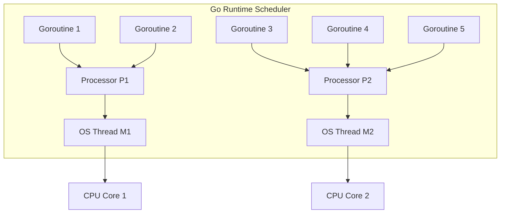
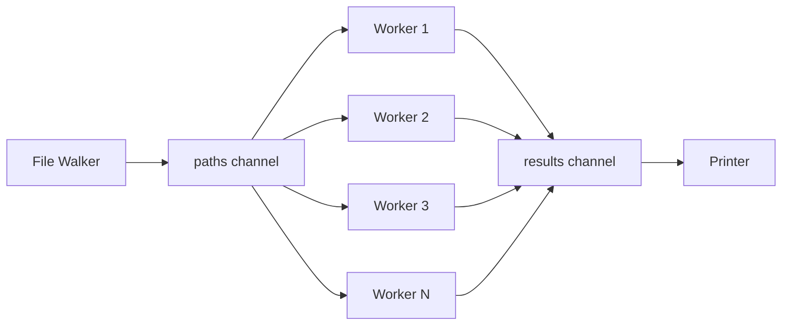

## Learning Objectives

- Understand the Go scheduler and how goroutines differ from OS threads
- Create and manage goroutines for concurrent execution
- Communicate between goroutines using channels
- Differentiate between buffered and unbuffered channels
- Use directional channels to enforce communication contracts
- Implement select statements for multiplexing channel operations
- Build fan-in and fan-out patterns for parallel data processing

## Prerequisites

- Solid understanding of Go functions and methods
- Familiarity with basic Go types and control flow
- Understanding of closures and anonymous functions

## Core Concepts

### The Go Scheduler: M:N Threading

Go implements an M:N scheduler that multiplexes M goroutines onto N OS threads. This design gives you the lightweight concurrency of green threads with the parallelism of native threads.



Key scheduler components:
- **G (Goroutine)**: The unit of work — a lightweight thread with its own stack (starts at 2KB, grows dynamically)
- **M (Machine)**: An OS thread that executes goroutines
- **P (Processor)**: A logical processor that manages a local run queue of goroutines

### Creating Goroutines

A goroutine is launched with the `go` keyword before a function call. The cost is minimal — roughly 2KB of stack space versus 1-8MB for an OS thread.

```go
package main

import (
    "fmt"
    "sync"
    "time"
)

func processOrder(orderID int, wg *sync.WaitGroup) {
    defer wg.Done()
    fmt.Printf("Processing order %d\n", orderID)
    time.Sleep(100 * time.Millisecond) // simulate work
    fmt.Printf("Order %d complete\n", orderID)
}

func main() {
    var wg sync.WaitGroup

    orders := []int{101, 102, 103, 104, 105}
    for _, id := range orders {
        wg.Add(1)
        go processOrder(id, &wg)
    }

    wg.Wait()
    fmt.Println("All orders processed")
}
```

**Critical pitfall — closure variable capture:**

```go
// BUG: All goroutines share the same loop variable
for _, id := range orders {
    wg.Add(1)
    go func() {
        defer wg.Done()
        fmt.Println(id) // captures loop variable by reference
    }()
}

// FIX: Pass as argument (or use Go 1.22+ loop variable semantics)
for _, id := range orders {
    wg.Add(1)
    go func(orderID int) {
        defer wg.Done()
        fmt.Println(orderID)
    }(id)
}
```

### Unbuffered Channels

An unbuffered channel provides synchronous communication — the sender blocks until a receiver is ready, and vice versa.

```go
func main() {
    ch := make(chan string) // unbuffered

    go func() {
        result := expensiveComputation()
        ch <- result // blocks until main reads
    }()

    // do other work while computation runs...
    setupDependencies()

    value := <-ch // blocks until goroutine sends
    fmt.Println("Result:", value)
}

func expensiveComputation() string {
    time.Sleep(2 * time.Second)
    return "computed value"
}

func setupDependencies() {
    time.Sleep(1 * time.Second)
}
```

### Buffered Channels

Buffered channels decouple sender and receiver timing. The sender only blocks when the buffer is full; the receiver only blocks when the buffer is empty.

```go
func produceMetrics(ch chan<- Metric, source DataSource) {
    for metric := range source.Stream() {
        ch <- metric // blocks only if buffer is full
    }
    close(ch)
}

func main() {
    // Buffer of 100 allows producer to work ahead
    metrics := make(chan Metric, 100)

    go produceMetrics(metrics, NewDataSource())

    for m := range metrics {
        processMetric(m)
    }
}
```

**When to use buffered vs unbuffered:**

| Scenario | Channel Type | Rationale |
|----------|-------------|-----------|
| Signal completion | Unbuffered | Synchronization point |
| Producer/consumer with rate mismatch | Buffered | Absorb bursts |
| Semaphore (limit concurrency) | Buffered | Buffer size = max concurrency |
| Request/response | Unbuffered | Direct handoff |

### Directional Channels

Directional channel types enforce communication contracts at compile time:

```go
// generator only sends
func generator(nums ...int) <-chan int {
    out := make(chan int)
    go func() {
        for _, n := range nums {
            out <- n
        }
        close(out)
    }()
    return out
}

// square only receives from in, only sends to out
func square(in <-chan int) <-chan int {
    out := make(chan int)
    go func() {
        for n := range in {
            out <- n * n
        }
        close(out)
    }()
    return out
}

func main() {
    nums := generator(2, 3, 4, 5)
    squares := square(nums)

    for result := range squares {
        fmt.Println(result) // 4, 9, 16, 25
    }
}
```

### The Select Statement

`select` lets a goroutine wait on multiple channel operations simultaneously. It's the backbone of complex concurrent coordination.

```go
func fetchWithTimeout(url string, timeout time.Duration) ([]byte, error) {
    type result struct {
        data []byte
        err  error
    }

    ch := make(chan result, 1)
    go func() {
        data, err := http.Get(url)
        if err != nil {
            ch <- result{nil, err}
            return
        }
        defer data.Body.Close()
        body, err := io.ReadAll(data.Body)
        ch <- result{body, err}
    }()

    select {
    case res := <-ch:
        return res.data, res.err
    case <-time.After(timeout):
        return nil, fmt.Errorf("request to %s timed out after %v", url, timeout)
    }
}
```

**Non-blocking channel operations with default:**

```go
select {
case msg := <-messages:
    fmt.Println("Received:", msg)
case sig := <-signals:
    fmt.Println("Signal:", sig)
    return
default:
    // no channel ready, do other work
    time.Sleep(10 * time.Millisecond)
}
```

### Fan-Out / Fan-In Pattern

Fan-out distributes work across multiple goroutines; fan-in merges their results into a single channel.

```go
package main

import (
    "crypto/sha256"
    "fmt"
    "os"
    "path/filepath"
    "sync"
)

type FileHash struct {
    Path string
    Hash [32]byte
    Err  error
}

// Fan-out: multiple workers process files concurrently
func hashFiles(paths <-chan string, numWorkers int) <-chan FileHash {
    results := make(chan FileHash, numWorkers)
    var wg sync.WaitGroup

    for i := 0; i < numWorkers; i++ {
        wg.Add(1)
        go func() {
            defer wg.Done()
            for path := range paths {
                data, err := os.ReadFile(path)
                if err != nil {
                    results <- FileHash{Path: path, Err: err}
                    continue
                }
                results <- FileHash{Path: path, Hash: sha256.Sum256(data)}
            }
        }()
    }

    go func() {
        wg.Wait()
        close(results)
    }()

    return results
}

// Fan-in is implicit: all workers write to the same results channel
func main() {
    paths := make(chan string, 100)

    go func() {
        filepath.Walk(".", func(path string, info os.FileInfo, err error) error {
            if err != nil || info.IsDir() {
                return nil
            }
            paths <- path
            return nil
        })
        close(paths)
    }()

    for result := range hashFiles(paths, 8) {
        if result.Err != nil {
            fmt.Fprintf(os.Stderr, "error: %s: %v\n", result.Path, result.Err)
            continue
        }
        fmt.Printf("%x  %s\n", result.Hash, result.Path)
    }
}
```



## Best Practices

1. **Always know who closes a channel** — only the sender should close, never the receiver
2. **Use `context.Context` for cancellation** — don't rely solely on channel signaling for lifecycle management
3. **Avoid goroutine leaks** — every goroutine must have a clear exit path
4. **Buffer size is not a correctness tool** — if your program only works with a specific buffer size, the design is flawed
5. **Prefer channels for communication, mutexes for state** — don't use channels as a mutex substitute

## Common Pitfalls

```go
// LEAK: goroutine blocks forever if nobody reads
func leakySearch(query string) {
    ch := make(chan Result)
    go func() {
        ch <- slowSearch(query) // blocks if caller abandoned
    }()
    // caller returns without reading ch
}

// FIX: use buffered channel or context
func safeSearch(ctx context.Context, query string) (Result, error) {
    ch := make(chan Result, 1) // buffer prevents goroutine leak
    go func() {
        ch <- slowSearch(query)
    }()
    select {
    case result := <-ch:
        return result, nil
    case <-ctx.Done():
        return Result{}, ctx.Err()
    }
}
```

## Hands-On Exercises

### Exercise 1: Concurrent URL Fetcher

Build a program that fetches multiple URLs concurrently with a timeout per request and a global timeout for all requests. Requirements:
- Accept a list of URLs
- Fetch each URL in its own goroutine
- Timeout individual requests after 5 seconds
- Timeout the entire batch after 30 seconds
- Collect and print results (status code + URL)

<details>
<summary>Solution</summary>

```go
package main

import (
    "context"
    "fmt"
    "net/http"
    "sync"
    "time"
)

type FetchResult struct {
    URL        string
    StatusCode int
    Err        error
    Duration   time.Duration
}

func fetchURL(ctx context.Context, url string) FetchResult {
    start := time.Now()
    req, err := http.NewRequestWithContext(ctx, "GET", url, nil)
    if err != nil {
        return FetchResult{URL: url, Err: err, Duration: time.Since(start)}
    }

    resp, err := http.DefaultClient.Do(req)
    if err != nil {
        return FetchResult{URL: url, Err: err, Duration: time.Since(start)}
    }
    defer resp.Body.Close()

    return FetchResult{
        URL: url, StatusCode: resp.StatusCode, Duration: time.Since(start),
    }
}

func fetchAll(urls []string, perReqTimeout, totalTimeout time.Duration) []FetchResult {
    ctx, cancel := context.WithTimeout(context.Background(), totalTimeout)
    defer cancel()

    results := make([]FetchResult, len(urls))
    var wg sync.WaitGroup

    for i, url := range urls {
        wg.Add(1)
        go func(idx int, u string) {
            defer wg.Done()
            reqCtx, reqCancel := context.WithTimeout(ctx, perReqTimeout)
            defer reqCancel()
            results[idx] = fetchURL(reqCtx, u)
        }(i, url)
    }

    wg.Wait()
    return results
}

func main() {
    urls := []string{
        "https://go.dev",
        "https://pkg.go.dev",
        "https://github.com",
        "https://httpbin.org/delay/10", // will timeout
    }

    results := fetchAll(urls, 5*time.Second, 30*time.Second)
    for _, r := range results {
        if r.Err != nil {
            fmt.Printf("FAIL  %s (%v): %v\n", r.URL, r.Duration, r.Err)
        } else {
            fmt.Printf("OK    %s (%v): %d\n", r.URL, r.Duration, r.StatusCode)
        }
    }
}
```

</details>

### Exercise 2: Pipeline with Fan-Out

Create a number-processing pipeline:
1. Stage 1: Generate integers 1-1000
2. Stage 2: Fan-out to 4 workers that filter primes
3. Stage 3: Fan-in results and compute their sum

<details>
<summary>Solution</summary>

```go
package main

import (
    "fmt"
    "math"
    "sync"
)

func generate(max int) <-chan int {
    out := make(chan int)
    go func() {
        for i := 2; i <= max; i++ {
            out <- i
        }
        close(out)
    }()
    return out
}

func isPrime(n int) bool {
    if n < 2 {
        return false
    }
    for i := 2; i <= int(math.Sqrt(float64(n))); i++ {
        if n%i == 0 {
            return false
        }
    }
    return true
}

func filterPrimes(in <-chan int, numWorkers int) <-chan int {
    out := make(chan int, numWorkers)
    var wg sync.WaitGroup

    for i := 0; i < numWorkers; i++ {
        wg.Add(1)
        go func() {
            defer wg.Done()
            for n := range in {
                if isPrime(n) {
                    out <- n
                }
            }
        }()
    }

    go func() {
        wg.Wait()
        close(out)
    }()
    return out
}

func main() {
    numbers := generate(1000)
    primes := filterPrimes(numbers, 4)

    sum := 0
    count := 0
    for p := range primes {
        sum += p
        count++
    }
    fmt.Printf("Found %d primes, sum = %d\n", count, sum)
}
```

</details>

## Key Takeaways

- Goroutines are extremely cheap (~2KB stack) — don't hesitate to spawn thousands
- Unbuffered channels synchronize; buffered channels decouple timing
- Always ensure goroutines have an exit path to prevent leaks
- Use `select` to multiplex operations and implement timeouts
- Fan-out/fan-in is the standard pattern for parallel processing pipelines
- Directional channel types provide compile-time safety for communication contracts

## External Resources

- [Effective Go: Concurrency](https://go.dev/doc/effective_go#concurrency)
- [Go Blog: Share Memory By Communicating](https://go.dev/blog/codelab-share)
- [Go Blog: Pipelines and Cancellation](https://go.dev/blog/pipelines)
- [GopherCon: Concurrency is Not Parallelism (Rob Pike)](https://www.youtube.com/watch?v=oV9rvDllKEg)
- [The Go Memory Model](https://go.dev/ref/mem)
