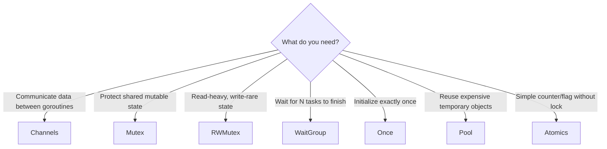

## Learning Objectives

- Use Mutex and RWMutex to protect shared state safely
- Coordinate goroutine completion with WaitGroup
- Execute one-time initialization with sync.Once
- Reduce GC pressure using sync.Pool for temporary objects
- Perform lock-free operations with atomic primitives
- Detect and fix race conditions using the Go race detector

## Prerequisites

- Understanding of goroutines and channels
- Familiarity with concurrent programming concepts
- Knowledge of Go interfaces and structs

## Core Concepts

### When Channels Aren't Enough

Channels are ideal for communication between goroutines, but when you need to protect shared mutable state that multiple goroutines access, synchronization primitives are the right tool.



### Mutex: Mutual Exclusion

A `sync.Mutex` ensures only one goroutine accesses a critical section at a time.

```go
package main

import (
    "fmt"
    "sync"
)

type SafeCounter struct {
    mu      sync.Mutex
    counts  map[string]int
}

func NewSafeCounter() *SafeCounter {
    return &SafeCounter{counts: make(map[string]int)}
}

func (c *SafeCounter) Increment(key string) {
    c.mu.Lock()
    defer c.mu.Unlock()
    c.counts[key]++
}

func (c *SafeCounter) Get(key string) int {
    c.mu.Lock()
    defer c.mu.Unlock()
    return c.counts[key]
}

func main() {
    counter := NewSafeCounter()
    var wg sync.WaitGroup

    for i := 0; i < 1000; i++ {
        wg.Add(1)
        go func() {
            defer wg.Done()
            counter.Increment("hits")
        }()
    }

    wg.Wait()
    fmt.Println("Total hits:", counter.Get("hits")) // always 1000
}
```

**Mutex best practices:**
- Keep the critical section as small as possible
- Always use `defer mu.Unlock()` to prevent deadlocks on panics
- Never copy a Mutex after first use (pass by pointer)
- Place the mutex field above the fields it protects in struct declarations

### RWMutex: Read-Write Lock

When reads vastly outnumber writes, `sync.RWMutex` allows concurrent reads while maintaining exclusive writes.

```go
type ConfigStore struct {
    mu     sync.RWMutex
    config map[string]string
}

func (s *ConfigStore) Get(key string) (string, bool) {
    s.mu.RLock()
    defer s.mu.RUnlock()
    val, ok := s.config[key]
    return val, ok
}

func (s *ConfigStore) Set(key, value string) {
    s.mu.Lock()
    defer s.mu.Unlock()
    s.config[key] = value
}

func (s *ConfigStore) GetAll() map[string]string {
    s.mu.RLock()
    defer s.mu.RUnlock()
    // Return a copy to prevent mutation outside the lock
    copy := make(map[string]string, len(s.config))
    for k, v := range s.config {
        copy[k] = v
    }
    return copy
}
```

**When to use RWMutex vs Mutex:**
- Use RWMutex when read:write ratio exceeds ~10:1
- For simple counters or low-contention state, plain Mutex has less overhead
- RWMutex has higher per-operation overhead than Mutex due to reader counting

### WaitGroup: Waiting for Completion

`sync.WaitGroup` tracks a set of goroutines and blocks until they all finish.

```go
func processItems(items []Item) []Result {
    results := make([]Result, len(items))
    var wg sync.WaitGroup

    for i, item := range items {
        wg.Add(1)
        go func(idx int, it Item) {
            defer wg.Done()
            results[idx] = process(it)
        }(i, item)
    }

    wg.Wait()
    return results
}
```

**Critical rules:**
- Call `Add()` before launching the goroutine, never inside it
- `Add()` and `Done()` calls must be balanced — mismatch panics
- A WaitGroup must not be reused while a `Wait()` is in progress

### sync.Once: One-Time Initialization

`sync.Once` guarantees a function runs exactly once, regardless of how many goroutines call it. It's the idiomatic way to implement lazy singleton initialization.

```go
type DBPool struct {
    once sync.Once
    pool *sql.DB
}

func (d *DBPool) getPool() *sql.DB {
    d.once.Do(func() {
        var err error
        d.pool, err = sql.Open("postgres", os.Getenv("DATABASE_URL"))
        if err != nil {
            log.Fatal("failed to connect to database:", err)
        }
        d.pool.SetMaxOpenConns(25)
        d.pool.SetMaxIdleConns(5)
        d.pool.SetConnMaxLifetime(5 * time.Minute)
    })
    return d.pool
}
```

**Important**: If the function passed to `Do` panics, `Once` considers it "done" — subsequent calls won't retry. For fallible initialization, use `sync.OnceValue` (Go 1.21+) or manage state yourself.

### sync.Pool: Object Reuse

`sync.Pool` caches temporary objects to reduce allocation pressure. Items may be reclaimed by GC at any time.

```go
var bufPool = sync.Pool{
    New: func() any {
        return new(bytes.Buffer)
    },
}

func handleRequest(w http.ResponseWriter, r *http.Request) {
    buf := bufPool.Get().(*bytes.Buffer)
    buf.Reset() // always reset before use
    defer bufPool.Put(buf)

    // Use buf for response construction
    fmt.Fprintf(buf, `{"request_id": "%s", "status": "ok"}`, r.Header.Get("X-Request-ID"))
    w.Header().Set("Content-Type", "application/json")
    w.Write(buf.Bytes())
}
```

**sync.Pool rules:**
- Always reset objects before putting them back
- Don't store pointers to pool objects long-term — they may be collected
- Ideal for high-allocation hot paths (HTTP handlers, serialization)
- Objects survive until the next GC cycle at minimum

### Atomic Operations

The `sync/atomic` package provides lock-free operations for simple shared state. Atomics are faster than mutexes but limited to basic types.

```go
package main

import (
    "fmt"
    "sync"
    "sync/atomic"
)

type Metrics struct {
    requestCount  atomic.Int64
    errorCount    atomic.Int64
    bytesReceived atomic.Int64
}

func (m *Metrics) RecordRequest(bytes int64, hasError bool) {
    m.requestCount.Add(1)
    m.bytesReceived.Add(bytes)
    if hasError {
        m.errorCount.Add(1)
    }
}

func (m *Metrics) Snapshot() (requests, errors, bytes int64) {
    return m.requestCount.Load(), m.errorCount.Load(), m.bytesReceived.Load()
}

func main() {
    var metrics Metrics
    var wg sync.WaitGroup

    for i := 0; i < 10000; i++ {
        wg.Add(1)
        go func(i int) {
            defer wg.Done()
            metrics.RecordRequest(int64(i%1024), i%10 == 0)
        }(i)
    }

    wg.Wait()
    reqs, errs, bytes := metrics.Snapshot()
    fmt.Printf("Requests: %d, Errors: %d, Bytes: %d\n", reqs, errs, bytes)
}
```

**Atomic vs Mutex decision matrix:**

| Use Case | Recommendation |
|----------|---------------|
| Simple counter | `atomic.Int64` |
| Boolean flag | `atomic.Bool` |
| Pointer swap (e.g., config reload) | `atomic.Pointer[T]` |
| Multiple fields updated together | `sync.Mutex` |
| Map or slice access | `sync.Mutex` / `sync.RWMutex` |

### Detecting Race Conditions

Go's race detector instruments memory accesses at compile time to find data races.

```bash
# Run tests with race detection
go test -race ./...

# Run a program with race detection
go run -race main.go

# Build with race detection (for integration tests)
go build -race -o myapp .
```

Example race condition and fix:

```go
// RACE: concurrent map write
type Cache struct {
    data map[string]string
}

func (c *Cache) Set(k, v string) {
    c.data[k] = v // DATA RACE if called from multiple goroutines
}

// FIX: protect with mutex
type SafeCache struct {
    mu   sync.RWMutex
    data map[string]string
}

func (c *SafeCache) Set(k, v string) {
    c.mu.Lock()
    defer c.mu.Unlock()
    c.data[k] = v
}

func (c *SafeCache) Get(k string) (string, bool) {
    c.mu.RLock()
    defer c.mu.RUnlock()
    v, ok := c.data[k]
    return v, ok
}
```

## Best Practices

1. **Run `go test -race` in CI** — race detection has ~5-10x overhead but catches real bugs
2. **Embed the mutex next to the data it protects** — makes ownership clear
3. **Avoid holding locks across I/O operations** — this causes contention and potential deadlocks
4. **Use `atomic.Pointer[T]` for lock-free config swaps** — swap an entire config struct atomically
5. **Never copy sync primitives** — pass by pointer or embed in structs passed by pointer

## Common Pitfalls

```go
// DEADLOCK: recursive locking
func (s *Store) DoubleLock() {
    s.mu.Lock()
    defer s.mu.Unlock()
    s.helperThatAlsoLocks() // tries to acquire same lock = deadlock
}

// DEADLOCK: inconsistent lock ordering
// goroutine 1: lockA -> lockB
// goroutine 2: lockB -> lockA
// Fix: always acquire locks in a consistent order

// WRONG: copying a mutex
type BadConfig struct {
    mu   sync.Mutex
    data string
}
config := BadConfig{data: "initial"}
copy := config // copies the mutex! undefined behavior
```

## Hands-On Exercises

### Exercise 1: Thread-Safe LRU Cache

Implement a concurrent-safe LRU cache with a configurable capacity. It should support `Get`, `Put`, and `Len` operations from multiple goroutines.

<details>
<summary>Solution</summary>

```go
package main

import (
    "container/list"
    "sync"
)

type LRUCache struct {
    mu       sync.RWMutex
    capacity int
    items    map[string]*list.Element
    order    *list.List
}

type entry struct {
    key   string
    value any
}

func NewLRUCache(capacity int) *LRUCache {
    return &LRUCache{
        capacity: capacity,
        items:    make(map[string]*list.Element),
        order:    list.New(),
    }
}

func (c *LRUCache) Get(key string) (any, bool) {
    c.mu.Lock()
    defer c.mu.Unlock()

    if elem, ok := c.items[key]; ok {
        c.order.MoveToFront(elem)
        return elem.Value.(*entry).value, true
    }
    return nil, false
}

func (c *LRUCache) Put(key string, value any) {
    c.mu.Lock()
    defer c.mu.Unlock()

    if elem, ok := c.items[key]; ok {
        c.order.MoveToFront(elem)
        elem.Value.(*entry).value = value
        return
    }

    if c.order.Len() >= c.capacity {
        oldest := c.order.Back()
        if oldest != nil {
            c.order.Remove(oldest)
            delete(c.items, oldest.Value.(*entry).key)
        }
    }

    elem := c.order.PushFront(&entry{key: key, value: value})
    c.items[key] = elem
}

func (c *LRUCache) Len() int {
    c.mu.RLock()
    defer c.mu.RUnlock()
    return c.order.Len()
}
```

</details>

### Exercise 2: Rate Limiter with Atomics

Build a simple sliding-window rate limiter using atomic operations that allows N requests per second.

<details>
<summary>Solution</summary>

```go
package main

import (
    "sync/atomic"
    "time"
)

type RateLimiter struct {
    tokens    atomic.Int64
    maxTokens int64
    ticker    *time.Ticker
    done      chan struct{}
}

func NewRateLimiter(rps int64) *RateLimiter {
    rl := &RateLimiter{
        maxTokens: rps,
        ticker:    time.NewTicker(time.Second / time.Duration(rps)),
        done:      make(chan struct{}),
    }
    rl.tokens.Store(rps)

    go func() {
        for {
            select {
            case <-rl.ticker.C:
                current := rl.tokens.Load()
                if current < rl.maxTokens {
                    rl.tokens.Add(1)
                }
            case <-rl.done:
                return
            }
        }
    }()

    return rl
}

func (rl *RateLimiter) Allow() bool {
    for {
        current := rl.tokens.Load()
        if current <= 0 {
            return false
        }
        if rl.tokens.CompareAndSwap(current, current-1) {
            return true
        }
    }
}

func (rl *RateLimiter) Stop() {
    rl.ticker.Stop()
    close(rl.done)
}
```

</details>

## Key Takeaways

- Use Mutex for protecting shared state; RWMutex when reads dominate
- WaitGroup coordinates goroutine completion without channels
- sync.Once is the safe, idiomatic way for lazy initialization
- sync.Pool reduces GC pressure for high-churn allocations
- Atomics are fastest for simple counters and flags but can't protect compound operations
- Always run the race detector in tests and CI

## External Resources

- [sync package documentation](https://pkg.go.dev/sync)
- [sync/atomic package documentation](https://pkg.go.dev/sync/atomic)
- [Go Blog: Race Detector](https://go.dev/blog/race-detector)
- [Go Wiki: Mutex or Channel](https://go.dev/wiki/MutexOrChannel)
- [Bryan Mills: Rethinking Classical Concurrency Patterns](https://www.youtube.com/watch?v=5zXAHh5tJqQ)
