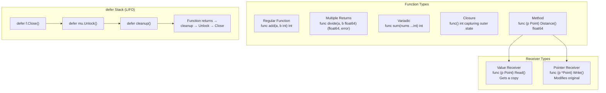

## Learning Objectives

- Write functions with multiple return values and named returns
- Use variadic parameters and understand when they're appropriate
- Create closures that capture and modify outer variables
- Attach methods to types using value and pointer receivers
- Apply defer, panic, and recover for resource management and error handling

## Prerequisites

- Go types, variables, and structs (previous lesson)
- Understanding of pointers at a conceptual level

## Core Concepts

### Functions with Multiple Returns

Go functions can return multiple values. This is fundamental to Go's error handling pattern.

```go
func divide(a, b float64) (float64, error) {
	if b == 0 {
		return 0, fmt.Errorf("cannot divide by zero")
	}
	return a / b, nil
}

func main() {
	result, err := divide(10, 3)
	if err != nil {
		log.Fatal(err)
	}
	fmt.Printf("10 / 3 = %.4f\n", result)

	// Ignore a return value with _
	_, err = divide(10, 0)
	fmt.Println("Error:", err) // cannot divide by zero
}
```

**Named return values** serve as documentation and enable "naked returns" (use sparingly):

```go
func parseCoordinate(s string) (lat, lon float64, err error) {
	parts := strings.Split(s, ",")
	if len(parts) != 2 {
		err = fmt.Errorf("invalid coordinate: %s", s)
		return // naked return — returns lat=0, lon=0, err=error
	}
	lat, err = strconv.ParseFloat(strings.TrimSpace(parts[0]), 64)
	if err != nil {
		return
	}
	lon, err = strconv.ParseFloat(strings.TrimSpace(parts[1]), 64)
	return
}
```

### Variadic Functions

Variadic functions accept a variable number of arguments of the same type:

```go
func sum(nums ...int) int {
	total := 0
	for _, n := range nums {
		total += n
	}
	return total
}

fmt.Println(sum(1, 2, 3))        // 6
fmt.Println(sum(1, 2, 3, 4, 5))  // 15

nums := []int{10, 20, 30}
fmt.Println(sum(nums...))        // 60 — spread a slice
```

A practical example — a flexible logger:

```go
func logMessage(level string, format string, args ...any) {
	timestamp := time.Now().Format("15:04:05")
	msg := fmt.Sprintf(format, args...)
	fmt.Printf("[%s] %s: %s\n", timestamp, level, msg)
}

logMessage("INFO", "Server started on port %d", 8080)
logMessage("ERROR", "Failed to connect to %s: %v", "database", err)
```

### First-Class Functions

Functions in Go are first-class values. You can assign them to variables, pass them as arguments, and return them from other functions.

```go
type transformer func(int) int

func apply(nums []int, fn transformer) []int {
	result := make([]int, len(nums))
	for i, n := range nums {
		result[i] = fn(n)
	}
	return result
}

func main() {
	nums := []int{1, 2, 3, 4, 5}

	doubled := apply(nums, func(n int) int { return n * 2 })
	fmt.Println(doubled) // [2 4 6 8 10]

	squared := apply(nums, func(n int) int { return n * n })
	fmt.Println(squared) // [1 4 9 16 25]
}
```

### Closures

A closure is a function that references variables from its outer scope. The function "captures" those variables and can read/modify them even after the outer function returns.

```go
func makeCounter() func() int {
	count := 0
	return func() int {
		count++
		return count
	}
}

func main() {
	counter := makeCounter()
	fmt.Println(counter()) // 1
	fmt.Println(counter()) // 2
	fmt.Println(counter()) // 3

	// Each closure gets its own captured state
	other := makeCounter()
	fmt.Println(other()) // 1 — independent counter
}
```

A practical closure — rate limiter:

```go
func newRateLimiter(maxPerSecond int) func() bool {
	mu := sync.Mutex{}
	tokens := maxPerSecond
	lastRefill := time.Now()

	return func() bool {
		mu.Lock()
		defer mu.Unlock()

		now := time.Now()
		elapsed := now.Sub(lastRefill)
		if elapsed >= time.Second {
			tokens = maxPerSecond
			lastRefill = now
		}

		if tokens > 0 {
			tokens--
			return true
		}
		return false
	}
}
```

### Methods and Receivers

Methods are functions attached to types. The receiver determines whether the method can modify the type.

**Value receiver** — gets a copy. Can't modify the original.

```go
type Point struct {
	X, Y float64
}

func (p Point) Distance(other Point) float64 {
	dx := p.X - other.X
	dy := p.Y - other.Y
	return math.Sqrt(dx*dx + dy*dy)
}
```

**Pointer receiver** — gets a pointer. Can modify the original. Required when:
- The method needs to modify the receiver
- The struct is large (avoids copying)
- Consistency — if any method uses a pointer receiver, all should

```go
func (p *Point) Translate(dx, dy float64) {
	p.X += dx
	p.Y += dy
}

func main() {
	p := Point{X: 1, Y: 2}
	q := Point{X: 4, Y: 6}

	fmt.Println(p.Distance(q))  // 5

	p.Translate(3, 4)
	fmt.Println(p) // {4 6} — modified in place
}
```

**The receiver rule of thumb:** If in doubt, use a pointer receiver.

### defer, panic, and recover

**defer** schedules a function to run when the enclosing function returns. Deferred calls execute in LIFO order.

```go
func readFile(path string) (string, error) {
	f, err := os.Open(path)
	if err != nil {
		return "", err
	}
	defer f.Close() // guaranteed to run even if we return early

	data, err := io.ReadAll(f)
	if err != nil {
		return "", err
	}
	return string(data), nil
}
```

Multiple defers execute in reverse order:

```go
func demo() {
	fmt.Println("start")
	defer fmt.Println("first defer")
	defer fmt.Println("second defer")
	defer fmt.Println("third defer")
	fmt.Println("end")
}
// Output: start, end, third defer, second defer, first defer
```

**panic** stops normal execution. **recover** catches panics inside deferred functions:

```go
func safeDivide(a, b int) (result int, err error) {
	defer func() {
		if r := recover(); r != nil {
			err = fmt.Errorf("recovered from panic: %v", r)
		}
	}()

	return a / b, nil // panics if b == 0 (integer division by zero)
}

func main() {
	result, err := safeDivide(10, 0)
	if err != nil {
		fmt.Println("Error:", err) // recovered from panic: runtime error: integer division by zero
	} else {
		fmt.Println("Result:", result)
	}
}
```

**Rule:** Use `panic` only for truly unrecoverable programmer errors. Use `error` returns for expected failure modes.

### Method Sets and Interface Satisfaction

The method set of a type determines which interfaces it satisfies:

| Receiver Type | Method Set                 |
|--------------|---------------------------|
| T (value)    | Methods with value receivers only |
| *T (pointer) | Methods with both value AND pointer receivers |

```go
type Sizer interface {
	Size() int
}

type StringSlice []string

func (ss StringSlice) Size() int { return len(ss) }  // value receiver

var s Sizer = StringSlice{"a", "b"}   // OK — value satisfies value receiver
var p Sizer = &StringSlice{"a", "b"}  // OK — pointer also satisfies

type Resetter interface {
	Reset()
}

func (ss *StringSlice) Reset() { *ss = nil }  // pointer receiver

// var r Resetter = StringSlice{"a"}  // COMPILE ERROR — value can't satisfy pointer receiver
var r Resetter = &StringSlice{"a"}    // OK — pointer satisfies pointer receiver
```

## Diagram



## Hands-On Exercise

### Exercise: Implement a Stack with Methods

Build a generic stack data structure using methods and demonstrate closures.

```go
package main

import (
	"errors"
	"fmt"
)

type Stack[T any] struct {
	items []T
}

func NewStack[T any]() *Stack[T] {
	return &Stack[T]{items: make([]T, 0)}
}

func (s *Stack[T]) Push(item T) {
	s.items = append(s.items, item)
}

func (s *Stack[T]) Pop() (T, error) {
	var zero T
	if len(s.items) == 0 {
		return zero, errors.New("stack is empty")
	}
	item := s.items[len(s.items)-1]
	s.items = s.items[:len(s.items)-1]
	return item, nil
}

func (s *Stack[T]) Peek() (T, error) {
	var zero T
	if len(s.items) == 0 {
		return zero, errors.New("stack is empty")
	}
	return s.items[len(s.items)-1], nil
}

func (s *Stack[T]) Size() int {
	return len(s.items)
}

func (s *Stack[T]) IsEmpty() bool {
	return len(s.items) == 0
}

func main() {
	intStack := NewStack[int]()
	for _, v := range []int{10, 20, 30, 40} {
		intStack.Push(v)
		fmt.Printf("Pushed %d (size: %d)\n", v, intStack.Size())
	}

	for !intStack.IsEmpty() {
		val, _ := intStack.Pop()
		fmt.Printf("Popped %d (size: %d)\n", val, intStack.Size())
	}

	strStack := NewStack[string]()
	strStack.Push("hello")
	strStack.Push("world")
	top, _ := strStack.Peek()
	fmt.Printf("Top of string stack: %s\n", top)
}
```

**Challenge:** Add a `ForEach` method that takes a `func(T)` callback and applies it to every item without removing them. Then write a `Map` function that transforms a `Stack[T]` into a `Stack[U]` using a closure.

## Key Takeaways

- Multiple return values are idiomatic Go — the `(result, error)` pattern is universal
- Variadic functions accept `...Type` parameters; pass a slice with `slice...`
- Closures capture variables by reference, enabling stateful functions without structs
- Value receivers get copies; pointer receivers can modify the original — use pointer receivers by default for structs
- `defer` guarantees cleanup (file closing, mutex unlocking) even if a panic occurs
- Reserve `panic` for programmer errors; use `error` returns for expected failures

## External Resources

- [Effective Go: Functions](https://go.dev/doc/effective_go#functions) — Official guide on function idioms
- [Go Blog: Defer, Panic, and Recover](https://go.dev/blog/defer-panic-and-recover) — Deep dive into control flow mechanisms
- [Go Blog: Methods](https://go.dev/blog/methods-are-values) — How methods are implemented as function values
- [Go Generics Tutorial](https://go.dev/doc/tutorial/generics) — Official introduction to type parameters
- [Go FAQ: Value vs Pointer Receivers](https://go.dev/doc/faq#methods_on_values_or_pointers) — When to use each

## Quiz

See the quiz.json file for this module's quiz questions.
