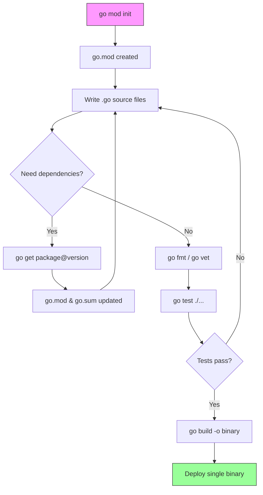

## Learning Objectives

- Install Go and verify the toolchain on your operating system
- Understand GOPATH, GOROOT, and the module system
- Initialize and manage a Go module with go.mod
- Configure VS Code with the Go extension for productive development
- Use essential Go tools: fmt, vet, test, build, and run

## Prerequisites

- Basic programming experience in any language
- Comfort with the command line / terminal
- A code editor installed (VS Code recommended)

## Core Concepts

### Why Go?

Go (Golang) was created at Google in 2009 by Robert Griesemer, Rob Pike, and Ken Thompson. It was designed to solve real problems at Google's scale:

- **Fast compilation** — Large codebases compile in seconds, not minutes
- **Built-in concurrency** — Goroutines and channels make concurrent programming natural
- **Simple language** — 25 keywords, no inheritance, no generics until 1.18
- **Single binary deployment** — No runtime dependencies, no DLL hell
- **Strong standard library** — HTTP servers, JSON, cryptography, testing — all built in

Go powers infrastructure at scale: Docker, Kubernetes, Terraform, CockroachDB, and countless microservices.

### Installing Go

**macOS (Homebrew):**

```bash
brew install go
go version
# go version go1.22.4 darwin/arm64
```

**Linux:**

```bash
wget https://go.dev/dl/go1.22.4.linux-amd64.tar.gz
sudo tar -C /usr/local -xzf go1.22.4.linux-amd64.tar.gz
echo 'export PATH=$PATH:/usr/local/go/bin' >> ~/.bashrc
source ~/.bashrc
go version
```

**Windows:** Download the MSI installer from [go.dev/dl](https://go.dev/dl/) and run it. Go is added to PATH automatically.

### Understanding GOPATH and GOROOT

```bash
go env GOROOT   # Where Go is installed (e.g., /usr/local/go)
go env GOPATH   # Your workspace (e.g., ~/go)
go env GOBIN    # Where compiled binaries go (e.g., ~/go/bin)
```

- **GOROOT** — The Go installation directory. Don't modify this.
- **GOPATH** — Your workspace. Contains three subdirectories:
  - `bin/` — Compiled executables
  - `pkg/` — Cached compiled packages
  - `src/` — Source code (legacy, mostly unused with modules)

Since Go 1.16, **modules are the default**. You no longer need to work inside GOPATH.

### Creating Your First Module

```bash
mkdir hello-go && cd hello-go
go mod init github.com/yourusername/hello-go
```

This creates a `go.mod` file — the heart of Go's dependency management:

```go
module github.com/yourusername/hello-go

go 1.22.4
```

Now create `main.go`:

```go
package main

import "fmt"

func main() {
	fmt.Println("Hello, Go!")
}
```

Run it:

```bash
go run main.go
# Hello, Go!

go build -o hello
./hello
# Hello, Go!
```

### Project Structure

A well-organized Go project follows conventions (not enforced by the compiler):

```
hello-go/
├── go.mod
├── go.sum              # dependency checksums (auto-generated)
├── main.go             # entry point
├── cmd/
│   └── server/
│       └── main.go     # alternative entry point for a server binary
├── internal/           # private packages — can't be imported by other modules
│   ├── handler/
│   │   └── handler.go
│   └── service/
│       └── service.go
├── pkg/                # public packages — can be imported by other modules
│   └── utils/
│       └── utils.go
└── Makefile
```

### Adding Dependencies

```bash
go get github.com/gin-gonic/gin@latest

# This updates go.mod:
# require github.com/gin-gonic/gin v1.9.1

go mod tidy   # Remove unused dependencies, add missing ones
go mod verify  # Verify dependencies match go.sum checksums
```

### VS Code Setup

1. Install the [Go extension](https://marketplace.visualstudio.com/items?itemName=golang.go) by the Go team
2. Open the command palette (Cmd+Shift+P) and run "Go: Install/Update Tools"
3. Select all tools and install them

Essential VS Code settings for Go (`.vscode/settings.json`):

```json
{
  "go.useLanguageServer": true,
  "go.lintTool": "golangci-lint",
  "go.lintFlags": ["--fast"],
  "editor.formatOnSave": true,
  "[go]": {
    "editor.defaultFormatter": "golang.go",
    "editor.codeActionsOnSave": {
      "source.organizeImports": "explicit"
    }
  },
  "go.testFlags": ["-v", "-count=1"],
  "go.coverOnSave": true
}
```

### Essential Go Tools

**go fmt** — Formats code to the canonical Go style. There's no debate about formatting in Go.

```bash
gofmt -w .        # Format all .go files in place
goimports -w .    # Format + fix imports (preferred)
```

**go vet** — Detects suspicious constructs that the compiler doesn't catch:

```bash
go vet ./...      # Check all packages
```

Common issues go vet catches:
- Printf format string mismatches
- Unreachable code
- Copying sync.Mutex
- Incorrect struct tags

**go test** — Runs tests:

```bash
go test ./...              # Run all tests
go test -v ./...           # Verbose output
go test -cover ./...       # Show coverage percentages
go test -race ./...        # Detect race conditions
go test -bench=. ./...     # Run benchmarks
```

**go build** — Compiles packages and dependencies:

```bash
go build -o myapp ./cmd/server   # Build specific binary
CGO_ENABLED=0 GOOS=linux GOARCH=amd64 go build -o myapp  # Cross-compile
```

**golangci-lint** — A fast meta-linter that runs 50+ linters:

```bash
# Install
go install github.com/golangci/golangci-lint/cmd/golangci-lint@latest

golangci-lint run ./...
```

### The go.sum File

`go.sum` contains cryptographic checksums for every dependency and its transitive dependencies. It ensures reproducible builds — if a dependency is tampered with, the checksum won't match and the build fails.

Never edit go.sum manually. It's managed by `go mod tidy`.

## Diagram



## Hands-On Exercise

### Exercise: Set Up a New Go Project

**Step 1: Create and initialize**

```bash
mkdir go-starter && cd go-starter
go mod init github.com/yourusername/go-starter
```

**Step 2: Create the main file**

Create `main.go`:

```go
package main

import (
	"fmt"
	"os"
	"runtime"
	"time"
)

func main() {
	fmt.Println("=== Go Environment Info ===")
	fmt.Printf("Go version: %s\n", runtime.Version())
	fmt.Printf("OS/Arch:    %s/%s\n", runtime.GOOS, runtime.GOARCH)
	fmt.Printf("CPUs:       %d\n", runtime.NumCPU())
	fmt.Printf("GOROOT:     %s\n", runtime.GOROOT())
	fmt.Printf("PID:        %d\n", os.Getpid())
	fmt.Printf("Time:       %s\n", time.Now().Format(time.RFC3339))
}
```

**Step 3: Run, format, and vet**

```bash
go run main.go
gofmt -w .
go vet ./...
```

**Step 4: Add a test**

Create `main_test.go`:

```go
package main

import "testing"

func TestMain(t *testing.T) {
	t.Log("Test setup verified — Go toolchain is working!")
}
```

```bash
go test -v ./...
```

**Step 5: Build and inspect**

```bash
go build -o go-starter
ls -lh go-starter     # Note the binary size
file go-starter       # See it's a statically linked binary
./go-starter
```

**Challenge:** Cross-compile your binary for Linux AMD64 from your Mac/Windows machine. Verify the file type with the `file` command.

## Key Takeaways

- Go modules (go.mod) are the standard way to manage dependencies — GOPATH is legacy
- `go fmt` eliminates all formatting debates; the canonical style is enforced by tooling
- `go vet` catches bugs that compile but are almost certainly wrong
- Go produces statically linked binaries with zero runtime dependencies
- VS Code with the Go extension and gopls language server provides an excellent development experience
- Cross-compilation is a first-class feature: just set GOOS and GOARCH

## External Resources

- [Go Official Documentation](https://go.dev/doc/) — The definitive reference for the Go language
- [Effective Go](https://go.dev/doc/effective_go) — The official guide to writing clear, idiomatic Go
- [Go Modules Reference](https://go.dev/ref/mod) — Complete specification for the module system
- [golangci-lint](https://golangci-lint.run/) — Configuration and linter list for the meta-linter
- [Go by Example](https://gobyexample.com/) — Annotated example programs covering every Go feature

## Quiz

See the quiz.json file for this module's quiz questions.
