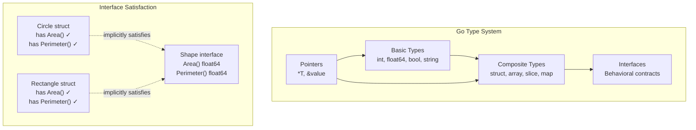

## Learning Objectives

- Use Go's basic types, zero values, and type conversions correctly
- Define and work with structs, including nested structs and struct tags
- Implement interfaces and understand implicit satisfaction
- Apply type assertions and type switches for runtime type inspection
- Write idiomatic control flow with if, switch, and for

## Prerequisites

- Go installed and a module initialized (previous lesson)
- Basic programming concepts (variables, loops, conditionals)

## Core Concepts

### Basic Types and Zero Values

Every type in Go has a **zero value** — the default value assigned when no explicit value is given. This eliminates an entire class of "uninitialized variable" bugs.

```go
package main

import "fmt"

func main() {
	var i int       // 0
	var f float64   // 0.0
	var b bool      // false
	var s string    // "" (empty string)
	var p *int      // nil

	fmt.Printf("int:     %d\n", i)
	fmt.Printf("float64: %f\n", f)
	fmt.Printf("bool:    %t\n", b)
	fmt.Printf("string:  %q\n", s)
	fmt.Printf("pointer: %v\n", p)
}
```

**Variable declaration styles:**

```go
var name string = "Alice"    // Explicit type
var age = 30                 // Type inferred (int)
score := 95.5                // Short declaration (only inside functions)
const pi = 3.14159           // Constant — evaluated at compile time

var (                        // Block declaration
	host = "localhost"
	port = 8080
)
```

### Numeric Types

Go has explicit-width integers — no implicit promotion, no surprises:

| Type       | Size    | Range                          |
|------------|---------|--------------------------------|
| int8       | 1 byte  | -128 to 127                    |
| int16      | 2 bytes | -32,768 to 32,767              |
| int32      | 4 bytes | -2.1B to 2.1B                  |
| int64      | 8 bytes | -9.2 quintillion to 9.2 quintillion |
| int        | platform-dependent | 32 or 64 bits       |
| uint8/byte | 1 byte  | 0 to 255                       |
| float32    | 4 bytes | ~7 decimal digits precision    |
| float64    | 8 bytes | ~15 decimal digits precision   |

**Type conversion is always explicit:**

```go
var x int32 = 100
var y int64 = int64(x)    // Must explicitly convert
var z float64 = float64(x)

// This WON'T compile:
// var bad int64 = x   // cannot use x (type int32) as type int64
```

### Strings and Runes

Strings in Go are immutable byte slices. Individual characters are `rune` (alias for int32, representing a Unicode code point).

```go
s := "Hello, 世界"
fmt.Println(len(s))          // 13 (bytes, not characters!)
fmt.Println(len([]rune(s)))  // 9 (actual characters)

for i, r := range s {
	fmt.Printf("index=%d rune=%c unicode=%U\n", i, r, r)
}

// String builder for efficient concatenation
var builder strings.Builder
for i := 0; i < 1000; i++ {
	builder.WriteString("hello ")
}
result := builder.String()
```

### Structs

Structs are Go's primary composite type. They group related fields together.

```go
type User struct {
	ID        int       `json:"id"`
	Name      string    `json:"name"`
	Email     string    `json:"email"`
	CreatedAt time.Time `json:"created_at"`
	Active    bool      `json:"active"`
}

alice := User{
	ID:    1,
	Name:  "Alice",
	Email: "alice@example.com",
	Active: true,
	CreatedAt: time.Now(),
}

bob := User{Name: "Bob"}  // Other fields get zero values
fmt.Println(bob.Active)    // false
fmt.Println(bob.ID)        // 0

// Nested structs
type Address struct {
	Street string
	City   string
	State  string
}

type Employee struct {
	User            // Embedded struct — promotes fields
	Role    string
	Address Address // Named field
}

emp := Employee{
	User: User{Name: "Charlie", Email: "charlie@corp.com"},
	Role: "Engineer",
	Address: Address{City: "San Francisco", State: "CA"},
}
fmt.Println(emp.Name)         // Accessed directly via embedding
fmt.Println(emp.Address.City) // Named field requires qualification
```

### Interfaces

Interfaces in Go are satisfied **implicitly** — there's no `implements` keyword. If a type has all the methods an interface requires, it satisfies that interface.

```go
type Shape interface {
	Area() float64
	Perimeter() float64
}

type Circle struct {
	Radius float64
}

func (c Circle) Area() float64 {
	return math.Pi * c.Radius * c.Radius
}

func (c Circle) Perimeter() float64 {
	return 2 * math.Pi * c.Radius
}

type Rectangle struct {
	Width, Height float64
}

func (r Rectangle) Area() float64 {
	return r.Width * r.Height
}

func (r Rectangle) Perimeter() float64 {
	return 2 * (r.Width + r.Height)
}

func printShapeInfo(s Shape) {
	fmt.Printf("Type: %T\n", s)
	fmt.Printf("Area: %.2f\n", s.Area())
	fmt.Printf("Perimeter: %.2f\n", s.Perimeter())
}

func main() {
	shapes := []Shape{
		Circle{Radius: 5},
		Rectangle{Width: 3, Height: 4},
	}
	for _, s := range shapes {
		printShapeInfo(s)
		fmt.Println("---")
	}
}
```

### Type Assertions and Type Switches

When you have an interface value and need the concrete type:

```go
var s Shape = Circle{Radius: 5}

c, ok := s.(Circle)
if ok {
	fmt.Printf("It's a circle with radius %.1f\n", c.Radius)
}

switch v := s.(type) {
case Circle:
	fmt.Printf("Circle: radius=%.1f\n", v.Radius)
case Rectangle:
	fmt.Printf("Rectangle: %v×%v\n", v.Width, v.Height)
default:
	fmt.Printf("Unknown shape: %T\n", v)
}
```

### Control Flow

**If statements** can include an initialization statement:

```go
if err := doSomething(); err != nil {
	log.Fatal(err) // err is scoped to this if-else block
}

if n := computeValue(); n > 100 {
	fmt.Println("large")
} else if n > 50 {
	fmt.Println("medium")
} else {
	fmt.Println("small")
}
```

**Switch** is cleaner than if-else chains. Cases don't fall through by default:

```go
switch day := time.Now().Weekday(); day {
case time.Saturday, time.Sunday:
	fmt.Println("Weekend!")
default:
	fmt.Printf("Weekday: %v\n", day)
}

score := 85
switch {
case score >= 90:
	fmt.Println("A")
case score >= 80:
	fmt.Println("B")
case score >= 70:
	fmt.Println("C")
default:
	fmt.Println("F")
}
```

**For** is Go's only loop construct. It replaces while, do-while, and for-each:

```go
for i := 0; i < 10; i++ {      // Classic for
	fmt.Println(i)
}

n := 1
for n < 100 {                   // While loop
	n *= 2
}

for {                           // Infinite loop
	if shouldStop() { break }
}

fruits := []string{"apple", "banana", "cherry"}
for i, fruit := range fruits {  // Range over slices
	fmt.Printf("%d: %s\n", i, fruit)
}

m := map[string]int{"a": 1, "b": 2}
for key, value := range m {     // Range over maps
	fmt.Printf("%s=%d\n", key, value)
}
```

### Slices and Maps

```go
nums := []int{1, 2, 3, 4, 5}
nums = append(nums, 6, 7)
sub := nums[1:4]               // [2, 3, 4] — shares underlying array

scores := make(map[string]int)
scores["alice"] = 95
scores["bob"] = 87

if val, exists := scores["charlie"]; exists {
	fmt.Println(val)
} else {
	fmt.Println("charlie not found")
}

delete(scores, "bob")
```

## Diagram



## Hands-On Exercise

### Exercise: Shape Interface with Area Method

Build a geometry package that demonstrates Go's type system.

**Step 1: Create the project**

```bash
mkdir shapes && cd shapes
go mod init github.com/yourusername/shapes
```

**Step 2: Create `shapes.go`**

```go
package main

import (
	"fmt"
	"math"
	"sort"
)

type Shape interface {
	Area() float64
	Perimeter() float64
	String() string
}

type Circle struct {
	Radius float64
}

func (c Circle) Area() float64      { return math.Pi * c.Radius * c.Radius }
func (c Circle) Perimeter() float64 { return 2 * math.Pi * c.Radius }
func (c Circle) String() string     { return fmt.Sprintf("Circle(r=%.1f)", c.Radius) }

type Rectangle struct {
	Width, Height float64
}

func (r Rectangle) Area() float64      { return r.Width * r.Height }
func (r Rectangle) Perimeter() float64 { return 2 * (r.Width + r.Height) }
func (r Rectangle) String() string {
	return fmt.Sprintf("Rectangle(%.1f×%.1f)", r.Width, r.Height)
}

type Triangle struct {
	A, B, C float64 // side lengths
}

func (t Triangle) Perimeter() float64 { return t.A + t.B + t.C }

func (t Triangle) Area() float64 {
	s := t.Perimeter() / 2
	return math.Sqrt(s * (s - t.A) * (s - t.B) * (s - t.C))
}

func (t Triangle) String() string {
	return fmt.Sprintf("Triangle(%.1f, %.1f, %.1f)", t.A, t.B, t.C)
}

func sortByArea(shapes []Shape) {
	sort.Slice(shapes, func(i, j int) bool {
		return shapes[i].Area() < shapes[j].Area()
	})
}

func main() {
	shapes := []Shape{
		Circle{Radius: 5},
		Rectangle{Width: 3, Height: 4},
		Triangle{A: 3, B: 4, C: 5},
		Circle{Radius: 1},
		Rectangle{Width: 10, Height: 2},
	}

	sortByArea(shapes)

	fmt.Println("Shapes sorted by area:")
	for _, s := range shapes {
		fmt.Printf("  %-25s Area=%.2f  Perimeter=%.2f\n",
			s, s.Area(), s.Perimeter())
	}
}
```

**Step 3: Run and verify**

```bash
go run shapes.go
```

**Challenge:** Add a `Square` type that embeds `Rectangle` and overrides `String()`. Does it still satisfy the `Shape` interface? Why or why not?

## Key Takeaways

- Every Go type has a zero value — variables are always initialized, eliminating undefined behavior
- Type conversions are always explicit; Go never silently converts between types
- Interfaces are satisfied implicitly — just implement the methods, no `implements` declaration needed
- Structs can embed other structs, promoting fields and methods for composition over inheritance
- Go has only one loop construct (`for`) but it covers all iteration patterns
- The `range` keyword iterates over slices, maps, strings, and channels uniformly

## External Resources

- [A Tour of Go](https://go.dev/tour/) — Interactive tour covering all language fundamentals
- [Go Specification: Types](https://go.dev/ref/spec#Types) — The formal type system specification
- [Go Blog: The Laws of Reflection](https://go.dev/blog/laws-of-reflection) — Deep dive into Go's type system
- [Effective Go: Interfaces](https://go.dev/doc/effective_go#interfaces) — Idiomatic interface patterns
- [Go Proverbs](https://go-proverbs.github.io/) — Rob Pike's design philosophy distilled

## Quiz

See the quiz.json file for this module's quiz questions.
